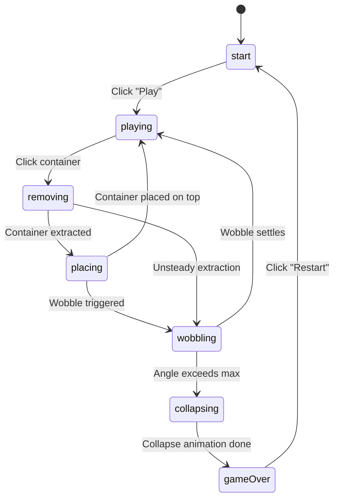

<!-- 99eae653-57a2-41b5-808b-cdfc9db68f9f -->
---
todos:
  - id: "scaffold"
    content: "Create folder structure, definition.ts, and stub files for all modules/components/composables/store/types"
    status: pending
  - id: "types"
    content: "Define TypeScript interfaces: JengaContainer, TowerLayer, TowerState, WobbleState, GamePhase, ScoringResult in types/index.ts"
    status: pending
  - id: "config"
    content: "Write config.ts with block dimensions, colour palette, physics tuning constants, scoring multipliers, and layer/tower presets"
    status: pending
  - id: "tower-builder"
    content: "Implement towerBuilder.ts: generate initial 10-layer tower with alternating orientations and random container colours"
    status: pending
  - id: "physics"
    content: "Implement physics.ts: center-of-mass calculation, stability scoring, wobble spring simulation, collapse detection, and per-frame update tick"
    status: pending
  - id: "scoring"
    content: "Implement scoring.ts: base points, speed bonus, steadiness bonus, combo streaks, height bonus calculations"
    status: pending
  - id: "store"
    content: "Implement gameStore.ts Pinia store: game phase state machine, tower state, score tracking, move history, actions for remove/place/restart"
    status: pending
  - id: "audio-module"
    content: "Copy sound files from available-media/sound-samples/ into assets/audio/. Implement audio.ts sound map and audio composable"
    status: pending
  - id: "scene"
    content: "Implement sceneBuilder.ts (ground, lighting, skybox) and containerRenderer.ts (coloured box meshes with edge detail)"
    status: pending
  - id: "three-scene"
    content: "Implement useThreeScene.ts composable with OrbitControls, camera auto-framing, and render loop"
    status: pending
  - id: "picking"
    content: "Implement useContainerPicking.ts: raycasting for hover highlight and click-to-select containers"
    status: pending
  - id: "game-loop"
    content: "Implement useGameLoop.ts: drive physics tick, wobble animation, collapse animation, and tower visual updates each frame"
    status: pending
  - id: "game-canvas"
    content: "Build GameCanvas.vue: mount canvas, wire up mouse/touch handlers for drag-to-remove and click-to-place interactions, integrate all composables"
    status: pending
  - id: "ui-components"
    content: "Build ScoreBar.vue, TowerStability.vue, Instructions.vue overlay components"
    status: pending
  - id: "modals"
    content: "Build StartScreen.vue, GameOver.vue (with score + restart button), and PauseMenu.vue modals"
    status: pending
  - id: "root-component"
    content: "Assemble ContainerStack.vue root component: compose all UI, modals, and GameCanvas"
    status: pending
  - id: "polish"
    content: "Add visual polish: container hover glow, wobble camera shake, score pop-up animations, collapse particle effects, tune physics feel"
    status: pending
  - id: "lint-test"
    content: "Run npm run lint, fix all issues. Manual play-test and tune difficulty/physics constants for fun factor"
    status: pending
isProject: false
---
# Container Stack -- 3D Jenga with Shipping Containers

## Sim identity

- **Folder:** `src/sims/container-stack/`
- **ID:** `container-stack`
- **Title:** Container Stack
- **Tagline:** "How high can you stack before the tower falls?"
- **Icon:** `🏗️`
- **Status:** `playable`
- **Color:** `#ef4444` (red accent -- danger/tension theme)
- **Tags:** `['3D', 'Physics', 'Puzzle']`

---

## Folder structure

```
src/sims/container-stack/
├── definition.ts
├── ContainerStack.vue              # Root component
├── components/
│   ├── GameCanvas.vue              # Three.js canvas + mouse/touch handlers
│   ├── ui/
│   │   ├── ScoreBar.vue            # Current score, level, moves
│   │   ├── TowerStability.vue      # Visual stability meter
│   │   └── Instructions.vue        # Brief control hints overlay
│   └── modals/
│       ├── StartScreen.vue         # Title + "Play" button
│       ├── GameOver.vue            # Collapse! Final score + "Restart"
│       └── PauseMenu.vue           # Pause overlay with restart option
├── composables/
│   ├── useThreeScene.ts            # Sim-specific scene (camera orbit, lighting)
│   ├── useGameLoop.ts              # Game tick driving physics + render
│   ├── useAudio.ts                 # Sound effect loader + player
│   └── useContainerPicking.ts      # Raycasting to select/hover containers
├── modules/
│   ├── config.ts                   # All tuning constants (dims, physics params, scoring)
│   ├── physics.ts                  # Core Jenga physics engine (see below)
│   ├── towerBuilder.ts             # Initial tower generation (layers, colours)
│   ├── containerRenderer.ts        # Create box meshes with colours and textures
│   ├── sceneBuilder.ts             # Ground plane, lighting, environment
│   ├── scoring.ts                  # Points per move, multipliers, combos
│   └── audio.ts                    # Sound map + disaster sequences
├── store/
│   └── gameStore.ts                # Pinia store (game phase, tower state, score)
├── types/
│   └── index.ts                    # JengaContainer, TowerLayer, GamePhase, etc.
└── assets/
    └── audio/                      # Copied from available-media/sound-samples/
        ├── container-loaded-to-ship.mp3
        ├── container-set-down-on-ship.mp3
        ├── correct-ding.mp3
        ├── gaming-bonus-sound.mp3
        ├── gaming-negative-event-sound.mp3
        ├── group-yay-cheer.mp3
        ├── horns-level-up.mp3
        ├── level-up.mp3
        ├── money-increase-ca-ching-.mp3
        └── man-screaming.mp3
```

---

## Game design

### Tower layout

- Classic Jenga proportions adapted to 20ft containers (6.06 x 2.59 x 2.44 m in Three.js units)
- **Each layer:** 3 containers side by side
- **Alternating orientation:** odd layers along X-axis, even layers along Z-axis (rotated 90 degrees), exactly like real Jenga
- **Starting height:** 10 layers (30 containers total) -- tunable in `config.ts`
- Each container gets a random colour from a palette of ~8 shipping-line inspired colours (Maersk blue, Evergreen green, MSC navy, Hapag-Lloyd orange, red, yellow, grey, teal)

### Container dimensions for the game

Using real 20ft proportions scaled for playability. In `config.ts`:

```ts
export const BLOCK = {
  width: 2.44,   // X -- container width
  height: 2.59,  // Y -- container height
  length: 6.06,  // Z -- container length (long side)
  gap: 0.05,     // tiny gap between containers in a layer
} as const
```

Three containers side-by-side span `3 * 2.44 + 2 * 0.05 = 7.42` units, and each container is 6.06 long, so the footprint is roughly 7.42 x 6.06 -- a chunky, satisfying tower.

### Interaction model

1. **Hover:** Raycasting highlights the container under the cursor (outline glow or colour brighten)
2. **Click + drag:** Initiates a pull/push on the selected container
   - Drag direction determines push or pull (toward camera = pull out, away = push through)
   - A container can only be removed from its layer if it is not the only support (at least one other container must remain in that layer, unless it is the topmost full layer)
   - Cannot remove from the topmost incomplete layer
3. **Slide animation:** Container slides out smoothly in the drag direction
4. **Placement phase:** After removal, the container floats to a ghost position above the tower top. The player clicks to place it. Placement snaps to valid positions on the top layer (filling the current incomplete layer, or starting a new layer if the top is full)
5. **Mouse steadiness:** Track mouse velocity/jitter during drag. High velocity or erratic movement translates to tower wobble (see physics below)

### Physics engine (`modules/physics.ts`)

No external physics library -- a purpose-built simplified Jenga model:

#### Tower stability model

```ts
interface TowerState {
  layers: TowerLayer[]
  centerOfMass: Vector3
  stabilityScore: number    // 0 (about to fall) to 1 (perfectly stable)
  wobble: WobbleState
}

interface TowerLayer {
  index: number
  containers: (JengaContainer | null)[]  // 3 slots, null = removed
  completeness: number                    // 0-1, fraction of slots filled
}

interface WobbleState {
  angle: number         // current lean angle (radians)
  angularVelocity: number
  damping: number       // how fast wobble settles
  maxAngle: number      // collapse threshold
}
```

#### Stability calculation

- **Center of mass offset:** After each removal, recalculate the center of mass of all remaining containers. The further it deviates from the geometric center of the base, the lower the stability.
- **Layer completeness factor:** Each layer with missing containers reduces stability. Consecutive incomplete layers compound the penalty. A full layer above an incomplete one is extra destabilizing.
- **Height factor:** Taller towers are inherently less stable (higher CoM).
- **Formula (simplified):**

```
stability = baseStability
  - comOffsetPenalty(centerOfMass.xz distance from base center)
  - heightPenalty(towerHeight / baseWidth)
  - gapPenalty(sum of incomplete-layer penalties)
```

#### Wobble mechanics

- Every container removal injects angular impulse into the wobble state proportional to:
  - Mouse jitter during the drag (unsteady hands)
  - How critical the removed container was to stability
- The wobble is a damped oscillation: `angle += angularVelocity * dt; angularVelocity -= angle * springK * dt - angularVelocity * damping * dt`
- If `|angle| > maxAngle` at any point, the tower **collapses** (game over)
- Visual: the entire tower group rotates slightly on X/Z axes during wobble; containers in upper layers get more displacement
- Wobble damping decreases as stability drops -- a rickety tower keeps swaying longer

#### Collapse sequence

- When `|angle| > maxAngle`: trigger collapse
- Animate containers falling: apply gravity + random angular velocity to each container above the failure point
- Scatter containers on the ground plane with bouncing
- Play crash sound sequence (container-loaded-to-ship.mp3 layered with gaming-negative-event-sound.mp3)

### Scoring (`modules/scoring.ts`)

- **Base points:** 100 per container successfully removed and placed on top
- **Speed bonus:** faster moves score more (multiplier 1.0x to 2.0x)
- **Steadiness bonus:** low mouse jitter during extraction = bonus multiplier (1.0x to 1.5x)
- **Combo multiplier:** consecutive successful moves without triggering major wobble increase a streak multiplier (1.0x, 1.2x, 1.5x, 2.0x...)
- **Height bonus:** placing at greater heights earns more (encourages continuing rather than quitting early)
- **Score displayed** in ScoreBar UI with pop-up animations for each move

### Sound effects mapping (`modules/audio.ts`)

Copy these from `available-media/sound-samples/` into `assets/audio/`:

| Game event | Sound file | Notes |
|---|---|---|
| Container selected (hover click) | `correct-ding.mp3` | Quiet confirmation |
| Container sliding out | `container-loaded-to-ship.mp3` | Metallic scrape feel |
| Container placed on top | `container-set-down-on-ship.mp3` | Satisfying thud |
| Tower wobble (small) | `gaming-negative-event-sound.mp3` | Played at low volume, pitch-shifted |
| Tower collapse | `man-screaming.mp3` + `gaming-negative-event-sound.mp3` | Dramatic sequence |
| Score points | `money-increase-ca-ching-.mp3` | Ca-ching on each placement |
| Combo streak | `gaming-bonus-sound.mp3` | When streak multiplier increases |
| New height record | `level-up.mp3` | When tower exceeds starting height |
| Game over screen | `gaming-negative-event-sound.mp3` | Final sting |
| Restart / new game | `horns-level-up.mp3` | Fresh start fanfare |

### Camera and controls

- **OrbitControls** with constrained vertical angle (no going below ground)
- Camera starts positioned to see the full tower (auto-calculate distance from tower height)
- Smooth auto-orbit (very slow rotation) when idle, stops when player interacts
- Camera gently tracks upward as the tower grows taller

### Scene environment (`modules/sceneBuilder.ts`)

- **Ground plane:** Concrete/asphalt-coloured flat plane with subtle grid
- **Background:** Dark gradient skybox or solid dark colour (port at night feel)
- **Lighting:** Directional light (sun) + ambient + a subtle spotlight on the tower for drama
- **Optional:** Faint fog for depth

### Game phases (Pinia store)

```ts
type GamePhase = 'start' | 'playing' | 'removing' | 'placing' | 'wobbling' | 'collapsing' | 'gameOver'
```



### Restart flow

- **Game Over modal** shows final score, number of moves, and a large "Play Again" button
- Clicking restart resets the Pinia store, rebuilds the tower, clears the scene, and transitions back to `start` phase
- Also available via pause menu during play

---

## Dependencies

- **No new npm packages required.** The physics is custom (no cannon.js/rapier needed -- Jenga physics is simple enough with a stability + wobble model).
- Three.js (already installed) handles all 3D rendering.
- Container meshes use `THREE.BoxGeometry` with `MeshStandardMaterial` -- no external model files needed. Coloured boxes with subtle edge bevels and a painted-metal look are more performant and better match the stylized game feel.

---

## Implementation sequence

The todos below represent the build order. Each step should be completed and lint-checked before moving to the next.