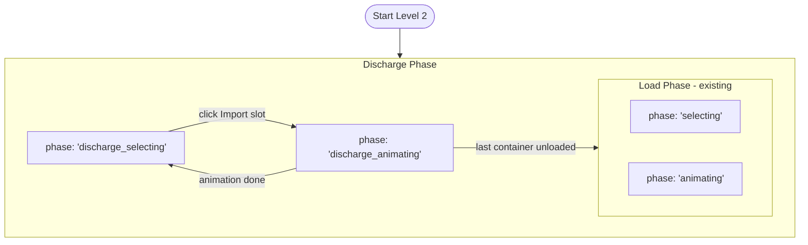

<!-- 7abac9b8-a29f-4858-b5ad-d5b785eebe99 -->
---
todos:
  - id: "types"
    content: "Extend GamePhase type and add isImport to Container; add dischargeContainerCount to LevelConfig in types/index.ts"
    status: pending
  - id: "discharge-manifest"
    content: "Create modules/dischargeManifest.ts — generates N pre-loaded Import containers distributed across the grid"
    status: pending
  - id: "scoring-discharge"
    content: "Add calculateDischargeScore to modules/scoring.ts (top-tier bonus, stability improvement bonus, warning-zone penalty, blocker penalty)"
    status: pending
  - id: "store"
    content: "Add discharge state & actions to store/gameStore.ts (dischargeContainers, dischargedCount, pickDischargeContainer, finalizeDischarge, startLevel changes)"
    status: pending
  - id: "levels"
    content: "Add dischargeContainerCount: 10 to Level 2 in modules/levels.ts"
    status: pending
  - id: "config"
    content: "Add OUTBOUND_TRUCK constants to modules/config.ts"
    status: pending
  - id: "truck-renderer"
    content: "Add createOutboundTruckQueue and outbound departure animation to modules/truckRenderer.ts"
    status: pending
  - id: "crane-discharge"
    content: "Add createDischargeAnimation (reverse crane pick from ship slot to dock) in modules/craneSystem.ts"
    status: pending
  - id: "container-renderer"
    content: "Add createImportSlotIndicators (orange, isImportContainer userData flag) in modules/containerRenderer.ts"
    status: pending
  - id: "game-canvas"
    content: "Update GameCanvas.vue: discharge click handler, import slot indicators on buildScene, outbound truck queue, phase watcher update"
    status: pending
  - id: "hud"
    content: "Add DischargeBar.vue widget showing discharge progress and score; update TopBar.vue to show it during discharge phases"
    status: pending
  - id: "modals"
    content: "Update StartScreen.vue (Level 2 description) and LevelComplete.vue (show discharge score breakdown)"
    status: pending
  - id: "lint"
    content: "Run npm run lint:fix and resolve any TypeScript/ESLint errors"
    status: pending
isProject: false
---
# Level 2 Discharge Phase

## Overview

Level 2 (Regional Carrier / medium preset) gains a two-phase structure:

1. **Discharge phase** — vessel arrives pre-loaded with N containers; player clicks Import containers to unload them via crane onto outbound trucks.
2. **Load phase** — existing loading gameplay (same as today but continues after discharge completes).

---

## Architecture changes



---

## Key files to change

### 1. `src/sims/stowage-master/types/index.ts`

- Extend `GamePhase`:
```typescript
export type GamePhase = 'start' | 'discharge_selecting' | 'discharge_animating' | 'selecting' | 'animating' | 'disaster' | 'complete' | 'failed'
```
- Add `dischargeContainerCount?: number` to `LevelConfig`.

### 2. `src/sims/stowage-master/modules/levels.ts`

- Level 1 (`id: 1`) gets `dischargeContainerCount: 10` — 10 pre-loaded Import containers to unload before loading begins. The container count for the subsequent load phase stays unchanged.

### 3. `src/sims/stowage-master/modules/scoring.ts` — new `calculateDischargeScore`

Scoring per unloaded container (knowledge-base: discharge order, stability, bay sequence):

| Condition | Points |
|---|---|
| Base | +60 |
| Container is in a top tier (unblocking lower tiers — good pod order) | +20 bonus |
| Unloading this container improves stability (moves list/trim toward 0) | +20 bonus |
| Unloading while ship is in warning zone | -20 |
| Choosing a container that is **not** a top-tier blocker (will need restow) | -25 |

### 4. `src/sims/stowage-master/store/gameStore.ts`

New state:
```typescript
const dischargeContainers = ref<Container[]>([])   // pre-loaded containers to discharge
const dischargeCount = ref(0)                       // total to discharge
const dischargedCount = ref(0)                      // how many done
const dischargeScore = ref(0)
```

New actions:
- `startLevel` — if level has `dischargeContainerCount`, populate `dischargeContainers` by calling a new `generateDischargeManifest(n, preset, grid)` helper that places N containers onto the grid and returns the manifest.
- `pickDischargeContainer(slotId)` — validates `phase === 'discharge_selecting'`, returns `{ container, slot }`, sets `phase` to `'discharge_animating'`.
- `finalizeDischarge(slotId)` — removes container from slot, recalculates physics, scores the pick via `calculateDischargeScore`, increments `dischargedCount`; when `dischargedCount >= dischargeCount` transitions to `'selecting'` (load phase begins).

Modified `startLevel`:
- After normal init, if `dischargeContainerCount` is set, call `generateDischargeManifest` to pre-fill grid and set `phase = 'discharge_selecting'` instead of `'selecting'`.

### 5. New module: `src/sims/stowage-master/modules/dischargeManifest.ts`

```typescript
export function generateDischargeManifest(
  count: number,
  preset: ShipPreset,
  grid: Record<string, Slot>
): Container[]
```

- Generates N containers with `isImport: true` flag (new field on `Container`).
- Distributes them across bays/rows/tiers ensuring stable initial load (spread across centre rows, lower tiers first).
- Marks them in the grid.

### 6. `src/sims/stowage-master/types/index.ts` — Container interface update

```typescript
export interface Container {
  // ...existing fields...
  isImport: boolean   // true = discharge candidate (imported, needs offloading)
}
```

### 7. `src/sims/stowage-master/modules/craneSystem.ts` — `createDischargeAnimation`

Mirror of `createPlacementAnimation` in reverse:
- Crane trolley travels from ship slot world position → dock Z position.
- Container mesh moves with it.
- On completion, container arrives at outbound truck dock position.

### 8. `src/sims/stowage-master/modules/truckRenderer.ts` — outbound truck queue

New export `createOutboundTruckQueue(scene, craneObj, count)`:
- Spawns a queue of trucks on the **opposite side of the road** from the inbound queue (positive Z offset from crane dock).
- Each truck has an **empty trailer** (no container mesh on top).
- After a container is placed onto truck 0: truck drives away (X+ direction), fades out over ~1 second; trucks 1–N slide forward.

Config additions to `config.ts`:
```typescript
export const OUTBOUND_TRUCK = {
  dockZOffset: +6,    // road lane width offset from crane dock position
  spacing: 22,
  departSpeed: 18,
  fadeStartT: 0.4,
} as const
```

### 9. `src/sims/stowage-master/components/GameCanvas.vue`

**Phase watcher** — add `discharge_selecting` to the scene-rebuild trigger condition (alongside existing `start | disaster | failed | complete`). Discharge starts immediately after scene build for level 2, so no separate rebuild needed.

**Click handler** — add `handleDischargeClick`:
- Checks `phase === 'discharge_selecting'`.
- Raycasts for `userData.isImportContainer` (slot indicators on pre-loaded Import containers instead of empty slots).
- Calls `store.pickDischargeContainer(slotId)`.
- Kicks off `createDischargeAnimation` to crane-lift container from ship slot to outbound dock.
- On animation complete: place container mesh on outbound truck 0 → trigger outbound truck departure.
- Calls `store.finalizeDischarge(slotId)`.

**`buildScene`** — after scene build, if `store.phase === 'discharge_selecting'`, render Import container meshes on ship slots and show "clickable Import" slot indicators (distinct colour, e.g. orange) on those slots instead of the standard blue empty-slot indicators.

**Outbound truck queue** — instantiate alongside existing inbound queue during `buildScene`.

### 10. `src/sims/stowage-master/modules/containerRenderer.ts`

- Add `createImportSlotIndicators(shipGroup, grid, importSlotIds, shipConfig)` — same as `createSlotIndicators` but with an orange/amber colour and `userData.isImportContainer = true`.

### 11. HUD / UI changes

- `TopBar.vue` or a new `DischargeBar.vue` widget — shows discharge progress `dischargedCount / dischargeCount` and discharge score while in discharge phase.
- `StartScreen.vue` — update Level 2 description to mention the discharge phase.
- `LevelComplete.vue` — show combined load + discharge score breakdown.

---

## Stability recalculation on discharge

`finalizeDischarge` already calls `updatePhysics(grid, preset)` (same path as `finalizePlacement`). Ship visual tilt updates via the existing `watch([shipList, shipTrim])` watcher in `GameCanvas` — no extra wiring needed.

Disaster checks during discharge: only `capsize` / `founder` apply (a discharge cannot cause stack collapse or hazmat explosion); pass `placedSlot: null` to `checkDisasters` to skip stack/hazmat checks.

---

## Knowledge-base alignment

From `dk_ops__vessel_loading_unloading.md`:
- Discharge always works **top-tier first** within a bay — the pod-order concept already in `scoring.ts` inverts naturally for discharge scoring.
- Bay sequence matters: discharging from fore/aft extremes first maintains trim.
- Import containers have their own `portOrder` = 0 (first port of call = this port).

From `dk_vessels__stability_and_loading_rules.md`:
- Each discharge changes COG; recalculate list/trim after every move.
- Unloading a heavy container from an outboard slot **improves** stability — reward this.

---

## Implementation order (todos)

