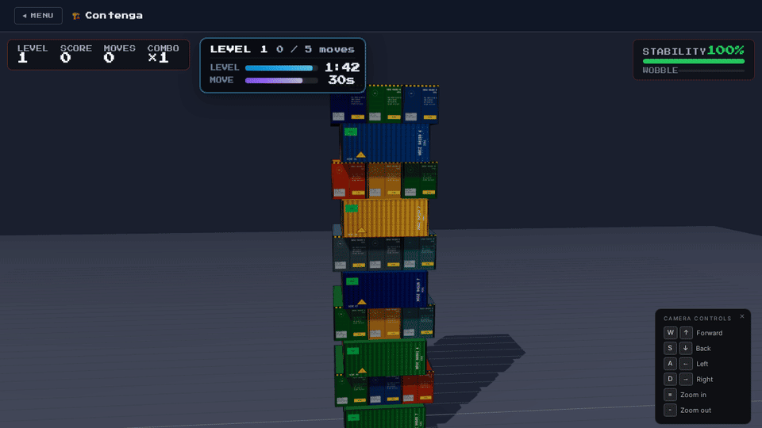

# Shipping Container Sims

**Play free in the browser:** **[container-games.net](https://container-games.net)**

Three shipping-container-themed games in one Vue app: plan vessel loads, balance a physics tower, or run a terminal tycoon. Below is the **home portal** (pick a game), then each title with **gameplay a few seconds after you start** — not the pre-game menu.

## Main menu


---

## Stowage Master

*Tetris meets real-world container logistics — 3D puzzle*


**What you do:** Place containers on the ship’s bays with an eye on **weight**, **cargo classes** (what can sit next to what), and **port rotation** (unload in the right order). You’re optimising a real stowage puzzle, not just filling slots.

**Vibe:** Calm planning, spatial reasoning, and “one more level” optimisation.

---

## Contenga

*Jenga with containers — 3D physics*




**What you do:** Pull blocks from the stack and **pile them on top** without letting the tower collapse. **Poor support** and bad balance bring the whole thing down — it’s tactile, risky, and very satisfying when it holds.

**Vibe:** Quick rounds, physics tension, and “just one more pull.”

---

## Box Empire

*Terminal tycoon — strategy and economy*


**What you do:** Start from a **single container** and grow a **logistics empire**: buy **routes**, **upgrade ports**, manage **fleets**, and stay ahead of **rivals**. Numbers, maps, and narrative beats frame a management sim built around real terminal ideas.

**Vibe:** Longer sessions, progression, and empire-building.

---

## Run locally

```bash
npm install
npm run dev
```

Open `http://localhost:5173/` — the home page lists every sim; open any card to play.

```bash
npm run build      # Production build
npm run lint       # ESLint checks
npm run lint:fix   # ESLint with auto-fixes
```

### Regenerate README screenshots

Requires a production preview and **ffmpeg** (for the Contenga GIF). Default wait before each gameplay shot is **10 seconds** of real time.

```bash
npm run build
npm run preview -- --host 127.0.0.1 --port 4173
# in another terminal:
npm run capture-readme-media
# optional: BASE_URL=http://127.0.0.1:4173 GAMEPLAY_WAIT_MS=12000 npm run capture-readme-media
```

## For developers

This repo is a **Vue 3 + TypeScript** app: **Vite**, **Pinia**, **Vue Router**, **Three.js** for 3D sims, **ESLint** for static analysis. Each game lives in its own folder under `src/sims/` and is **auto-discovered** at build time — no manual registration.

### Project structure (summary)

```
src/
├── assets/              # Global CSS, fonts, design tokens
├── components/          # Shared UI (SimCard, HeroBackground, …)
├── composables/         # useThreeScene, useSimRegistry, useMenuMusic
├── pages/               # HomePage, SimPage
├── router/
├── stores/
├── types/               # SimDefinition, etc.
└── sims/                # ★ One folder per game (isolated code & assets)
    ├── stowage-master/
    ├── container-stack/ # Contenga
    └── box-empire/

available-media/         # Shared 3D/sound library (copy into a sim when needed)
knowledge-base/          # Domain reference (containers, terminals, …)
```

### Core rules

- **Sim isolation:** All game-specific code, components, stores, and media stay under `src/sims/<sim-id>/`. Only truly shared logic belongs in top-level `composables/` or `components/`.
- **Auto-discovery:** Add `src/sims/<id>/definition.ts` — the home page picks it up via `import.meta.glob`.
- **Style:** Composition API only (`<script setup lang="ts">`), strict TypeScript, scoped styles, design tokens from `src/assets/main.css`.

### Add a new sim

1. Create `src/sims/<your-sim-id>/`
2. Add `definition.ts` with a `SimDefinition` (id, title, tagline, description, component loader, …)
3. Add the root `YourSim.vue`

Full conventions, 3D patterns, and domain skills: **[AGENTS.md](AGENTS.md)** and **`.ai/skills/`**.

## More resources

- **Sim guides:** e.g. `src/sims/box-empire/box-empire-AGENTS.md`
- **Domain knowledge:** `knowledge-base/`
- **Pre-sourced assets:** `available-media/3d-models/`, `available-media/sound-samples/`
