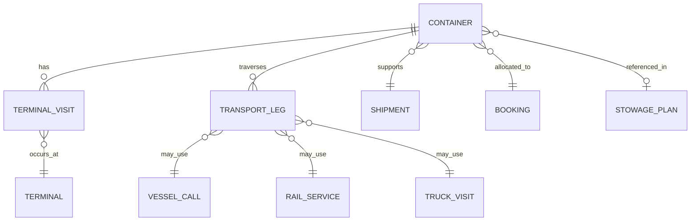
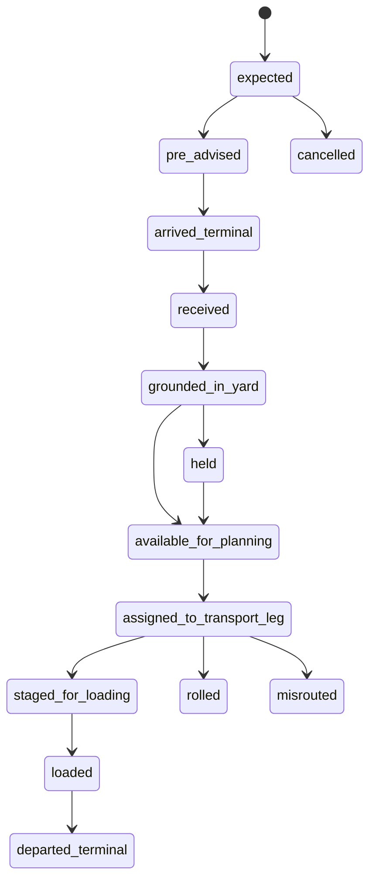
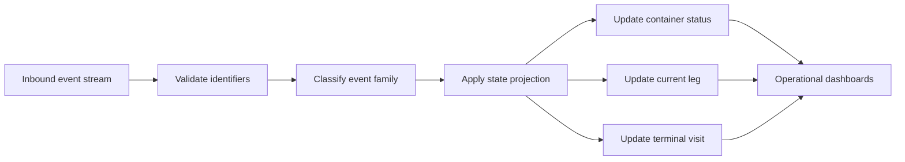

## Summary

This document defines the **logical attributes** of a shipping container as handled by a terminal ecosystem rather than its physical construction. These attributes describe **who controls the box, what commercial and operational journey it belongs to, where it should go next, what state it is currently in, and which transport legs or terminal processes it is linked to**.

Logical attributes are the glue between:
- the physical container asset
- the shipment or booking it supports
- the terminal visit and yard plan
- onward transport legs such as vessel, truck, and rail
- event streams used for operational tracking and customer visibility

This file is intended to support:
- simulation entity design
- state machines and event processing
- terminal planning logic
- believable gameplay around routing, delays, exceptions, and handoffs

---

## Why this matters for simulation and gameplay

Physical dimensions tell the simulation **what a container is**. Logical attributes tell the simulation **what the container is doing and why anyone cares about it**.

Without logical attributes, all containers become interchangeable metal boxes, which kills a lot of terminal behaviour:
- import, export, and transhipment flows cannot be distinguished
- yard grouping becomes arbitrary rather than purpose-driven
- vessel planning and discharge/load sequences lose operational meaning
- truck, rail, and vessel handoffs cannot be scheduled correctly
- exceptions such as customs hold, no-booking, rolled cargo, missing VGM, or misroute cannot emerge naturally

Gameplay and simulation systems directly affected:
- pre-arrival planning
- berth and yard preparation
- move prioritisation
- deadline and cut-off mechanics
- customer or carrier service metrics
- route disruption and recovery gameplay
- visibility dashboards and event feeds

At low fidelity, these attributes support arcade-like queue and objective systems. At higher fidelity, they support rule-driven planning, exception handling, and operational KPIs.

---

## Key definitions and vocabulary

- **Container ID / ISO 6346 identifier**  
  Standard container identification composed of owner code, equipment category identifier, serial number, and check digit.

- **Owner**  
  The company whose registered BIC owner code appears in the ISO container identifier.

- **Operator**  
  The party commercially controlling or operating the box in a given movement, which may differ from the owner.

- **Lessor / Lessee**  
  In leased equipment scenarios, the owner may be a leasing company while a carrier or logistics company operates the container.

- **Equipment category identifier**  
  The fourth letter in the ISO 6346 identifier. `U` denotes freight containers, while other categories such as `J` and `Z` are used for related detachable equipment and trailers/chassis in the wider coding system.

- **POL (Port of Loading)**  
  Port where the container is loaded to the main sea leg relevant to the shipment stage being modelled.

- **POD (Port of Discharge)**  
  Port where the container is discharged from the relevant sea leg.

- **Place of Receipt / Place of Delivery**  
  Commercial inland endpoints that may differ from POL and POD.

- **Transhipment / Transshipment**  
  A container is discharged from one vessel and later loaded to another vessel at an intermediate port.

- **Terminal visit**  
  The period during which the container is handled by a specific terminal, including gate, yard, rail, and vessel-side events.

- **Transport leg**  
  A single movement segment, such as truck drayage, rail leg, feeder vessel leg, or deep-sea vessel leg.

- **Voyage / Call / Service**  
  Vessel movement and schedule references used to link a container to a specific ship operation.

- **BAPLIE**  
  The electronic representation of a vessel stowage plan.

- **MOVINS**  
  A message carrying vessel stowage instructions, typically used for load, discharge, restow, and shift planning.

- **Track and Trace event**  
  A standardised event describing a shipment, transport, or equipment milestone.

- **Cut-off**  
  The latest time by which the container or required documentation must be completed for a planned departure.

- **ETA / ETD**  
  Estimated Time of Arrival / Estimated Time of Departure.

- **Rolled container**  
  A container that misses its intended departure and is reassigned to a later leg.

- **Hold**  
  A restriction that prevents normal progression, for example customs hold, documentation hold, dangerous goods hold, or terminal hold.

---

## Scope boundaries

### Included
- Logical attributes of containers relevant to terminal operations
- Owner, operator, and leasing distinctions at simulation level
- Routing references such as POL, POD, and onward destination
- State and lifecycle fields required for yard, gate, rail, and vessel processes
- Linkage to bookings, shipments, terminal visits, transport legs, and stowage artefacts
- Planning timestamps such as ETA, ETD, and cut-offs
- Exception and hold states suitable for simulation

### Excluded
- Physical dimensions, structure, or marking placement
- Detailed customs law and country-specific compliance workflows
- Full carrier commercial contract modelling
- Full EDI segment-by-segment implementation detail for each message family
- Detailed cargo packing data beyond what drives container-level planning
- Financial settlement, detention/demurrage invoicing, and accounting logic

---

## Key attributes and dimensions (human-level data model)

Logical attributes should be grouped into stable subdomains rather than dumped into one flat object. A practical top-level model is shown below.

### 1. Core identity and control
- `container_id`
- `iso_6346`
- `owner.owner_code`
- `owner.owner_name`
- `operator.operator_code`
- `operator.operator_name`
- `lease.is_leased`
- `lease.lessor_name`
- `lease.lessee_name`
- `equipment_category`
- `container_pool`
- `line_equipment_reference`

### 2. Commercial routing context
- `shipment.shipment_id`
- `shipment.booking_reference`
- `shipment.bill_of_lading_reference`
- `routing.place_of_receipt`
- `routing.pol`
- `routing.transshipment_port_sequence[]`
- `routing.pod`
- `routing.place_of_delivery`
- `routing.final_destination`
- `routing.trade_lane`
- `routing.service_code`

### 3. Operational leg linkage
- `current_leg.mode` (`truck`, `rail`, `barge`, `vessel`, `yard`, `gate`)
- `current_leg.leg_id`
- `current_leg.carrier_reference`
- `current_leg.vehicle_or_vessel_id`
- `current_leg.voyage_id`
- `current_leg.call_id`
- `next_leg.*`
- `previous_leg.*`

### 4. Terminal visit context
- `terminal_visit.visit_id`
- `terminal_visit.terminal_id`
- `terminal_visit.facility_code`
- `terminal_visit.visit_type` (`import`, `export`, `transshipment`, `empty_reposition`, `restow`, `rail_transfer`)
- `terminal_visit.arrival_mode`
- `terminal_visit.departure_mode`
- `terminal_visit.arrival_time_planned`
- `terminal_visit.arrival_time_actual`
- `terminal_visit.departure_time_planned`
- `terminal_visit.departure_time_actual`
- `terminal_visit.yard_block`
- `terminal_visit.stack_reference`

### 5. Operational state
- `status.lifecycle_state`
- `status.operational_state`
- `status.is_available_for_planning`
- `status.is_available_for_dispatch`
- `status.last_event_time`
- `status.last_event_type`
- `status.exception_state`
- `status.holds[]`

### 6. Planning dependencies
- `planning.receiving_window_open`
- `planning.receiving_window_close`
- `planning.documentation_cutoff`
- `planning.vgm_cutoff`
- `planning.dg_cutoff`
- `planning.customs_release_required`
- `planning.ready_to_load`
- `planning.priority_score`

### 7. Stowage and move planning
- `stowage.inbound_bay`
- `stowage.inbound_row`
- `stowage.inbound_tier`
- `stowage.outbound_bay`
- `stowage.outbound_row`
- `stowage.outbound_tier`
- `stowage.load_list_reference`
- `stowage.discharge_list_reference`
- `stowage.restow_required`
- `stowage.special_handling_flags[]`

### 8. Event and visibility fields
- `events.last_known_location`
- `events.last_known_facility`
- `events.last_transport_event`
- `events.last_equipment_event`
- `events.last_shipment_event`
- `events.subscribed_visibility_channels[]`

### Example logical state categories

| Category | Purpose | Example values |
|---|---|---|
| Lifecycle state | High-level position in journey | `expected`, `arrived_terminal`, `in_yard`, `assigned_to_outbound`, `loaded`, `departed` |
| Terminal process state | Fine-grained operational state | `at_gate`, `grounded`, `mounted_on_chassis`, `customs_hold`, `awaiting_vgm`, `ready_for_qc` |
| Visit type | Why the box is in this terminal | `import`, `export`, `transshipment`, `empty_reposition`, `restow` |
| Arrival / departure mode | How it enters or leaves | `truck`, `rail`, `barge`, `vessel` |
| Routing status | Network planning state | `planned`, `confirmed`, `rolled`, `misrouted`, `diverted` |

---

## Rules, constraints, and algorithms (include simplified simulation models)

### 1. Ownership and operational control

The owner code in the container ID should resolve to the registered owner code namespace, but the party operating the box for a specific shipment may differ. A simulation should not assume `owner == operator`.

Simplified rule:
```pseudo
owner = iso_6346.owner_code_registry_match
operator = booking.assigned_carrier or terminal_equipment_operator

if lease.is_leased == true:
  legal_owner = lease.lessor_name
  operating_party = lease.lessee_name
```

Simulation consequence:
- billing, pooling, repositioning, and routing decisions may depend on operator
- asset provenance and long-term fleet ownership may depend on owner

### 2. Terminal visit type inference

```pseudo
if arrival_mode in [truck, rail] and departure_mode == vessel:
  visit_type = export
elif arrival_mode == vessel and departure_mode in [truck, rail]:
  visit_type = import
elif arrival_mode == vessel and departure_mode == vessel:
  visit_type = transshipment
elif is_empty and purpose == reposition:
  visit_type = empty_reposition
else:
  visit_type = other_exception
```

Simulation consequence:
- determines expected dwell pattern
- drives yard allocation strategy
- changes move priority and deadline logic

### 3. Routing and yard grouping heuristic

Containers are typically grouped by operational need, not merely at random. A believable yard grouping heuristic should weight:
- outbound vessel/voyage
- port of discharge or next port
- discharge/load sequence
- reefer or dangerous goods requirements
- trucking appointment windows
- rail departure block
- special customs or inspection holds

Simplified yard score:
```pseudo
group_score =
  same_outbound_voyage * 5 +
  same_pod * 3 +
  same_service * 2 +
  same_cutoff_bucket * 4 +
  same_hazard_zone * 4 +
  same_departure_mode * 3
```

Simulation consequence:
- produces less chaos and fewer reshuffles
- makes yard layout visibly purposeful
- allows gameplay built around smart pre-marshalling

### 4. Container lifecycle state machine

Recommended high-level lifecycle states:

- `expected`
- `pre_advised`
- `arrived_terminal`
- `received`
- `grounded_in_yard`
- `held`
- `available_for_planning`
- `assigned_to_transport_leg`
- `staged_for_loading`
- `loaded`
- `departed_terminal`
- `rolled`
- `misrouted`
- `cancelled`

Simplified transition rule:
```pseudo
if current_state == expected and gate_in_confirmed:
  next_state = arrived_terminal

if current_state == arrived_terminal and yard_put_confirmed:
  next_state = grounded_in_yard

if hold_count > 0:
  next_state = held

if no_holds and docs_ok and vgm_ok and outbound_assignment_exists:
  next_state = available_for_planning

if load_confirmed:
  next_state = loaded
```

### 5. Holds and release logic

A container can be physically present but not operationally usable.

Suggested hold types:
- `customs_hold`
- `documentation_hold`
- `dg_hold`
- `inspection_hold`
- `payment_hold`
- `terminal_hold`
- `line_hold`
- `missing_vgm`
- `damage_hold`

Release logic:
```pseudo
dispatchable = (
  current_location == yard and
  holds.count == 0 and
  status.operational_state not in [damaged, inaccessible] and
  required_leg_assigned == true
)
```

Simulation consequence:
- introduces realistic friction
- supports gameplay around unblocking cargo flows
- creates believable reason codes for missed departures

### 6. ETA / ETD dependency model

Container planning depends on several timestamps that can shift independently:
- inland arrival ETA
- vessel ETA / ETD
- documentation cut-off
- dangerous goods cut-off
- VGM cut-off
- rail cut-off
- truck appointment time

Simplified readiness calculation:
```pseudo
ready_to_load = (
  current_location == yard and
  now <= vessel_etd and
  now <= gate_receiving_close and
  docs_complete and
  vgm_complete and
  holds.count == 0
)
```

A more useful simulation prioritisation score:
```pseudo
priority_score =
  hours_to_cutoff_weighted_inverse +
  vessel_window_urgency +
  customer_priority +
  reefer_risk +
  transshipment_connection_risk
```

### 7. BAPLIE and MOVINS linkage

A believable terminal model should separate:
- **current stowage truth** from BAPLIE-like data
- **planned move instructions** from MOVINS-like data

Suggested simplified rule:
```pseudo
stowage.actual_slot = baplie_snapshot.slot
stowage.planned_slot = movins_instruction.slot

if actual_slot != planned_slot:
  plan_variance = true
```

Simulation consequence:
- supports restows, last-minute changes, and crane plan disruption
- allows “plan vs reality” gameplay and KPI reporting

### 8. Event stream model

A useful simulation should treat container status as an event-derived projection rather than a manually edited label.

Suggested event families:
- shipment events
- transport events
- equipment events
- terminal internal events

Projection example:
```pseudo
sort events by occurred_at

for each event:
  apply projection rules to current_status
  update current_location
  update current_leg
  append audit_trail
```

This allows replay, debugging, delayed messages, and customer visibility feeds without inventing magic status jumps.

---

## Standards and authoritative references to confirm (edition/year, what to verify)

- **ISO 6346**  
  Confirm the relationship between the visible owner code, equipment category identifier, and unique equipment identification. Verify that the file distinguishes correctly between code ownership and operational control.

- **BIC container owner code register and marking guidance**  
  Confirm that only registered BIC owner codes are used as unique owner prefixes in international identification and that owner/operator distinctions are not collapsed in the model.

- **SMDG BAPLIE / MOVINS implementation guidance**  
  Confirm message purpose boundaries:
  - BAPLIE as stowage-plan representation
  - MOVINS as stowage/move instruction representation
  - recommendation context for terminal-carrier exchanges
  - useful identifiers to mirror in an internal simulation model

- **SMDG recommended terminal-carrier message catalogue**  
  Confirm related message families that influence container status transitions, such as COPRAR and COARRI, if the broader container lifecycle is later expanded.

- **DCSA Track & Trace standards**  
  Confirm current event model terminology, especially distinctions between shipment, transport, and equipment events, and which identifiers are most suitable for cross-system visibility modelling.

- **DCSA booking and shipment documentation ecosystem**  
  Confirm where booking references, shipping instruction references, and bill of lading references should be considered optional versus central in a simulation-grade data model.

---

## Example outputs to include (tables, diagrams, sample data)

### Example table: logical attribute groups

| Group | Core question answered | Example fields |
|---|---|---|
| Ownership and control | Whose box is it and who is using it? | `owner_code`, `operator_name`, `is_leased` |
| Routing | Where should it go? | `pol`, `pod`, `final_destination`, `next_location` |
| Terminal visit | Why is it here? | `visit_type`, `arrival_mode`, `departure_mode` |
| Operational status | What can happen to it now? | `lifecycle_state`, `holds`, `ready_to_load` |
| Planning | What deadlines matter? | `documentation_cutoff`, `vgm_cutoff`, `etd` |
| Transport linkage | Which leg is it on? | `voyage_id`, `rail_service_id`, `truck_visit_id` |
| Stowage linkage | Where is it or where should it go? | `actual_slot`, `planned_slot`, `restow_required` |
| Visibility | What has the outside world been told? | `last_event_type`, `last_known_location` |

### Example outputs to generate in downstream tooling
- container master record
- terminal visit record
- lifecycle state timeline
- route leg chain
- outbound load candidate queue
- exception dashboard grouped by hold type
- plan vs actual slot variance report

---

## Data schemas (JSON Schema references or in-file fragments)

### Logical attribute fragment for a container master record

```json
{
  "$schema": "https://json-schema.org/draft/2020-12/schema",
  "$id": "container-logical-attributes.schema.json",
  "title": "ContainerLogicalAttributes",
  "type": "object",
  "required": [
    "container_id",
    "iso_6346",
    "owner",
    "routing",
    "status"
  ],
  "properties": {
    "container_id": { "type": "string" },
    "iso_6346": { "type": "string" },
    "owner": {
      "type": "object",
      "required": ["owner_code"],
      "properties": {
        "owner_code": { "type": "string", "minLength": 3, "maxLength": 3 },
        "owner_name": { "type": "string" }
      }
    },
    "operator": {
      "type": "object",
      "properties": {
        "operator_code": { "type": "string" },
        "operator_name": { "type": "string" }
      }
    },
    "lease": {
      "type": "object",
      "properties": {
        "is_leased": { "type": "boolean" },
        "lessor_name": { "type": "string" },
        "lessee_name": { "type": "string" }
      }
    },
    "routing": {
      "type": "object",
      "required": ["pol", "pod"],
      "properties": {
        "place_of_receipt": { "type": "string" },
        "pol": { "type": "string" },
        "transshipment_ports": {
          "type": "array",
          "items": { "type": "string" }
        },
        "pod": { "type": "string" },
        "place_of_delivery": { "type": "string" },
        "final_destination": { "type": "string" },
        "service_code": { "type": "string" },
        "next_location": { "type": "string" }
      }
    },
    "shipment": {
      "type": "object",
      "properties": {
        "shipment_id": { "type": "string" },
        "booking_reference": { "type": "string" },
        "bill_of_lading_reference": { "type": "string" }
      }
    },
    "terminal_visit": {
      "type": "object",
      "properties": {
        "visit_id": { "type": "string" },
        "terminal_id": { "type": "string" },
        "facility_code": { "type": "string" },
        "visit_type": {
          "type": "string",
          "enum": ["import", "export", "transshipment", "empty_reposition", "restow", "rail_transfer", "unknown"]
        },
        "arrival_mode": {
          "type": "string",
          "enum": ["truck", "rail", "barge", "vessel", "unknown"]
        },
        "departure_mode": {
          "type": "string",
          "enum": ["truck", "rail", "barge", "vessel", "unknown"]
        }
      }
    },
    "current_leg": {
      "type": "object",
      "properties": {
        "mode": {
          "type": "string",
          "enum": ["truck", "rail", "barge", "vessel", "yard", "gate", "unknown"]
        },
        "leg_id": { "type": "string" },
        "voyage_id": { "type": "string" },
        "call_id": { "type": "string" },
        "vehicle_or_vessel_id": { "type": "string" }
      }
    },
    "planning": {
      "type": "object",
      "properties": {
        "receiving_window_open": { "type": "string", "format": "date-time" },
        "receiving_window_close": { "type": "string", "format": "date-time" },
        "documentation_cutoff": { "type": "string", "format": "date-time" },
        "vgm_cutoff": { "type": "string", "format": "date-time" },
        "dg_cutoff": { "type": "string", "format": "date-time" },
        "ready_to_load": { "type": "boolean" },
        "priority_score": { "type": "number" }
      }
    },
    "status": {
      "type": "object",
      "required": ["lifecycle_state"],
      "properties": {
        "lifecycle_state": {
          "type": "string",
          "enum": [
            "expected",
            "pre_advised",
            "arrived_terminal",
            "received",
            "grounded_in_yard",
            "held",
            "available_for_planning",
            "assigned_to_transport_leg",
            "staged_for_loading",
            "loaded",
            "departed_terminal",
            "rolled",
            "misrouted",
            "cancelled"
          ]
        },
        "operational_state": { "type": "string" },
        "exception_state": { "type": "string" },
        "holds": {
          "type": "array",
          "items": { "type": "string" }
        },
        "last_event_type": { "type": "string" },
        "last_event_time": { "type": "string", "format": "date-time" }
      }
    },
    "stowage": {
      "type": "object",
      "properties": {
        "actual_slot": { "type": "string" },
        "planned_slot": { "type": "string" },
        "load_list_reference": { "type": "string" },
        "discharge_list_reference": { "type": "string" },
        "restow_required": { "type": "boolean" }
      }
    }
  }
}
```

---

## Sample data (JSON and YAML)

### JSON

```json
{
  "container_id": "MSKU1234567",
  "iso_6346": "MSKU1234567",
  "owner": {
    "owner_code": "MSK",
    "owner_name": "A.P. Moller - Maersk"
  },
  "operator": {
    "operator_code": "MAEU",
    "operator_name": "Maersk Line"
  },
  "lease": {
    "is_leased": false
  },
  "shipment": {
    "shipment_id": "SHP-2026-000441",
    "booking_reference": "BK-8844102",
    "bill_of_lading_reference": "BL-7129981"
  },
  "routing": {
    "place_of_receipt": "Birmingham",
    "pol": "GBFXT",
    "transshipment_ports": ["NLRTM"],
    "pod": "SGSIN",
    "place_of_delivery": "Singapore",
    "final_destination": "Singapore",
    "service_code": "AEU1",
    "next_location": "GBFXT-T1-YARD-BLOCK-C3"
  },
  "terminal_visit": {
    "visit_id": "VIS-GBFXT-2026-0312-778",
    "terminal_id": "GBFXT-T1",
    "facility_code": "GBFXTT01",
    "visit_type": "export",
    "arrival_mode": "truck",
    "departure_mode": "vessel"
  },
  "current_leg": {
    "mode": "yard",
    "leg_id": "LEG-003188",
    "voyage_id": "VOY-MSK-118W",
    "call_id": "CALL-GBFXT-118W-01",
    "vehicle_or_vessel_id": "VESSEL-MSK-ALPHA"
  },
  "planning": {
    "receiving_window_open": "2026-03-25T06:00:00Z",
    "receiving_window_close": "2026-03-27T16:00:00Z",
    "documentation_cutoff": "2026-03-27T12:00:00Z",
    "vgm_cutoff": "2026-03-27T10:00:00Z",
    "dg_cutoff": "2026-03-27T08:00:00Z",
    "ready_to_load": true,
    "priority_score": 82.4
  },
  "status": {
    "lifecycle_state": "available_for_planning",
    "operational_state": "grounded_and_released",
    "exception_state": "",
    "holds": [],
    "last_event_type": "EQUIPMENT_GATE_IN",
    "last_event_time": "2026-03-26T08:43:00Z"
  },
  "stowage": {
    "actual_slot": "",
    "planned_slot": "034/10/84",
    "load_list_reference": "MOVINS-GBFXT-118W-01",
    "discharge_list_reference": "",
    "restow_required": false
  }
}
```

### YAML

```yaml
container_id: TGHU7654321
iso_6346: TGHU7654321

owner:
  owner_code: TGH
  owner_name: Textainer

operator:
  operator_code: HLCU
  operator_name: Hapag-Lloyd

lease:
  is_leased: true
  lessor_name: Textainer
  lessee_name: Hapag-Lloyd

shipment:
  shipment_id: SHP-2026-000982
  booking_reference: BK-2294410
  bill_of_lading_reference: BL-9031188

routing:
  place_of_receipt: Leeds
  pol: GBLGP
  transshipment_ports:
    - DEHAM
  pod: USNYC
  place_of_delivery: Newark
  final_destination: Newark
  service_code: AT3
  next_location: VESSEL_SLOT_018_06_82

terminal_visit:
  visit_id: VIS-GBLGP-2026-0308-102
  terminal_id: GBLGP-T2
  facility_code: GBLGPT02
  visit_type: transshipment
  arrival_mode: vessel
  departure_mode: vessel

current_leg:
  mode: vessel
  leg_id: LEG-004501
  voyage_id: VOY-HL-221W
  call_id: CALL-GBLGP-221W-02
  vehicle_or_vessel_id: VESSEL-HL-BETA

planning:
  receiving_window_open: "2026-03-24T00:00:00Z"
  receiving_window_close: "2026-03-28T23:59:00Z"
  documentation_cutoff: "2026-03-27T18:00:00Z"
  vgm_cutoff: "2026-03-27T16:00:00Z"
  dg_cutoff: "2026-03-27T14:00:00Z"
  ready_to_load: false
  priority_score: 91.1

status:
  lifecycle_state: loaded
  operational_state: on_board_outbound_vessel
  exception_state: transshipment_connection_risk
  holds: []
  last_event_type: EQUIPMENT_LOADED
  last_event_time: "2026-03-26T11:12:00Z"

stowage:
  actual_slot: 018/06/82
  planned_slot: 018/06/82
  load_list_reference: MOVINS-GBLGP-221W-02
  discharge_list_reference: BAPLIE-IN-GBLGP-221W-01
  restow_required: false
```

---

## Visualisation guidance

### Mermaid diagrams

#### 1. Entity relationship view



#### 2. Lifecycle state diagram



#### 3. Event projection pipeline



### UI/dashboard widgets where relevant

Useful UI widgets for a simulation or operations game:
- **Container detail panel** with tabs for routing, planning, holds, and event history
- **Lifecycle timeline** showing expected vs actual milestones
- **Yard grouping heatmap** by POD, voyage, or cut-off bucket
- **Exception board** grouped by hold reason and hours-to-cutoff
- **Plan vs actual stowage widget** showing assigned slot variance
- **Transport chain panel** showing previous, current, and next leg

---

## 3D rendering notes (scale, dimensions, textures/markings)

Logical attributes do not directly change mesh dimensions, but they should drive **presentation state** in the scene and UI.

Recommended 3D-driven overlays or variations:
- status decals or hovering icons for hold / release / inspection
- colour-coded selection outlines for import, export, and transshipment flows
- animated route or assignment indicators when a container is linked to an outbound move
- reefer, dangerous goods, customs, and rolled-state icons in inspection or management views
- facility-linked wayfinding overlays for truck gate, rail pad, and quay assignment

Keep the actual container model independent from most logical fields. The same physical asset should be reusable while the simulation swaps metadata-driven overlays, labels, and UI indicators. Otherwise the asset pipeline turns into a haunted wardrobe.

---

## Validation checklist

- [ ] Owner code and operator are represented as separate concepts
- [ ] Leasing scenarios can be represented without mutating the ISO container identity
- [ ] POL, POD, and optional transshipment ports are modelled distinctly
- [ ] Terminal visit type can be inferred from arrival and departure modes
- [ ] Current, previous, and next transport legs can be linked without ambiguity
- [ ] Lifecycle state and fine-grained operational state are separated
- [ ] Holds can block dispatch or loading without implying the container is missing
- [ ] ETA / ETD / cut-off fields can drive priority scoring
- [ ] BAPLIE-like actual stowage and MOVINS-like planned stowage are not conflated
- [ ] Event history can be replayed to rebuild current status
- [ ] Sample records support import, export, and transshipment scenarios
- [ ] The data model is usable for both simulation and UI visibility layers

---

## Open questions and research backlog

- Confirm the best minimal identifier set for cross-linking:
  - container ID
  - booking reference
  - shipment reference
  - bill of lading reference
  - equipment transport reference
- Decide whether `terminal_visit` should be a child object of `container` or a first-class entity with versioned history
- Define a canonical event taxonomy for gameplay that maps cleanly to DCSA event families without copying the full external standard
- Add explicit support for empty depot, off-hire, on-hire, and repair workflow states
- Determine whether route modelling should support multiple future candidate legs for disruption gameplay
- Extend planning logic to rail-specific block planning and truck appointment windows
- Add optional audit fields:
  - `created_at`
  - `updated_at`
  - `source_system`
  - `source_message_type`
  - `source_message_reference`
- Add reconciliation rules for late, duplicate, or out-of-order events
