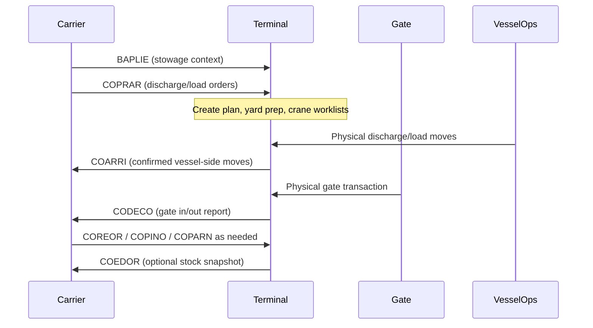
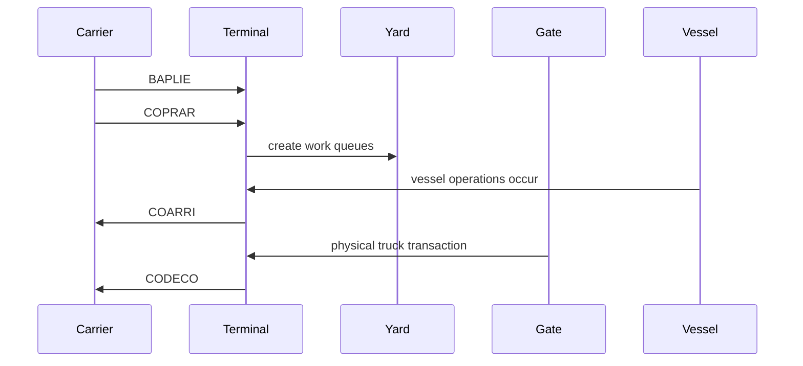
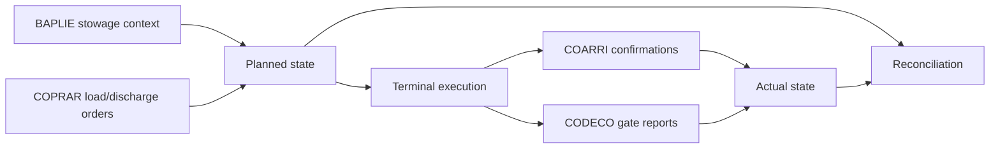

# Summary

This topic documents the common UN/EDIFACT message families used between ocean carriers and container terminals for vessel, gate, and container-movement coordination. The core operational set is:

- **BAPLIE** for bayplan and stowage-plan data
- **COPRAR** for discharge and loading orders
- **COARRI** for discharge and loading confirmations
- **CODECO** for gate-in and gate-out reporting

Closely related message sets often used in the same operational landscape include:

- **COPARN** for booking / announcement style instructions to terminals
- **COREOR** for release orders
- **COPINO** for pre-arrival / pick-up notification
- **COEDOR** for stock reporting

For simulation, these messages should not be treated as raw text blobs. They are best represented as structured domain events and state updates that connect vessel calls, stowage slots, terminal jobs, gate moves, and container status histories.

# Why this matters for simulation and gameplay

- It provides a believable information layer behind terminal operations rather than “magic data”.
- It separates **planned work** from **confirmed execution**.
- It supports realistic event timing:
  - stowage plan before arrival
  - vessel work orders before operations
  - confirmations during or after execution
  - gate reports as containers enter or leave the facility
- It enables gameplay around:
  - bad data and reconciliation
  - late plan changes
  - missing confirmations
  - yard mismatch versus vessel plan mismatch
  - terminal congestion caused by poor information flow

# Key definitions and vocabulary

- **UN/EDIFACT**: United Nations EDI syntax and message directory framework used widely in shipping and logistics.
- **SMDG**: Industry user group publishing maritime-container implementation guidance and recommended message usage.
- **MIG**: Message Implementation Guide. Practical profile that narrows a standard message for interoperable real-world use.
- **Carrier**: Usually the vessel operator / shipping line or its agent.
- **Terminal**: Container terminal operator handling vessel, yard, and gate moves.
- **Bayplan / stowage plan**: Structured description of which containers occupy which vessel slots.
- **Order message**: Message telling the terminal what work should be done.
- **Report / confirmation message**: Message telling the carrier what was actually done.
- **Gate move**: Entry or exit of a container or other equipment item through a gate, or equivalent landside movement reporting.
- **Occupied location**: A vessel slot that contains a container in the plan.
- **Event mapping**: Converting EDI messages into simulation objects, commands, and historical events.

# Scope boundaries

## Included

- Operational purpose of BAPLIE, COPRAR, COARRI, CODECO and closely related sets
- Who sends what, and roughly when
- Mapping from message content to simulation objects and events
- Synthetic examples that show shape without reproducing copyrighted dumps
- Sequence-flow guidance for carrier-terminal information exchange

## Excluded

- Full UN/EDIFACT segment-by-segment reproductions
- Directory-specific implementation at the field-code level for every release
- Customs, dangerous-goods, invoicing, and inland-only message families except where they touch the main flow
- Proprietary API replacements or carrier-specific private extensions
- Formal legal meaning of commercial instructions in contracts

# Key attributes and dimensions (human-level data model)

## 1. Core message roles

### BAPLIE

**Purpose**  
BAPLIE is the bayplan / stowage-plan message. UN/EDIFACT defines it as the **bayplan/stowage plan occupied and empty locations** message. In SMDG recommendation material, it is used to provide a **provisional vessel stowage plan before vessel arrival** and a **definitive stowage plan after departure**.

**Typical sender / receiver**
- Carrier or vessel-planning side -> terminal
- Sometimes line-to-line or planning-party exchange in alliance / sharing contexts

**Typical timing**
- Before arrival for planning and pre-marshalling
- After departure as the actual or finalised stowage reference

**What it tells the terminal**
- Vessel identity / voyage context
- Slot coordinates
- Which slots are occupied
- Container references and key handling attributes
- Reefer / hazardous / weight / over-dimension implications where profiled in the implementation guide

**Best simulation use**
- Source of vessel slot objects
- Input to crane planning, yard pre-positioning, and exception detection
- Baseline plan for comparing COPRAR instructions and COARRI confirmations

### COPRAR

**Purpose**  
COPRAR is the **container discharge/loading order** message.

**Typical sender / receiver**
- Carrier -> terminal
- Also line-to-line in some vessel-sharing / alliance contexts according to SMDG

**Typical timing**
- Before vessel operations
- Updated when load/discharge intentions change

**What it tells the terminal**
- Which containers are to be discharged
- Which containers are to be loaded
- Operational order-level detail linked to vessel call / voyage context
- Sometimes status flags and handling constraints depending on profile and release

**Best simulation use**
- Source of planned vessel work orders
- Input to work queues for quay cranes, yard dispatch, and pre-marshalling
- Canonical “should happen” list for move execution

### COARRI

**Purpose**  
COARRI is the **container discharge/loading report** message. SMDG describes it in terminal-carrier practice as the **discharging and loading confirmation** from terminal to line.

**Typical sender / receiver**
- Terminal -> carrier

**Typical timing**
- During operations as moves are executed
- At completion of discharge / load activities
- Sometimes batched by work phase rather than truly real-time

**What it tells the carrier**
- Which moves actually happened
- Confirmation of load on / discharge from vessel
- Event-level completion information for vessel-side handling

**Best simulation use**
- Source of actual move events
- Updates container state from “planned” to “executed”
- Feeds productivity, variance, and mismatch KPIs

### CODECO

**Purpose**  
CODECO is the **container gate-in/gate-out report** message. SMDG describes it as reporting gate activity associated with equipment moving into or out of a terminal, storage/repair facility, or packing/unpacking facility, and says it can also report some internal movements in a facility.

**Typical sender / receiver**
- Terminal -> carrier or relevant operator

**Typical timing**
- At gate-in
- At gate-out
- Sometimes for rail / barge / inland transitions depending on the operating profile

**What it tells the receiver**
- That a piece of equipment actually entered or left
- The movement direction and context
- Status-changing events around landside handoff

**Best simulation use**
- Source of terminal boundary crossing events
- Updates inventory presence on terminal
- Drives yard arrivals, truck appointment fulfilment, and export availability

## 2. Related message sets that often sit around the core flow

### COPARN
SMDG describes COPARN as a line-to-terminal message used as a booking / announcement style instruction. In practical simulation terms, it is useful as an earlier pre-advice / terminal instruction layer before execution orders are firm.

### COREOR
SMDG lists COREOR as a release order from line to terminal. In simulation terms, it can be treated as a permissions or release event affecting gate-out eligibility.

### COPINO
SMDG lists COPINO as a pre-arrival / pick-up notification. In simulation terms, it can create expected gate-arrival events before CODECO confirms the actual move.

### COEDOR
SMDG lists COEDOR as a stock report from terminal to line. In simulation terms, it can be used as a snapshot reconciliation message for container inventory.

## 3. Message timing model for a vessel call

A useful simplified timing chain is:

1. Carrier sends schedule / call context and planning information
2. Carrier sends **BAPLIE** for stowage context
3. Carrier sends **COPRAR** for operational discharge/load orders
4. Terminal executes moves
5. Terminal sends **COARRI** as vessel-side confirmations
6. Terminal sends **CODECO** when relevant gate or inland handoff events occur
7. Terminal may send **COEDOR** for inventory reconciliation

This timing model is more useful for simulation than memorising directory releases.

## 4. Minimum field families to map into simulation objects

Do not mirror every EDIFACT segment. Instead map each message into field families that your simulation actually uses.

| Field family | Typical meaning | Simulation object |
|---|---|---|
| message_meta | message type, version, sender, receiver, reference, creation time | integration event |
| transport_context | vessel, voyage, call, terminal, port | vessel_call |
| equipment_id | container ID or equipment reference | container |
| movement_intent | load, discharge, gate_in, gate_out, release, announce | terminal_job or event |
| location_ref | bay-row-tier, block I/O, gate lane, terminal code | slot, yard node, gate node |
| status_flags | full/empty, reefer, hazard, customs/release relevance | container state |
| timing | planned, actual, reported timestamps | event history |
| party_refs | carrier, terminal, agent, inland carrier | party model |

# Rules, constraints, and algorithms

## 1. Planning versus execution rule

The simplest useful rule is:

- **BAPLIE** and **COPRAR** are planning / instruction-side data
- **COARRI** and **CODECO** are execution / confirmation-side data

### Simulation implication

```text
planned_state <- BAPLIE + COPRAR
actual_state <- COARRI + CODECO
variance = actual_state - planned_state
```

That one split alone makes the whole terminal feel less fake.

## 2. Timing and precedence rules

A container should not normally generate a vessel-side execution confirmation unless an order or compatible stowage context exists.

### Basic rule

```text
COARRI move is valid if:
  matching COPRAR work item exists
  or matching BAPLIE stowage context exists
```

For imports:
- discharge confirmation usually follows the vessel-side move
- gate-out may happen much later

For exports:
- gate-in often happens before load confirmation
- load confirmation should not happen before the unit is present and available

### Example state chain

```text
export:
announced -> expected_at_gate -> gate_in -> in_yard -> load_planned -> loaded

import:
on_vessel_plan -> discharge_planned -> discharged -> in_yard -> released -> gate_out
```

## 3. Message-to-event mapping

### BAPLIE -> slot occupancy snapshot
Use BAPLIE to create or update:
- vessel slot objects
- slot occupancy records
- initial onboard container states
- planning constraints such as reefer connection or dangerous-goods flags if available in the chosen profile

### COPRAR -> work order events
Use COPRAR to create:
- discharge job
- loading job
- priority class
- crane work list
- yard-prep task

### COARRI -> execution events
Use COARRI to create:
- `container_discharged_from_vessel`
- `container_loaded_to_vessel`
- actual move timestamp
- actual crane / move confirmation linkage

### CODECO -> boundary crossing events
Use CODECO to create:
- `container_gate_in`
- `container_gate_out`
- optionally `rail_in`, `rail_out`, `barge_in`, `barge_out` if your model supports them

## 4. Reconciliation algorithm

A good simulation should deliberately support messy reality.

### Simple reconciliation steps

1. Build expected move list from COPRAR
2. Build actual move list from COARRI
3. Match by container ID + move type + voyage/call context
4. Flag exceptions:
   - planned not executed
   - executed not planned
   - planned slot mismatch
   - actual timestamp outside tolerance
5. Reconcile final vessel slots against post-departure BAPLIE if available

### Pseudocode

```text
for each planned_move in coprar_moves:
    actual = find_matching_coarri(planned_move)
    if actual is null:
        raise exception "planned_not_confirmed"
    else if actual.location != planned_move.location and strict_mode:
        raise exception "location_mismatch"

for each gate_event in codeco_events:
    update_container_terminal_presence(gate_event)

if final_baplie exists:
    compare(final_baplie.slot_occupancy, executed_load_results)
```

## 5. Release management and directory handling

SMDG publishes recommended message sets and recommended versions. UN/EDIFACT also has multiple directory releases. Your simulation should therefore:

- store the **message family** separately from the exact **directory release**
- parse into an internal canonical model
- avoid baking one directory release into gameplay logic

### Canonical design rule

```text
external_message -> parser_by_release -> canonical_terminal_event
```

That saves you from version hell later.

## 6. Terminal-code handling

SMDG terminal code material shows that terminal codes are used in container messages such as BAPLIE, COPRAR, CODECO and COARRI to identify locations within a port or specific terminals. For simulation, keep a clean mapping layer:

```text
external_location_code -> port/terminal model node
```

Do not assume one UN/LOCODE equals one terminal. Ports love ambiguity the way a puddle loves your socks.

# Standards and authoritative references to confirm

## Primary references

1. **SMDG Recommendation #06 (2020)**  
   Use for the recommended terminal-carrier message set and high-level purpose/timing guidance. It explicitly lists BAPLIE, COPRAR, COARRI and CODECO among the recommended standard messages between terminal and carrier.

2. **SMDG Container Messages page**  
   Use for recommended versions and concise business-purpose labels such as:
   - COPRAR: discharging and loading order
   - COARRI: discharging and loading confirmation
   - CODECO: gate in / gate out confirmation

3. **UN/EDIFACT BAPLIE definition**
   Use as the authoritative definition that BAPLIE is the bayplan/stowage plan occupied and empty locations message.

4. **UN/EDIFACT COPRAR definition**
   Use as the authoritative definition that COPRAR is the container discharge/loading order message.

5. **UN/EDIFACT COARRI definition**
   Use as the authoritative definition that COARRI is the container discharge/loading report message.

6. **UN/EDIFACT CODECO definition**
   Use as the authoritative definition that CODECO is the container gate-in/gate-out report message.

## What to verify when extending this topic

- Exact recommended directory versions currently listed by SMDG
- Whether a specific project uses D.95B, D.00B, D.13B, D.16B or another release
- Whether VGM, dangerous-goods, inland mode, or alliance/vessel-sharing profiles are in scope
- Whether the terminal uses message batching, real-time messaging, or API-wrapped EDI
- Whether terminal codes use SMDG terminal-code extensions in addition to UN/LOCODE

# Example outputs to include

## 1. Comparison table

| Message | Direction | Main purpose | Typical timing | Best simulation role |
|---|---|---|---|---|
| BAPLIE | carrier -> terminal | stowage / bayplan | before arrival, after departure | slot plan snapshot |
| COPRAR | carrier -> terminal | discharge / load order | before and during vessel ops | planned work list |
| COARRI | terminal -> carrier | discharge / load confirmation | during or after vessel ops | executed move events |
| CODECO | terminal -> carrier | gate in / out report | at boundary crossing | terminal entry/exit events |
| COPARN | carrier -> terminal | announcement / booking style instruction | pre-execution | expected work / pre-advice |
| COREOR | carrier -> terminal | release order | before pickup | gate-out permission |
| COPINO | line or forwarder -> terminal | pre-notification | before arrival | expected gate-arrival event |
| COEDOR | terminal -> carrier | stock report | periodic / on demand | reconciliation snapshot |

## 2. Carrier-terminal sequence



## 3. Synthetic canonical event examples

### Synthetic BAPLIE-derived slot snapshot

```yaml
message_family: BAPLIE
message_release: D13B
sender: CARRIER_X
receiver: TERMINAL_A
transport_context:
  vessel_imo: "9876543"
  vessel_name: "MV SYNTHETIC HORIZON"
  voyage_ref: "HX221E"
  terminal_code: "GBFXT:T123"
slots:
  - bay: 14
    row: 08
    tier: 82
    container_id: "ABCD1234567"
    load_status: occupied
    reefer_required: false
    hazardous: false
  - bay: 14
    row: 10
    tier: 82
    container_id: "WXYZ7654321"
    load_status: occupied
    reefer_required: true
    hazardous: false
```

### Synthetic COPRAR-derived work order

```json
{
  "message_family": "COPRAR",
  "message_release": "D00B",
  "sender": "CARRIER_X",
  "receiver": "TERMINAL_A",
  "transport_context": {
    "vessel_name": "MV SYNTHETIC HORIZON",
    "voyage_ref": "HX221E",
    "terminal_code": "GBFXT:T123"
  },
  "orders": [
    {
      "container_id": "ABCD1234567",
      "move_type": "discharge",
      "from_slot": { "bay": 14, "row": 8, "tier": 82 },
      "priority": "normal"
    },
    {
      "container_id": "LMNO3334445",
      "move_type": "load",
      "to_slot": { "bay": 22, "row": 4, "tier": 84 },
      "priority": "high"
    }
  ]
}
```

### Synthetic COARRI-derived execution event

```yaml
message_family: COARRI
message_release: D00B
sender: TERMINAL_A
receiver: CARRIER_X
events:
  - container_id: ABCD1234567
    move_type: discharge
    actual_time_utc: "2026-03-27T08:22:00Z"
    crane_id: QC-03
    result: confirmed
  - container_id: LMNO3334445
    move_type: load
    actual_time_utc: "2026-03-27T11:14:00Z"
    crane_id: QC-02
    result: confirmed
```

### Synthetic CODECO-derived gate event

```json
{
  "message_family": "CODECO",
  "message_release": "D00B",
  "sender": "TERMINAL_A",
  "receiver": "CARRIER_X",
  "events": [
    {
      "container_id": "LMNO3334445",
      "move_type": "gate_in",
      "actual_time_utc": "2026-03-27T06:12:00Z",
      "gate_lane": "IN-04",
      "truck_visit_ref": "TV-88219"
    }
  ]
}
```

# Data schemas

## JSON Schema fragment for canonical terminal-carrier message event

```json
{
  "$schema": "https://json-schema.org/draft/2020-12/schema",
  "$id": "terminal_carrier_message_event.schema.json",
  "title": "TerminalCarrierMessageEvent",
  "type": "object",
  "required": ["message_family", "direction", "sender", "receiver", "transport_context"],
  "properties": {
    "message_family": {
      "type": "string",
      "enum": ["BAPLIE", "COPRAR", "COARRI", "CODECO", "COPARN", "COREOR", "COPINO", "COEDOR"]
    },
    "message_release": { "type": "string" },
    "direction": {
      "type": "string",
      "enum": ["carrier_to_terminal", "terminal_to_carrier", "other"]
    },
    "sender": { "type": "string" },
    "receiver": { "type": "string" },
    "created_at_utc": { "type": "string", "format": "date-time" },
    "transport_context": {
      "type": "object",
      "properties": {
        "vessel_name": { "type": "string" },
        "vessel_imo": { "type": "string" },
        "voyage_ref": { "type": "string" },
        "terminal_code": { "type": "string" },
        "port_code": { "type": "string" }
      }
    },
    "equipment_events": {
      "type": "array",
      "items": {
        "type": "object",
        "required": ["container_id", "event_type"],
        "properties": {
          "container_id": { "type": "string" },
          "event_type": {
            "type": "string",
            "enum": [
              "slot_snapshot",
              "load_order",
              "discharge_order",
              "loaded",
              "discharged",
              "gate_in",
              "gate_out",
              "released",
              "pre_notified",
              "stock_reported"
            ]
          },
          "planned_time_utc": { "type": "string", "format": "date-time" },
          "actual_time_utc": { "type": "string", "format": "date-time" },
          "slot": {
            "type": "object",
            "properties": {
              "bay": { "type": "integer" },
              "row": { "type": "integer" },
              "tier": { "type": "integer" }
            }
          },
          "terminal_node_ref": { "type": "string" },
          "status_flags": {
            "type": "object",
            "properties": {
              "full_empty": { "type": "string" },
              "reefer": { "type": "boolean" },
              "hazardous": { "type": "boolean" }
            }
          }
        }
      }
    }
  }
}
```

# Sample data

## JSON

```json
{
  "message_family": "COARRI",
  "message_release": "D00B",
  "direction": "terminal_to_carrier",
  "sender": "TERMINAL_A",
  "receiver": "CARRIER_X",
  "created_at_utc": "2026-03-27T11:15:00Z",
  "transport_context": {
    "vessel_name": "MV SYNTHETIC HORIZON",
    "vessel_imo": "9876543",
    "voyage_ref": "HX221E",
    "terminal_code": "GBFXT:T123",
    "port_code": "GBFXT"
  },
  "equipment_events": [
    {
      "container_id": "LMNO3334445",
      "event_type": "loaded",
      "actual_time_utc": "2026-03-27T11:14:00Z",
      "slot": { "bay": 22, "row": 4, "tier": 84 },
      "status_flags": {
        "full_empty": "full",
        "reefer": false,
        "hazardous": false
      }
    }
  ]
}
```

## YAML

```yaml
message_family: CODECO
message_release: D00B
direction: terminal_to_carrier
sender: TERMINAL_A
receiver: CARRIER_X
created_at_utc: "2026-03-27T06:13:00Z"
transport_context:
  terminal_code: GBFXT:T123
  port_code: GBFXT
equipment_events:
  - container_id: LMNO3334445
    event_type: gate_in
    actual_time_utc: "2026-03-27T06:12:00Z"
    terminal_node_ref: GATE_IN_04
    status_flags:
      full_empty: full
      reefer: false
      hazardous: false
```

# Visualisation guidance

## Mermaid diagrams

### Core carrier-terminal flow



### Planning versus execution



## UI/dashboard widgets where relevant

- Message timeline by vessel call
- Planned versus confirmed move counter
- Exceptions panel:
  - planned not confirmed
  - gate event without release
  - slot mismatch
  - duplicate report
- Gate event stream
- Carrier-terminal integration health summary
- Container state history viewer

# 3D rendering notes (scale, dimensions, textures/markings)

This topic is mostly data, but it still affects the 3D world indirectly:

- BAPLIE and COPRAR should determine which containers visually appear planned for load or discharge.
- COARRI should determine when the visual state of the vessel and yard is allowed to change.
- CODECO should control when a trucked container appears inside or outside the terminal boundary.
- If you visualise “ghost plans”, use a different overlay style for planned versus confirmed states.
- Message delays can be shown as stale labels, warning icons, or out-of-sync highlights between ship, yard, and gate scenes.

# Validation checklist

- [ ] BAPLIE is treated as stowage / bayplan context, not as a gate or execution report
- [ ] COPRAR is treated as an order message, not as confirmation
- [ ] COARRI is treated as vessel-side execution confirmation
- [ ] CODECO is treated as gate or terminal-boundary movement reporting
- [ ] Message family is stored separately from directory release
- [ ] Canonical mapping exists from external EDI to internal domain events
- [ ] Synthetic examples do not copy full copyrighted message dumps
- [ ] Planning state and actual state can diverge and be reconciled
- [ ] Container IDs, voyage context, and location references are enough to match events
- [ ] Optional related messages are modelled as extensions, not tangled into the core flow

# Open questions and research backlog

- Add a separate topic for vessel-planning messages such as MOVINS and related bay/stowage planning exchanges.
- Add a separate topic for terminal inventory and special-handling messages such as COEDOR and COHAOR.
- Research how different terminals batch or stream COARRI and CODECO in modern integrations.
- Add a release-matrix appendix showing common directory versions by message family.
- Add a canonical crosswalk from EDIFACT message families to REST-style domain events.
- Add message quality failure modes:
  - duplicates
  - out-of-sequence updates
  - late messages
  - missing terminal codes
  - wrong voyage reference
- Add alliance / vessel-sharing scenarios where carrier-to-carrier usage matters.

# Research notes to verify later

- SMDG currently lists recommended versions for container messages on its container-messages page, and Recommendation #06 also gives recommended usage by message family. For implementation, always verify the actual project profile and the counterpart's required directory release before building parsers.
