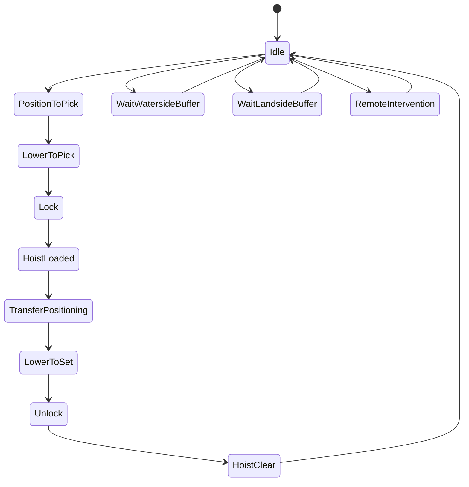
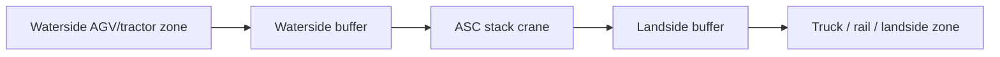
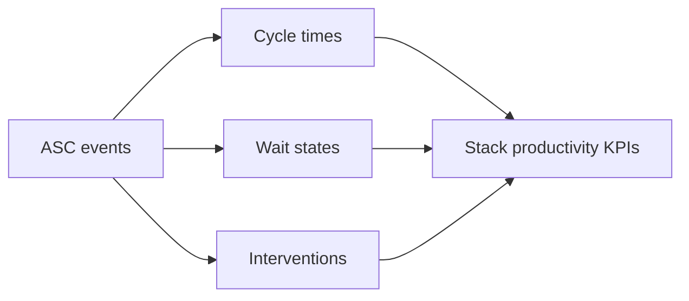

## Summary

This document defines **Automated Stacking Cranes (ASCs)** as simulation entities for automated or semi-automated container-terminal yards.

It separates the topic into the four mandatory lenses:

- **What it looks like**: portal frame, rails, trolley, hoist, spreader, sensors, waterside and landside transfer zones
- **How it moves**: gantry travel, trolley cross-travel, hoist motion, lock/unlock cycle, and housekeeping moves
- **What it can do**: automated stack/retrieve, truck or AGV handoff, buffer-zone handling, housekeeping and pre-marshalling
- **When it must stop**: safety interlocks, collision prevention, transfer-point faults, weather limits, control/network faults, maintenance

It is intended to support:
- believable 3D ASC assets and yard layouts
- simulation of dense automated stacks
- KPI definitions aligned with automation papers
- waterside/landside interchange modelling
- event-driven cycle execution and exception handling

---

## Why this matters for simulation and gameplay

ASCs are where an automated terminal either feels like a precise machine or a very expensive queue generator.

If they are modelled badly:
- automated yards become magical high-density storage with no downside
- transfer-point congestion disappears
- automation looks like a skin change rather than an operating model
- KPI comparisons between manual and automated scenarios become meaningless

If they are modelled properly:
- waterside and landside transfer logic matters
- buffers and interchange zones become real throughput constraints
- automation improves consistency more than it simply makes everything faster
- exception recovery, housekeeping, and queue control become central mechanics
- the player or AI has to manage a system, not just a crane

---

## Key definitions and vocabulary

- **ASC (Automated Stacking Crane)**  
  A rail-mounted gantry-style yard crane operating automatically or semi-automatically in container stacks.

- **ARMG**  
  Automated Rail Mounted Gantry crane. Often used interchangeably with ASC in terminal discussions.

- **Waterside interchange**  
  Transfer area where containers are exchanged with quay-to-yard transport such as AGVs, terminal tractors, or shuttles.

- **Landside interchange**  
  Transfer area where containers are exchanged with external trucks, rail, or other landside flows.

- **Buffer zone / transfer buffer**  
  Dedicated area used to decouple crane operations from vehicle arrival timing.

- **Housekeeping**  
  Automated internal stack rearrangement to improve future accessibility or maintain stack rules.

- **Stack operation mode**  
  How the ASC serves a block and transfer points, including whether it is tightly coupled or buffered.

- **Remote operator station (ROS)**  
  Off-crane workstation for monitoring, intervention, or manual takeover.

- **TOS / ECS**  
  Terminal Operating System / Equipment Control System.

- **Isolated ASC performance**  
  Performance measured for the crane or stack subsystem itself, separate from terminal-wide bottlenecks.

- **Integrated stack performance**  
  Performance measured including effects of TOS, ECS, vehicle flows, buffers, and transfer zones.

---

## Scope boundaries (what is included/excluded)

### Included
- ASC geometry and stack-serving behaviour
- waterside and landside transfer concepts
- event model and cycle phases
- KPI definitions for ASC stacks and transfer performance
- automation levels and supervision modes
- environmental and control-system stop conditions

### Excluded
- full TOS dispatch optimisation
- low-level PLC software design
- detailed civil/rail engineering
- financial ROI models for automation projects
- detailed gate and rail business rules unless they directly affect ASC handoff

---

## Key attributes and dimensions (human-level data model)

A simulation-grade ASC model should include:

### 1. Identity and classification
- `equipment_id`
- `family = "ASC"`
- `subtype` (`yard_asc`, `cantilever_side_loading_asc`, `end_loading_asc`)
- `manufacturer`
- `automation_level` (`remote_manual`, `supervised_auto`, `semi_automated`, `fully_automated`)
- `assigned_block_pair_or_zone`

### 2. Physical geometry
- `span_m`
- `stacking_width_slots`
- `stacking_height_descriptor`
- `stacking_height_max`
- `block_length_m`
- `transfer_zone_waterside_count`
- `transfer_zone_landside_count`
- `cantilever_left_m`
- `cantilever_right_m`
- `portal_height_m`

### 3. Motion model
- `gantry_travel_speed_mpm`
- `trolley_speed_mpm`
- `hoist_speed_laden_mpm`
- `hoist_speed_empty_mpm`
- `simultaneous_motion_allowed`
- `anti_sway_system`
- `stack_profile_system`

### 4. Functional interfaces
- `waterside_interfaces[]`
- `landside_interfaces[]`
- `buffering_mode` (`none`, `waterside_buffered`, `landside_buffered`, `dual_buffered`)
- `can_handle_container_sizes[]`
- `can_handle_laden`
- `can_handle_empty`
- `automated_housekeeping_supported`
- `automated_rehandle_supported`

### 5. Automation and supervision
- `remote_operator_station_supported`
- `operator_intervention_mode`
- `sensor_suite[]`
- `collision_prevention_system`
- `truck_alignment_confirmation`
- `agv_position_confirmation`
- `network_dependency_level`

### 6. Stop / restriction conditions
- `max_operating_wind_mps`
- `lightning_stop`
- `transfer_zone_blocked_stop`
- `collision_prevention_stop`
- `runway_obstruction_stop`
- `maintenance_state`
- `network_or_control_fault_stop`
- `manual_intervention_required`

---

## Rules, constraints, and algorithms (include simplified simulation models)

## 1. What it looks like: silhouette and 3D anchors

An ASC should be recognisable by:
- rectangular rail-mounted gantry spanning a dense stack block
- transfer zones at waterside, landside, or both
- trolley running across the span
- hoist and spreader beneath the trolley
- visible sensor pods / camera units for automated variants
- clean, regimented stack lanes and transfer points

### Mandatory 3D components
- `portal_frame`
- `runway_rails`
- `rail_bogies`
- `trolley`
- `hoist_ropes`
- `spreader`
- `sensor_pods`
- `electrical_house_or_service_platform`
- `transfer_point_markings`

### Optional high-value components
- remote-operation visual cues
- laser scanners / camera masts
- stack profile sensors
- transfer-point indicators and stop lights
- equipment beacons / warning lights
- cable reel or conductor-bar details

### Rendering note
The key visual difference from a generic RMG should be the automation cues and the clearly designed transfer zones for robotic or structured interchange.

---

## 2. Waterside vs landside interchange and buffer zones

PEMA’s ASC performance paper explicitly treats interfaces and environmental influences as part of crane-performance understanding, not as side notes. That means the simulation must model transfer areas properly.

### Waterside interchange
Typical partners:
- AGV
- terminal shuttle
- terminal tractor + trailer
- automated lift platforms or buffer points

Typical roles:
- receives import / transshipment discharge boxes
- releases export / transshipment load boxes toward quay side
- absorbs timing mismatch between quay and stack system

### Landside interchange
Typical partners:
- external truck
- internal truck
- rail-side interface
- inspection or support transfer point

Typical roles:
- import delivery
- export receipt
- special handling or inspection routing

### Buffering modes
- **No buffer**: direct crane-to-vehicle dependency
- **Waterside buffered**: ASC can place/retrieve from a transfer buffer to decouple from AGV arrival timing
- **Landside buffered**: decouples truck interaction from immediate crane action
- **Dual buffered**: greatest decoupling, typically higher infrastructure complexity

### Simplified rule

```pseudo
if transfer_buffer_available:
  asc_can_complete_set_phase_without_waiting_for_vehicle = true
else:
  asc_waits_for_vehicle_alignment = true
```

### Gameplay consequence
Buffers reduce immediate waiting but can:
- consume space
- create secondary queue hotspots
- hide upstream problems temporarily instead of solving them

---

## 3. Motion model and cycle phases

An ASC has the same broad three-axis motion logic as an automated RMG:
- gantry travel along block
- trolley travel across span
- hoist motion up/down

### Typical retrieval cycle
1. receive job
2. gantry to target bay if required
3. trolley to target row
4. hoist lower to top accessible box
5. lock
6. hoist clear
7. trolley/gantry to transfer point
8. lower to buffer or vehicle
9. unlock
10. hoist clear
11. confirm handover

### Typical storage cycle
1. transfer point confirms box present and aligned
2. lock and lift box
3. move to target stack slot
4. lower into slot
5. unlock
6. hoist clear
7. confirm stack update

### Housekeeping cycle
1. pick blocking or poorly placed container
2. move to temporary or preferred slot
3. update accessibility score for target stack

### Cycle-time principle
PEMA’s ASC performance material stresses performance should be understood in realistic scenarios, including interfaces and environmental influences. So:

```pseudo
cycle_time_seconds =
  travel_and_position_time +
  pick_set_time +
  lock_unlock_time +
  transfer_confirmation_time +
  wait_penalties +
  exception_penalties
```

Do not use one “ASC speed” number as a lazy shortcut.

---

## 4. Performance definitions and measurement

This topic is where simulations often go to hell by using vague KPIs.

PEMA’s ASC performance paper is explicitly about **definition and measurement of ASC performance in realistic scenarios for use in simulations and field testing**. It notes that interfaces, stack operation modes, and environmental influences affect performance and that TOS, ECS, and horizontal transport also affect stack performance.

### Core KPI design rule
Each KPI must state:
- measurement boundary
- included activities
- excluded stoppages
- whether it is per crane, per stack, per block, or per transfer point
- whether it is isolated or integrated performance

### Essential ASC KPI list

#### Crane / stack productivity
- `asc_moves_per_hour_gross`
- `asc_moves_per_hour_net`
- `asc_cycle_time_avg_sec`
- `asc_cycle_time_p95_sec`

#### Transfer-point performance
- `waterside_transfer_wait_avg_sec`
- `landside_transfer_wait_avg_sec`
- `buffer_occupancy_pct`
- `buffer_blocked_time_pct`

#### Accessibility / housekeeping
- `housekeeping_moves`
- `rehandles_generated`
- `stack_access_delay_avg_sec`
- `buried_export_rate_pct`

#### Reliability / automation
- `automation_intervention_count`
- `remote_operator_takeovers`
- `control_fault_minutes`
- `collision_prevention_stop_count`

#### Flow and service quality
- `truck_service_time_avg_sec`
- `agv_turnaround_avg_sec`
- `export_box_not_ready_rate_pct`
- `import_delivery_delay_rate_pct`

### Example KPI formulas

```pseudo
asc_moves_per_hour_gross = completed_moves / gross_operating_hours
asc_moves_per_hour_net = completed_moves / net_working_hours
buffer_occupancy_pct = occupied_buffer_slots / total_buffer_slots * 100
housekeeping_share_pct = housekeeping_moves / total_moves * 100
```

### Caveat
An ASC with high isolated moves per hour can still be a bad terminal performer if:
- waterside transfer is starved
- landside truck queueing is poor
- buffers are saturated
- intervention rates are high

That is why isolated and integrated KPIs must both exist.

---

## 5. Automation considerations and operating modes

PEMA’s automation papers treat ASCs as the prevailing technology for robotic yard operations and stress that performance depends on the chosen equipment system, transfer architecture, and surrounding processes.

### Operating modes

#### Remote manual
- operator directly controls crane from remote station
- lower field risk exposure
- still human-paced for many actions

#### Supervised automatic
- crane runs planned motions automatically
- operator intervenes only when alarms or ambiguities arise

#### Semi-automated
- some phases automated, some confirmation or handling steps require intervention
- common in mixed or transitional terminals

#### Fully automated
- TOS/ECS dispatches jobs
- crane performs stacking, retrieval, and housekeeping automatically
- humans supervise multiple cranes and resolve exceptions

### Environmental influences called out in performance guidance
- wind
- visibility / sensing quality
- stack condition and box alignment
- transfer-point occupancy
- interface readiness
- surrounding traffic or obstacle conditions

### Simplified automation-effect model

```pseudo
if automation_level == "fully_automated":
  cycle_time_variability -= large_amount
  intervention_rate += dependence_on_sensor_quality
  staffing_per_crane -= large_amount

if automation_level == "remote_manual":
  safety_exposure -= medium_amount
  cycle_time_variability -= small_amount
```

### Important simulation principle
Automation does not simply “make it faster”.
It tends to:
- improve consistency
- reduce labour at the crane
- change where delays show up
- increase sensitivity to interface design, sensors, control logic, and exception handling

---

## 6. Example ASC stack geometry parameters

### Example dense dual-interface block
- block length: 300 m
- span: 50 m
- stack width: 8 slots
- stacking height: `1 over 6`
- waterside transfer points: 2
- landside transfer points: 2
- buffer mode: `dual_buffered`
- automation level: `fully_automated`

### Example compact export block
- block length: 180 m
- span: 38 m
- stack width: 6 slots
- stacking height: `1 over 4`
- waterside transfer points: 1
- landside transfer points: 1
- buffer mode: `waterside_buffered`
- automation level: `supervised_auto`

### Vendor/public reference anchors
- Konecranes says its ASC operations are used for **fast, high-density container handling** and notes features such as **supervised operation, automated stacking, and automated housekeeping**.  
- Port Technology reference material describes automated stacking cranes as typically around **24 m high**, about **33.5 m wide**, and developed to handle **up to 10 rows of containers**, with paired-crane and high-density yard concepts in mind.  
These are broad reference anchors, not hard defaults.

---

## 7. Event model for ASC cycles

Suggested canonical event set:

- `ASC_JOB_ASSIGNED`
- `ASC_ROUTE_CONFIRMED`
- `ASC_GANTRY_MOVING`
- `ASC_TROLLEY_POSITIONING`
- `ASC_HOIST_LOWERING_TO_PICK`
- `ASC_LOCKING`
- `ASC_PICK_CONFIRMED`
- `ASC_HOIST_LIFTING`
- `ASC_TRANSFER_POSITIONING`
- `ASC_WAITING_WATERSIDE_BUFFER`
- `ASC_WAITING_LANDSIDE_BUFFER`
- `ASC_WAITING_AGV`
- `ASC_WAITING_TRUCK_ALIGNMENT`
- `ASC_HOIST_LOWERING_TO_SET`
- `ASC_UNLOCKING`
- `ASC_SET_CONFIRMED`
- `ASC_HOUSEKEEPING_CREATED`
- `ASC_HOUSEKEEPING_COMPLETED`
- `ASC_REMOTE_INTERVENTION`
- `ASC_CONTROL_FAULT`
- `ASC_JOB_COMPLETED`

### Example event projection rule

```pseudo
if target_box_buried:
  emit("ASC_HOUSEKEEPING_CREATED")
  create_housekeeping_job()

if waterside_buffer_full:
  emit("ASC_WAITING_WATERSIDE_BUFFER")
  delay_job()
```

---

## 8. Good-enough simulation algorithms

### 8.1 Move feasibility

```pseudo
function asc_can_execute(crane, job, environment):
  return (
    crane.maintenance_state == "available" and
    not environment.lightning_alert and
    transfer_interfaces_ready(job) and
    stack_accessible_or_housekeeping_planned(job) and
    control_path_available(crane.automation_level) and
    no_collision_prevention_block
  )
```

### 8.2 Transfer-point choice

```pseudo
function choose_transfer_point(job, block):
  candidates = valid_points_for(job.flow_direction, block.buffering_mode)
  return best_candidate_by(queue_length, travel_distance, target_priority)
```

### 8.3 Integrated performance estimate

```pseudo
effective_asc_throughput =
  min(
    asc_internal_cycle_capacity,
    waterside_interface_capacity,
    landside_interface_capacity,
    control_and_intervention_capacity
  )
```

### 8.4 Housekeeping trigger

```pseudo
if export_box_needed_soon and buried_depth > threshold:
  create_housekeeping_job(priority="high")
```

---

## Standards and authoritative references to confirm (edition/year, what to verify)

- **PEMA Automatic Stacking Crane Performance information paper**  
  Confirm that the paper is intended to improve understanding of **definition and measurement of ASC performance in realistic scenarios for simulations and field testing**, and that it explicitly includes alternative layouts, stack operation modes, interfaces, and environmental influences.

- **PEMA Container Terminal Automation information paper**  
  Confirm that ASCs are treated as the current prevailing technology for robotised yard operations, and that comparisons between systems depend on the full quay-yard transfer concept rather than crane speed alone.

- **Konecranes ASC product / technical information**  
  Confirm public references to supervised operation, automated stacking, and automated housekeeping, plus the emphasis on high-density automated yard handling.

- **Public ASC/RMG reference material**  
  Confirm representative geometric anchors such as height/width/row coverage where useful, while keeping clear that actual layouts vary significantly.

---

## Example outputs to include (tables, diagrams, sample data)

### KPI list for an ASC stack

| KPI | Formula | Why it matters |
|---|---|---|
| `asc_moves_per_hour_gross` | `completed_moves / gross_hours` | overall stack productivity |
| `asc_cycle_time_avg_sec` | `sum(cycle_times) / move_count` | baseline machine performance |
| `waterside_transfer_wait_avg_sec` | `sum(wait_waterside) / waterside_jobs` | quay-yard coupling quality |
| `landside_transfer_wait_avg_sec` | `sum(wait_landside) / landside_jobs` | truck service quality |
| `buffer_occupancy_pct` | `occupied / total_buffer_slots * 100` | decoupling effectiveness |
| `housekeeping_share_pct` | `housekeeping_moves / total_moves * 100` | hidden yard work burden |
| `remote_operator_takeovers` | `count(interventions)` | automation friction |
| `control_fault_minutes` | `sum(fault_minutes)` | system reliability |

### Sample event stream

```json
[
  {"event_time":"2026-03-27T08:00:00Z","event_type":"ASC_JOB_ASSIGNED","container_id":"MSKU1234567"},
  {"event_time":"2026-03-27T08:00:06Z","event_type":"ASC_GANTRY_MOVING","container_id":"MSKU1234567"},
  {"event_time":"2026-03-27T08:00:18Z","event_type":"ASC_PICK_CONFIRMED","container_id":"MSKU1234567"},
  {"event_time":"2026-03-27T08:00:31Z","event_type":"ASC_WAITING_WATERSIDE_BUFFER","container_id":"MSKU1234567"},
  {"event_time":"2026-03-27T08:00:42Z","event_type":"ASC_SET_CONFIRMED","container_id":"MSKU1234567"},
  {"event_time":"2026-03-27T08:00:43Z","event_type":"ASC_JOB_COMPLETED","container_id":"MSKU1234567"}
]
```

### Example ASC stack parameter set

```json
{
  "equipment_id": "ASC-WS-04",
  "automation_level": "fully_automated",
  "span_m": 50.0,
  "stacking_width_slots": 8,
  "stacking_height_descriptor": "1_over_6",
  "transfer_zone_waterside_count": 2,
  "transfer_zone_landside_count": 2,
  "buffering_mode": "dual_buffered"
}
```

---

## Data schemas (JSON Schema references or in-file fragments)

### ASC equipment schema fragment

```json
{
  "$schema": "https://json-schema.org/draft/2020-12/schema",
  "$id": "equipment-asc.schema.json",
  "title": "AutomatedStackingCrane",
  "type": "object",
  "required": ["equipment_id", "automation_level", "span_m", "stacking_width_slots", "buffering_mode"],
  "properties": {
    "equipment_id": { "type": "string" },
    "automation_level": {
      "type": "string",
      "enum": ["remote_manual", "supervised_auto", "semi_automated", "fully_automated"]
    },
    "span_m": { "type": "number" },
    "stacking_width_slots": { "type": "integer" },
    "stacking_height_descriptor": { "type": "string" },
    "transfer_zone_waterside_count": { "type": "integer" },
    "transfer_zone_landside_count": { "type": "integer" },
    "buffering_mode": {
      "type": "string",
      "enum": ["none", "waterside_buffered", "landside_buffered", "dual_buffered"]
    }
  }
}
```

### ASC event log schema fragment

```json
{
  "$schema": "https://json-schema.org/draft/2020-12/schema",
  "$id": "equipment-asc-event-log.schema.json",
  "title": "ASCEventLog",
  "type": "object",
  "required": ["equipment_id", "events"],
  "properties": {
    "equipment_id": { "type": "string" },
    "events": {
      "type": "array",
      "items": {
        "type": "object",
        "required": ["event_time", "event_type"],
        "properties": {
          "event_time": { "type": "string", "format": "date-time" },
          "event_type": { "type": "string" },
          "container_id": { "type": "string" },
          "job_id": { "type": "string" },
          "details": { "type": "object" }
        }
      }
    }
  }
}
```

---

## Sample data (JSON and YAML)

### JSON

```json
{
  "equipment_id": "ASC-LS-02",
  "automation_level": "supervised_auto",
  "span_m": 38.0,
  "stacking_width_slots": 6,
  "stacking_height_descriptor": "1_over_4",
  "transfer_zone_waterside_count": 1,
  "transfer_zone_landside_count": 1,
  "buffering_mode": "waterside_buffered"
}
```

### YAML

```yaml
equipment_id: ASC-DUAL-09
automation_level: fully_automated
span_m: 50.0
stacking_width_slots: 8
stacking_height_descriptor: 1_over_6
transfer_zone_waterside_count: 2
transfer_zone_landside_count: 2
buffering_mode: dual_buffered

automation:
  remote_operator_station_supported: true
  automated_housekeeping_supported: true
  operator_intervention_mode: exception_only
```

---

## Visualisation guidance

### Mermaid diagrams

#### 1. ASC cycle state machine



#### 2. Waterside vs landside interchange



#### 3. KPI pipeline



### UI/dashboard widgets where relevant

Useful widgets:
- ASC moves per hour by block
- waterside and landside buffer occupancy
- transfer-point wait heatmap
- housekeeping queue
- remote intervention count and causes
- control fault / recovery timeline
- stack accessibility score by block

---

## 3D rendering notes (scale, dimensions, textures/markings)

### Scale
- 1 unit = 1 metre
- keep the crane visually regular, precise, and highly “system-like”

### Minimum animated parts
- gantry along rails
- trolley across span
- hoist rope length
- spreader lock state
- attached container state

### Environment details that matter
- clearly marked waterside and landside transfer zones
- visible buffers if buffering mode is enabled
- lane lights / stop markers for AGVs or trucks
- sensor pods, scanners, and safety beacons
- regimented block layout with clean automation aesthetic

### Gameplay readability cues
- blue = waterside job
- green = landside job
- amber = housekeeping or rehandle
- red = intervention / control fault / blocked transfer point

---

## Validation checklist

- [ ] Waterside and landside interchange are represented separately
- [ ] Buffer zones are modelled as optional decoupling elements
- [ ] KPI definitions distinguish isolated and integrated ASC performance
- [ ] Automation mode changes staffing, intervention, and variability behaviour
- [ ] Event stream can reconstruct ASC cycle execution
- [ ] Housekeeping is a first-class move type, not hidden noise
- [ ] Transfer-point blocking affects throughput
- [ ] 3D model has visible automation and transfer-zone cues

---

## Open questions and research backlog

- Split further into:
  - `dk_equipment__asc_waterside_interface.md`
  - `dk_equipment__asc_landside_interface.md`
  - `dk_equipment__asc_kpis_and_benchmarking.md`
- Add paired-crane / twin-ASC-on-runway concepts where the chosen yard design uses them
- Add rail-terminal ASC variants if intermodal yard simulation expands
- Add detailed network and control-room staffing models
- Add weather-degradation curves instead of simple stop thresholds
