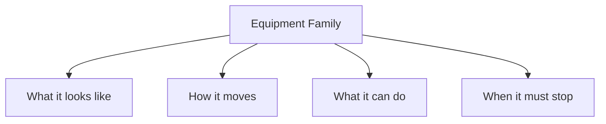
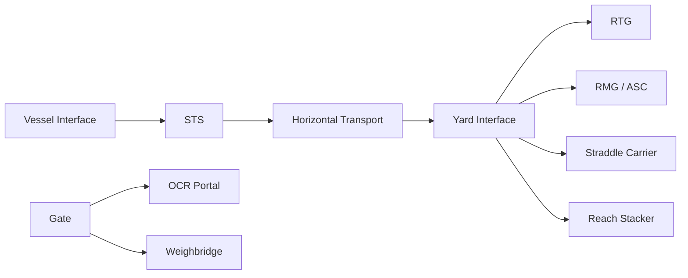
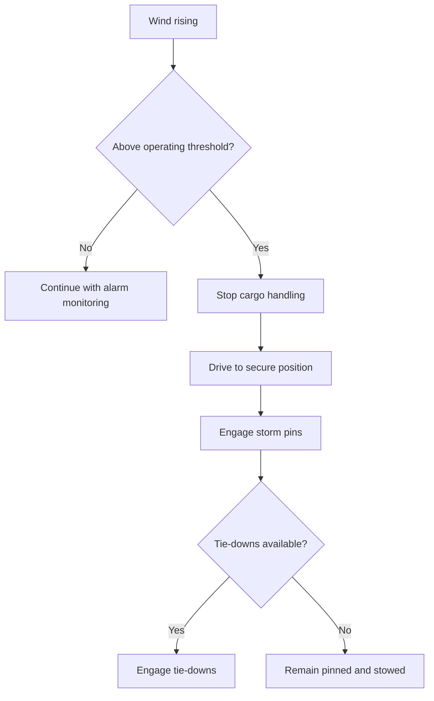

## Summary

This document provides a **cross-cutting equipment and infrastructure reference** for a container-terminal simulation.

It explicitly separates each equipment type into four lenses:

1. **What it looks like**  
   Silhouette, key components, and what must be visible in 3D.

2. **How it moves**  
   Degrees of freedom, motion axes, travel envelope, and speed abstractions.

3. **What it can do**  
   Interfaces, compatible assets, operating roles, and functional constraints.

4. **When it must stop**  
   Safety, weather, maintenance, and operating-envelope limits.

This file is intended as the shared baseline for later equipment-specific files such as:
- STS cranes
- RTG cranes
- RMG / ASC systems
- terminal tractors / AGVs
- straddle carriers
- reach stackers
- empty handlers
- gate OCR portals and weighbridges
- reefer power infrastructure
- crane rails, buffers, storm pins, and tie-down points

---

## Why this matters for simulation and gameplay

If equipment is modelled only as “thing that moves boxes”, the terminal will look busy but behave like nonsense.

A believable simulation needs to distinguish:
- which machine can physically reach a box
- which machine can legally or safely handle it
- which machine is blocked by wind, traffic, or staffing
- which infrastructure is required before the machine can work at all

This matters because:
- STS cranes are not just bigger RTGs
- AGVs and terminal tractors create different queue behaviours
- straddle terminals feel radically different from RTG/ASC terminals
- storm locks, OCR portals, and reefer power points are not decorative trivia
- weather shutdowns and safety stoppages are operationally important, not optional flavour

---

## Key definitions and vocabulary

- **STS crane**  
  Ship-to-shore crane for vessel loading and unloading.

- **RTG crane**  
  Rubber-tyred gantry crane serving container yard blocks.

- **RMG crane**  
  Rail-mounted gantry crane serving yard or rail blocks.

- **ASC**  
  Automated stacking crane, commonly a specialised automated RMG-like yard system.

- **Horizontal transport**  
  Equipment moving containers between quay, yard, rail, and gate interfaces.

- **Terminal tractor / yard truck**  
  Prime mover pulling terminal trailers or bomb carts.

- **AGV**  
  Automated Guided Vehicle used for unmanned horizontal transport.

- **Straddle carrier**  
  Mobile machine that can lift and carry containers while straddling them.

- **Reach stacker**  
  Mobile top-lift machine using a boom and spreader to stack or retrieve containers.

- **Empty handler**  
  Mobile machine optimised for stacking empty containers at greater heights than laden handlers.

- **OCR portal**  
  Gate or transfer-point scanning infrastructure for truck IDs, container IDs, and often damage imaging.

- **Weighbridge**  
  Static weighing point used for gate control, compliance, and sometimes VGM-supporting workflows.

- **Storm pin**  
  Horizontal restraint device that locks a rail-mounted crane against travel in forecast storm conditions.

- **Tie-down**  
  Vertical restraint device that helps resist uplift and overturning under high wind.

- **Operating wind speed**  
  Maximum wind speed at which the crane is permitted to operate.

- **Stowed wind speed**  
  Wind speed the crane is designed to withstand when secured in the stowed or parked configuration.

---

## Scope boundaries (what is included/excluded)

### Included
- common modelling framework for terminal equipment
- high-level equipment family comparison
- motion envelopes and interface abstractions
- shared safety and weather constraints
- infrastructure dependencies such as rails, lanes, power, and storm locks

### Excluded
- deep OEM-specific performance tuning for each machine
- maintenance engineering detail at component level
- procurement or cost-of-ownership analysis
- local legal compliance detail beyond high-level operational modelling

---

## Key attributes and dimensions (human-level data model)

A shared base schema for all terminal equipment should include:

### 1. Identity and classification
- `equipment_id`
- `equipment_family`
- `subtype`
- `manufacturer`
- `automation_level`
- `assigned_operating_zone`

### 2. Visual / physical attributes
- `length_m`
- `width_m`
- `height_m`
- `wheel_or_rail_base_m`
- `key_components[]`
- `silhouette_tags[]`

### 3. Motion model
- `travel_axes[]`
- `travel_speed_mps`
- `hoist_speed_mps`
- `trolley_speed_mps`
- `steering_mode`
- `turning_radius_m`
- `reach_envelope`
- `stacking_height_max`

### 4. Functional interfaces
- `can_handle_container_sizes[]`
- `can_handle_laden`
- `can_handle_empty`
- `reefer_support`
- `hazmat_support`
- `requires_operator_role`
- `pickup_interfaces[]`
- `dropoff_interfaces[]`

### 5. Stop / restriction conditions
- `max_operating_wind_mps`
- `max_stowed_wind_mps`
- `rain_restriction_level`
- `lightning_stop`
- `storm_lock_required`
- `maintenance_state`
- `staffing_required`
- `exclusion_zone_m`

### 6. Infrastructure dependencies
- `requires_rail`
- `requires_power_busbar`
- `requires_charging`
- `requires_lane_markings`
- `requires_gps_or_guidance`
- `requires_storm_pin_positions`
- `requires_tie_down_points`
- `requires_interchange_buffer`

---

## Rules, constraints, and algorithms (include simplified simulation models)

## 1. Four-lens modelling rule

Every equipment file must define:

```yaml
appearance:
movement:
capabilities:
stop_conditions:
```

This is a hard template rule. If a file only defines one or two of these, it is not simulation-ready.

---

## 2. Equipment-family comparison baseline

| Family | What it looks like | How it moves | What it can do | When it must stop |
|---|---|---|---|---|
| STS crane | giant portal crane on quay rails with boom, trolley, spreader | gantry travel along berth, trolley travel, hoist | vessel load/discharge | wind, lightning, no ship clearance, no storm securing, maintenance |
| RTG | tall wheeled gantry over yard rows | drives on tyres over block, trolley + hoist | stack/retrieve yard boxes | wind, tyre or steering faults, no lane clearance, maintenance |
| RMG / ASC | rail-mounted gantry over block or rail tracks | rail travel + trolley + hoist | dense block handling, often automated | wind, rail obstruction, automation faults, maintenance |
| Terminal tractor | compact tractor unit towing trailer | road/lane travel | horizontal transport only | traffic conflict, no trailer, no driver/dispatch, maintenance |
| AGV | low automated transport unit | guided lane travel | automated horizontal transport | route block, charging low, guidance fault, safety zone breach |
| Straddle carrier | tall mobile frame carrying container under body | drive, steer, lift/lower | transport + stack + interchange | wind, stability warning, collision risk, maintenance |
| Reach stacker | mobile boom machine with top spreader | drive, steer, boom lift/extend | flexible stack/retrieve and truck handling | overload envelope, visibility limits, ground condition, maintenance |
| Empty handler | similar to reach stacker but tuned for empties | drive, steer, boom lift | high empty-stack handling | wind, overload, visibility, maintenance |
| OCR portal | fixed gate frame with cameras/sensors | no operational movement | identify truck/container and capture images | system fault, dirty lenses, network outage |
| Weighbridge | fixed deck scale | no operational movement | static weighing and verification | sensor fault, overload, queue overflow |

---

## 3. Generic capability check

```pseudo
function can_execute(equipment, move):
  return (
    move.container_size in equipment.can_handle_container_sizes and
    not (move.is_laden and equipment.can_handle_laden == false) and
    interface_compatible(equipment, move.source, move.destination) and
    equipment.maintenance_state == "available" and
    equipment.stop_state == "clear"
  )
```

---

## 4. Generic stop-condition check

```pseudo
function stop_state(equipment, weather, site):
  if weather.lightning_alert:
    return "stop"
  if weather.wind_mps > equipment.max_operating_wind_mps:
    return "stop"
  if equipment.requires_operator_role and no_operator_available:
    return "stop"
  if site.exclusion_zone_breached:
    return "stop"
  if equipment.maintenance_state != "available":
    return "stop"
  return "clear"
```

---

## 5. Weather and storm-lock rule for rail-mounted cranes

Rail-mounted cranes need a different model from purely mobile equipment.

### Suggested states
- `operating`
- `high_wind_alarm`
- `drive_to_secure_position`
- `storm_pinned`
- `tied_down`
- `stowed`
- `out_of_service`

### Simplified logic

```pseudo
if wind_mps > warning_threshold and crane.family in ["STS", "RMG", "ASC"]:
  state = "high_wind_alarm"

if forecast_storm and crane.family in ["STS", "RMG", "ASC"]:
  move_to_secure_position()
  engage_storm_pins()
  if tie_downs_available:
    engage_tie_downs()
  state = "stowed"
```

### Simulation note
Storm pins and tie-downs should not be treated as cosmetic. They change whether a crane can safely remain in place during forecast storm conditions.

---

## 6. Infrastructure-dependency rule

A machine can only operate if the site supports it.

```pseudo
if equipment.requires_rail and no_rail_present:
  reject_terminal_design()

if equipment.requires_power_busbar and no_power_busbar:
  reduce_or_disable_operation()

if equipment.requires_charging and charge_state < minimum:
  send_to_charge()
```

---

## 7. Safety-envelope rule

Every active machine should own a moving or fixed exclusion zone.

```pseudo
if person_or_vehicle enters exclusion_zone:
  trigger_slowdown_or_stop()
```

Simulation fidelity levels:
- **low**: binary stop
- **medium**: slowdown + alarm + near-miss logging
- **high**: dynamic safety field with differentiated machine response

---

## Standards and authoritative references to confirm (edition/year, what to verify)

- **Konecranes STS technical documentation**  
  Confirm representative crane environmental design figures. Example published STS documents show operating wind speed around **20 m/s** and stowed wind speed around **60 m/s** for one crane reference, which is useful as a simulation range anchor rather than a universal truth.

- **TT Club windstorm guidance**  
  Confirm the role of storm pins and tie-downs for quay cranes and the point that brakes alone are not considered an adequate substitute for forecast storm conditions. Also confirm practical braking / securing guidance and the distinction between horizontal restraint and uplift restraint.

- **PEMA / TT Club safety features for quay container cranes**  
  Confirm recommended safety features such as wind alarms, braking behaviour, and the principle that automatic shutdown should not prevent travel to the storm securing position.

- **ICHCA safety material**  
  Confirm that moving container-handling equipment remains a major severe-risk category in terminal operations, reinforcing the need for exclusion zones and personnel-equipment separation logic.

- **OEM equipment category references**  
  Confirm the major terminal equipment families and their intended operational domains:
  - STS for vessel interface
  - RTG/RMG/ASC for yard or rail blocks
  - terminal tractors / AGVs / straddles for horizontal transport
  - reach stackers / empty handlers for flexible or lower-density operations

---

## Example outputs to include (tables, diagrams, sample data)

### Table: equipment family to simulation hooks

| Family | Primary zone | Core move verbs | Key shared bottlenecks |
|---|---|---|---|
| STS | quay | pick_from_vessel, place_to_vehicle, place_to_buffer, load_to_vessel | wind, no truck/AGV, hatch change, lashing, staffing |
| RTG | yard | pick_from_stack, ground_to_stack, handoff_to_truck | yard congestion, interchange queue, staffing |
| RMG / ASC | yard/rail | pick, place, automated handoff | rail obstruction, guidance fault, transfer-point congestion |
| Terminal tractor | road/quay/yard lanes | tow_to_yard, tow_to_quay | traffic, dispatch imbalance, staffing |
| AGV | guided lanes | collect_from_qc, deliver_to_buffer | route conflict, charging, guidance fault |
| Straddle carrier | quay/yard | carry_container, stack_container, retrieve_container | traffic, safety separation, stability |
| Reach stacker | flexible blocks | top_lift, stack, truck_serve | visibility, ground condition, overload envelope |
| OCR portal | gate | identify, image_capture | confidence failure, dirty lens, downtime |
| Weighbridge | gate | weigh, validate | queue overflow, sensor failure |

### Parameter set for a common STS reference

```json
{
  "equipment_id": "STS-01",
  "equipment_family": "STS",
  "appearance": {
    "silhouette_tags": ["portal", "quay_rail", "boom", "waterside_legs", "landside_legs", "trolley", "spreader"],
    "key_components": ["boom", "trolley", "hoist", "machinery_house", "operator_cabin", "storm_pins"]
  },
  "movement": {
    "travel_axes": ["gantry_along_rail", "trolley_cross_travel", "vertical_hoist"],
    "travel_speed_mps": 0.75,
    "trolley_speed_mps": 3.0,
    "hoist_speed_mps": 1.5
  },
  "capabilities": {
    "pickup_interfaces": ["vessel_slot", "quay_buffer", "vehicle_handover"],
    "dropoff_interfaces": ["vehicle_handover", "quay_buffer", "vessel_slot"],
    "can_handle_container_sizes": ["20ft", "40ft", "45ft"]
  },
  "stop_conditions": {
    "max_operating_wind_mps": 20,
    "max_stowed_wind_mps": 60,
    "lightning_stop": true,
    "storm_lock_required": true
  }
}
```

---

## Data schemas (JSON Schema references or in-file fragments)

### Shared equipment schema fragment

```json
{
  "$schema": "https://json-schema.org/draft/2020-12/schema",
  "$id": "equipment-common.schema.json",
  "title": "EquipmentCommon",
  "type": "object",
  "required": ["equipment_id", "equipment_family", "appearance", "movement", "capabilities", "stop_conditions"],
  "properties": {
    "equipment_id": { "type": "string" },
    "equipment_family": { "type": "string" },
    "appearance": {
      "type": "object",
      "properties": {
        "silhouette_tags": {
          "type": "array",
          "items": { "type": "string" }
        },
        "key_components": {
          "type": "array",
          "items": { "type": "string" }
        }
      }
    },
    "movement": {
      "type": "object",
      "properties": {
        "travel_axes": {
          "type": "array",
          "items": { "type": "string" }
        },
        "travel_speed_mps": { "type": "number" },
        "trolley_speed_mps": { "type": "number" },
        "hoist_speed_mps": { "type": "number" },
        "turning_radius_m": { "type": "number" }
      }
    },
    "capabilities": {
      "type": "object",
      "properties": {
        "can_handle_container_sizes": {
          "type": "array",
          "items": { "type": "string" }
        },
        "pickup_interfaces": {
          "type": "array",
          "items": { "type": "string" }
        },
        "dropoff_interfaces": {
          "type": "array",
          "items": { "type": "string" }
        }
      }
    },
    "stop_conditions": {
      "type": "object",
      "properties": {
        "max_operating_wind_mps": { "type": "number" },
        "max_stowed_wind_mps": { "type": "number" },
        "lightning_stop": { "type": "boolean" },
        "storm_lock_required": { "type": "boolean" }
      }
    }
  }
}
```

---

## Sample data (JSON and YAML)

### JSON

```json
{
  "equipment_id": "TT-14",
  "equipment_family": "terminal_tractor",
  "appearance": {
    "silhouette_tags": ["tractor_unit", "fifth_wheel", "yard_vehicle"],
    "key_components": ["cab", "fifth_wheel", "lights", "safety_system"]
  },
  "movement": {
    "travel_axes": ["lane_travel", "steering"],
    "travel_speed_mps": 8.0,
    "turning_radius_m": 8.5
  },
  "capabilities": {
    "can_handle_container_sizes": ["20ft", "40ft", "45ft"],
    "pickup_interfaces": ["trailer_handover"],
    "dropoff_interfaces": ["quay_handover", "yard_handover", "gate_handover"]
  },
  "stop_conditions": {
    "max_operating_wind_mps": null,
    "max_stowed_wind_mps": null,
    "lightning_stop": false,
    "storm_lock_required": false
  }
}
```

### YAML

```yaml
equipment_id: RTG-C3
equipment_family: RTG

appearance:
  silhouette_tags:
    - gantry
    - rubber_tyres
    - trolley
    - spreader
  key_components:
    - portal_frame
    - trolley
    - hoist
    - tyre_bogies
    - operator_cabin

movement:
  travel_axes:
    - block_travel
    - trolley_cross_travel
    - vertical_hoist
  travel_speed_mps: 2.5
  trolley_speed_mps: 1.8
  hoist_speed_mps: 0.9

capabilities:
  can_handle_container_sizes:
    - 20ft
    - 40ft
    - 45ft
  pickup_interfaces:
    - truck_lane
    - ground_slot
    - transfer_buffer
  dropoff_interfaces:
    - truck_lane
    - ground_slot
    - transfer_buffer

stop_conditions:
  max_operating_wind_mps: 18
  max_stowed_wind_mps:
  lightning_stop: true
  storm_lock_required: false
```

---

## Visualisation guidance

### Mermaid diagrams

#### 1. Four-lens equipment template



#### 2. Equipment-domain map



#### 3. Wind response logic for rail-mounted cranes



### UI/dashboard widgets where relevant

Useful widgets:
- equipment status board by family and zone
- stop-state dashboard by reason (wind, maintenance, staffing, safety)
- utilisation by equipment family
- mobile-equipment queue map
- crane weather envelope panel
- charging / fuel / power availability panel for electric or hybrid fleets

---

## 3D rendering notes (scale, dimensions, textures/markings)

This file should drive asset consistency across the terminal.

### General rendering rules
- equipment silhouettes must be distinct from far camera distances
- the user should be able to tell at a glance whether they are looking at:
  - STS
  - RTG/RMG/ASC
  - straddle carrier
  - reach stacker
  - terminal tractor
- key moving components should be separable for animation:
  - crane trolley
  - hoist/spreader
  - boom
  - gantry travel
  - steering wheels / articulated vehicle motion

### Key silhouette anchors
- **STS**: portal legs on quay rail, long boom over ship, trolley under boom
- **RTG**: tall rectangular frame on rubber tyres spanning multiple lanes
- **RMG/ASC**: similar gantry but rail-bound and more structured/automated
- **Straddle carrier**: tall open frame carrying the box inside its legs
- **Reach stacker**: low vehicle body, large boom, top-lift spreader
- **Terminal tractor**: short cab and fifth wheel, usually towing a low trailer
- **OCR portal**: fixed gantry frame with cameras and sensors
- **Weighbridge**: recessed or deck-mounted scale pad in road lane

### Environmental / safety details worth rendering
- crane rails and buffers
- storm pin pockets / positions on quay for STS
- tie-down points where modelled
- reefer racks and power cabinets
- lane markings, stop lines, and exclusion zones
- warning lights and alarm states in high wind or stop mode

---

## Validation checklist

- [ ] Every equipment type is described using the four mandatory lenses
- [ ] Motion models distinguish travel, trolley, hoist, and steering where relevant
- [ ] Capability rules distinguish interfaces, not just abstract “can move container”
- [ ] Stop conditions include safety and weather, not only breakdowns
- [ ] Rail-mounted cranes include storm-lock logic where relevant
- [ ] Infrastructure dependencies are explicit
- [ ] Safety exclusion zones are part of the simulation model
- [ ] 3D assets have distinct silhouettes and named moving components
- [ ] Shared schema can be specialised into equipment-specific files later

---

## Open questions and research backlog

- Split this overview into detailed files:
  - `dk_equipment__quay_cranes_sts.md`
  - `dk_equipment__yard_cranes_rtg.md`
  - `dk_equipment__yard_cranes_rmg_asc.md`
  - `dk_equipment__horizontal_transport_trucks_agvs.md`
  - `dk_equipment__flexible_handlers_reachstackers_emptyhandlers.md`
  - `dk_infra__gate_ocr_weighbridges.md`
  - `dk_infra__power_rails_storm_locks.md`
- Add representative speed envelopes from more OEM families for non-STS equipment
- Add weather degradation curves rather than simple binary cutoffs
- Add pedestrian-proximity and collision-risk modelling in more detail
- Add charging/fuelling logistics for mixed diesel, hybrid, and electric fleets
