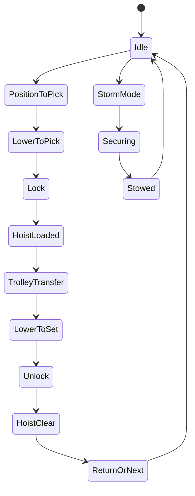
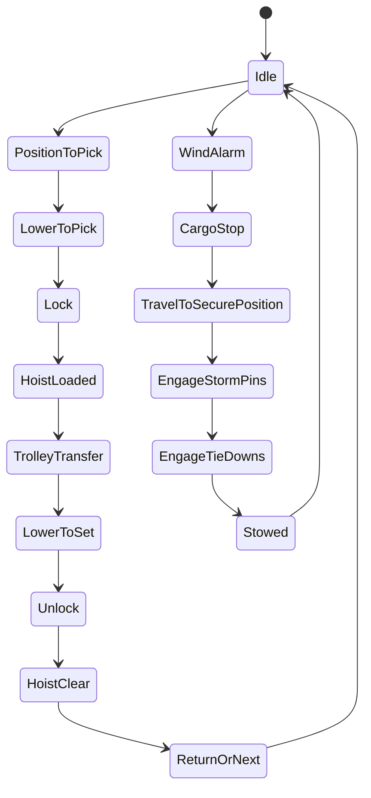
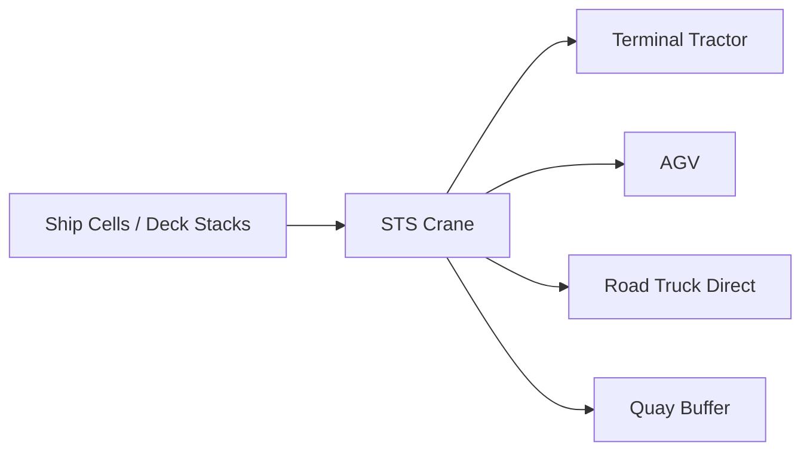
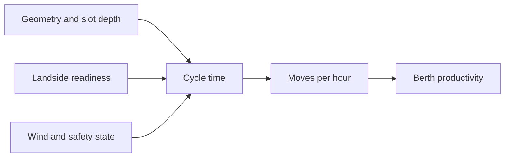

## Summary

This document defines **ship-to-shore (STS) quay cranes** as simulation entities.

It separates the topic into the four mandatory lenses:

- **What it looks like**: silhouette, key components, 3D anchors
- **How it moves**: gantry, trolley, hoist, boom, spreader, and cycle phases
- **What it can do**: vessel and landside interfaces, container handling limits, handover modes
- **When it must stop**: wind, lightning, interlocks, collision, overload, maintenance, and storm mode

The goal is to support:
- believable 3D crane assets and animation
- operational cycle modelling
- move-time estimation
- weather and safety shutdown logic
- crane-size-based parameterisation

---

## Why this matters for simulation and gameplay

STS cranes are the most visible machines in a container terminal and often the main throughput bottleneck.

If they are modelled badly:
- ship operations feel fake
- berth productivity becomes meaningless
- wind and safety never matter
- all terminals end up feeling the same

If they are modelled properly:
- crane size changes what ships a berth can serve
- cycle-time differences show up in vessel productivity
- yard starvation and truck shortages become visible as QC idle time
- high wind and storm-preparation procedures become operational gameplay rather than decorative fluff
- big cranes feel different from older or smaller cranes

A decent STS model is the difference between “animated wallpaper” and a terminal sim.

---

## Key definitions and vocabulary

- **STS crane / quay crane / QC**  
  Rail-mounted portal crane used to load and discharge containers between vessel and terminal.

- **Gantry travel**  
  Crane travel along quay rails parallel to the berth.

- **Boom**  
  Waterside projecting structure carrying trolley rails over the ship.

- **Backreach**  
  Landside extension behind the waterside gantry, used to reach trucks, trailers, or buffers.

- **Trolley**  
  Mechanism travelling along the boom/backreach carrying the hoist and spreader.

- **Hoist**  
  Vertical lifting mechanism.

- **Spreader**  
  Lifting frame that locks into container corner castings.

- **Lock / unlock**  
  Spreader twistlock engagement and release.

- **Outreach**  
  Waterside reach from landside rail gauge to farthest ship-cell working position.

- **Lift height above rail**  
  Maximum hook/spreader height for clearing vessel stacks.

- **Gauge / span**  
  Distance between crane rails or portal legs.

- **Twin-lift**  
  Handling two 20ft containers together where crane, spreader, and rules permit.

- **Tandem-lift**  
  Handling two 40ft containers together with specialised systems. Advanced-fidelity only.

- **Storm pin**  
  Horizontal restraint engaging crane to rail-side locking positions for forecast storm conditions.

- **Tie-down**  
  Vertical restraint preventing uplift / wheel detachment under extreme wind.

- **Park / stow / storm mode**  
  Non-operating secured state used during bad weather or shutdown.

---

## Scope boundaries (what is included/excluded)

### Included
- STS crane components and silhouette
- motion axes and cycle phases
- operational interfaces with ship cells and landside handoff
- representative size-class parameters
- weather and safety stop conditions
- storm-mode and lock-down behaviour

### Excluded
- detailed PLC or control-system design
- civil engineering of quay foundations
- OEM-proprietary automation logic in full detail
- detailed vessel-lashing crew workflows beyond crane impact
- exact procurement specifications for every manufacturer

---

## Key attributes and dimensions (human-level data model)

A simulation-grade STS model should group attributes into:

### 1. Identity and classification
- `equipment_id`
- `family = "STS"`
- `size_class` (`feeder`, `panamax`, `post_panamax`, `super_post_panamax`, `ulcv`)
- `manufacturer`
- `automation_level` (`manual`, `assisted`, `semi_automated`, `automated`)
- `berth_id`

### 2. Physical geometry
- `outreach_m`
- `backreach_m`
- `lift_height_above_rail_m`
- `rail_gauge_m`
- `portal_clearance_m`
- `boom_hinge_height_m`
- `overall_height_m`
- `wheelbase_m`
- `bogie_count`

### 3. Motion model
- `gantry_travel_speed_mpm`
- `trolley_speed_mpm`
- `hoist_speed_laden_mpm`
- `hoist_speed_empty_mpm`
- `boom_raise_lower_mode`
- `simultaneous_motion_allowed`
- `positioning_precision_mode`

### 4. Handling capabilities
- `rated_load_under_spreader_t`
- `container_sizes_supported[]`
- `twin20_capable`
- `tandem_capable`
- `ship_cell_interface`
- `truck_handover_interface`
- `trailer_handover_interface`
- `agv_handover_interface`
- `quay_buffer_interface`
- `reefer_container_handling_allowed`
- `hazmat_container_handling_allowed`

### 5. Operational limits
- `max_operating_wind_mps`
- `max_stowed_wind_mps`
- `lightning_stop`
- `collision_prevention_system`
- `storm_pin_present`
- `tie_down_present`
- `rail_brake_present`
- `anti_pedestrian_barriers`
- `snag_load_protection`
- `overload_protection`

### 6. Runtime states
- `state`
- `assigned_work_zone`
- `current_bay_range`
- `wind_alarm_state`
- `operator_present`
- `maintenance_state`
- `storm_mode_state`
- `idle_reason`

---

## Rules, constraints, and algorithms (include simplified simulation models)

## 1. What it looks like: silhouette and key components for 3D

An STS crane should be recognisable from far away by the following visual anchors:

- tall portal frame spanning quay rail gauge
- waterside boom projecting over vessel
- trolley moving under boom
- suspended spreader below hoist ropes
- machinery house near boom apex or landside structure
- operator cabin offset for ship-cell visibility
- bogies and wheel assemblies on quay rails
- storm-pin / tie-down connection points if modelled
- access ladders, platforms, sill beams, and rail beams

### Mandatory 3D components
- `portal_frame`
- `waterside_boom`
- `backreach`
- `trolley`
- `hoist_ropes`
- `spreader`
- `operator_cabin`
- `machinery_house`
- `bogies`
- `buffers_and_rail_contacts`

### Optional but high-value components
- cable reels / festoon systems
- boom rest / stow support
- wind anemometer
- anti-collision sensors
- floodlights
- warning beacons
- access gates / interlocks
- storm pins and tie-down fittings

### Rendering note
Do not build the STS as a static sculpture. The trolley, hoist ropes, spreader, gantry, and optionally boom/storm gear need separate animation-ready parts.

---

## 2. How it moves: degrees of freedom and motion axes

An STS crane has at least these core motion axes:

### 2.1 Gantry travel
Movement of the whole crane along quay rails.

Uses:
- repositioning between vessel bays
- moving to park or storm-pin location
- berth-sharing or crane split adjustments

### 2.2 Trolley travel
Movement of trolley along boom/backreach.

Uses:
- crossing between ship cell and landside handover zone
- most of the horizontal motion during a cycle

### 2.3 Hoist motion
Vertical lift and lower of spreader and load.

Uses:
- pick from vessel slot
- clear hatch coamings / cell guides / stack tops
- land on truck, AGV, trailer, or quay buffer
- load into vessel slot

### 2.4 Spreader lock state
Not a travel axis, but operationally critical.

States:
- `unlocked`
- `aligning`
- `locked`
- `unlocking`
- `fault`

### 2.5 Boom raise / lower or boom luffing / stow
Not active during normal cargo cycles for many container cranes, but relevant for:
- vessel clearance
- non-working safe position
- navigation clearance depending on crane design

### Simultaneous motion
Some STS designs and control systems allow simultaneous trolley and hoist motion and fine positioning advantages due to separate drives. A simulation should support:

```pseudo
if simultaneous_motion_allowed:
  cycle_time -= overlap_efficiency_bonus
```

Use with care. It should improve productivity, not produce teleport nonsense.

---

## 3. Motion and cycle phases

A good-enough container cycle can be broken into explicit phases.

### 3.1 Discharge cycle
1. trolley moves to vessel slot
2. hoist lowers spreader
3. spreader aligns and locks
4. hoist lifts container clear
5. trolley travels landside
6. hoist lowers to handover target
7. spreader unlocks
8. hoist lifts spreader clear
9. trolley returns or proceeds to next position

### 3.2 Load cycle
1. trolley positions landside
2. hoist lowers spreader
3. spreader locks to outbound box
4. hoist lifts clear
5. trolley travels waterside
6. hoist lowers into vessel slot
7. spreader unlocks
8. hoist lifts spreader clear
9. trolley returns or proceeds to next position

### 3.3 Restow variants
- `onboard_restow`: ship slot -> ship slot
- `quay_restow`: ship slot -> temporary landside buffer -> ship slot

### 3.4 Auxiliary phases that matter
- hatch-change waiting
- lashing/unlashing wait
- truck / AGV not present
- landside buffer full
- box not ready for load
- wind alarm slowdown
- shift handover interruption

---

## 4. Cycle-time breakdown

A useful simulation-level breakdown is:

```pseudo
cycle_time_seconds =
  align_time +
  lock_time +
  hoist_down_time +
  hoist_up_time +
  trolley_out_time +
  trolley_back_time +
  setdown_time +
  unlock_time +
  confirmation_time +
  wait_penalties +
  exception_penalties
```

### Simplified component model

```pseudo
hoist_time = vertical_distance / hoist_speed
trolley_time = horizontal_distance / trolley_speed
gantry_reposition_time = bay_shift_distance / gantry_speed
```

### Example operational penalties
- `truck_not_ready_penalty`
- `agv_queue_penalty`
- `hatch_transition_penalty`
- `restow_penalty`
- `high_wind_slowdown_penalty`
- `manual_alignment_penalty`
- `visibility_penalty_for_deep_hold`

### Suggested modelling principle
Never represent STS productivity as a single constant. Even a basic cycle model should separate:
- waterside geometry
- landside handoff condition
- wait states
- setup/change penalties

---

## 5. Interfaces: what the crane can do

STS cranes interface with both vessel and terminal systems.

### Waterside interfaces
- vessel cell guides under deck
- on-deck stack positions
- hatch-cover-adjacent positions
- restow target positions
- hatch-open work areas only

### Landside interfaces
- terminal tractor + trailer
- road truck direct interchange
- AGV platform / cassette
- quay transfer platform
- grounded quay buffer
- straddle handoff zone in some layouts

### Interface constraints

```pseudo
function can_handover(sts, target):
  return (
    target.interface_type in sts.supported_handover_interfaces and
    target.position_clear and
    target.height_within_handover_envelope and
    target.vehicle_stable and
    no_exclusion_zone_breach
  )
```

### Practical note
Direct road-truck handoff should usually be slower and more variable than dedicated terminal-trailer or AGV handoff unless the terminal is explicitly designed for it.

---

## 6. Parameter ranges by crane size class

Representative ranges for simulation use:

| Size class | Typical ship class served | Outreach m | Lift height above rail m | Rated load under spreader t | Typical trolley speed m/min | Typical hoist speed laden m/min | Typical gantry speed m/min |
|---|---|---:|---:|---:|---:|---:|---:|
| Feeder | feeder / small feedermax | 30-40 | 20-30 | 40-50 | 120-180 | 45-70 | 30-45 |
| Panamax | panamax | 40-50 | 30-35 | 50-60 | 150-210 | 60-75 | 35-45 |
| Post-Panamax | post-panamax | 50-60 | 35-45 | 60-65 | 180-240 | 60-90 | 35-45 |
| Super Post-Panamax | new panamax / large mainline | 60-70 | 40-50 | 65-75 | 180-240 | 75-90 | 35-45 |
| ULCV class | ultra-large vessels | 70-80+ | 45-55+ | 65-80+ | 180-240 | 75-90 | 35-45 |

These are intentionally broad simulation ranges. Actual cranes vary by OEM, age, berth, and upgrade path.

### Useful anchor values from public OEM material
Representative Konecranes STS brochures/specifications publicly show figures such as:
- gantry travel around **45 m/min**
- trolley speed around **210-240 m/min**
- laden hoist around **60-90 m/min**
- empty hoist around **120-180 m/min**
- operating wind around **20 m/s**
- stowed wind around **60 m/s**

Use these as reference anchors, not universal constants.

---

## 7. Simplified kinematics model for 3D animation

A game or visual sim usually does not need full multibody physics. A state-machine plus parametric motion model is enough.

### State machine



### Animation variables
- `gantry_position_x`
- `trolley_position_y`
- `spreader_height_z`
- `spreader_lock_state`
- `load_attached`
- `boom_angle`
- `storm_pin_engaged`
- `tie_down_engaged`

### Motion interpolation example

```pseudo
gantry_position_x = lerp(current_x, target_x, gantry_travel_progress)
trolley_position_y = lerp(current_y, target_y, trolley_progress)
spreader_height_z = lerp(current_z, target_z, hoist_progress)
```

### Animation rule
Lock/unlock should not be visually instantaneous. Even a short dwell sells the action.

---

## 8. Operational limits and stop logic

## 8.1 Wind limits

A simulation should model at least:
- **warning threshold**
- **operating stop threshold**
- **storm securing threshold / procedure trigger**

Suggested state logic:

```pseudo
if wind_mps >= warning_wind_mps:
  state = "wind_alarm"

if wind_mps >= max_operating_wind_mps:
  stop_new_lifts()
  finish_safe_phase_if_possible()
  state = "high_wind_stop"
```

### Important operational detail
Safety guidance recommends the crane **must not shut down automatically in a way that prevents travel to storm pin / tie-down positions**. So use:

```pseudo
if high_wind_stop:
  cargo_handling = disabled
  gantry_travel_to_secure_position = allowed
```

not:
```pseudo
if high_wind_stop:
  everything = dead
```

That second version is how you accidentally model a crane that politely waits to be blown down the quay.

## 8.2 Storm mode and lock-down behaviour

### Suggested storm-mode states
- `alarm`
- `cargo_stop`
- `travel_to_secure_position`
- `engage_storm_pins`
- `engage_tie_downs`
- `stowed_and_secured`

### Simplified storm-mode algorithm

```pseudo
if forecast_storm or wind_mps > max_operating_wind_mps:
  stop_accepting_new_moves()
  complete_safe_current_motion()
  gantry_to(nearest_secure_position)
  engage_storm_pins()

  if tie_down_present:
    engage_tie_downs()

  state = "stowed_and_secured"
```

### Suggested simulation notes
- storm pins resist horizontal runway movement
- tie-downs resist uplift / overturning
- brakes help but should not be treated as sufficient substitute for proper storm securing
- microbursts can justify an emergency braking / uncontrolled-runaway risk model at high fidelity

## 8.3 Other stop conditions
- lightning alert
- overload detected
- snag-load event
- crane-to-crane collision prevention stop
- pedestrian or vehicle exclusion-zone breach
- access-gate interlock open
- machine-room fire/smoke alarm
- maintenance lockout
- no operator present for manual modes

---

## 9. Safety systems and failure modes

### Recommended safety features to model
- wind anemometer with audible and visual alarms
- storm pins
- tie-downs
- rail brakes / gantry brakes
- crane-to-crane anti-collision
- anti-pedestrian barriers between bogies
- snag-load protection
- overload protection
- access interlocks for restricted areas
- fire and smoke detection in machinery/electrical rooms
- positive-pressure cabin air filtration

### Failure / exception states
- `no_truck_available`
- `no_box_ready`
- `twistlock_fault`
- `snag_detected`
- `overload_alarm`
- `high_wind_alarm`
- `gantry_collision_risk`
- `maintenance_stop`
- `vision_or_alignment_fault`
- `operator_not_present`

---

## 10. Good-enough simulation algorithms

### 10.1 Move feasibility
```pseudo
function sts_can_execute_move(crane, move, weather):
  return (
    crane.state not in ["maintenance_stop", "stowed_and_secured"] and
    weather.wind_mps < crane.max_operating_wind_mps and
    required_handover_available(move) and
    required_ship_access_available(move) and
    no_safety_interlock_block
  )
```

### 10.2 Cycle time estimate
```pseudo
function estimate_sts_cycle(move):
  return (
    align_seconds(move) +
    hoist_seconds(move.vertical_pick_m + move.vertical_set_m) +
    trolley_seconds(move.horizontal_transfer_m) +
    lock_unlock_seconds(move) +
    wait_penalty_seconds(move) +
    setup_penalty_seconds(move)
  )
```

### 10.3 Idle-reason attribution
```pseudo
if crane_ready and no_vehicle_present:
  idle_reason = "no_horizontal_transport"
elif crane_ready and load_box_not_ready:
  idle_reason = "no_box_ready"
elif weather_stop:
  idle_reason = "weather"
elif hatch_transition:
  idle_reason = "hatch_change"
else:
  idle_reason = "other"
```

---

## Standards and authoritative references to confirm (edition/year, what to verify)

- **Konecranes STS technical documents and brochures**  
  Confirm representative public parameter anchors such as gantry travel, trolley speed, hoist speeds, rated loads, and environmental design data. Public Konecranes materials show examples like 45 m/min gantry travel, 210-240 m/min trolley speed, and operating/stowed wind figures of about 20 m/s and 60 m/s.

- **Liebherr STS technical descriptions**  
  Confirm that separate drives for hoist, travel, and trolley allow fine positioning and simultaneous motion assumptions in the simulation model.

- **PEMA / TT Club recommended minimum safety features for quay container cranes**  
  Confirm wind-alarm, collision-prevention, snag-load, overload, anti-pedestrian, access-interlock, and fire/smoke safety features, including the recommendation that cranes must not shut down automatically in a way that prevents movement to storm securing points.

- **TT Club windstorm guidance**  
  Confirm operational storm preparations:
  - storm pins and tie-downs should be invoked for forecast strong winds
  - brakes help but are not the full securing solution
  - retrofit considerations may exist for older cranes
  - modified cranes may need rechecked wind/uplift calculations

---

## Example outputs to include (tables, diagrams, sample data)

### Cycle time breakdown example

| Phase | Seconds | Notes |
|---|---:|---|
| Align and lower to pick | 10 | depends on slot visibility and depth |
| Lock and confirm | 3 | manual vs automated affects this |
| Hoist clear | 12 | vertical distance dependent |
| Trolley transfer | 15 | ship-to-landside distance dependent |
| Lower and set down | 10 | handover precision dependent |
| Unlock and clear | 4 | includes confirmation |
| Return or move to next | 8 | can be reduced by sequencing overlap |
| **Total baseline** | **62** | before waiting penalties |

### Simplified kinematic parameter set

```json
{
  "equipment_id": "STS-02",
  "size_class": "super_post_panamax",
  "appearance": {
    "silhouette_tags": ["portal", "boom", "trolley", "spreader"],
    "key_components": ["portal_frame", "boom", "trolley", "hoist_ropes", "spreader", "operator_cabin", "storm_pins"]
  },
  "movement": {
    "gantry_travel_speed_mpm": 45,
    "trolley_speed_mpm": 220,
    "hoist_speed_laden_mpm": 75,
    "hoist_speed_empty_mpm": 150,
    "simultaneous_motion_allowed": true
  },
  "capabilities": {
    "rated_load_under_spreader_t": 65,
    "container_sizes_supported": ["20ft", "40ft", "45ft"],
    "twin20_capable": true,
    "truck_handover_interface": true,
    "agv_handover_interface": true
  },
  "stop_conditions": {
    "max_operating_wind_mps": 20,
    "max_stowed_wind_mps": 60,
    "lightning_stop": true,
    "storm_pin_present": true,
    "tie_down_present": true
  }
}
```

### Strategy note by crane size class

| Crane class | Typical ship range | Gameplay implication |
|---|---|---|
| Feeder crane | feeder vessels | lower reach, smaller vessels, lower cycle distances |
| Panamax crane | panamax vessels | moderate reach, classic mainline operations |
| Post-panamax crane | wide mainline vessels | larger work zones, more truck dependency |
| ULCV-capable crane | ultra-large vessels | high stack clearances, long trolley travel, major berth productivity pressure |

---

## Data schemas (JSON Schema references or in-file fragments)

### STS equipment schema fragment

```json
{
  "$schema": "https://json-schema.org/draft/2020-12/schema",
  "$id": "equipment-sts.schema.json",
  "title": "ShipToShoreCrane",
  "type": "object",
  "required": ["equipment_id", "size_class", "appearance", "movement", "capabilities", "stop_conditions"],
  "properties": {
    "equipment_id": { "type": "string" },
    "size_class": {
      "type": "string",
      "enum": ["feeder", "panamax", "post_panamax", "super_post_panamax", "ulcv"]
    },
    "appearance": {
      "type": "object",
      "properties": {
        "silhouette_tags": {
          "type": "array",
          "items": { "type": "string" }
        },
        "key_components": {
          "type": "array",
          "items": { "type": "string" }
        }
      }
    },
    "movement": {
      "type": "object",
      "properties": {
        "gantry_travel_speed_mpm": { "type": "number" },
        "trolley_speed_mpm": { "type": "number" },
        "hoist_speed_laden_mpm": { "type": "number" },
        "hoist_speed_empty_mpm": { "type": "number" },
        "simultaneous_motion_allowed": { "type": "boolean" }
      }
    },
    "capabilities": {
      "type": "object",
      "properties": {
        "rated_load_under_spreader_t": { "type": "number" },
        "container_sizes_supported": {
          "type": "array",
          "items": { "type": "string" }
        },
        "twin20_capable": { "type": "boolean" },
        "truck_handover_interface": { "type": "boolean" },
        "agv_handover_interface": { "type": "boolean" },
        "quay_buffer_interface": { "type": "boolean" }
      }
    },
    "stop_conditions": {
      "type": "object",
      "properties": {
        "max_operating_wind_mps": { "type": "number" },
        "max_stowed_wind_mps": { "type": "number" },
        "lightning_stop": { "type": "boolean" },
        "storm_pin_present": { "type": "boolean" },
        "tie_down_present": { "type": "boolean" }
      }
    }
  }
}
```

---

## Sample data (JSON and YAML)

### JSON

```json
{
  "equipment_id": "STS-01",
  "size_class": "ulcv",
  "appearance": {
    "silhouette_tags": ["portal", "quay_rail", "long_boom", "trolley", "spreader"],
    "key_components": ["portal_frame", "waterside_boom", "backreach", "trolley", "hoist_ropes", "spreader", "operator_cabin", "storm_pins"]
  },
  "movement": {
    "gantry_travel_speed_mpm": 45,
    "trolley_speed_mpm": 240,
    "hoist_speed_laden_mpm": 90,
    "hoist_speed_empty_mpm": 180,
    "simultaneous_motion_allowed": true
  },
  "capabilities": {
    "rated_load_under_spreader_t": 75,
    "container_sizes_supported": ["20ft", "40ft", "45ft"],
    "twin20_capable": true,
    "truck_handover_interface": false,
    "agv_handover_interface": true,
    "quay_buffer_interface": true
  },
  "stop_conditions": {
    "max_operating_wind_mps": 20,
    "max_stowed_wind_mps": 60,
    "lightning_stop": true,
    "storm_pin_present": true,
    "tie_down_present": true
  }
}
```

### YAML

```yaml
equipment_id: STS-03
size_class: post_panamax

appearance:
  silhouette_tags:
    - portal
    - boom
    - trolley
    - spreader
  key_components:
    - portal_frame
    - waterside_boom
    - trolley
    - hoist_ropes
    - spreader
    - operator_cabin

movement:
  gantry_travel_speed_mpm: 45
  trolley_speed_mpm: 210
  hoist_speed_laden_mpm: 75
  hoist_speed_empty_mpm: 150
  simultaneous_motion_allowed: true

capabilities:
  rated_load_under_spreader_t: 65
  container_sizes_supported:
    - 20ft
    - 40ft
    - 45ft
  twin20_capable: true
  truck_handover_interface: true
  agv_handover_interface: false
  quay_buffer_interface: true

stop_conditions:
  max_operating_wind_mps: 19
  max_stowed_wind_mps: 60
  lightning_stop: true
  storm_pin_present: true
  tie_down_present: false
```

---

## Visualisation guidance

### Mermaid crane cycle state machine



### Mermaid interface map



### Mermaid productivity pipeline



---

## 3D rendering notes (scale, dimensions, textures/markings)

### Scale
- 1 unit = 1 metre
- exaggerate neither boom thickness nor trolley size too much or the crane starts looking like a toy from hell

### Animation requirements
Minimum animated parts:
- gantry along rail
- trolley along boom
- hoist rope length
- spreader lock state
- container attached/detached state

Optional high-value animations:
- boom raise/lower to stowed position
- operator-cabin lights
- wind alarm beacons
- storm pins extending / engaging
- tie-down deployment visuals

### Visual feedback for gameplay
- blue highlight for discharge cycle
- green highlight for load cycle
- amber for restow
- red for weather stop or safety interlock
- visible idle labels such as `NO TRUCK`, `NO BOX READY`, `HIGH WIND`

### Scene details worth adding
- rail tracks and bogie alignment
- storm-pin pockets or lock positions on quay
- landside handover lanes or AGV pads
- collision spacing between adjacent cranes
- ship-cell alignment cues for accurate pick placement

---

## Validation checklist

- [ ] STS crane is modelled with gantry, boom, trolley, hoist, and spreader as separate concepts
- [ ] Cycle phases include pick, hoist, trolley transfer, set-down, and lock/unlock
- [ ] Interfaces distinguish ship cells, terminal trailers, road trucks, AGVs, and buffers
- [ ] Cycle time is broken into components instead of one constant speed
- [ ] Wind warning, stop, and storm securing are separate states
- [ ] Storm mode allows travel to secure position before final lock-down
- [ ] Storm pins and tie-downs are modelled distinctly
- [ ] Safety systems include overload, snag-load, collision, and exclusion logic
- [ ] Parameter ranges vary by crane size class
- [ ] 3D model has enough moving parts for believable animation

---

## Open questions and research backlog

- Add detailed twin-lift / tandem-lift behaviour if later gameplay needs it
- Add automation-assist features such as auto-steering, stack profiling, and target prediction
- Add detailed hatch-lid and lashing coordination penalties from vessel-work files
- Add cabin visibility / deep-hold penalties by vessel class and slot depth
- Add power-consumption and regen-braking approximations for energy-aware sims
- Add adjacent-crane interference and spacing rules in more detail
- Add OEM-specific presets:
  - Konecranes
  - Liebherr
  - ZPMC
  - Mitsui E&S
