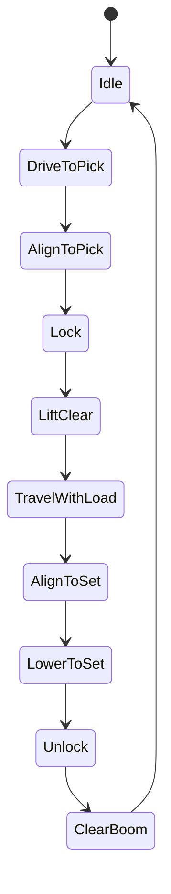
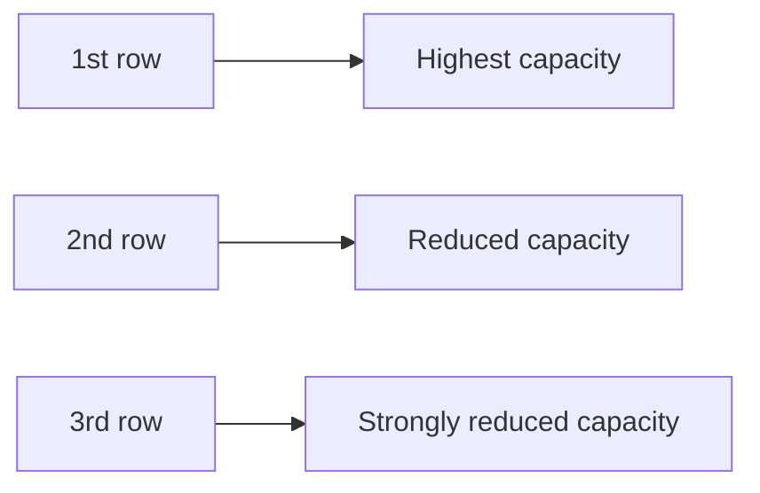
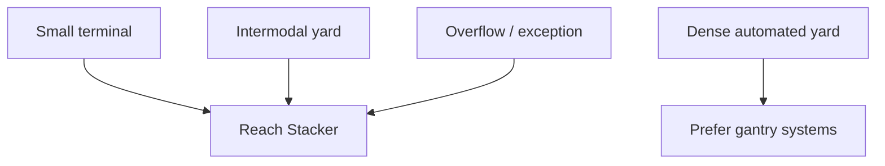

## Summary

This document defines **reach stackers** as simulation entities for container-terminal, intermodal, and exception-handling operations.

It separates the topic into the four mandatory lenses:

- **What it looks like**: mobile chassis, telescopic boom, top spreader, counterweight, stabilised container handler silhouette
- **How it moves**: drive, steer, boom raise/lower, boom extend/retract, spreader lock/unlock, load-carrying travel
- **What it can do**: flexible pick, lift, travel, and set operations for containers and some intermodal/general-cargo configurations
- **When it must stop**: overload envelope limits, ground condition, visibility, maintenance, traffic conflict, and weather/safety constraints

It is intended to support:
- believable 3D assets and mobile-equipment animation
- flexible-yard and intermodal-terminal operations
- exception handling in terminals that are not fully gantry-based
- “utility machine” gameplay for spillover, special moves, and recovery operations

---

## Why this matters for simulation and gameplay

Reach stackers are not the highest-throughput container machines, but they are one of the most flexible.

They matter because they are commonly used in:
- smaller marine terminals
- inland/intermodal yards
- rail terminals
- overflow yards
- maintenance or disruption scenarios
- exception handling where fixed cranes are unavailable or impractical

If they are modelled badly:
- they become magical all-purpose machines with no capacity or reach limits
- small terminals become unrealistically efficient
- exception handling loses meaning
- stack depth and front-row limitations disappear

If they are modelled properly:
- they shine in flexible, lower-density, mixed-use environments
- their row-dependent capacity limits create believable constraints
- they become excellent “recovery” equipment but poor substitutes for high-density gantry systems
- players have to choose between flexibility and throughput

---

## Key definitions and vocabulary

- **Reach stacker**  
  A mobile container handler using a telescopic boom and top spreader to pick, carry, and stack containers.

- **Top lift**  
  Container is picked from above using a spreader or twistlock interface.

- **Boom extension / reach**  
  Horizontal reach of the telescopic boom, which affects how many rows deep the machine can work.

- **First row / second row / third row**  
  Capacity decreases as the machine handles containers deeper into the stack.

- **Standard lifting mode**  
  Normal container-handling mode, typically up to around 45 tonnes on common laden-container models.

- **Intermodal spreader**  
  Attachment supporting ISO containers, swap bodies, or some trailer/piggyback handling depending on model.

- **Tilt mode / tilting spreader**  
  Special mode or attachment allowing tilted handling for some applications; not always relevant to standard marine-container use.

- **Load chart**  
  Capacity table showing allowable loads by row/reach and lift height.

- **Exception handling move**  
  A move performed because more efficient primary equipment is unavailable or unsuitable.

---

## Scope boundaries (what is included/excluded)

### Included
- laden-container reach stackers used in terminal and intermodal contexts
- cycle model for pick, lift, travel, set
- row-dependent capacity constraints
- flexible-use cases and exception-handling roles
- representative OEM-derived capacity anchors
- event model and KPI hooks

### Excluded
- heavy industrial super-lift reach stackers beyond container-terminal relevance
- empty-container handlers as a separate primary topic
- detailed road-vehicle legal constraints outside terminal operations
- full maintenance engineering and tyre-powertrain detail

---

## Key attributes and dimensions (human-level data model)

A simulation-grade reach stacker model should include:

### 1. Identity and classification
- `equipment_id`
- `family = "reach_stacker"`
- `subtype` (`laden_container`, `intermodal_combo`, `heavy_duty`, `exception_handler`)
- `manufacturer`
- `powertrain` (`diesel`, `hybrid`, `electric`)
- `automation_level` (`manual`, `assisted`, `remote_assist`)

### 2. Physical geometry
- `overall_length_m`
- `overall_width_m`
- `overall_height_m`
- `wheelbase_m`
- `turning_radius_m`
- `counterweight_profile`
- `boom_length_m`
- `lift_height_m`
- `row_reach_max`
- `stacking_height_descriptor`

### 3. Motion model
- `travel_speed_unladen_kph`
- `travel_speed_laden_kph`
- `boom_raise_speed`
- `boom_lower_speed`
- `boom_extend_speed`
- `boom_retract_speed`
- `spreader_lock_time_sec`
- `micro_positioning_mode`

### 4. Handling capabilities
- `rated_first_row_t`
- `rated_second_row_t`
- `rated_third_row_t`
- `container_sizes_supported[]`
- `intermodal_attachment_supported`
- `swap_body_supported`
- `rail_service_supported`
- `truck_service_supported`
- `stack_rows_supported`
- `stack_height_max`

### 5. Stop / restriction conditions
- `ground_condition_limit`
- `visibility_limit`
- `max_safe_wind_mps`
- `overload_protection`
- `boom_envelope_interlock`
- `traffic_conflict_stop`
- `maintenance_state`
- `operator_required`

### 6. Runtime states
- `state`
- `assigned_zone`
- `current_load_state`
- `current_row_mode`
- `idle_reason`
- `exception_role_active`

---

## Rules, constraints, and algorithms (include simplified simulation models)

## 1. What it looks like: silhouette and key components for 3D

A reach stacker should be recognisable by:
- heavy mobile chassis on large tyres
- telescopic boom projecting forward and upward
- top spreader at boom tip
- substantial rear counterweight
- elevated cab with good forward/side visibility
- compact but muscular silhouette compared with gantry equipment

### Mandatory 3D components
- `chassis`
- `tyres_and_axles`
- `cab`
- `counterweight`
- `telescopic_boom`
- `boom_pivot`
- `spreader`
- `hydraulic_cylinders`

### Optional high-value components
- intermodal / piggyback spreader variant
- reversing and work lights
- warning beacons
- camera pods
- stabilising design details around boom base
- battery or charging visual differences for electric models

### Rendering note
A reach stacker must visibly look like a machine that trades density for flexibility. It should not be mistaken for an empty handler or forklift.

---

## 2. How it moves: cycle model

The canonical reach stacker cycle is:

1. **pick**  
   approach target, align boom and spreader, lower, lock

2. **lift**  
   raise load clear to safe travel / transfer height

3. **travel**  
   move with the load to destination

4. **set**  
   position, lower, unlock, clear boom

### Simplified cycle-time model

```pseudo
cycle_time_seconds =
  approach_time +
  alignment_time +
  lock_time +
  lift_time +
  travel_time +
  setdown_time +
  unlock_time +
  clear_time +
  wait_penalties
```

### Travel-time rule

```pseudo
travel_time = distance_m / travel_speed_mps
```

Use different speeds for:
- unladen travel
- laden travel
- rough yard / intermodal surface penalties

### Pick and set phase rule

```pseudo
lift_time = vertical_distance / boom_lift_rate
setdown_time = vertical_distance / boom_lower_rate
```

In more detailed sims, include boom extension/retraction time separately.

---

## 3. Capacity ranges and technical constraints

This is the most important reality check for reach stackers.

Public OEM material provides representative anchors:

- Kalmar product pages and brochures describe standard laden-container reach stackers with **around 45 tonnes** capacity in standard lifting mode on mainstream models, and broader families extending well beyond that for industrial/heavy-duty variants.
- Konecranes Liftace reach stacker brochures likewise state **45-tonne** container-handling capacity on common laden-container models.
- Hyster’s RS46 reach stacker range reports capacity bands that include the standard loaded-container handling class.

### Simulation-ready capacity model

A reach stacker should not use one single capacity number. Capacity must decrease with reach/row.

Suggested fields:
- `rated_first_row_t`
- `rated_second_row_t`
- `rated_third_row_t`

### Example generic laden-container model
- first row: 45 t
- second row: 30-35 t
- third row: 15-20 t

These are broad simulation anchors, not a substitute for model-specific load charts.

### Constraint rule

```pseudo
function can_lift(machine, load_t, target_row):
  if target_row == 1:
    return load_t <= machine.rated_first_row_t
  if target_row == 2:
    return load_t <= machine.rated_second_row_t
  if target_row == 3:
    return load_t <= machine.rated_third_row_t
  return false
```

### Height interaction
Capacity can also reduce with lift height and boom angle. At simplified fidelity, model that as a penalty:

```pseudo
effective_capacity = base_capacity_for_row - height_penalty
```

### Ground condition / stability constraint
Unlike gantry cranes, reach stackers are mobile load-bearing machines. Poor surface condition should matter.

```pseudo
if surface_condition == "poor" and load_t > surface_limit:
  deny_move()
```

---

## 4. Where reach stackers are used

Reach stackers are especially useful in:

### 4.1 Smaller marine terminals
- lower throughput environments
- flexible operations
- lower capital infrastructure
- mixed manual handling

### 4.2 Intermodal terminals
- rail-to-road transfer
- inland depots
- flexible loading patterns
- variable box sizes and occasional swap-body work

### 4.3 Exception handling
- recovering a box from a problem area
- serving overflow or temporary stacks
- handling not-planned truck transactions
- maintenance or outage fallback when gantries are unavailable

### 4.4 Low-density flexible yards
- operations prioritising adaptability over maximum stack density

### Operational downside
They are less suitable for:
- very high-density storage
- deep, heavily buried stack systems
- ultra-high-throughput repetitive moves compared with gantry-based automation

That trade-off is exactly why they are interesting in simulation.

---

## 5. Row-depth and stacking logic

Reach stackers typically work:
- first row best
- second row with reduced capacity
- third row with major limits
- beyond that: generally not practical for standard laden-container handling

### Simplified yard geometry rule

```pseudo
if target_row > machine.stack_rows_supported:
  reject_move()
```

### Stack-height rule

```pseudo
if target_tier > machine.stack_height_max:
  reject_move()
```

### Accessibility note
Reach stackers can be flexible, but they do not remove rehandle logic. Buried boxes still create delay and extra moves.

---

## 6. Event model for reach stacker cycles

Suggested canonical event sequence:

- `RS_JOB_ASSIGNED`
- `RS_DRIVE_TO_PICK`
- `RS_ALIGN_TO_PICK`
- `RS_LOCKING`
- `RS_PICK_CONFIRMED`
- `RS_LIFT_CLEAR`
- `RS_TRAVEL_WITH_LOAD`
- `RS_ALIGN_TO_SET`
- `RS_LOWERING_TO_SET`
- `RS_UNLOCKING`
- `RS_SET_CONFIRMED`
- `RS_JOB_COMPLETED`

Optional wait / exception events:
- `RS_WAITING_TRAFFIC_CLEAR`
- `RS_WAITING_TRUCK_ALIGNMENT`
- `RS_OVERLOAD_BLOCK`
- `RS_SURFACE_CONDITION_BLOCK`
- `RS_VISIBILITY_LIMIT_BLOCK`
- `RS_EXCEPTION_RECOVERY_JOB`
- `RS_MAINTENANCE_STOP`

### Example event projection rule

```pseudo
if target_load_t > capacity_for(target_row):
  emit("RS_OVERLOAD_BLOCK")
  reject_job()

if traffic_path_blocked:
  emit("RS_WAITING_TRAFFIC_CLEAR")
  delay_job()
```

---

## 7. KPI hooks

Useful KPIs for reach-stacker operations:
- `rs_moves_per_hour`
- `rs_cycle_time_avg_sec`
- `rs_laden_travel_distance_avg_m`
- `rs_exception_move_share_pct`
- `rs_overload_block_count`
- `rs_traffic_wait_avg_sec`
- `rs_rehandle_assist_count`
- `rs_utilisation_pct`

### Example formula

```pseudo
rs_moves_per_hour = completed_moves / gross_operating_hours
exception_move_share_pct = exception_jobs / total_jobs * 100
```

Because reach stackers are often used for flexible and exception work, a high `exception_move_share_pct` may be normal and not necessarily bad.

---

## 8. Automation and assistance notes

Fully autonomous reach stackers are not the mainstream operating model in container terminals in the way ASCs are.

A realistic simulation should use:
- `manual`
- `assisted`
- `remote_assist`

### Assisted features may include
- boom-envelope protection
- load monitoring
- camera-assisted alignment
- spreader-position assistance
- anti-collision alarms

These improve consistency and safety, but they do not turn the machine into a robotic stack fairy.

---

## 9. Good-enough simulation algorithms

### 9.1 Move feasibility

```pseudo
function rs_can_execute(machine, job, environment):
  return (
    machine.maintenance_state == "available" and
    operator_present(machine) and
    can_lift(machine, job.load_t, job.target_row) and
    target_tier <= machine.stack_height_max and
    environment.visibility_ok and
    environment.traffic_path_clear and
    environment.surface_condition_ok
  )
```

### 9.2 Cycle time estimate

```pseudo
function estimate_rs_cycle(job, machine):
  return (
    drive_seconds(job.pick_distance_m, machine.travel_speed_unladen_kph) +
    alignment_seconds(job.pick_complexity) +
    lock_seconds() +
    lift_seconds(job.vertical_m) +
    drive_loaded_seconds(job.loaded_distance_m, machine.travel_speed_laden_kph) +
    set_seconds(job.set_complexity) +
    unlock_seconds()
  )
```

### 9.3 Use-case selection

```pseudo
if terminal_size == "small" or job.is_exception or zone.is_intermodal:
  prefer_reach_stacker = true
else:
  prefer_reach_stacker = false
```

---

## Standards and authoritative references to confirm (edition/year, what to verify)

- **Kalmar reach stacker materials**  
  Confirm representative mainstream laden-container figures around **45 tonnes** for standard lifting mode, along with the distinction between standard container handling and special/heavy-duty variants.

- **Konecranes reach stacker brochures**  
  Confirm comparable mainstream 45-tonne class figures and intermodal spreader options for swap-body/trailer handling where relevant.

- **Hyster reach stacker product information**  
  Confirm the existence of model families covering first/second/third-row handling ranges and reinforce the row-dependent capacity concept.

- **Intermodal / terminal equipment references**  
  Confirm reach stacker use cases in smaller terminals, intermodal yards, and flexible exception handling roles.

---

## Example outputs to include (tables, diagrams, sample data)

### Strategy note: where reach stackers fit

| Environment | Suitability | Why |
|---|---|---|
| Small marine terminal | High | flexible, lower infrastructure needs |
| Inland intermodal yard | High | rail-road flexibility |
| High-density automated yard | Low | poor fit against ASC/RMG density and throughput |
| Exception recovery / overflow | Very high | mobile and adaptable |

### Example capacity table for a generic 45t class machine

| Row | Representative capacity t | Simulation note |
|---|---:|---|
| 1st row | 45 | standard laden-container handling anchor |
| 2nd row | 30-35 | reduced reach capacity |
| 3rd row | 15-20 | major constraints, use sparingly |

### Sample event stream

```json
[
  {"event_time":"2026-03-27T09:00:00Z","event_type":"RS_JOB_ASSIGNED","container_id":"MSKU1234567"},
  {"event_time":"2026-03-27T09:00:12Z","event_type":"RS_DRIVE_TO_PICK","container_id":"MSKU1234567"},
  {"event_time":"2026-03-27T09:00:29Z","event_type":"RS_PICK_CONFIRMED","container_id":"MSKU1234567"},
  {"event_time":"2026-03-27T09:00:54Z","event_type":"RS_TRAVEL_WITH_LOAD","container_id":"MSKU1234567"},
  {"event_time":"2026-03-27T09:01:18Z","event_type":"RS_SET_CONFIRMED","container_id":"MSKU1234567"},
  {"event_time":"2026-03-27T09:01:19Z","event_type":"RS_JOB_COMPLETED","container_id":"MSKU1234567"}
]
```

### Example parameter set

```json
{
  "equipment_id": "RS-01",
  "subtype": "laden_container",
  "powertrain": "diesel",
  "rated_first_row_t": 45,
  "rated_second_row_t": 32,
  "rated_third_row_t": 16,
  "stack_rows_supported": 3,
  "stack_height_max": 5,
  "travel_speed_unladen_kph": 25,
  "travel_speed_laden_kph": 20
}
```

---

## Data schemas (JSON Schema references or in-file fragments)

### Reach stacker schema fragment

```json
{
  "$schema": "https://json-schema.org/draft/2020-12/schema",
  "$id": "equipment-reach-stacker.schema.json",
  "title": "ReachStacker",
  "type": "object",
  "required": ["equipment_id", "rated_first_row_t", "stack_rows_supported", "stack_height_max"],
  "properties": {
    "equipment_id": { "type": "string" },
    "subtype": {
      "type": "string",
      "enum": ["laden_container", "intermodal_combo", "heavy_duty", "exception_handler"]
    },
    "rated_first_row_t": { "type": "number" },
    "rated_second_row_t": { "type": "number" },
    "rated_third_row_t": { "type": "number" },
    "stack_rows_supported": { "type": "integer" },
    "stack_height_max": { "type": "integer" },
    "travel_speed_unladen_kph": { "type": "number" },
    "travel_speed_laden_kph": { "type": "number" }
  }
}
```

### Reach stacker event schema fragment

```json
{
  "$schema": "https://json-schema.org/draft/2020-12/schema",
  "$id": "equipment-reach-stacker-events.schema.json",
  "title": "ReachStackerEventLog",
  "type": "object",
  "required": ["equipment_id", "events"],
  "properties": {
    "equipment_id": { "type": "string" },
    "events": {
      "type": "array",
      "items": {
        "type": "object",
        "required": ["event_time", "event_type"],
        "properties": {
          "event_time": { "type": "string", "format": "date-time" },
          "event_type": { "type": "string" },
          "container_id": { "type": "string" },
          "job_id": { "type": "string" },
          "details": { "type": "object" }
        }
      }
    }
  }
}
```

---

## Sample data (JSON and YAML)

### JSON

```json
{
  "equipment_id": "RS-03",
  "subtype": "intermodal_combo",
  "powertrain": "diesel",
  "rated_first_row_t": 45,
  "rated_second_row_t": 31,
  "rated_third_row_t": 15,
  "stack_rows_supported": 3,
  "stack_height_max": 5,
  "travel_speed_unladen_kph": 24,
  "travel_speed_laden_kph": 19,
  "intermodal_attachment_supported": true
}
```

### YAML

```yaml
equipment_id: RS-07
subtype: exception_handler
powertrain: electric
rated_first_row_t: 45
rated_second_row_t: 30
rated_third_row_t: 16
stack_rows_supported: 3
stack_height_max: 4
travel_speed_unladen_kph: 22
travel_speed_laden_kph: 18

runtime:
  exception_role_active: true
  idle_reason: ""
```

---

## Visualisation guidance

### Mermaid diagrams

#### 1. Reach stacker cycle state machine



#### 2. Capacity by row concept



#### 3. Use-case map



### UI/dashboard widgets where relevant

Useful widgets:
- reach stacker job queue
- row-depth capacity indicator
- overload-block event count
- exception-recovery move board
- travel distance and cycle-time trend
- intermodal / rail service queue

---

## 3D rendering notes (scale, dimensions, textures/markings)

### Scale
- 1 unit = 1 metre
- keep proportions heavy and believable, especially boom length and counterweight mass

### Minimum animated parts
- chassis movement
- steering front/rear wheel articulation as applicable
- boom raise/lower
- boom extend/retract
- spreader lock state
- attached load state

### Visual cues worth adding
- clear row-depth target markers
- tyre compression / suspension feel under heavy load if fidelity allows
- work lights and reversing alarms
- electric vs diesel visual differences
- container sway kept low but not zero

### Gameplay readability cues
- blue = storage / retrieval job
- green = truck or rail handoff
- amber = exception recovery or overflow move
- red = overload / blocked route / visibility limit

---

## Validation checklist

- [ ] Reach stacker uses row-dependent capacity, not one flat lift value
- [ ] Cycle model includes pick, lift, travel, and set
- [ ] Boom motion and travel are separate concepts
- [ ] Smaller-terminal, intermodal, and exception-handling roles are represented
- [ ] Stack row and stack height limits are enforced
- [ ] Event model can reconstruct a reach-stacker move cycle
- [ ] 3D asset distinguishes reach stacker from empty handler and gantry cranes
- [ ] KPI set reflects flexibility and exception-use patterns

---

## Open questions and research backlog

- Split separate file for empty handlers if needed for denser empty-depot simulation
- Add electric reach stacker energy/charging model
- Add rail-specific spreader and wagon-clearance details for intermodal fidelity
- Add tyre/ground-condition degradation effects in rough-surface yards
- Add special attachments and non-container cargo variants where the simulation later expands
