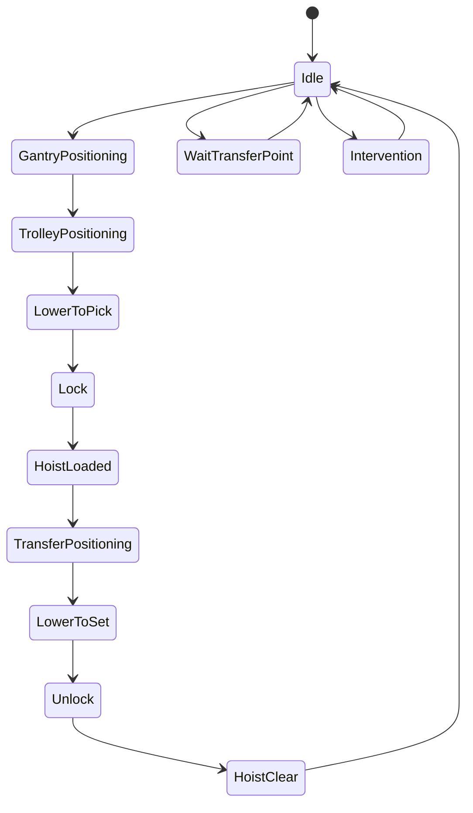
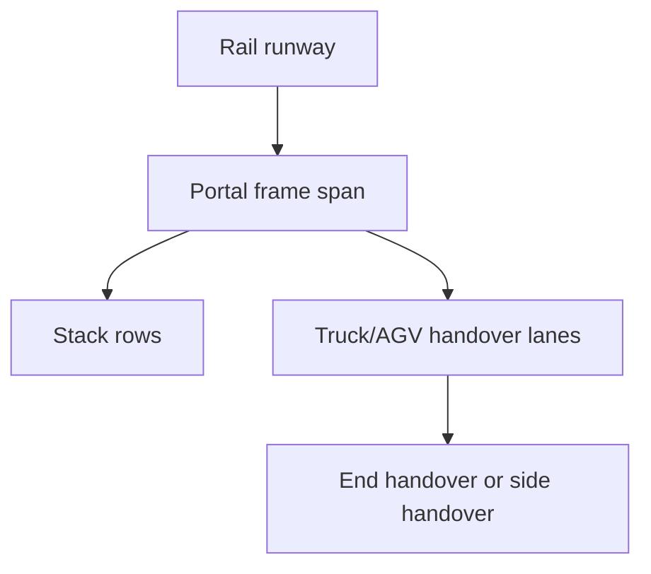
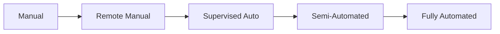

## Summary

This document defines **rail-mounted gantry cranes (RMGs)** as simulation entities for container-terminal yards and rail interfaces.

It separates the topic into the four mandatory lenses:

- **What it looks like**: portal frame, legs, trolley, hoist, spreader, rail runway, handover zones
- **How it moves**: gantry travel along rails, trolley cross-travel, hoist motion, spreader lock cycle
- **What it can do**: stack/retrieve containers in dense blocks, hand off to trucks/AGVs/rail, support remote and automated operation
- **When it must stop**: wind, collision risk, interlock breach, rail obstruction, maintenance, remote-control fault, storm securing

This file is intended to support:
- believable 3D yard-crane assets
- block geometry parameterisation
- realistic yard and rail operations
- remote-operation and automation fidelity toggles
- event-driven cycle modelling and throughput estimation

---

## Why this matters for simulation and gameplay

RMGs define how a dense yard actually behaves.

If they are modelled badly:
- stack density becomes magical
- yard capacity has no operational downside
- handover lanes never congest
- remote operation and automation do nothing except change the label on the UI

If they are modelled properly:
- block geometry matters
- end-handover versus side-handover layouts feel different
- automation changes staffing, safety, and queue behaviour
- yard throughput becomes a real constraint on vessel loading, truck turnaround, and rail operations
- the terminal can feel crisp, robotic, efficient, or painfully clumsy depending on the design choices

---

## Key definitions and vocabulary

- **RMG**  
  Rail Mounted Gantry crane serving a fixed block or rail terminal area on rails.

- **ASC**  
  Automated Stacking Crane. In many terminals this is essentially an automated RMG-like machine in the yard.

- **Span**  
  Width of the crane across the block, usually expressed by ground slots / truck lanes covered and converted to metres.

- **Stacking width**  
  Number of container rows or ground slots the crane can serve across its span.

- **Stacking height**  
  Maximum number of containers high that can be stacked, often described as `1-over-n`.

- **Trolley travel**  
  Lateral motion of the trolley across the span.

- **Gantry travel**  
  Motion of the crane along the rail runway parallel to the block length.

- **End handover**  
  Interchange lanes located at the end of the block.

- **Side handover**  
  Interchange lanes located along one or both long sides of the block.

- **Transfer point / interchange point**  
  Position where horizontal transport and the yard crane exchange a container.

- **Remote operator station (ROS)**  
  Off-crane workstation used to control one or more cranes remotely.

- **Semi-automatic operation**  
  Some motions automated, with operator supervision or intervention.

- **Full automatic operation**  
  Crane executes moves from TOS/work orders with remote supervision and exception handling.

- **Stack profiling**  
  Sensing and modelling the actual stack surface and load geometry to assist safe automated moves.

---

## Scope boundaries (what is included/excluded)

### Included
- RMG geometry and block-serving behaviour
- span, stacking width, stacking height, and motion model
- end and side handover patterns
- remote, supervised, semi-automated, and automated operating modes
- event-driven RMG cycle model
- rail obstruction, collision, and stop logic

### Excluded
- detailed civil design of rail foundations
- exact PLC or vendor control logic
- full TOS dispatch algorithms
- detailed OCR / gate systems unless they directly affect handover logic
- procurement-level engineering specifications for every OEM variant

---

## Key attributes and dimensions (human-level data model)

A simulation-grade RMG model should include:

### 1. Identity and classification
- `equipment_id`
- `family = "RMG"`
- `subtype` (`yard_rmg`, `rail_rmg`, `asc_like`)
- `manufacturer`
- `automation_level` (`manual`, `remote_manual`, `supervised_auto`, `semi_automated`, `fully_automated`)
- `assigned_block_ids[]`

### 2. Physical geometry
- `span_m`
- `stacking_width_slots`
- `truck_lane_count`
- `rail_track_count_supported`
- `stacking_height_descriptor` (`1_over_4`, `1_over_5`, `1_over_6`, `1_over_8`)
- `stacking_height_max`
- `gantry_height_m`
- `trolley_travel_m`
- `portal_leg_spacing_m`
- `cantilever_left_m`
- `cantilever_right_m`

### 3. Motion model
- `gantry_travel_speed_mpm`
- `trolley_speed_mpm`
- `hoist_speed_laden_mpm`
- `hoist_speed_empty_mpm`
- `simultaneous_motion_allowed`
- `micro_positioning_mode`
- `anti_sway_system`

### 4. Functional interfaces
- `handover_layout` (`end_only`, `side_only`, `dual_side`, `end_plus_side`)
- `supported_handover_targets[]`
- `can_handle_container_sizes[]`
- `can_handle_laden`
- `can_handle_empty`
- `reefer_block_support`
- `hazmat_block_support`
- `truck_serving_allowed`
- `agv_serving_allowed`
- `rail_wagon_serving_allowed`

### 5. Automation / control
- `remote_operator_station_supported`
- `operator_onboard_required`
- `automated_stacking_supported`
- `automated_housekeeping_supported`
- `automated_handover_supported`
- `sensor_suite[]`
- `collision_prevention_system`
- `stack_profile_system`

### 6. Stop / restriction conditions
- `max_operating_wind_mps`
- `lightning_stop`
- `rail_obstruction_stop`
- `exclusion_zone_stop`
- `maintenance_state`
- `network_or_control_fault_stop`
- `manual_intervention_required`

---

## Rules, constraints, and algorithms (include simplified simulation models)

## 1. What it looks like: silhouette and key components for 3D

An RMG should be recognisable by:
- rectangular gantry frame spanning a yard or rail block
- rail-mounted bogies at ground level on both sides
- trolley moving across the span
- hoist and spreader under the trolley
- stack area beneath the portal
- visible handover lanes at ends, sides, or both depending on design

### Mandatory 3D components
- `portal_frame`
- `rail_bogies`
- `runway_rails`
- `trolley`
- `hoist_ropes`
- `spreader`
- `electrical_house_or_cab`
- `maintenance_platforms`
- `end_stops_or_buffers`

### Optional high-value components
- cable reel or conductor-bar representation
- remote camera pods
- stack profiling sensors
- lane-marking and transfer-point indicators
- anti-collision scanners
- warning lights and sirens

### Rendering note
The difference between side-handover and end-handover layouts must be visible in the environment, not hidden in metadata.

---

## 2. How it moves: motion axes

An RMG has three primary motion axes:

### 2.1 Gantry travel
Whole crane travels along rail runway parallel to the block length.

Uses:
- moving to target bay
- clearing for adjacent crane movement
- serving different transfer points
- rail block progression

### 2.2 Trolley travel
Trolley moves laterally across the block width.

Uses:
- selecting row or lane across stacks, truck lanes, AGV lanes, or rail tracks

### 2.3 Hoist travel
Vertical lift/lower of spreader and load.

Uses:
- pick from top of stack
- lower into stack slot
- retrieve from truck chassis or AGV deck
- place to rail wagon or transfer platform

### 2.4 Spreader lock state
Operational states:
- `unlocked`
- `aligning`
- `locked`
- `unlocking`
- `fault`

### Motion principle
RMGs often benefit from simultaneous motion of drives, especially with anti-sway and automated control support.

```pseudo
if simultaneous_motion_allowed:
  cycle_time -= overlap_bonus
```

Use bounded overlap, not fantasy teleporting.

---

## 3. Rail span, stacking width, and stacking height

Public OEM references suggest broadly useful simulation anchors:

- Liebherr states RMGs can be built with **stacking heights of up to eight containers high** and **custom spans in excess of 70 metres**. Its product material also notes manual, semi-automatic, or automatic operation options.
- Liebherr’s technical description lists representative working speeds such as **28 m/min hoisting with rated load**, **56 m/min without load**, **70 m/min trolley travel**, and **130 m/min gantry travel**.
- Konecranes public RMG materials emphasise remote or supervised operation plus automated stacking and housekeeping support.

### Practical size-class ranges for simulation

| RMG class | Typical use | Span m | Stacking width slots | Height descriptor | Typical gantry speed m/min | Typical trolley speed m/min | Typical hoist speed laden m/min |
|---|---|---:|---:|---|---:|---:|---:|
| Compact yard RMG | smaller yard blocks | 25-40 | 4-6 | 1 over 3 to 1 over 5 | 80-130 | 60-90 | 20-35 |
| Standard yard RMG | main yard block | 35-55 | 6-8 | 1 over 4 to 1 over 6 | 100-130 | 60-90 | 25-35 |
| Wide / automated block RMG | ASC-like dense block | 45-70+ | 8-10+ | 1 over 5 to 1 over 8 | 100-130 | 60-90 | 25-35 |
| Rail-terminal RMG | rail siding/wagon service | 30-60 | varies by track/lane layout | 1 over 3 to 1 over 6 | 80-130 | 60-90 | 20-35 |

These are deliberately broad and simulation-friendly.

---

## 4. Handover lanes and interchange layouts

Handover layout is one of the most important gameplay knobs.

### 4.1 End handover
Containers are exchanged at one or both ends of the block.

Pros:
- clear separation of stack zone and transport zone
- common in some automated layouts
- easier traffic control

Cons:
- longer gantry travel to serve distant handover ends
- queueing can bunch at block ends
- less flexible for ad hoc manual service

### 4.2 Side handover
Containers are exchanged along long sides of the block.

Pros:
- shorter average truck access in some layouts
- flexible for manned truck operations
- intuitive in mixed manual yards

Cons:
- more vehicle interaction along the block
- more safety conflict points
- side lanes can congest badly

### 4.3 Dual-side or mixed layouts
Used where both automation and flexibility matter.

### Simplified handover choice rule

```pseudo
if block.handover_layout == "end_only":
  candidate_points = block.end_transfer_points
elif block.handover_layout == "side_only":
  candidate_points = block.side_transfer_points
else:
  candidate_points = all_valid_transfer_points
```

### Simulation consequence
Handover layout changes:
- gantry travel distance
- truck/AGV queue patterns
- safety exposure
- yard throughput under peak demand

---

## 5. RMG cycle model

### 5.1 Stack-to-truck / stack-to-AGV cycle
1. gantry travels to target bay if needed
2. trolley moves to target row
3. hoist lowers to top accessible container
4. spreader locks
5. hoist lifts clear
6. trolley moves to handover lane
7. hoist lowers to vehicle/platform
8. spreader unlocks
9. hoist lifts clear
10. trolley or gantry repositions for next task

### 5.2 Truck/AGV-to-stack cycle
1. vehicle arrives at transfer point
2. RMG positions over lane
3. hoist lowers and locks to box
4. hoist lifts clear
5. trolley moves to target row
6. hoist lowers into stack
7. unlock
8. hoist clears

### 5.3 Rail-wagon service cycle
Same broad pattern, but add:
- wagon alignment / confirmation
- wagon-slot geometry
- possible side clearance or rail-specific interlock checks

### 5.4 Housekeeping / rehandle cycle
1. pick container from blocking position
2. move to temporary slot
3. later relocate to preferred slot

This is critical for automated stacking and housekeeping support.

---

## 6. Event model for RMG cycles

Suggested canonical event sequence:

- `RMG_JOB_ASSIGNED`
- `RMG_GANTRY_MOVING`
- `RMG_TROLLEY_POSITIONING`
- `RMG_HOIST_LOWERING_TO_PICK`
- `RMG_LOCKING`
- `RMG_PICK_CONFIRMED`
- `RMG_HOIST_LIFTING`
- `RMG_TRANSFER_POSITIONING`
- `RMG_HOIST_LOWERING_TO_SET`
- `RMG_UNLOCKING`
- `RMG_SET_CONFIRMED`
- `RMG_JOB_COMPLETED`

Optional wait and exception events:
- `RMG_WAITING_NO_TRUCK`
- `RMG_WAITING_NO_AGV`
- `RMG_WAITING_TRANSFER_POINT_BLOCKED`
- `RMG_WAITING_STACK_NOT_ACCESSIBLE`
- `RMG_RAIL_OBSTRUCTION_STOP`
- `RMG_COLLISION_PREVENTION_STOP`
- `RMG_REMOTE_OPERATOR_INTERVENTION`
- `RMG_AUTOMATION_FAULT`

### Example event projection rule

```pseudo
if transfer_point_occupied:
  emit("RMG_WAITING_TRANSFER_POINT_BLOCKED")
  delay_job()

if stack_not_accessible:
  create_rehandle_job()
  emit("RMG_WAITING_STACK_NOT_ACCESSIBLE")
```

---

## 7. Remote operation and automation as fidelity toggles

Public vendor and industry material makes this a useful simulation dimension.

### 7.1 Manual onboard mode
- operator on crane
- highest local flexibility
- slower and more variable
- more exposed to shift and staffing constraints

### 7.2 Remote manual mode
- operator in remote station
- safer and more ergonomic
- can improve consistency
- still requires explicit operator assignment

### 7.3 Supervised automation
- crane executes automated travel, stacking, or housekeeping
- operator intervenes for exceptions
- useful bridge mode for brownfield upgrades

### 7.4 Semi-automated mode
- automated stacking and positioning
- humans still supervise handover or certain exception points

### 7.5 Fully automated mode
- crane receives work orders from TOS
- unmanned physical operation
- operator handles alarms/exceptions from remote office

### Suggested simulation toggles

```yaml
automation_mode:
  manual
  remote_manual
  supervised_auto
  semi_automated
  fully_automated

effects:
  cycle_time_variability
  staffing_requirement
  exception_recovery_time
  safety_exposure
  throughput_consistency
```

### Practical behaviour assumptions
- automation reduces cycle-time variability more reliably than it increases pure peak speed
- automated housekeeping can significantly reduce future rehandles
- remote operation improves safety and ergonomics but may increase sensitivity to network/control issues
- brownfield retrofits may keep mixed manual and automated zones

---

## 8. Example yard stack + RMG geometry parameters

### Example automated export block
- block length: 250 m
- span: 52 m
- stack width: 8 slots
- transfer lanes: 2 end transfer points
- stacking height: `1 over 6`
- gantry speed: 120 m/min
- trolley speed: 70 m/min
- hoist speed laden: 28 m/min
- automation level: `fully_automated`

### Example mixed-manual truck-served block
- block length: 180 m
- span: 38 m
- stack width: 6 slots
- transfer lanes: side handover on one side
- stacking height: `1 over 4`
- gantry speed: 100 m/min
- trolley speed: 65 m/min
- hoist speed laden: 25 m/min
- automation level: `remote_manual`

---

## 9. Cycle time breakdown

A useful simulation cycle time breakdown is:

```pseudo
cycle_time_seconds =
  gantry_travel_seconds +
  trolley_position_seconds +
  hoist_down_seconds +
  lock_seconds +
  hoist_up_seconds +
  trolley_transfer_seconds +
  hoist_set_seconds +
  unlock_seconds +
  confirmation_seconds +
  wait_penalties +
  exception_penalties
```

### Example wait penalties
- truck not arrived
- AGV late
- end transfer point full
- rail wagon not ready
- stack not accessible
- collision-prevention slowdown
- remote operator intervention

### Representative cycle-time drivers
- block length and target bay distance
- handover layout
- stack height and accessibility
- automation level
- transfer-point queueing
- housekeeping demand

---

## 10. Safety and stop conditions

### 10.1 Collision prevention
PEMA notes non-contact collision-prevention systems are used to reduce collision risk for RMG and ASC cranes and obstacles.

Model at least:
- rail-path obstruction detection
- adjacent-crane spacing logic
- load collision / stack profiling checks
- transfer-point occupancy checks

```pseudo
if obstacle_in_runway or adjacent_crane_clearance_breached:
  stop_reason = "collision_prevention"
  halt_motion()
```

### 10.2 Wind and weather
Public RMG materials do not always expose a single universal wind figure. Use equipment-specific configuration where known, otherwise set class defaults carefully and document them.

Suggested simulation states:
- `normal`
- `wind_alarm`
- `reduced_speed`
- `stop_operations`

### 10.3 Remote/automation faults
- network loss
- sensor disagreement
- unconfirmed truck position
- stack profile uncertainty
- load skew / sway anomaly

### 10.4 Rail and lane interlocks
- no move if transfer lane occupied unsafely
- no lowering to truck if chassis alignment invalid
- no gantry travel if runway section blocked
- no rail-wagon move if wagon slot not confirmed

---

## 11. Good-enough simulation algorithms

### 11.1 Move feasibility

```pseudo
function rmg_can_execute(crane, job, environment):
  return (
    crane.maintenance_state == "available" and
    not environment.lightning_alert and
    no_runway_obstruction(job.block_id) and
    handover_target_valid(job) and
    stack_accessible_or_rehandle_planned(job) and
    control_mode_available(crane.automation_level)
  )
```

### 11.2 Handover target selection

```pseudo
function choose_handover_point(block, vehicle):
  valid_points = points_matching(block.handover_layout, vehicle.mode)
  return best_point_by(queue_length, travel_distance, priority)
```

### 11.3 Event-driven cycle execution

```pseudo
for job in dispatch_queue:
  wait_until(runway_clear and transfer_point_ready and operator_or_auto_ready)
  emit("RMG_JOB_ASSIGNED")
  execute_pick_phase()
  execute_transfer_phase()
  execute_set_phase()
  emit("RMG_JOB_COMPLETED")
```

### 11.4 Rehandle generation

```pseudo
if target_container_not_topmost:
  create_housekeeping_jobs()
  delay_primary_job()
```

---

## Standards and authoritative references to confirm (edition/year, what to verify)

- **Konecranes RMG technical documentation**  
  Confirm supported operating modes such as supervised operation, automated stacking, and automated housekeeping. Confirm representative geometry and performance parameters where public.

- **Liebherr RMG technical description and product pages**  
  Confirm broad physical ranges such as stacking heights up to eight high, spans in excess of 70 metres, manual/semi-automatic/automatic operation options, and representative working speeds like 28/56 m/min hoist, 70 m/min trolley, and 130 m/min gantry travel.

- **PEMA yard automation and brownfield papers**  
  Confirm the practical distinctions between remote operation, supervision, semi-automation, and full automation, especially in retrofitted terminals and mixed-mode yards.

- **PEMA collision prevention paper**  
  Confirm collision-prevention and stack/load profiling as meaningful simulation features for RMG and ASC operations.

---

## Example outputs to include (tables, diagrams, sample data)

### Example yard stack + RMG geometry parameter set

```json
{
  "equipment_id": "RMG-E2",
  "subtype": "yard_rmg",
  "automation_level": "supervised_auto",
  "span_m": 48.0,
  "stacking_width_slots": 8,
  "truck_lane_count": 2,
  "stacking_height_descriptor": "1_over_6",
  "movement": {
    "gantry_travel_speed_mpm": 120,
    "trolley_speed_mpm": 70,
    "hoist_speed_laden_mpm": 28,
    "hoist_speed_empty_mpm": 56
  },
  "handover_layout": "end_only"
}
```

### Event model example

| Event type | Meaning | Typical trigger |
|---|---|---|
| `RMG_JOB_ASSIGNED` | crane receives job | TOS / dispatch logic |
| `RMG_GANTRY_MOVING` | crane moving to bay | target bay differs |
| `RMG_TROLLEY_POSITIONING` | trolley aligning to row/lane | pick or set phase |
| `RMG_PICK_CONFIRMED` | box attached and clear | lock + hoist successful |
| `RMG_WAITING_NO_TRUCK` | truck not at transfer point | side/end handover delay |
| `RMG_WAITING_STACK_NOT_ACCESSIBLE` | buried box | rehandle needed |
| `RMG_JOB_COMPLETED` | move done | box placed and unlocked |

### Strategy note by layout

| Layout | Strength | Weakness |
|---|---|---|
| End handover | safer, cleaner traffic, automation-friendly | more gantry travel to block ends |
| Side handover | flexible for truck service | more vehicle interaction and lane conflict |
| Dual-side | high flexibility | more complex control and safety logic |

---

## Data schemas (JSON Schema references or in-file fragments)

### RMG equipment schema fragment

```json
{
  "$schema": "https://json-schema.org/draft/2020-12/schema",
  "$id": "equipment-rmg.schema.json",
  "title": "RailMountedGantryCrane",
  "type": "object",
  "required": ["equipment_id", "span_m", "stacking_width_slots", "movement", "automation_level"],
  "properties": {
    "equipment_id": { "type": "string" },
    "subtype": {
      "type": "string",
      "enum": ["yard_rmg", "rail_rmg", "asc_like"]
    },
    "automation_level": {
      "type": "string",
      "enum": ["manual", "remote_manual", "supervised_auto", "semi_automated", "fully_automated"]
    },
    "span_m": { "type": "number" },
    "stacking_width_slots": { "type": "integer" },
    "truck_lane_count": { "type": "integer" },
    "stacking_height_descriptor": { "type": "string" },
    "handover_layout": {
      "type": "string",
      "enum": ["end_only", "side_only", "dual_side", "end_plus_side"]
    },
    "movement": {
      "type": "object",
      "properties": {
        "gantry_travel_speed_mpm": { "type": "number" },
        "trolley_speed_mpm": { "type": "number" },
        "hoist_speed_laden_mpm": { "type": "number" },
        "hoist_speed_empty_mpm": { "type": "number" },
        "simultaneous_motion_allowed": { "type": "boolean" }
      }
    }
  }
}
```

### RMG event schema fragment

```json
{
  "$schema": "https://json-schema.org/draft/2020-12/schema",
  "$id": "equipment-rmg-events.schema.json",
  "title": "RMGEventLog",
  "type": "object",
  "required": ["equipment_id", "events"],
  "properties": {
    "equipment_id": { "type": "string" },
    "events": {
      "type": "array",
      "items": {
        "type": "object",
        "required": ["event_time", "event_type"],
        "properties": {
          "event_time": { "type": "string", "format": "date-time" },
          "event_type": { "type": "string" },
          "job_id": { "type": "string" },
          "container_id": { "type": "string" },
          "location": { "type": "string" },
          "details": { "type": "object" }
        }
      }
    }
  }
}
```

---

## Sample data (JSON and YAML)

### JSON

```json
{
  "equipment_id": "RMG-RAIL-01",
  "subtype": "rail_rmg",
  "automation_level": "remote_manual",
  "span_m": 42.0,
  "stacking_width_slots": 6,
  "truck_lane_count": 1,
  "stacking_height_descriptor": "1_over_4",
  "handover_layout": "side_only",
  "movement": {
    "gantry_travel_speed_mpm": 110,
    "trolley_speed_mpm": 70,
    "hoist_speed_laden_mpm": 28,
    "hoist_speed_empty_mpm": 56,
    "simultaneous_motion_allowed": true
  }
}
```

### YAML

```yaml
equipment_id: RMG-YARD-07
subtype: asc_like
automation_level: fully_automated
span_m: 52.0
stacking_width_slots: 8
truck_lane_count: 2
stacking_height_descriptor: 1_over_6
handover_layout: end_only

movement:
  gantry_travel_speed_mpm: 120
  trolley_speed_mpm: 70
  hoist_speed_laden_mpm: 28
  hoist_speed_empty_mpm: 56
  simultaneous_motion_allowed: true

automation:
  remote_operator_station_supported: true
  automated_stacking_supported: true
  automated_housekeeping_supported: true
```

---

## Visualisation guidance

### Mermaid diagrams

#### 1. RMG cycle state machine



#### 2. Geometry and handover layout



#### 3. Automation fidelity map



### UI/dashboard widgets where relevant

Useful widgets:
- per-RMG job queue
- transfer-point occupancy and wait state board
- remote operator allocation panel
- automated-housekeeping queue
- collision-prevention stop log
- block travel heatmap by crane

---

## 3D rendering notes (scale, dimensions, textures/markings)

### Scale
- 1 unit = 1 metre
- keep the portal visually lighter than an STS, but clearly rail-bound and block-serving

### Minimum animated parts
- gantry along rails
- trolley across span
- hoist rope length
- spreader lock state
- attached container state

### Layout cues worth rendering
- end transfer pads or side transfer lanes
- rail tracks and end stops
- stack rows beneath portal
- camera/sensor housings for automated variants
- remote-control / unmanned visual variant with no onboard operator cabin emphasis if desired

### Gameplay visibility cues
- blue = retrieve / export pull
- green = store / inbound put-away
- amber = housekeeping / rehandle
- red = blocked by transfer point, collision prevention, or automation fault

---

## Validation checklist

- [ ] RMG model includes span, stacking width, and stacking height
- [ ] Trolley, gantry, hoist, and spreader are separate motion concepts
- [ ] End-handover and side-handover layouts are distinct
- [ ] Remote and automated operating modes are modelled as fidelity toggles
- [ ] Cycle model includes wait states and transfer-point blocking
- [ ] Collision-prevention and rail-obstruction logic exist
- [ ] Event model can reconstruct RMG job execution
- [ ] Geometry parameters are usable for procedural yard-block generation
- [ ] 3D asset supports visible distinction from RTG and STS families

---

## Open questions and research backlog

- Split further into:
  - `dk_equipment__yard_rmg.md`
  - `dk_equipment__rail_rmg.md`
  - `dk_equipment__asc_systems.md`
- Add lane-level truck/AGV appointment coupling
- Add energy and charging model if electric supply realism becomes important
- Add mixed-fleet blocks where RMGs and reach stackers interact
- Add advanced exception taxonomy for remote-operation delays
