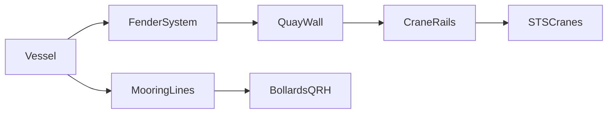
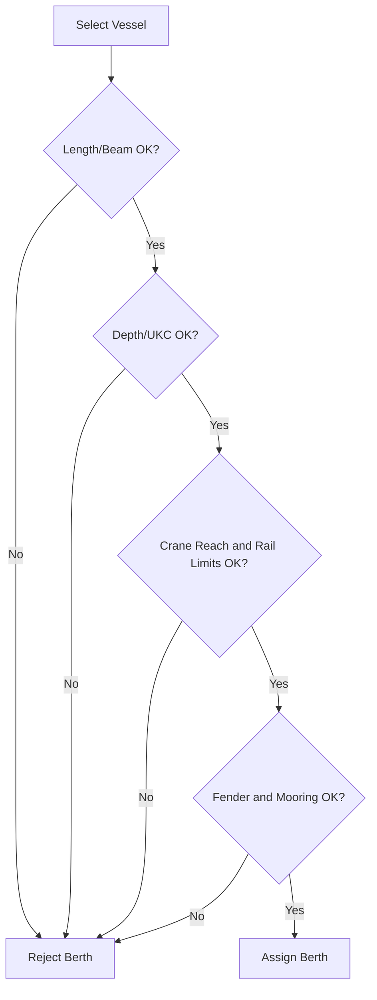

# Summary

This topic covers the berth-side infrastructure that matters most to a container terminal simulation: quay geometry, crane rails, fender systems, and mooring points. These elements define whether a ship can physically berth, how quay cranes interface with the ship, how berthing energy is absorbed, and how the vessel is held safely alongside during cargo operations.

For simulation and game design, quay and berth infrastructure should be treated as a structured system rather than a decorative edge of the map. Berth length, water depth, rail location, fender layout, bollard or quick-release-hook spacing, and local mooring constraints directly affect ship class compatibility, crane reach, berth assignment, weather limits, and operational risk.

# Why this matters for simulation and gameplay

- Determines which vessels can use a berth at all.
- Constrains crane placement and crane travel envelope.
- Creates realistic berth allocation decisions for short, long, deep, or shallow berths.
- Enables believable mooring limits during wind, wave, current, and passing-ship events.
- Supports failure or penalty mechanics:
  - berth rejected due to inadequate depth
  - crane cannot reach working bays cleanly
  - fender overload or hull pressure exceedance
  - bollard overload or poor mooring geometry
  - weather-driven stoppages or reduced crane productivity

# Key definitions and vocabulary

- **Quay wall**: Waterfront retaining structure forming the berth face.
- **Berth**: Assigned length of quay where a vessel moors for cargo operations.
- **Berthing line / berth line**: Operational line representing where the ship lies alongside.
- **Fender system**: Energy-absorbing interface between ship and structure.
- **Reaction force**: Force transferred from compressed fender back into berth structure and ship hull.
- **Hull pressure**: Local contact pressure imposed on the vessel hull by the fender system.
- **Bollard**: Fixed mooring point on the quay used to secure lines.
- **Quick Release Hook (QRH)**: Shore mooring fitting designed for safe line securing and controlled release, often with optional capstan and load monitoring.
- **Mooring dolphin**: Separate offshore structure used as a mooring point when quay geometry alone is insufficient.
- **Crane rail gauge**: Centre-to-centre spacing between quay crane rails.
- **Waterside rail / landside rail**: The two rails supporting a rail-mounted ship-to-shore crane.
- **Cable trench / utility trench**: Service corridor adjacent to crane rails carrying power and controls.
- **Design vessel**: Vessel or vessel set used to size berth geometry, fenders, and mooring equipment.
- **Berthing energy**: Kinetic energy to be absorbed during vessel contact with the berth.
- **Safe Working Load (SWL)**: Rated load capacity for bollards, hooks, and related fittings.

# Scope boundaries

## Included

- Quay structure elements visible and functionally relevant in container terminals
- Berth geometry for container ship compatibility
- Crane rail interface with quay
- Fender arrangement and design considerations
- Bollards, QRHs, and mooring point selection concepts
- Infrastructure data needed for simulation, visualisation, and validation

## Excluded

- Full geotechnical design of quay walls and foundations
- Detailed structural calculations for piles, anchors, and deck reinforcement
- Tug operations, pilotage, and channel design except where they affect berth assumptions
- Full dynamic mooring analysis implementation
- Local civil code compliance and detailed project specifications

# Key attributes and dimensions (human-level data model)

## 1. Berth geometry

A berth in a container terminal should usually expose at least these attributes:

| Attribute | Meaning |
|---|---|
| berth_id | Unique berth identifier |
| berth_length_m | Usable mooring length along quay |
| design_depth_cd_m | Water depth at chart datum or local reference |
| apron_width_m | Distance from quay face inland to working apron edge or obstruction |
| allowable_vessel_loa_m | Maximum vessel length overall |
| allowable_beam_m | Maximum vessel beam |
| max_berthing_displacement_t | Design displacement used for fendering and mooring checks |
| under_keel_clearance_rule | Static or dynamic rule for acceptance |
| crane_rail_offset_m | Offset from berth line or quay face to waterside rail |
| rail_gauge_m | Gauge between waterside and landside crane rails |
| crane_stop_positions | End stops / limits of crane travel |
| mooring_point_spacing_m | Approximate along-berth spacing of bollards or hooks |
| fender_pitch_m | Spacing between adjacent fender units |
| fender_line_elevation_range_m | Vertical range over which fender contact is effective |

### Simulation notes

- **Berth length** gates vessel assignment and mooring geometry.
- **Depth** controls access by draft and under-keel-clearance rule.
- **Apron width** affects crane, truck, and utility layout.
- **Rail offset and gauge** affect crane footprint and visible berth proportions.
- **Mooring point spacing** shapes line angles and berth suitability for larger ships.

## 2. Typical quay-side elements

Recognised quay wall infrastructure commonly includes:
- fenders
- bollards
- crane rails
- cable gutters or trenches
- ladders and access points
- edge beams, deck slabs, and service zones

This is a useful baseline for simulation geometry even where the deep structural design is simplified.

## 3. Indicative dimensional ranges for simulation

These are **game/simulation starter values**, not design values:

| Item | Indicative range |
|---|---|
| Container berth length | 250 to 450+ m |
| Deep-sea container berth length | 350 to 500+ m |
| Design depth | 12 to 18+ m depending on vessel class |
| Apron width | 30 to 65 m |
| Fender pitch | 10 to 25 m |
| Bollard / QRH spacing | 15 to 30 m typical starter assumption |
| Waterside crane rail setback | project-specific, often several metres from berth line |
| Crane rail gauge | equipment-specific, usually large enough for STS portal and machinery house footprint |

Use these only as placeholders until replaced with site-specific or design-vessel-specific data.

# Rules, constraints, and algorithms

## 1. Berth acceptance logic

A vessel can be assigned only if the berth satisfies at least:

- `vessel_loa <= allowable_vessel_loa`
- `vessel_beam <= allowable_beam`
- `vessel_draft + required_ukc <= available_depth`
- required crane outreach and crane spacing are compatible
- fender line and mooring geometry are suitable for the vessel class

### Simplified rule

```text
berth_compatible =
  loa_ok
  and beam_ok
  and draft_ok
  and crane_ok
  and fender_ok
  and mooring_ok
```

## 2. Crane rail placement constraints

For rail-mounted STS cranes, the quay must reserve a clear rail corridor, support structure, trench and tolerances. PEMA notes that crane rail systems include the rail, clips, pads, bearing plates, bolts, grout, welding, expansion joints and installation tolerances, and that quay and yard rail support conditions differ.

A practical simulation rule is:

- do not place bollards, ladders, cabins, reefer racks, or road furniture inside the crane sweep or rail maintenance corridor
- reserve separate waterside safety zone, rail corridor, and landside circulation zone
- end stops limit crane travel to a defined berth segment

### Simplified rail model

```text
crane_can_serve_ship =
  crane_position within rail_limits
  and ship_bays overlap crane_working_window
  and no blocked_infrastructure_conflict
```

## 3. Fender system design logic

PIANC Report No. 211 treats fendering as a system-level design problem covering:
- design approach
- vessel characteristics
- berthing energy
- fender system selection
- hull pressure
- supporting structure interface
- operation and maintenance

For simulation, model the fender system as satisfying two core checks:

1. **Energy absorption check**  
   The selected fender arrangement must absorb the design berthing energy.

2. **Reaction / hull pressure check**  
   The resulting reaction force and contact pressure must remain acceptable for both berth and vessel.

### Simplified checks

```text
fender_ok =
  absorbed_energy_kNm >= design_berthing_energy_kNm
  and peak_reaction_kN <= berth_limit_kN
  and hull_pressure_kPa <= vessel_hull_limit_kPa
```

### Simplified design berthing energy model

```text
design_berthing_energy =
  base_kinetic_energy
  * angle_factor
  * eccentricity_factor
  * added_mass_factor
  * safety_factor
```

Use increasingly detailed factors only at higher realism tiers.

## 4. Mooring point selection and mooring logic

PIANC identifies bollards and quick release hooks as critical parts of port infrastructure and highlights that increasing ship size and freeboard are driving higher loads. PIANC's recent work also notes that crane tracks often force bollards close to the berth line, which can produce short mooring lines and steep line angles, a known issue for large container and cruise berths.

For simulation, mooring point selection should depend on:

- design vessel classes
- line lead geometry
- required SWL
- whether rapid release is operationally required
- whether line load monitoring is fitted
- whether an integrated capstan is present
- compatibility with the apron layout and crane rail corridor

### Simplified mooring adequacy model

```text
mooring_ok =
  all(line_load_i <= point_swl_i)
  and line_angle_ok
  and lead_geometry_ok
  and min_number_of_effective_lines_met
```

### Good gameplay abstraction

- **Basic mode**: berth has a mooring rating only.
- **Standard mode**: berth has SWL, spacing, and weather sensitivity.
- **Advanced mode**: each point has SWL, position, equipment type, and monitored load.

## 5. Weather and exposure constraints

Where realism matters, berth operability should be reduced by:
- strong crosswind
- long-period surge
- passing ship effects
- high current
- poor fender elevation fit at tide extremes

### Simple operational penalty rule

```text
if wind_kn > berth_crosswind_limit or surge_m > berth_surge_limit:
    crane_productivity *= 0.6
    mooring_risk += 1
```

## 6. One berth, many design vessels

Container terminals often evolve to handle larger ships than the original berth was designed for. A good simulation model should allow:

- historical design vessel
- current routine vessel class
- stretch vessel class handled with restrictions

This gives believable upgrade gameplay:
- add deeper dredge
- replace fenders
- strengthen or replace bollards / hooks
- extend crane rail limits
- alter berth operating rules in heavy weather

# Standards and authoritative references to confirm

## Primary or recognised guidance

1. **PIANC Report No. 211 (2024)**  
   *Guidelines for the Design, Manufacturing and Testing of Fender Systems*  
   Use this for fender terminology, berthing energy, design factors, hull pressure, supporting structure interface, and operation/maintenance assumptions.

2. **PIANC WG231 (Terms of Reference, 2020)**  
   *Mooring Bollards & Hooks: Selection, maintenance and testing*  
   Use this as recognised evidence that bollards and QRHs are critical infrastructure elements requiring system-level consideration, including foundations, fixings, inspection, and testing.

3. **PIANC WG186 (2025 press release for final guideline)**  
   *Mooring of Large Ships at Quay Walls*  
   Use this to frame modern berth-side mooring problems for large ships, especially the effect of crane-track-driven bollard positioning and large-line-load issues.

4. **PEMA (2020)**  
   *Recommendations for Crane Rail Systems*  
   Use for quay crane rail terminology, rail system elements, installation considerations, and the civil/equipment interface.

5. **IMO MSC.1/Circ.1175/Rev.1 (2020)**  
   *Revised Guidance on Shipboard Towing and Mooring Equipment*  
   This is ship-side guidance, not quay-side design guidance, but it is useful for interface terminology and for understanding the ship fittings and mooring context that shore infrastructure must work with.

## Secondary support

6. **Port Designer's Handbook**  
   Useful for container berth planning heuristics, including indicative rail offset discussions and berth layout principles.

7. **Port Economics, Management and Policy**
   Useful for compact descriptions of quay wall element sets and terminal construction context.

# Example outputs to include

## Example berth table

| berth_id | length_m | depth_m | apron_width_m | waterside_rail_offset_m | rail_gauge_m | fender_pitch_m | mooring_point_spacing_m |
|---|---:|---:|---:|---:|---:|---:|---:|
| B01 | 400 | 16.0 | 45 | 6.0 | 30.5 | 18 | 24 |
| B02 | 300 | 13.5 | 38 | 5.0 | 30.5 | 15 | 20 |

## Example compatibility result

| vessel | berth | result | reason |
|---|---|---|---|
| NeoPanamax-A | B01 | accept | all checks passed |
| NeoPanamax-A | B02 | reject | insufficient depth and berth length |
| Feeder-1200 | B02 | accept | berth and mooring suitable |

## Example fender check

| berth | vessel | design_energy_kNm | absorbed_kNm | peak_reaction_kN | result |
|---|---|---:|---:|---:|---|
| B01 | NeoPanamax-A | 8200 | 9100 | 3400 | pass |
| B02 | NeoPanamax-A | 8200 | 5000 | 3900 | fail |

# Data schemas

## Berth infrastructure schema fragment

```json
{
  "$schema": "https://json-schema.org/draft/2020-12/schema",
  "$id": "berth_infrastructure.schema.json",
  "title": "BerthInfrastructure",
  "type": "object",
  "required": [
    "berth_id",
    "berth_length_m",
    "design_depth_m",
    "apron_width_m",
    "crane_rail",
    "fender_system",
    "mooring_points"
  ],
  "properties": {
    "berth_id": { "type": "string" },
    "berth_length_m": { "type": "number" },
    "design_depth_m": { "type": "number" },
    "apron_width_m": { "type": "number" },
    "allowable_vessel_loa_m": { "type": "number" },
    "allowable_beam_m": { "type": "number" },
    "crane_rail": {
      "type": "object",
      "required": ["waterside_offset_m", "gauge_m", "travel_limit_start_m", "travel_limit_end_m"],
      "properties": {
        "waterside_offset_m": { "type": "number" },
        "gauge_m": { "type": "number" },
        "travel_limit_start_m": { "type": "number" },
        "travel_limit_end_m": { "type": "number" }
      }
    },
    "fender_system": {
      "type": "object",
      "required": ["type", "pitch_m", "design_energy_kNm", "peak_reaction_kN"],
      "properties": {
        "type": { "type": "string" },
        "pitch_m": { "type": "number" },
        "design_energy_kNm": { "type": "number" },
        "peak_reaction_kN": { "type": "number" },
        "effective_elevation_min_m": { "type": "number" },
        "effective_elevation_max_m": { "type": "number" }
      }
    },
    "mooring_points": {
      "type": "array",
      "items": {
        "type": "object",
        "required": ["point_id", "type", "chainage_m", "swl_t"],
        "properties": {
          "point_id": { "type": "string" },
          "type": { "type": "string", "enum": ["bollard", "qrh", "dolphin"] },
          "chainage_m": { "type": "number" },
          "swl_t": { "type": "number" },
          "has_capstan": { "type": "boolean" },
          "has_load_monitoring": { "type": "boolean" }
        }
      }
    }
  }
}
```

# Sample data

## JSON

```json
{
  "berth_id": "B01",
  "berth_length_m": 400,
  "design_depth_m": 16.0,
  "apron_width_m": 45,
  "allowable_vessel_loa_m": 399,
  "allowable_beam_m": 61,
  "crane_rail": {
    "waterside_offset_m": 6.0,
    "gauge_m": 30.5,
    "travel_limit_start_m": 0,
    "travel_limit_end_m": 395
  },
  "fender_system": {
    "type": "cell_fender_with_panel",
    "pitch_m": 18,
    "design_energy_kNm": 9100,
    "peak_reaction_kN": 3400,
    "effective_elevation_min_m": 1.0,
    "effective_elevation_max_m": 8.0
  },
  "mooring_points": [
    {
      "point_id": "M01",
      "type": "qrh",
      "chainage_m": 12,
      "swl_t": 200,
      "has_capstan": true,
      "has_load_monitoring": true
    },
    {
      "point_id": "M02",
      "type": "qrh",
      "chainage_m": 36,
      "swl_t": 200,
      "has_capstan": true,
      "has_load_monitoring": true
    }
  ]
}
```

## YAML

```yaml
berth_id: B01
berth_length_m: 400
design_depth_m: 16.0
apron_width_m: 45
allowable_vessel_loa_m: 399
allowable_beam_m: 61
crane_rail:
  waterside_offset_m: 6.0
  gauge_m: 30.5
  travel_limit_start_m: 0
  travel_limit_end_m: 395
fender_system:
  type: cell_fender_with_panel
  pitch_m: 18
  design_energy_kNm: 9100
  peak_reaction_kN: 3400
  effective_elevation_min_m: 1.0
  effective_elevation_max_m: 8.0
mooring_points:
  - point_id: M01
    type: qrh
    chainage_m: 12
    swl_t: 200
    has_capstan: true
    has_load_monitoring: true
  - point_id: M02
    type: qrh
    chainage_m: 36
    swl_t: 200
    has_capstan: true
    has_load_monitoring: true
```

# Visualisation guidance

## Mermaid diagrams

### Berth-side element relationship



### Berth compatibility check



## UI/dashboard widgets where relevant

- Berth occupancy strip with vessel LOA overlay
- Fender utilisation panel showing energy and reaction margins
- Mooring point map with SWL labels
- Weather limitation indicator by berth
- Crane rail coverage overlay
- Berth compatibility matrix by vessel class

# 3D rendering notes (scale, dimensions, textures/markings)

- Make the quay edge visibly straight and engineered, not a generic sea wall.
- Model separate waterside and landside crane rails.
- Keep fenders repeated at a believable pitch, with variation only at corners or special berths.
- Bollards or QRHs should align along the berth edge but remain clear of crane rail movement and service zones.
- Add ladders, cable trenches, edge markings, and wheel stops for scale readability.
- Container berths usually look broad and highly serviced compared with bulk or general cargo berths.
- Use visible wear:
  - tire scuffing near edge
  - rust staining below fittings
  - polished contact surfaces on fender panels
  - painted numbering for berth chainage or mooring points

# Validation checklist

- [ ] Berth length is long enough for assigned design vessel and mooring ends
- [ ] Depth rule includes under-keel clearance, not raw depth only
- [ ] Crane rails are present and aligned with crane travel limits
- [ ] Rail corridor is not blocked by mooring equipment or scenery clutter
- [ ] Fender pitch and fender elevation are plausible for vessel hull contact
- [ ] Fender capacity is checked against design berthing energy
- [ ] Hull pressure or equivalent vessel-side limit is checked
- [ ] Mooring points have type, position, and SWL
- [ ] Mooring point layout does not ignore crane-track constraints
- [ ] Large-ship handling restrictions can be applied without rebuilding the whole berth

# Open questions and research backlog

- Add a separate topic for quay wall structural typologies:
  - sheet pile
  - combi-wall
  - diaphragm wall
  - caisson
  - piled deck
- Add a separate topic for dynamic mooring analysis and berth operability thresholds
- Research realistic STS rail gauge ranges by crane class and outreach generation
- Research practical QRH and bollard spacing patterns by berth size
- Add tide-dependent fender contact envelopes for mixed feeder and ultra-large vessel berths
- Add consequences of passing-ship effects and surge for exposed berths
- Add maintenance and inspection states for fenders, rails, and mooring fittings

# Research notes to verify later

- Port Designer's Handbook material cited in search results indicates the distance from berth line to waterside crane rail should not be less than 2.5 m, with larger container vessels often needing greater offset because of bow shape and berthing geometry.
- Treat that as an indicative planning heuristic only until confirmed from a directly accessible edition or project brief.
