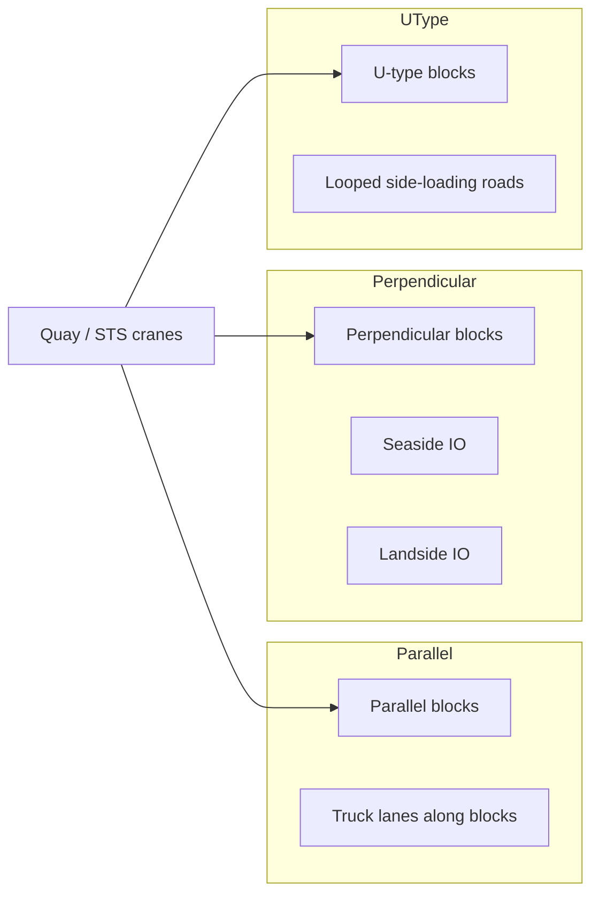
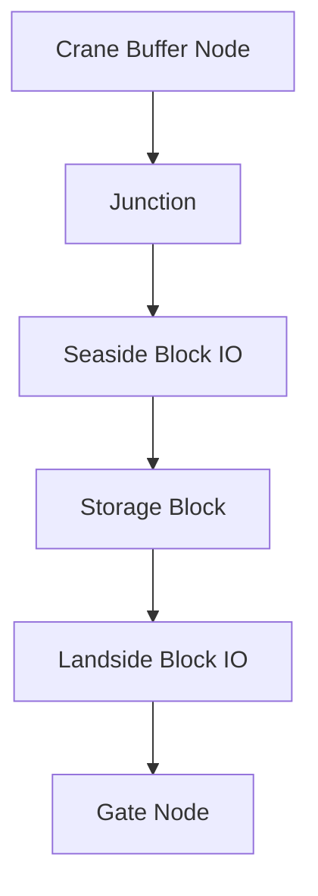
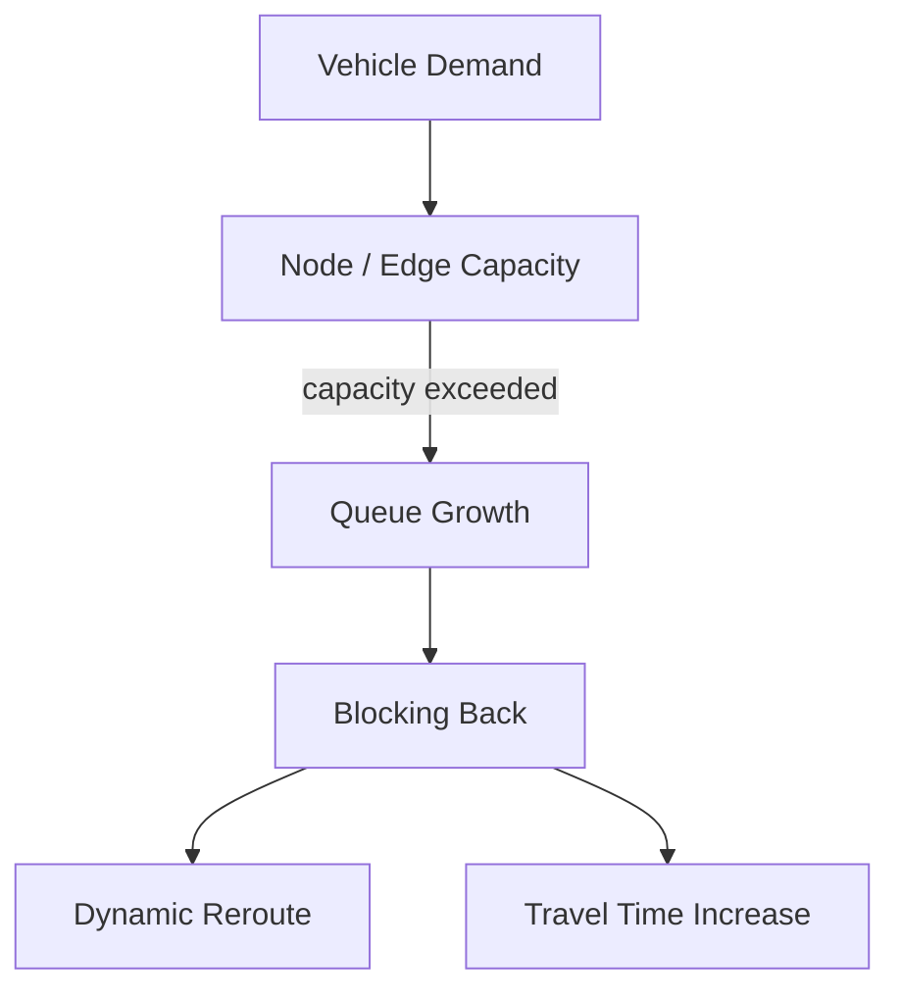

# Summary

This topic covers the physical and operational layout patterns used in container terminals, with a focus on yard orientation, road systems, routing structure, choke points, and travel time modelling. In simulation terms, the terminal should be treated as a connected network of berth-side work zones, transfer corridors, storage blocks, gate interfaces, rail interfaces where present, and control points.

The most important design choice is the relationship between quay, yard blocks, and transfer vehicle interfaces. In the literature, container yards are commonly grouped into parallel-to-quay and perpendicular-to-quay layouts for gantry-crane yards, while straddle-carrier terminals form a third major family with more open block circulation. In more recent automated terminals, emerging U-type and related side-loading layouts are treated as distinct automated archetypes rather than small variants of the older perpendicular model.

For simulation and gameplay, layout is not scenery. It drives average travel distance, vehicle conflict frequency, queueing pattern, crane feeding reliability, and the shape of bottlenecks. A believable terminal generator should therefore produce both geometry and a routing graph, plus layout-dependent traffic rules.

# Why this matters for simulation and gameplay

- Layout choice directly changes horizontal transport productivity.
- Road topology determines whether congestion happens on long corridors, intersections, transfer points, or gate approaches.
- The same equipment mix can perform very differently under different yard orientations.
- Travel distance, not just handling time, strongly affects throughput and fleet sizing.
- Choke points create good gameplay because they turn abstract “capacity” into visible operational pain.
- Layout upgrades provide natural progression:
  - add transfer lanes
  - separate landside and seaside flows
  - convert mixed traffic into dedicated corridors
  - move from parallel yard to perpendicular automated blocks
  - rework junctions and buffer zones

# Key definitions and vocabulary

- **Parallel layout**: Yard blocks oriented parallel to the quay.
- **Perpendicular layout**: Yard blocks oriented perpendicular to the quay.
- **European layout**: Common shorthand in the literature for perpendicular automated ASC-style layouts with seaside and landside I/O at opposite ends.
- **Asian layout**: Common shorthand in the literature for parallel gantry-crane layouts where trucks move along block-side lanes.
- **U-type layout**: Automated layout family using side-loading operations and looped or U-shaped transfer patterns.
- **Horizontal transport**: Vehicle movement between quay, yard, gate, and rail interfaces.
- **I/O point**: Transfer point where vehicle and yard handling system exchange a container.
- **Transfer area**: Dedicated vehicle exchange zone, often at the end of a perpendicular block.
- **Apron corridor**: Road or working strip running behind quay cranes along the berth.
- **Mesh network**: Road graph with rectangular blocks and intersecting lanes.
- **Choke point**: Node or short edge whose capacity limits overall flow.
- **Deadhead distance**: Distance travelled empty.
- **Loaded distance**: Distance travelled with a container job in progress.
- **Turnaround time**: Total time from task assignment to completion, often including queueing and waiting.

# Scope boundaries

## Included

- Layout archetypes relevant to container terminal generation
- Road systems and vehicle circulation patterns
- One-way rules and conflict management abstractions
- Choke point identification
- Distance and travel-time modelling
- Graph representation for routing
- Parameter sets suitable for procedural layout generation

## Excluded

- Detailed civil design of pavements and drainage
- Microsimulation of driver psychology
- Detailed gate processing logic beyond its effect on roads
- Full optimisation of berth allocation, crane scheduling, or stack allocation
- Rail terminal detailed design beyond simple interface nodes

# Key attributes and dimensions (human-level data model)

## 1. Primary layout archetypes and why they exist

### A. Parallel yard layout

In the 2014 literature review, one of the two main gantry-crane yard configurations is the layout with blocks positioned parallel to the quay. It is described as common in non-automated yards, with one or more rows reserved as truck lanes. Internal and external trucks travel along these lanes until reaching the target bay, and the yard crane moves to the truck lane for hand-off.

#### Why it exists

- Fits traditional RTG/RMG truck exchange patterns well.
- Allows trucks to access block-side lanes directly.
- Easier to retrofit in conventional terminals.
- Familiar for mixed manual operations.

#### Strengths

- Flexible truck access to blocks.
- Works well where external trucks are allowed into the yard.
- Can suit mixed manual operations and lower automation levels.

#### Weaknesses

- Truck lanes consume yard area.
- More mixed traffic in and around storage blocks.
- More opportunities for conflict between internal and external vehicles.
- Longer lane-side circulation and more local congestion near block aisles.

### B. Perpendicular yard layout

The same 2014 review describes the second main configuration as blocks positioned perpendicular to the quay, typically used in automated yards, with seaside and landside I/O points at opposite ends of each block. AGVs or internal vehicles usually serve the seaside end, while external trucks serve the landside end.

#### Why it exists

- Strong functional separation between seaside and landside flows.
- Better fit for ASC-based automation.
- Higher storage density because truck lanes do not need to run through block rows.
- Shorter average transfer-vehicle travel in many automated designs.

#### Strengths

- Good separation of traffic types.
- Higher storage capacity per area in the literature.
- Strong fit for dedicated automated flows.
- Easier to model as clear transfer points rather than broad access zones.

#### Weaknesses

- Higher investment cost.
- Longer crane travel along the block can become a bottleneck.
- Poor design of block-end transfer zones can create severe node congestion.
- External trucks typically cannot freely enter storage aisles.

### C. Straddle-carrier open circulation layout

The 2014 review also describes a typical straddle-carrier layout as having separation between rows so straddle carriers can move within rows, with I/O points at block ends and lanes that may run parallel or perpendicular to the quay.

#### Why it exists

- Straddle carriers combine horizontal transport with stack handling.
- Reduces dependence on separate yard cranes in some operations.
- Can create more open circulation patterns than crane-served block systems.

#### Strengths

- Flexible routing.
- Fewer hand-off points.
- Good for pure transshipment or lower-density layouts.

#### Weaknesses

- Lower storage density than dense crane yard systems.
- Vehicle congestion can spread across a larger area.
- Safety management becomes more important in mixed human-operated environments.

### D. Emerging automated U-type / side-loading layouts

Ocean Engineering research comparing perpendicular, parallel and U-type automated layouts describes U-type and parallel side-loading variants as newer automated designs that can outperform perpendicular end-loading layouts on some efficiency, waiting-time, energy, and cost metrics.

#### Why they exist

- Designed to reduce end-loading bottlenecks.
- Improve the interaction between automated yard cranes and vehicles.
- Rework travel paths so loaded and empty flows can be handled more cleanly.

#### Strengths

- Can reduce ship waiting time and operating cost in studied scenarios.
- Better performance in some side-loading configurations.
- More design freedom for automated routing corridors.

#### Weaknesses

- Higher design complexity.
- Less intuitive for manual or mixed operations.
- Strong dependence on exact crane and vehicle technology assumptions.

## 2. Block and corridor starter dimensions for simulation

These are starter values for layout generation, not engineering rules.

| Parameter | Typical starter range |
|---|---:|
| Yard block length in bays | 40 to 50 |
| Yard block width in rows | 6 to 9 |
| Stack height in tiers | 3 to 6 |
| Main corridor lane count per direction | 1 to 2 |
| Road segment speed, mixed manned terminal | 15 to 30 km/h |
| Road segment speed, automated corridor | 20 to 35 km/h |
| Intersection control delay, uncongested | 2 to 10 s |
| Transfer point dwell penalty | 10 to 60 s |
| Gate approach queue penalty | highly variable |

These block ranges align with one widely cited doctoral synthesis that describes typical terminal blocks as around 40-50 bays long, 6-9 rows wide, and 3-6 tiers high.

## 3. Road network data needed for simulation

| Attribute | Meaning |
|---|---|
| node_id | Unique node identifier |
| node_type | junction, crane_buffer, block_io, gate, rail_io, yard_entry, parking |
| x_m, y_m | Position |
| edge_id | Unique edge identifier |
| from_node, to_node | Directed connection |
| length_m | Edge length |
| lane_count | Number of lanes represented |
| directionality | one_way or two_way |
| speed_limit_mps | Free-flow limit |
| vehicle_classes | allowed vehicle types |
| capacity_veh | Concurrent vehicle capacity or equivalent density cap |
| control_type | uncontrolled, stop, signal, reservation, priority |
| turn_penalty_s | Extra delay for turning movement |
| hazard_zone | whether speed/behaviour restrictions apply |
| congestion_factor | dynamic multiplier used by routing model |

# Rules, constraints, and algorithms

## 1. Archetype selection rules

A layout generator should choose an archetype based on:

- automation level
- land depth behind quay
- target vessel mix and throughput
- expected balance of external truck versus transshipment traffic
- preferred handling equipment
- retrofit versus greenfield terminal

### Simple generator rule

```text
if automation_level is high and land_depth is moderate_to_deep:
    prefer perpendicular or U_type
elif mixed_manual_operations and external_trucks_access_yard:
    prefer parallel
elif straddle_carrier_system:
    prefer open_straddle_layout
```

## 2. Why one-way rules exist

Road systems in container terminals are usually simplified and controlled because traffic is repetitive, heavy, safety-critical, and strongly coupled to cranes and transfer points. Research on AGV routing repeatedly models the service area as a regular rectangular or mesh-like network, where conflicts at paths and junctions become a major performance issue. In automated systems in particular, one-way routing, sector control, waypoint control, and junction reservation are standard abstractions because they reduce deadlocks and same-point conflicts.

### Practical reasons for one-way circulation

- Reduce head-on conflicts in narrow corridors
- Simplify dispatch and conflict resolution
- Improve predictability at junctions
- Prevent crane-side safety incidents
- Make routing graph easier to solve in real time

### Good simulation rule

Use directed edges by default for:
- apron roads behind quay cranes
- block-end transfer loops
- narrow service corridors
- gate feeder lanes
- automated vehicle corridors

Allow two-way edges only where:
- width is generous
- human-driven flexibility is desired
- the gameplay target is a more chaotic legacy terminal

## 3. Choke points

The most common choke points in a generated layout are:

- apron merge zones where several quay cranes feed the same corridor
- block-end transfer areas in perpendicular layouts
- block-side access lanes in parallel layouts
- gate approach roads and pre-gate buffers
- rail crossing interfaces
- intersections linking main trunk roads to yard sectors
- maintenance crossings or shared utility corridors in automated terminals

### Choke-point score

```text
choke_score(node) =
  demand_throughput / effective_service_rate
```

Where `effective_service_rate` can be reduced by:
- crossing conflicts
- turn penalties
- reservation time
- safety spacing
- downstream blockage

A node becomes operationally critical when its choke score remains above 1 for sustained periods.

## 4. Graph representation for routing

The Winter Simulation Conference traffic-network model represents a container terminal traffic system as a network of servers, where both paths and junctions are modelled explicitly and travel time depends on congestion. That is a good abstraction for layout generation.

### Recommended graph model

- **Nodes** represent:
  - junctions
  - crane service positions
  - block I/O points
  - gates
  - rail interfaces
  - parking / dwell points
- **Edges** represent:
  - straight path sections
  - loop roads
  - apron corridors
  - transfer connectors
  - gate feeder roads

### Routing cost

```text
edge_cost =
  free_flow_time
  + turn_penalty
  + expected_queue_delay
  + safety_penalty
  + congestion_penalty
```

### Free-flow time

```text
free_flow_time = length_m / speed_limit_mps
```

### Congestion-aware travel time

A simple load-dependent formulation is:

```text
travel_time =
  free_flow_time * (1 + alpha * density_ratio^beta)
```

Where:
- `density_ratio = current_vehicles / nominal_capacity`
- `alpha` is usually 0.5 to 2.0 in simple game models
- `beta` is usually 1 to 3 depending on how sharply congestion should bite

## 5. Distance modelling

The 2008 layout optimisation work explicitly models horizontal transport travel times from a distance matrix derived from layout results. That is a very good approach for a generator because it separates geometry from operations.

### Recommended distance layers

1. **Euclidean distance**
   - useful for rough planning only

2. **Network shortest-path distance**
   - standard distance used for routing jobs

3. **Operational path distance**
   - network distance plus mandatory loops, one-way restrictions, and safety diversions

4. **Stochastic realised distance**
   - operational distance plus detours caused by dynamic congestion or blocked nodes

### Practical simulation formula

```text
job_distance =
  distance(crane_buffer_node, assigned_block_io_node)
  + local_in_block_connector_distance
```

For import/export truck jobs:

```text
job_distance =
  distance(gate_buffer_node, assigned_block_landside_io_node)
```

For straddle layouts, the local connector may be shorter but the open circulation network may create more intersection conflict.

## 6. Travel time modelling

Travel time should never be just `distance / speed`. Container-terminal movement has at least five parts:

1. dispatch delay
2. acceleration and deceleration allowance
3. line-haul time on roads
4. intersection or reservation delay
5. endpoint dwell / alignment delay

### Recommended simple model

```text
travel_time =
  dispatch_delay_s
  + accel_decel_penalty_s
  + sum(edge_length_m / effective_speed_mps)
  + sum(node_delay_s)
  + endpoint_alignment_s
```

### Effective speed rule

```text
effective_speed_mps =
  speed_limit_mps
  * load_factor
  * safety_factor
  * congestion_factor
```

Typical multipliers:
- `load_factor`: 0.8 to 1.0
- `safety_factor`: 0.4 to 1.0
- `congestion_factor`: 0.3 to 1.0

### Useful extra detail

The UCL horizontal transport planning work cites common-industry assumptions such as average travel speed outside the block around 5.90 m/s and within the block around 1.39 m/s for automated straddle-carrier operations. Those values are equipment- and scenario-specific, but they are useful starter assumptions when you want a split between “main corridor” and “local manoeuvring” speeds.

## 7. Queueing and blocking rules

Routing should account for the fact that some nodes behave like servers:

- block I/O points
- apron pick-up / drop-off spots
- gate lanes
- transfer pads
- intersections under reservation control

### Queue delay model

```text
expected_queue_delay =
  queue_length / service_rate
```

Or, more robustly for gameplay:

```text
expected_queue_delay =
  base_delay_s * (1 + gamma * utilization_ratio^delta)
```

### Blocking-back rule

If downstream occupancy is full:
- the upstream node cannot release vehicles
- queue spills onto upstream edge
- upstream edge capacity is reduced
- rerouting may be triggered

This is essential for believable choke-point failures.

## 8. Safety zoning and lane classes

A layout generator should tag edges by safety class:

- **apron_hot_zone**
- **yard_transfer_zone**
- **main_trunk_road**
- **gate_approach**
- **mixed_human_vehicle_zone**
- **fully_automated_corridor**

Each safety class can impose:
- speed cap
- overtaking prohibition
- vehicle class exclusions
- minimum spacing
- stop or reservation rules at crossings

## 9. Recommended realism tiers

### Arcade

- shortest path on a directed graph
- fixed speeds by edge type
- no blocking-back
- only major choke points modelled

### Standard

- one-way rules
- queueing at nodes
- congestion-adjusted travel times
- separate main-corridor and local-manoeuvre speeds

### Advanced

- reservation-based intersections
- vehicle class separation
- blocking-back and spillback
- crane-induced bursts of demand
- stochastic disruptions and rerouting

# Standards and authoritative references to confirm

There is no single ISO-style standard that prescribes container terminal layout archetypes in the way ISO standards prescribe container dimensions. For this topic, the strongest sources are recognised industry association papers, terminal planning literature, and peer-reviewed operations research.

1. **Carlo, Vis and Roodbergen (2014), European Journal of Operational Research**  
   Use for the mainstream classification of parallel versus perpendicular yard layouts, the Asian/European shorthand, I/O-point logic, and the distinction between gantry-crane and straddle-carrier storage configurations.

2. **PEMA Container Terminal Yard Automation (2012)**  
   Use for real terminal examples of parallel and perpendicular automated ASC layouts, plus equipment/layout pairings.

3. **Li et al. (2022), Ocean Engineering**  
   Use for comparative framing of perpendicular, parallel and U-type automated layouts and for the claim that layout affects throughput, ship waiting time, energy use, and cost.

4. **Zhou et al. (2017), Winter Simulation Conference**  
   Use for modelling the traffic system as a graph/network of paths and junctions with dynamic service rates and congestion-dependent travel times.

5. **Roy et al. (2020), Operations Research**  
   Use for the strategic importance of terminal layout and the interaction between quayside, stackside, and vehicle transport design choices.

6. **Terán (2018), UPC doctoral thesis**  
   Use for starter block dimensions, layout distinctions, and the idea that parallel terminals often allow truck access into storage lanes whereas perpendicular terminals often use designated transfer areas.

7. **Kim et al. (2008), HMS**  
   Use for the distance-matrix concept in simulation and layout evaluation.

# Example outputs to include

## 1. Parameter sets for several layout archetypes suitable for a layout generator

### Parallel RTG terminal

```yaml
archetype_id: parallel_rtg
yard_orientation: parallel
automation_level: low_to_medium
vehicle_mix:
  internal_trucks: true
  external_trucks_in_yard: true
  agv: false
block:
  bays: 44
  rows: 7
  tiers: 4
io_pattern:
  type: side_lane_access
  seaside_io: distributed
  landside_io: distributed
roads:
  apron_direction: one_way_loop
  block_access: mixed
  main_trunks_per_direction: 1
  local_lane_speed_mps: 3.5
  trunk_speed_mps: 6.0
routing:
  graph_style: mesh
  dominant_choke_points:
    - block_side_access_lanes
    - apron_merge_zones
```

### Perpendicular ASC terminal

```yaml
archetype_id: perpendicular_asc
yard_orientation: perpendicular
automation_level: high
vehicle_mix:
  internal_trucks: false
  external_trucks_in_yard: false
  agv: true
block:
  bays: 45
  rows: 8
  tiers: 5
io_pattern:
  type: block_end_transfer
  seaside_io: dedicated
  landside_io: dedicated
roads:
  apron_direction: one_way
  transfer_loops: one_way
  main_trunks_per_direction: 1
  local_lane_speed_mps: 2.5
  trunk_speed_mps: 7.0
routing:
  graph_style: directed_mesh
  dominant_choke_points:
    - seaside_block_end_ios
    - apron_cross_connectors
```

### Straddle-carrier transshipment terminal

```yaml
archetype_id: straddle_open
yard_orientation: open_linear
automation_level: low
vehicle_mix:
  straddle_carrier: true
  internal_trucks: limited
  external_trucks_in_yard: limited
block:
  bays: 40
  rows: 6
  tiers: 3
io_pattern:
  type: flexible_end_access
  seaside_io: shared
  landside_io: shared
roads:
  apron_direction: one_way_preferred
  internal_crossings: multiple
  main_trunks_per_direction: 1
  local_lane_speed_mps: 3.0
  trunk_speed_mps: 5.5
routing:
  graph_style: open_mesh
  dominant_choke_points:
    - major_intersections
    - quay_feed_corridors
```

### U-type automated terminal

```yaml
archetype_id: u_type_automated
yard_orientation: u_type
automation_level: high
vehicle_mix:
  agv: true
  external_trucks_in_yard: false
block:
  bays: 46
  rows: 8
  tiers: 5
io_pattern:
  type: side_loading_u_pattern
  seaside_io: structured
  landside_io: structured
roads:
  apron_direction: one_way
  loop_direction: one_way
  main_trunks_per_direction: 1
  local_lane_speed_mps: 2.5
  trunk_speed_mps: 7.5
routing:
  graph_style: directed_loop_mesh
  dominant_choke_points:
    - u_turn_connectors
    - transfer_pads
    - apron_entry_nodes
```

## 2. Graph representation (nodes/edges) for routing

### JSON

```json
{
  "nodes": [
    { "node_id": "QC_B01_01", "node_type": "crane_buffer", "x_m": 40, "y_m": 20 },
    { "node_id": "APRON_J01", "node_type": "junction", "x_m": 80, "y_m": 20 },
    { "node_id": "BLK_A_S", "node_type": "block_io", "x_m": 140, "y_m": 60 },
    { "node_id": "BLK_A_L", "node_type": "block_io", "x_m": 140, "y_m": 180 },
    { "node_id": "GATE_IN", "node_type": "gate", "x_m": 260, "y_m": 220 }
  ],
  "edges": [
    {
      "edge_id": "E1",
      "from_node": "QC_B01_01",
      "to_node": "APRON_J01",
      "length_m": 40,
      "lane_count": 1,
      "directionality": "one_way",
      "speed_limit_mps": 4.0,
      "vehicle_classes": ["agv", "tt"],
      "capacity_veh": 3,
      "control_type": "priority",
      "turn_penalty_s": 0
    },
    {
      "edge_id": "E2",
      "from_node": "APRON_J01",
      "to_node": "BLK_A_S",
      "length_m": 72,
      "lane_count": 1,
      "directionality": "one_way",
      "speed_limit_mps": 7.0,
      "vehicle_classes": ["agv"],
      "capacity_veh": 6,
      "control_type": "reservation",
      "turn_penalty_s": 3
    },
    {
      "edge_id": "E3",
      "from_node": "BLK_A_L",
      "to_node": "GATE_IN",
      "length_m": 128,
      "lane_count": 1,
      "directionality": "one_way",
      "speed_limit_mps": 6.0,
      "vehicle_classes": ["truck"],
      "capacity_veh": 8,
      "control_type": "stop",
      "turn_penalty_s": 4
    }
  ]
}
```

## 3. Example travel-time parameter pack

```yaml
travel_time_model:
  dispatch_delay_s:
    agv: 3
    terminal_tractor: 8
    truck: 12
  accel_decel_penalty_s:
    trunk_edge: 4
    local_edge: 7
  node_delay_s:
    uncontrolled_junction: 2
    stop_controlled_junction: 6
    reservation_junction: 4
    block_io_busy_penalty: 20
  congestion:
    alpha: 1.2
    beta: 2.0
```

# Data schemas

## JSON Schema fragment for layout graph

```json
{
  "$schema": "https://json-schema.org/draft/2020-12/schema",
  "$id": "terminal_layout_graph.schema.json",
  "title": "TerminalLayoutGraph",
  "type": "object",
  "required": ["layout_id", "archetype", "nodes", "edges"],
  "properties": {
    "layout_id": { "type": "string" },
    "archetype": {
      "type": "string",
      "enum": ["parallel", "perpendicular", "straddle_open", "u_type", "hybrid"]
    },
    "nodes": {
      "type": "array",
      "items": {
        "type": "object",
        "required": ["node_id", "node_type", "x_m", "y_m"],
        "properties": {
          "node_id": { "type": "string" },
          "node_type": {
            "type": "string",
            "enum": [
              "junction",
              "crane_buffer",
              "block_io",
              "gate",
              "rail_io",
              "yard_entry",
              "parking"
            ]
          },
          "x_m": { "type": "number" },
          "y_m": { "type": "number" },
          "service_rate_per_min": { "type": "number" },
          "queue_capacity": { "type": "integer" }
        }
      }
    },
    "edges": {
      "type": "array",
      "items": {
        "type": "object",
        "required": [
          "edge_id",
          "from_node",
          "to_node",
          "length_m",
          "directionality",
          "speed_limit_mps"
        ],
        "properties": {
          "edge_id": { "type": "string" },
          "from_node": { "type": "string" },
          "to_node": { "type": "string" },
          "length_m": { "type": "number" },
          "lane_count": { "type": "integer" },
          "directionality": { "type": "string", "enum": ["one_way", "two_way"] },
          "speed_limit_mps": { "type": "number" },
          "capacity_veh": { "type": "integer" },
          "control_type": {
            "type": "string",
            "enum": ["uncontrolled", "stop", "signal", "reservation", "priority"]
          },
          "turn_penalty_s": { "type": "number" },
          "hazard_zone": { "type": "boolean" }
        }
      }
    }
  }
}
```

# Sample data

## JSON

```json
{
  "layout_id": "TERM_A_01",
  "archetype": "perpendicular",
  "nodes": [
    { "node_id": "Q1", "node_type": "crane_buffer", "x_m": 20, "y_m": 15, "service_rate_per_min": 1.5, "queue_capacity": 3 },
    { "node_id": "J1", "node_type": "junction", "x_m": 60, "y_m": 15, "service_rate_per_min": 6, "queue_capacity": 6 },
    { "node_id": "A_SEA", "node_type": "block_io", "x_m": 130, "y_m": 60, "service_rate_per_min": 2, "queue_capacity": 4 },
    { "node_id": "A_LAND", "node_type": "block_io", "x_m": 130, "y_m": 170, "service_rate_per_min": 2, "queue_capacity": 4 }
  ],
  "edges": [
    { "edge_id": "Q1_J1", "from_node": "Q1", "to_node": "J1", "length_m": 40, "lane_count": 1, "directionality": "one_way", "speed_limit_mps": 4.0, "capacity_veh": 3, "control_type": "priority", "turn_penalty_s": 0, "hazard_zone": true },
    { "edge_id": "J1_ASEA", "from_node": "J1", "to_node": "A_SEA", "length_m": 82, "lane_count": 1, "directionality": "one_way", "speed_limit_mps": 7.0, "capacity_veh": 6, "control_type": "reservation", "turn_penalty_s": 3, "hazard_zone": false }
  ]
}
```

## YAML

```yaml
layout_id: TERM_A_01
archetype: perpendicular
nodes:
  - node_id: Q1
    node_type: crane_buffer
    x_m: 20
    y_m: 15
    service_rate_per_min: 1.5
    queue_capacity: 3
  - node_id: J1
    node_type: junction
    x_m: 60
    y_m: 15
    service_rate_per_min: 6
    queue_capacity: 6
  - node_id: A_SEA
    node_type: block_io
    x_m: 130
    y_m: 60
    service_rate_per_min: 2
    queue_capacity: 4
  - node_id: A_LAND
    node_type: block_io
    x_m: 130
    y_m: 170
    service_rate_per_min: 2
    queue_capacity: 4
edges:
  - edge_id: Q1_J1
    from_node: Q1
    to_node: J1
    length_m: 40
    lane_count: 1
    directionality: one_way
    speed_limit_mps: 4.0
    capacity_veh: 3
    control_type: priority
    turn_penalty_s: 0
    hazard_zone: true
  - edge_id: J1_ASEA
    from_node: J1
    to_node: A_SEA
    length_m: 82
    lane_count: 1
    directionality: one_way
    speed_limit_mps: 7.0
    capacity_veh: 6
    control_type: reservation
    turn_penalty_s: 3
    hazard_zone: false
```

# Visualisation guidance

## Mermaid diagrams

### Archetype overview



### Routing graph abstraction



### Choke point logic



## UI/dashboard widgets where relevant

- Layout-archetype selector with throughput and congestion trade-offs
- Heatmap of average edge utilisation
- Choke-point ranking table
- Sankey or flow lines for seaside-to-yard and gate-to-yard traffic
- Vehicle travel-distance histogram
- Average loaded vs deadhead distance per job type
- Gate approach queue monitor

# 3D rendering notes (scale, dimensions, textures/markings)

- Keep block orientation visually obvious from top-down and oblique views.
- Main trunk roads should be wider and cleaner than local transfer lanes.
- Parallel yards should visibly show block-side truck lanes.
- Perpendicular automated yards should visibly show block-end transfer pads and cleaner separation of seaside and landside roads.
- Apron roads should run behind quay cranes and feel like hot operational zones.
- Paint lane arrows, stop bars, hazard striping, and numbered block end points.
- Intersections matter visually. Make them readable because they are where congestion becomes legible to the player.
- Use believable empty space around junctions and transfer points. Overcrowded scenery wrecks the whole illusion.

# Validation checklist

- [ ] Layout archetype is explicitly tagged rather than implied
- [ ] Road graph exists and is routable from quay to yard to gate
- [ ] Directionality is defined on every edge
- [ ] Major choke points can be identified from the graph
- [ ] Distances are based on network paths, not just straight lines
- [ ] Travel time includes node delay and congestion, not just free-flow speed
- [ ] Parallel layout allows block-side access where intended
- [ ] Perpendicular layout uses block-end I/O where intended
- [ ] Safety classes and hazard zones are assigned to critical roads
- [ ] The layout can generate both loaded and deadhead vehicle movements

# Open questions and research backlog

- Add a separate topic for gate complex and pre-gate road design.
- Add a separate topic for rail terminal interface nodes and train-side truck conflicts.
- Research better public sources for typical road widths and turning templates in container terminals.
- Add layout-retrofit patterns for converting legacy parallel terminals to partial automation.
- Add formal choke-point detection heuristics using graph centrality plus flow assignment.
- Add weather and visibility penalties to speed and intersection control.
- Compare appointment-system effects on landside traffic for generator presets.
- Add separate archetypes for narrow brownfield terminals and island/reclaimed greenfield terminals.

# Research notes to verify later

- The literature is much stronger on comparative yard orientation, vehicle routing, and simulation abstractions than on publicly available hard rules for road widths and one-way geometry. For that reason, this topic deliberately focuses on simulation-ready topology, conflict logic, and parameterisation rather than pretending there is one universal civil-design rulebook for all container terminals.
