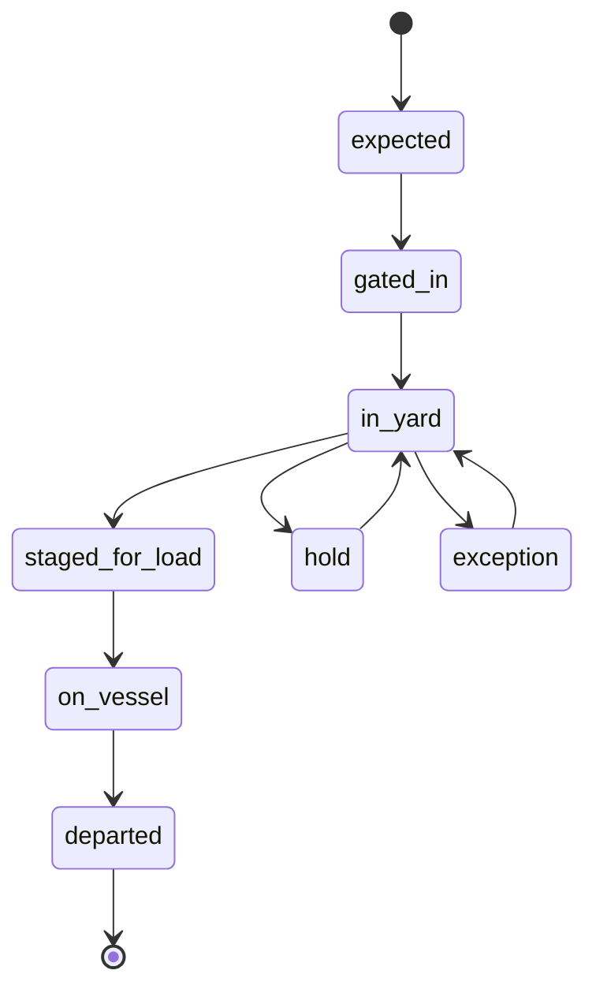
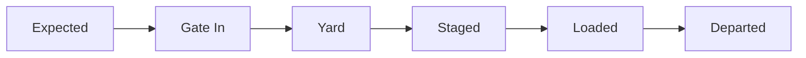
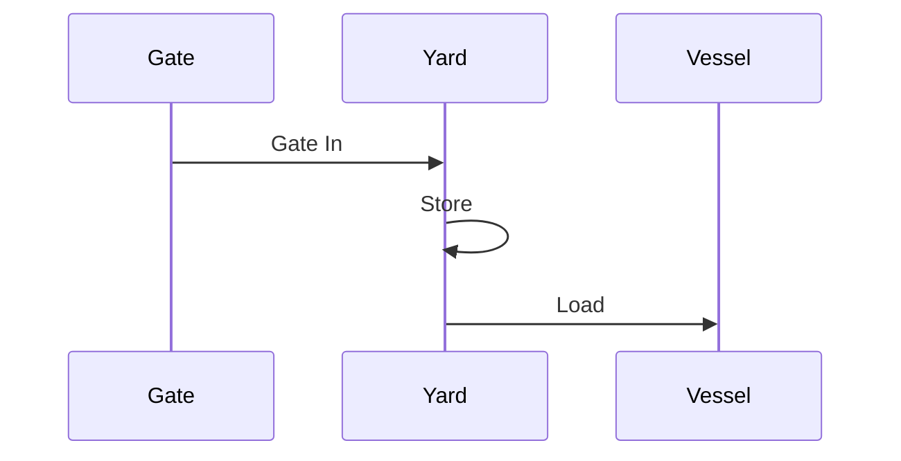

## Summary

This document defines a **canonical container lifecycle event model** for a container terminal.

It provides:
- a state machine for container status transitions
- a standardised set of operational events
- timestamp definitions for KPI calculation
- exception categories and causes
- sample event streams suitable for simulation and analytics

The goal is to allow:
- consistent event-driven simulation
- realistic tracking dashboards
- integration with planning and execution systems
- reproducible KPI calculations (dwell time, turn time, crane productivity)

---

## Why this matters for simulation and gameplay

Without a proper lifecycle model:
- containers teleport between states
- KPIs cannot be calculated correctly
- exceptions feel random and disconnected
- planning has no feedback loop

With a proper lifecycle:
- every state change is triggered by an event
- delays have traceable causes
- dashboards reflect real operational pain
- gameplay can reward flow optimisation instead of raw speed

This is the backbone of everything else. Get this wrong and the whole simulation becomes nonsense.

---

## Key definitions and vocabulary

- **Lifecycle state**  
  The current logical status of a container.

- **Event**  
  A timestamped occurrence that causes or reflects a state transition.

- **Milestone**  
  A significant lifecycle event used for tracking and KPIs.

- **Dwell time**  
  Time a container spends in the terminal.

- **Truck turn time**  
  Time from truck arrival at gate to departure.

- **Gate-in / gate-out**  
  Entry and exit of container via truck gate.

- **Load event**  
  Container placed onto vessel.

- **Discharge event**  
  Container removed from vessel.

- **Hold**  
  Restriction preventing movement (customs, documentation, safety).

- **Exception**  
  Any deviation from planned flow (missing, damaged, late, etc.)

---

## Scope boundaries (what is included/excluded)

### Included
- lifecycle states and transitions
- canonical event definitions
- timestamp definitions for KPIs
- exception modelling
- integration points with vessel and yard operations

### Excluded
- full customs/legal workflows
- detailed billing events
- external supply chain events outside terminal scope

---

## Key attributes and dimensions (human-level data model)

### Container lifecycle state

```json
{
  "container_id": "string",
  "state": "expected | gated_in | in_yard | staged_for_load | on_vessel | departed | delivered | hold | exception",
  "location": "string",
  "last_event": "string",
  "last_event_time": "datetime"
}
```

### Event structure

```json
{
  "event_id": "string",
  "event_type": "string",
  "event_time": "datetime",
  "container_id": "string",
  "location": "string",
  "equipment_id": "string",
  "details": {}
}
```

---

## Rules, constraints, and algorithms

## 1. Canonical state machine



### Rules
- every state change must be triggered by an event
- a container cannot skip mandatory states (except direct moves)
- hold overrides normal transitions until cleared
- exception requires resolution before continuing

---

## 2. Core lifecycle transitions

### Import flow
1. on_vessel
2. discharged
3. in_yard
4. gate_out
5. delivered

### Export flow
1. expected
2. gate_in
3. in_yard
4. staged_for_load
5. loaded
6. on_vessel
7. departed

### Transshipment flow
1. discharged
2. in_yard
3. staged_for_load
4. loaded

---

## 3. Exception handling logic

```pseudo
if missing_documents:
  state = "hold"

if damage_detected:
  state = "exception"

if vgm_missing:
  block_loading()

if container_not_found:
  raise_exception("missing_container")
```

### Common exception types
- documentation hold
- customs hold
- hazardous approval missing
- VGM missing or invalid
- container damaged
- container not found
- late arrival (missed vessel cutoff)

---

## 4. KPI timestamp definitions

### Dwell time
```pseudo
dwell_time = gate_out_time - gate_in_time
```

### Truck turn time
```pseudo
turn_time = gate_out_time - truck_arrival_time
```

### Vessel move timestamp
- `qc_pick_time`
- `qc_place_time`

### Yard processing time
```pseudo
yard_time = yard_entry_time - yard_exit_time
```

---

## Standards and authoritative references to confirm

- DCSA Track & Trace standard event definitions
- UN/EDIFACT CODECO (gate moves)
- UN/EDIFACT COARRI (load/discharge actuals)
- SOLAS VGM rules (loading constraints)
- Port KPI definitions (UNCTAD)

---

## Example outputs to include

### Canonical event list

| Event | Description |
|------|-------------|
| GATE_IN | Container enters terminal |
| GATE_OUT | Container leaves terminal |
| DISCHARGED | Removed from vessel |
| LOADED | Placed on vessel |
| YARD_GROUNDED | Placed in yard |
| YARD_PICKED | Picked from yard |
| HOLD_APPLIED | Movement blocked |
| HOLD_RELEASED | Movement allowed |
| EXCEPTION_RAISED | Issue detected |
| EXCEPTION_RESOLVED | Issue cleared |

---

## Data schemas

### Event stream schema

```json
{
  "events": [
    {
      "event_time": "datetime",
      "event_type": "string",
      "container_id": "string"
    }
  ]
}
```

---

## Sample data

### JSON

```json
{
  "events": [
    {
      "event_time": "2026-03-26T08:00:00Z",
      "event_type": "GATE_IN",
      "container_id": "MSKU1234567"
    },
    {
      "event_time": "2026-03-26T09:15:00Z",
      "event_type": "YARD_GROUNDED",
      "container_id": "MSKU1234567"
    },
    {
      "event_time": "2026-03-26T12:00:00Z",
      "event_type": "LOADED",
      "container_id": "MSKU1234567"
    }
  ]
}
```

### YAML

```yaml
events:
  - event_time: 2026-03-26T08:00:00Z
    event_type: GATE_IN
    container_id: CMAU7654321

  - event_time: 2026-03-26T09:20:00Z
    event_type: YARD_GROUNDED
    container_id: CMAU7654321

  - event_time: 2026-03-26T13:10:00Z
    event_type: LOADED
    container_id: CMAU7654321
```

---

## Visualisation guidance

### Lifecycle diagram



### Event timeline



---

## 3D rendering notes

- show container state visually:
  - yard stacks = idle
  - trucks = gate events
  - crane = load/discharge
- highlight containers with holds or exceptions
- animate transitions between zones

---

## Validation checklist

- [ ] every state transition has an event
- [ ] lifecycle supports import/export/transshipment
- [ ] holds block movement
- [ ] exceptions require resolution
- [ ] timestamps allow KPI calculation
- [ ] event stream can reconstruct full history

---

## Open questions and research backlog

- extend lifecycle to include rail operations
- integrate customs systems deeper
- include predictive ETA/ETD updates
- standardise event IDs across systems
- align fully with DCSA event naming
