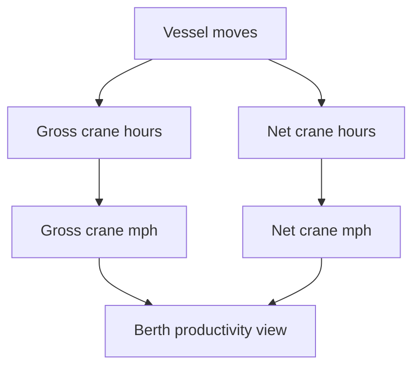

## Summary

This document defines **simulation-ready operational dashboards and KPI definitions** for a container terminal.

It covers:
- vessel and berth productivity metrics
- crane, yard, gate, and truck-flow KPIs
- queue, dwell, utilisation, and schedule-conformance indicators
- explicit measurement points and caveats to avoid benchmark confusion
- dashboard widgets, chart types, and example datasets

The core design principle is simple:

**A KPI is only useful if the measurement points, exclusions, and denominator are explicit.**

This topic is critical because container-terminal simulations often become misleading when terms like:
- moves per hour
- berth productivity
- turnaround time
- utilisation
- dwell
- waiting time

are used loosely or inconsistently.

---

## Why this matters for simulation and gameplay

Dashboards are how managers, dispatchers, and players understand whether the terminal is:
- flowing well
- slowly choking to death
- hiding problems behind misleading averages

Without explicit KPI definitions:
- the simulation can reward the wrong behaviour
- two scenarios with the same “moves per hour” can actually have very different bottlenecks
- comparisons between manual, semi-automated, and automated terminals become meaningless
- queue problems, berth underperformance, and yard congestion get blurred into one ugly blob

With a good KPI model:
- bottlenecks become visible
- trade-offs become measurable
- players can optimise for different goals
- historical trend views become useful rather than decorative wallpaper

---

## Key definitions and vocabulary

- **Gross crane productivity / gross crane moves per hour**  
  Moves divided by gross crane hours, usually including all elapsed crane deployment time for the call or analysis period.

- **Net crane productivity / net crane moves per hour**  
  Moves divided by net working crane hours, usually excluding agreed interruptions or non-working periods.

- **Berth productivity / berth moves per hour**  
  Total vessel moves divided by berth time or berth working time, depending on the chosen definition. This must be made explicit.

- **Crane intensity**  
  Average number of quay cranes assigned to a vessel call.

- **Berth time**  
  Time from all-fast / berth occupation start to berth release / unberthing, depending on the terminal definition.

- **Port stay / port hours**  
  Total time the vessel spends in port, often broader than berth time because it may include anchorage or waiting periods. Keep this separate from berth-time metrics.

- **Truck turn time**  
  Time from truck arrival to truck exit, or from gate-in to gate-out if the metric intentionally excludes external queueing. Do not mix the two.

- **Dwell time**  
  Time a container spends in terminal custody between receipt/discharge and departure/release.

- **Yard occupancy**  
  Share of storage capacity currently used. This may be reported in TEU, ground slots, blocks, or weighted capacity units.

- **Queue length**  
  Number of waiting entities at a process boundary, such as gate, crane, or yard block transfer point.

- **Schedule conformance**  
  Degree to which actual milestones match planned ETA, ETD, berth window, work start, work completion, and release windows.

- **Exception rate**  
  Share of transactions or moves affected by holds, inspection, not-ready conditions, equipment failures, or data discrepancies.

---

## Scope boundaries (what is included/excluded)

### Included
- terminal operational KPIs
- vessel-call, yard, gate, and truck performance metrics
- explicit formulas and timestamp definitions
- dashboard design guidance for simulation and operations play
- caveats for comparing terminal configurations

### Excluded
- full finance and accounting dashboards
- emissions and ESG reporting beyond brief optional extensions
- enterprise BI implementation details
- labour contract reporting and payroll analytics

---

## Key attributes and dimensions (human-level data model)

A dashboard-friendly model should group metrics by operational domain.

### 1. Vessel and berth domain
- `vessel_call_id`
- `arrival_time_actual`
- `berth_time_start`
- `berth_time_end`
- `work_start_time`
- `work_end_time`
- `planned_moves`
- `actual_moves`
- `actual_load_moves`
- `actual_discharge_moves`
- `actual_restow_moves`
- `gross_crane_hours`
- `net_crane_hours`
- `crane_intensity`
- `berth_wait_minutes`
- `schedule_delay_minutes`

### 2. Quay crane domain
- `qc_id`
- `moves_completed`
- `gross_hours`
- `net_hours`
- `idle_minutes_no_truck`
- `idle_minutes_no_box_ready`
- `idle_minutes_weather`
- `idle_minutes_breakdown`
- `dual_cycle_rate`
- `restow_share_pct`

### 3. Yard domain
- `block_id`
- `occupancy_teu`
- `occupancy_pct`
- `reefer_occupancy_pct`
- `dangerous_goods_occupancy_pct`
- `yard_rehandles`
- `yard_travel_time_avg`
- `yard_queue_length_avg`
- `stack_access_delay_minutes`

### 4. Gate and truck domain
- `gate_lane_id`
- `truck_arrivals`
- `truck_turn_time_avg`
- `truck_turn_time_p95`
- `gate_processing_time_avg`
- `external_queue_time_avg`
- `appointment_conformance_pct`
- `transactions_per_hour`
- `ocr_exception_rate`

### 5. Container flow domain
- `import_dwell_hours_avg`
- `export_dwell_hours_avg`
- `transshipment_dwell_hours_avg`
- `short_dwell_share_pct`
- `long_dwell_share_pct`
- `late_gate_share_pct`
- `hold_rate_pct`
- `not_ready_for_load_pct`

### 6. Reliability and exception domain
- `equipment_availability_pct`
- `move_failure_rate_pct`
- `data_mismatch_rate_pct`
- `documentation_hold_rate_pct`
- `customs_hold_rate_pct`
- `vgm_hold_rate_pct`
- `damage_exception_rate_pct`

### 7. Trend and comparison dimensions
- time bucket (`hour`, `shift`, `day`, `week`)
- vessel class
- service string
- berth
- crane type
- terminal operating mode (`manual`, `semi_automated`, `automated`)
- cargo flow type (`import`, `export`, `transshipment`)
- block type (`import`, `export`, `reefer`, `DG`, `empty`)

---

## Rules, constraints, and algorithms (include simplified simulation models)

## 1. KPI definitions must declare measurement points

This is non-negotiable.

Every KPI definition in the simulation should explicitly store:
- numerator
- denominator
- time window
- included event types
- excluded delay categories
- whether the measure is per call, per crane, per shift, or terminal-wide

Suggested schema fragment:

```json
{
  "kpi_id": "qc_net_mph",
  "name": "Quay Crane Net Moves per Hour",
  "numerator": "completed_container_moves",
  "denominator": "net_crane_hours",
  "included_events": ["LOAD", "DISCHARGE", "RESTOW"],
  "excluded_time_categories": ["meal_break", "shift_handover", "planned_stoppage"],
  "aggregation_level": "crane_shift"
}
```

If you skip this, you end up benchmarking apples against forklifts.

---

## 2. Vessel and berth productivity metrics

### 2.1 Gross crane moves per hour

```pseudo
gross_crane_mph = total_container_moves / gross_crane_hours
```

Use when:
- measuring full elapsed crane deployment performance
- showing actual customer-facing productivity impact including interruptions

Caveat:
- gross hours may include waiting, changeover, hatch delays, or non-productive time depending on local definition

### 2.2 Net crane moves per hour

```pseudo
net_crane_mph = total_container_moves / net_crane_hours
```

Use when:
- comparing the pure working rate of cranes
- isolating execution efficiency from agreed stoppages

Caveat:
- net definitions vary. Document exactly which stoppages are removed.

### 2.3 Berth moves per hour

Two acceptable versions, but they must not be mixed.

#### Berth gross productivity
```pseudo
berth_gross_mph = total_container_moves / berth_hours
```

#### Berth working productivity
```pseudo
berth_working_mph = total_container_moves / working_berth_hours
```

Use both if possible, with labels that make the distinction painfully obvious.

### 2.4 Crane intensity

```pseudo
crane_intensity = sum(cranes_assigned_each_hour) / vessel_work_hours
```

Or simpler per call:
```pseudo
crane_intensity = total_crane_hours / berth_work_hours
```

Interpretation:
- high crane intensity with poor berth productivity suggests interference, poor stowage, yard starvation, or coordination problems
- low intensity with long berth time may indicate under-resourcing

### 2.5 Vessel schedule conformance

```pseudo
eta_delay_minutes = actual_berth_start - planned_berth_start
work_completion_delay_minutes = actual_work_end - planned_work_end
etd_delay_minutes = actual_departure - planned_departure
```

Recommended reporting:
- average delay
- p95 delay
- on-time share within threshold, e.g. ±30 minutes or ±2 hours depending on the milestone

---

## 3. Yard performance metrics

### 3.1 Yard occupancy

```pseudo
yard_occupancy_pct = occupied_capacity_units / total_usable_capacity_units * 100
```

Use a clearly declared capacity unit:
- TEU capacity
- slot capacity
- stack-weighted capacity
- operational usable capacity

Caveat:
- 80% physical occupancy can already feel operationally painful depending on layout, segregation rules, reefer density, and stack policy

### 3.2 Yard rehandle rate

```pseudo
yard_rehandle_rate = yard_rehandles / outbound_or_retrieval_moves
```

Interpretation:
- rising rehandles often indicate poor pre-marshalling, poor dwell distribution, or over-compressed storage

### 3.3 Stack accessibility delay

```pseudo
stack_access_delay = actual_pick_start - request_time
```

Useful for:
- export load readiness
- import pickup readiness
- showing how “available in yard” can still mean “buried and annoying”

### 3.4 Block queue KPI

```pseudo
avg_block_queue = sum(queue_length_samples) / sample_count
p95_block_queue = percentile(queue_length_samples, 95)
```

Show both average and p95. Averages alone are liars.

---

## 4. Gate and truck KPIs

### 4.1 Truck turn time

Use two named versions.

#### Total truck turn time
```pseudo
truck_turn_time_total = gate_exit_time - terminal_arrival_time
```

#### Internal truck turn time
```pseudo
truck_turn_time_internal = gate_exit_time - gate_in_time
```

Do not call both merely “truck turn time”.

### 4.2 Gate processing time

```pseudo
gate_processing_time = gate_clearance_time - lane_entry_time
```

Useful for:
- gatehouse performance
- OCR/kiosk/inspection comparisons

### 4.3 External queue time

```pseudo
external_queue_time = gate_in_time - terminal_arrival_time
```

This is the KPI that starts arguments at management meetings.

### 4.4 Appointment conformance

```pseudo
appointment_conformance_pct =
  trucks_arriving_within_slot_tolerance / total_appointed_trucks * 100
```

Use when modelling appointment systems.

---

## 5. Container dwell KPIs

### 5.1 Import dwell

```pseudo
import_dwell_hours = gate_out_time - discharge_complete_time
```

### 5.2 Export dwell

```pseudo
export_dwell_hours = load_time - gate_in_time
```

### 5.3 Transshipment dwell

```pseudo
transshipment_dwell_hours = outbound_load_time - inbound_discharge_time
```

### 5.4 Dwell bucket reporting
Use buckets rather than only averages, for example:
- `0-12h`
- `12-24h`
- `1-3d`
- `3-5d`
- `5d+`

This matters because a terminal can have a nice average and still be hiding a heap of aged cargo quietly rotting in the corner.

---

## 6. Queue and utilisation KPIs

### 6.1 Resource utilisation

```pseudo
utilisation_pct = busy_time / available_time * 100
```

Apply separately to:
- quay cranes
- yard cranes
- horizontal transport fleet
- gate lanes
- inspection bays

Caveat:
- 100% utilisation is usually a bad sign in stochastic operations because it destroys resilience and inflates queues

### 6.2 Queue length and waiting time

```pseudo
avg_queue_length = mean(queue_samples)
p95_wait_minutes = percentile(wait_time_samples, 95)
```

Track these at:
- gate approach
- under-crane truck queue
- yard handoff point
- rail interface if applicable

### 6.3 Throughput vs congestion rule of thumb

A good-enough simulation warning rule:

```pseudo
if utilisation_pct > 85 and p95_wait_minutes rising:
  congestion_risk = "high"
```

---

## 7. Reliability and exception KPIs

### 7.1 Equipment availability

```pseudo
availability_pct = available_time / scheduled_time * 100
```

### 7.2 Hold rate

```pseudo
hold_rate_pct = containers_with_active_hold / relevant_container_population * 100
```

Break down by:
- customs
- documentation
- VGM
- dangerous goods
- damage
- seal discrepancy

### 7.3 Not-ready rate for vessel load

```pseudo
not_ready_rate_pct = load_moves_delayed_not_ready / planned_load_moves * 100
```

This is one of the best indicators that yard planning and documentation flow are betraying the berth.

### 7.4 OCR or data mismatch rate

```pseudo
ocr_exception_rate_pct = ocr_exceptions / gate_transactions * 100
```

Useful for automation investment analysis.

---

## 8. KPI comparability rules for simulation studies

Automation and simulation papers repeatedly run into the same problem: people compare systems using different KPI definitions or different scope boundaries.

To avoid that, each experiment or dashboard comparison should store:
- scenario name
- equipment set
- layout type
- process assumptions
- KPI formula version
- exclusions applied
- random seed or run set
- warm-up / transient treatment
- reporting period

Suggested simulation metadata:

```json
{
  "scenario_id": "ACT_BUFFERED_V2",
  "layout_type": "automated_asc_agv",
  "kpi_definition_version": "2026-03-ops-kpi-v1",
  "run_hours": 720,
  "warmup_hours": 48,
  "reported_hours": 672,
  "notes": "Gross crane hours include hatch-change time; meal breaks excluded from net hours."
}
```

---

## 9. Dashboard design patterns

A simulation-ready dashboard should present:
- current-state operational control
- trend analysis
- exception analysis
- comparison views

### Recommended widgets by domain

#### Executive overview
- vessel calls in progress
- berth occupancy
- berth moves per hour
- truck turn time today
- yard occupancy by block type
- active holds
- delayed departures
- top current bottleneck

#### Quay operations
- per-crane gross and net mph
- crane intensity by vessel
- restow count by bay
- QC idle reason stacked bar
- gantt of crane work zones

#### Yard operations
- occupancy heatmap by block
- rehandle rate trend
- export readiness score
- reefer slot utilisation
- DG zone occupancy and alerts

#### Gate and truck flows
- arrivals by hour
- internal turn time trend
- p95 queue time
- OCR exception count
- appointment adherence

#### Reliability and exceptions
- hold reasons pie or bar
- equipment breakdown minutes
- not-ready-for-load queue
- exception ageing table

### Recommended visual styles
- **time series** for productivity, delays, arrivals, occupancy trend
- **heatmaps** for yard occupancy, restows by bay, queue hot spots
- **stacked bars** for idle reasons, hold categories, move composition
- **scatter plots** for crane intensity vs berth productivity
- **box plots or percentile bands** for truck turn time and dwell
- **gantt or lane charts** for vessel-call execution and crane assignment
- **sparklines** for compact trend-in-card displays

---

## Standards and authoritative references to confirm (edition/year, what to verify)

- **UNCTAD Monographs on Port Management**  
  Confirm gross vs net crane productivity concepts, berth productivity terminology, and the caution that output loss due to idle time materially changes comparisons.

- **UNCTAD port performance indicators guidance**  
  Confirm classic port-performance measurement structures such as time-at-berth and productivity indicators.

- **World Bank Container Port Performance Index (CPPI)**  
  Confirm contemporary vessel-call and crane-productivity terminology such as crane intensity, gross crane productivity, and related call-level definitions used in benchmarking.

- **PEMA automation and ASC performance papers**  
  Confirm the importance of clear performance-definition boundaries in automated terminal simulations and equipment-performance comparisons.

- **Terminal / port public dashboard practice**  
  Confirm common operational dashboard presentation patterns and metric grouping used in port reporting.

---

## Example outputs to include (tables, diagrams, sample data)

### KPI table: formula, measurement points, caveats

| KPI | Formula | Measurement points | Caveats |
|---|---|---|---|
| Gross crane mph | `moves / gross_crane_hours` | crane deployment start/end | includes some idle/interruption time depending on definition |
| Net crane mph | `moves / net_crane_hours` | productive work periods only | net exclusions must be explicit |
| Berth gross mph | `moves / berth_hours` | berth all-fast to berth release | sensitive to pre-work/post-work delay |
| Crane intensity | `crane_hours / berth_work_hours` | per vessel call | high intensity does not guarantee high productivity |
| Truck turn total | `gate_exit - terminal_arrival` | terminal approach to exit | includes external queueing |
| Truck turn internal | `gate_exit - gate_in` | gate entry to exit | hides outside congestion |
| Import dwell | `gate_out - discharge_complete` | vessel discharge to terminal exit | skewed by customs/storage behaviour |
| Yard occupancy | `used / usable_capacity` | declared capacity basis required | capacity basis varies by terminal |
| Not-ready-for-load rate | `delayed_load_moves / planned_load_moves` | vessel-call move set | strongly affected by yard prep and documentation |
| Equipment availability | `available_time / scheduled_time` | per equipment class or unit | scheduled vs calendar time must be distinguished |

### Example mock dashboard dataset

```json
{
  "timestamp": "2026-03-27T10:00:00Z",
  "terminal_summary": {
    "active_vessel_calls": 3,
    "berth_occupancy_pct": 75.0,
    "berth_moves_per_hour": 128.4,
    "yard_occupancy_pct": 81.2,
    "truck_turn_time_internal_avg_min": 44.0,
    "truck_turn_time_internal_p95_min": 96.0,
    "active_holds": 137,
    "top_bottleneck": "yard_not_ready_for_load"
  },
  "quay_cranes": [
    {
      "qc_id": "QC-01",
      "gross_mph": 24.8,
      "net_mph": 31.1,
      "idle_reasons": {
        "no_truck": 18,
        "no_box_ready": 11,
        "weather": 0,
        "breakdown": 6
      }
    },
    {
      "qc_id": "QC-02",
      "gross_mph": 27.2,
      "net_mph": 33.5,
      "idle_reasons": {
        "no_truck": 9,
        "no_box_ready": 14,
        "weather": 0,
        "breakdown": 0
      }
    }
  ],
  "yard_blocks": [
    { "block_id": "IMP-C3", "occupancy_pct": 88.0, "rehandle_rate": 0.22 },
    { "block_id": "EXP-E2", "occupancy_pct": 76.0, "rehandle_rate": 0.11 },
    { "block_id": "RF-R1", "occupancy_pct": 91.0, "rehandle_rate": 0.08 }
  ],
  "gate": {
    "transactions_per_hour": 142,
    "external_queue_time_avg_min": 18,
    "ocr_exception_rate_pct": 1.9,
    "appointment_conformance_pct": 84.5
  }
}
```

### Recommended chart mapping
- berth moves per hour -> line chart with shift overlays
- crane intensity vs berth productivity -> scatter plot
- yard occupancy by block -> heatmap
- truck turn time distribution -> box plot or percentile ribbon
- hold reasons -> horizontal stacked bar
- QC idle reasons -> stacked bar by crane and shift
- delayed departures -> status table with sparkline trend

---

## Data schemas (JSON Schema references or in-file fragments)

### KPI definition schema fragment

```json
{
  "$schema": "https://json-schema.org/draft/2020-12/schema",
  "$id": "terminal-kpi-definition.schema.json",
  "title": "TerminalKPIDefinition",
  "type": "object",
  "required": ["kpi_id", "name", "numerator", "denominator", "aggregation_level"],
  "properties": {
    "kpi_id": { "type": "string" },
    "name": { "type": "string" },
    "numerator": { "type": "string" },
    "denominator": { "type": "string" },
    "included_events": {
      "type": "array",
      "items": { "type": "string" }
    },
    "excluded_time_categories": {
      "type": "array",
      "items": { "type": "string" }
    },
    "aggregation_level": {
      "type": "string",
      "enum": ["terminal", "vessel_call", "berth", "crane", "yard_block", "gate_lane", "shift", "day"]
    },
    "formula_text": { "type": "string" },
    "caveats": {
      "type": "array",
      "items": { "type": "string" }
    }
  }
}
```

### Dashboard snapshot schema fragment

```json
{
  "$schema": "https://json-schema.org/draft/2020-12/schema",
  "$id": "terminal-dashboard-snapshot.schema.json",
  "title": "TerminalDashboardSnapshot",
  "type": "object",
  "required": ["timestamp", "terminal_summary"],
  "properties": {
    "timestamp": { "type": "string", "format": "date-time" },
    "terminal_summary": {
      "type": "object",
      "properties": {
        "active_vessel_calls": { "type": "integer" },
        "berth_occupancy_pct": { "type": "number" },
        "berth_moves_per_hour": { "type": "number" },
        "yard_occupancy_pct": { "type": "number" },
        "truck_turn_time_internal_avg_min": { "type": "number" },
        "truck_turn_time_internal_p95_min": { "type": "number" },
        "active_holds": { "type": "integer" },
        "top_bottleneck": { "type": "string" }
      }
    }
  }
}
```

---

## Sample data (JSON and YAML)

### JSON

```json
{
  "kpi_id": "berth_gross_mph",
  "name": "Berth Gross Moves per Hour",
  "numerator": "completed_container_moves",
  "denominator": "berth_hours",
  "included_events": ["LOAD", "DISCHARGE", "RESTOW"],
  "excluded_time_categories": [],
  "aggregation_level": "vessel_call",
  "formula_text": "completed_container_moves / berth_hours",
  "caveats": [
    "Sensitive to waiting after all-fast and before first move",
    "Not directly comparable to net crane mph"
  ]
}
```

### YAML

```yaml
timestamp: "2026-03-27T14:00:00Z"
terminal_summary:
  active_vessel_calls: 4
  berth_occupancy_pct: 100.0
  berth_moves_per_hour: 121.7
  yard_occupancy_pct: 83.4
  truck_turn_time_internal_avg_min: 47.0
  truck_turn_time_internal_p95_min: 104.0
  active_holds: 162
  top_bottleneck: "no_horizontal_transport"

quay_cranes:
  - qc_id: QC-03
    gross_mph: 22.9
    net_mph: 30.4
  - qc_id: QC-04
    gross_mph: 25.2
    net_mph: 32.7
```

---

## Visualisation guidance

### Mermaid diagrams

#### 1. KPI pipeline


#### 2. Vessel-call productivity decomposition



#### 3. Congestion signal flow


### UI/dashboard widgets where relevant

Suggested dashboard layout:
- **Top row cards**: berth occupancy, berth gross mph, truck turn p95, yard occupancy, active holds
- **Operations row**: vessel-call gantt, crane productivity chart, gate arrivals vs processing
- **Congestion row**: yard occupancy heatmap, queue length trend, not-ready-for-load list
- **Reliability row**: equipment availability, OCR exception rate, hold reason stacked bar
- **Executive trend row**: 7-day line charts for berth productivity, truck turn time, dwell buckets, delayed departures

---

## 3D rendering notes (scale, dimensions, textures/markings)

This topic is mainly UI-facing, but dashboards can drive scene overlays:
- highlight active bottleneck zones on the terminal map
- overlay queue lengths above gate, quay buffer, and yard blocks
- colour berths by schedule risk
- show crane utilisation or idle state above equipment
- animate warning pulses when a KPI breaches threshold

Suggested threshold overlay examples:
- yard occupancy > 85% -> amber
- yard occupancy > 92% -> red
- truck turn p95 > target -> gate zone warning
- berth gross mph below threshold while crane intensity high -> coordination warning
- hold rate spike -> documentation/customs alert layer

---

## Validation checklist

- [ ] Every KPI has an explicit formula
- [ ] Every KPI has explicit measurement points
- [ ] Gross vs net productivity definitions are separated
- [ ] Berth productivity is not conflated with crane productivity
- [ ] Truck total turn time and internal turn time are both named distinctly
- [ ] Yard occupancy declares its capacity basis
- [ ] Queue metrics report percentiles as well as averages
- [ ] Dashboard widgets map to actionable decisions, not decorative noise
- [ ] Simulation comparison metadata stores KPI definition versions
- [ ] Example datasets support time-series, heatmaps, and exception views

---

## Open questions and research backlog

- Add energy, emissions, and idle-fuel metrics if the simulation economy later includes sustainability objectives
- Add rail-facing KPIs once inland rail operations are modelled
- Define a standard threshold library by terminal operating mode:
  - manual
  - semi_automated
  - automated
- Extend vessel-call KPI set with hatch-change penalties and restow intensity metrics
- Add forecast KPIs:
  - predicted gate queue in 2h
  - predicted yard occupancy at shift end
  - predicted vessel delay at ETD
- Add customer-facing visibility KPIs distinct from internal operations KPIs
