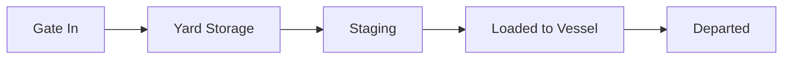
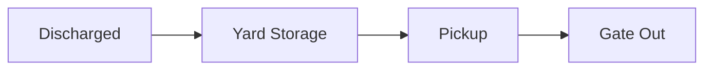
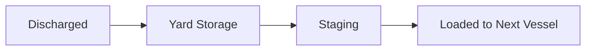
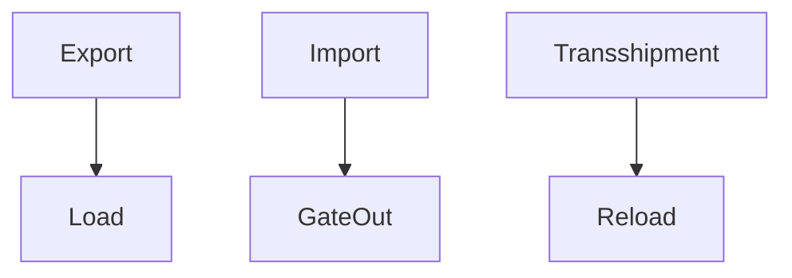

## Summary

This document defines **canonical end-to-end container flows** within a terminal:
- Export flow
- Import flow
- Transshipment flow

It links:
- lifecycle state transitions
- operational events
- equipment moves
- economic charge points

---

## Why this matters for simulation and gameplay

These flows are the **core gameplay loops**.

If wrong:
- operations feel random
- economy has no structure
- planning decisions don’t matter

If right:
- each container follows a believable journey
- delays have consequences
- revenue emerges naturally from activity

---

## Key definitions and vocabulary

- **Import container**  
  Arrives by vessel, leaves by truck/rail

- **Export container**  
  Arrives by truck/rail, leaves by vessel

- **Transshipment container**  
  Arrives and departs by vessel

- **Move**  
  A physical handling action (crane, truck, yard)

- **Value event**  
  A point where cost or revenue is generated

---

## Scope boundaries

### Included
- core terminal flows
- state transitions
- move types
- economic events

### Excluded
- shipping line contracts
- inland logistics beyond gate

---

## Key attributes and dimensions

### Flow object

```json
{
  "container_id": "string",
  "flow_type": "import | export | transshipment",
  "events": ["event_id"],
  "moves": ["move_id"],
  "charges": ["charge_id"]
}
```

---

## Rules, constraints, and algorithms

## 1. Export flow



### Sequence
1. Gate in
2. Yard placement
3. Rehandle (optional)
4. Move to quay
5. Load

---

## 2. Import flow



### Sequence
1. Discharge from vessel
2. Yard placement
3. Wait (dwell)
4. Pickup by truck
5. Gate out

---

## 3. Transshipment flow



---

## 4. Move types

| Move | Description |
|------|------------|
| Discharge | Vessel → quay |
| Load | Quay → vessel |
| Yard Move | Yard crane reposition |
| Horizontal | Truck/AGV movement |
| Rehandle | Move blocking container |

---

## 5. Economic value events

### Typical charge points

| Event | Charge Type |
|------|------------|
| Gate in | Handling fee |
| Discharge | Lift charge |
| Yard storage | Storage fee (per day) |
| Load | Lift charge |
| Rehandle | Extra move fee |
| Gate out | Handling fee |
| Exception | Penalty |

---

## 6. Storage charging logic

```pseudo
if dwell_days > free_days:
  storage_fee = (dwell_days - free_days) * rate
```

---

## 7. Rehandle cost

```pseudo
if container_blocked:
  perform_rehandle()
  add_cost()
```

---

## Standards and authoritative references

- UN/EDIFACT (BAPLIE, COPRAR, COARRI, CODECO)
- Port tariff structures
- Terminal operating procedures

---

## Example outputs

### Export event log

```json
[
  {"event": "GATE_IN", "time": "08:00"},
  {"event": "YARD_GROUNDED", "time": "08:20"},
  {"event": "QC_LOAD", "time": "12:00"}
]
```

### Import event log

```json
[
  {"event": "DISCHARGED", "time": "06:00"},
  {"event": "YARD_GROUNDED", "time": "06:30"},
  {"event": "GATE_OUT", "time": "14:00"}
]
```

---

## Data schemas

```json
{
  "flows": [
    {
      "container_id": "string",
      "flow_type": "string",
      "events": []
    }
  ]
}
```

---

## Sample data

### YAML

```yaml
flow:
  container_id: MSKU1234567
  flow_type: export
  events:
    - GATE_IN
    - YARD
    - LOAD
```

---

## Visualisation guidance

### Combined flow map



---

## 3D rendering notes

- animate container moving across zones
- show yard dwell visually
- highlight bottlenecks

---

## Validation checklist

- [ ] flows defined for import/export/transshipment
- [ ] state transitions consistent
- [ ] move types mapped
- [ ] economic events defined
- [ ] supports delays and exceptions

---

## Open questions

- pricing model sophistication
- dynamic tariffs
- integration with shipping line economics
