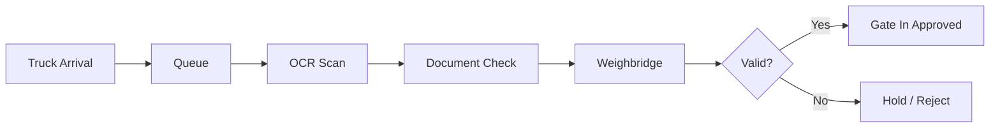
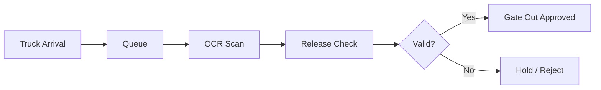
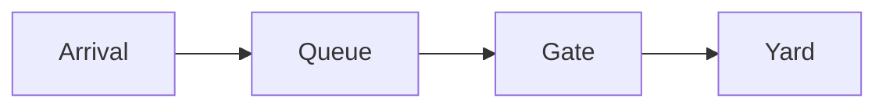
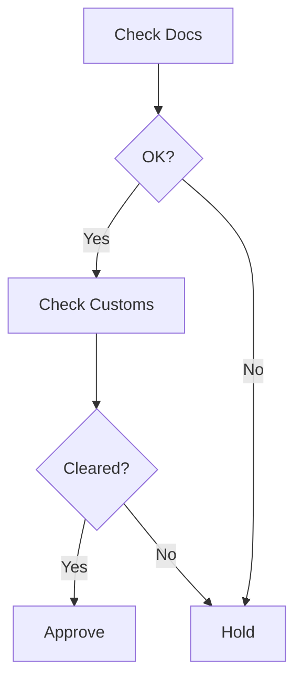

## Summary

This document defines **gatehouse processes** for container terminals.

It covers:
- in-gate and out-gate workflows
- document and security validation
- hold/release decision logic
- automation systems (OCR, kiosks, weighbridges)
- failure modes and exception handling

The gate is the **control point** of the entire terminal. Nothing moves without passing it.

---

## Why this matters for simulation and gameplay

The gate is where:
- congestion starts
- documentation errors surface
- compliance rules are enforced

If simplified too much:
- trucks flow unrealistically
- holds never matter
- KPIs become meaningless

If modelled properly:
- queues emerge naturally
- bad data creates friction
- automation investments feel impactful

---

## Key definitions and vocabulary

- **Gatehouse**  
  Entry/exit control point for trucks and containers

- **Gate-in**  
  Truck enters terminal

- **Gate-out**  
  Truck exits terminal

- **Pre-advice**  
  Advance submission of container/truck details

- **Release**  
  Authorization for container to leave terminal

- **Hold**  
  Restriction preventing movement

- **OCR portal**  
  Automated system reading container numbers and truck plates

- **Weighbridge**  
  Scale measuring truck/container weight

- **Seal check**  
  Verification of container seal integrity

---

## Scope boundaries (what is included/excluded)

### Included
- gate workflows
- validation logic
- automation systems
- holds and releases
- queue behaviour at gate

### Excluded
- customs backend systems
- external logistics planning
- billing/payment systems

---

## Key attributes and dimensions (human-level data model)

### Gate transaction

```json
{
  "transaction_id": "string",
  "truck_id": "string",
  "container_id": "string",
  "direction": "in | out",
  "arrival_time": "datetime",
  "processed_time": "datetime",
  "status": "approved | rejected | hold",
  "lane": "string"
}
```

### Validation result

```json
{
  "container_id": "string",
  "valid_documents": true,
  "vgm_present": true,
  "seal_ok": true,
  "customs_clear": true,
  "result": "pass | hold | reject"
}
```

---

## Rules, constraints, and algorithms

## 1. Gate-in workflow



---

## 2. Gate-out workflow



---

## 3. Validation logic

```pseudo
function validate_gate(container):
  if not documents_ok:
    return HOLD

  if not customs_clear:
    return HOLD

  if vgm_required and not vgm_present:
    return HOLD

  if seal_required and seal_broken:
    return EXCEPTION

  return PASS
```

---

## 4. Hold and release logic

### Common hold reasons
- customs hold
- missing documentation
- unpaid fees (optional)
- VGM missing or invalid
- hazardous approval missing
- seal discrepancy

### Release condition

```pseudo
if all_checks_pass:
  allow_movement()
else:
  block_movement()
```

---

## 5. Automation vs manual processing

### Manual gate
- slower processing time
- higher error rate
- more variability

### Automated gate
- OCR identifies container/truck
- kiosk handles driver interaction
- weighbridge captures weight
- faster throughput

### Simulation parameter

```json
{
  "gate_type": "manual | semi_automated | automated",
  "processing_time_seconds": 30-180
}
```

---

## 6. Failure modes

- OCR misread container ID
- system downtime
- incorrect pre-advice data
- truck arrives without booking
- container mismatch

```pseudo
if ocr_confidence < threshold:
  send_to_manual_lane()
```

---

## Standards and authoritative references to confirm

- UN/EDIFACT CODECO (gate-in/gate-out messages)
- SOLAS VGM rules
- ISO 17712 (container seals)
- ISPS Code (security controls)
- Terminal automation practices

---

## Example outputs to include

### Hold decision table

| Condition | Result |
|----------|--------|
| Missing docs | HOLD |
| Customs not cleared | HOLD |
| VGM missing | HOLD |
| Seal broken | EXCEPTION |
| All valid | PASS |

---

## Data schemas

```json
{
  "gate_events": [
    {
      "event_type": "GATE_IN | GATE_OUT",
      "time": "datetime",
      "container_id": "string"
    }
  ]
}
```

---

## Sample data

### JSON

```json
{
  "transaction_id": "GT123",
  "truck_id": "TRK001",
  "container_id": "MSKU1234567",
  "direction": "in",
  "arrival_time": "2026-03-26T08:00:00Z",
  "processed_time": "2026-03-26T08:05:00Z",
  "status": "approved"
}
```

### YAML

```yaml
transaction:
  id: GT456
  truck_id: TRK002
  container_id: CMAU7654321
  direction: out
  arrival_time: 2026-03-26T09:00:00Z
  processed_time: 2026-03-26T09:04:00Z
  status: hold
```

---

## Visualisation guidance

### Gate flow



### Decision tree



---

## 3D rendering notes

- animate trucks queuing at gate
- show gate lanes with processing
- visualise OCR portals and barriers
- highlight trucks on hold (colour change)

---

## Validation checklist

- [ ] gate-in and gate-out flows defined
- [ ] validation logic consistent
- [ ] holds block movement
- [ ] automation impacts processing time
- [ ] failure modes included
- [ ] integrates with truck lifecycle

---

## Open questions and research backlog

- integrate biometric/driver ID systems
- dynamic lane allocation
- predictive gate congestion
- advanced OCR error modelling
