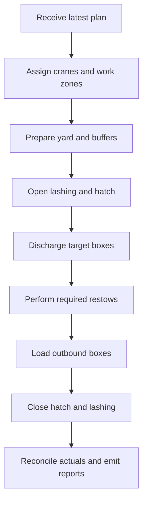
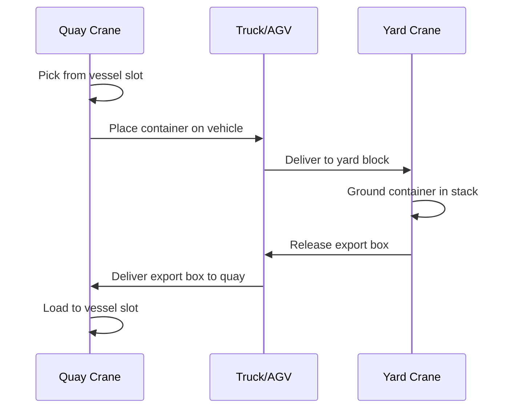
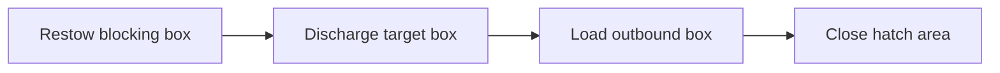

## Summary

This document defines **simulation-ready vessel loading and unloading operations** for a container terminal.

It covers:
- discharge and load execution at vessel-call level
- sequencing logic from discharge list or load list to actual move sequence
- explicit restow types and their operational impact
- quay crane, horizontal transport, and yard crane coordination
- move states, event logs, bottlenecks, and practical KPIs

It is intended to support:
- vessel call execution simulation
- terminal planning and dispatch systems
- game mechanics around congestion, poor planning, and recovery
- event-driven operational dashboards

This file sits between:
- vessel stowage plans and voyage manifests
- equipment models such as STS cranes, terminal trucks, AGVs, and yard cranes
- container state transitions and yard operations

---

## Why this matters for simulation and gameplay

A terminal is not just “put box on ship” and “take box off ship”.

Real operations are constrained by:
- what has to come off first
- what is blocked below other boxes
- which bay a crane can reach
- whether a truck or AGV is actually available
- whether the receiving yard block can absorb the box
- whether the planned load sequence keeps the vessel stable and the port call on schedule

Without modelling these dependencies:
- cranes behave like magic teleport devices
- yard congestion does not matter
- restows disappear
- vessel calls are reduced to a single progress bar, which is frankly a bit pathetic

With a good model:
- discharge sequences matter
- bad yard prep causes crane waiting
- load plans compete with stability, cut-offs, and slot constraints
- missed handoffs and equipment shortages create believable delays
- the player or AI can trade off speed, reshuffles, congestion, and risk

---

## Key definitions and vocabulary

- **Vessel call**  
  A single visit by a vessel at a terminal, including arrival, berth, cargo operations, and departure.

- **Discharge**  
  Removing containers from the vessel to the terminal system.

- **Load**  
  Placing containers from the terminal system onto the vessel.

- **Restow**  
  Moving a container not because it belongs at the current port, but because it blocks access or must be repositioned for later operations.

- **Ship restow / onboard restow**  
  Restow where the box is moved from one vessel slot to another and never truly leaves vessel operational ownership, even if a quay crane cycle and temporary placement are involved.

- **Quay restow / temporary landing restow**  
  Restow where a box is landed temporarily on quay transport or buffer area, then reloaded.

- **STS / QC / Quay crane**  
  Ship-to-shore crane used to discharge and load containers.

- **Horizontal transport**  
  Equipment moving containers between quay crane and yard, such as terminal tractors, trailers, AGVs, or straddle carriers.

- **Yard crane / YC**  
  Equipment serving the yard stack, such as RTG, RMG, ASC, or straddle carrier stacking system.

- **Move order / move instruction**  
  Planned sequence telling equipment what to pick and where to place it.

- **Discharge list**  
  List of containers to be removed at the current call.

- **Load list**  
  List of containers planned to be loaded at the current call.

- **Bay work**  
  Cargo handling in a specific vessel bay or hatch area.

- **Hatch sequence**  
  Operational order in which under-deck areas are opened and worked.

- **Crane split**  
  Assignment of vessel work zones to multiple quay cranes.

- **Gross crane rate**  
  Moves per hour measured over all elapsed crane time.

- **Net crane rate**  
  Moves per hour measured over working time excluding agreed interruptions.

- **Berth productivity / berth moves per hour**  
  Aggregate move rate across all cranes on the vessel.

---

## Scope boundaries (what is included/excluded)

### Included
- discharge, load, and restow operational logic
- sequencing rules at bay, stack, and crane-cycle level
- interaction between quay crane, horizontal transport, and yard crane
- event model for vessel-call execution
- simplified productivity and bottleneck modelling
- practical assumptions for simulation-grade operations

### Excluded
- detailed labour agreements or local union rules
- exact crane kinematics and PLC-level control
- full EDI segment specifications for every message
- financial charging models for operational delays
- detailed customs, security, or hazardous-cargo legal workflows beyond how they affect moves

---

## Key attributes and dimensions (human-level data model)

A vessel-call execution model should separate the **plan**, the **resources**, the **move queue**, and the **actuals**.

### 1. Vessel call context
- `vessel_call_id`
- `vessel_id`
- `voyage_id`
- `terminal_id`
- `berth_id`
- `eta`
- `ata`
- `etd`
- `atd`
- `berth_window_start`
- `berth_window_end`
- `work_start_planned`
- `work_start_actual`
- `work_end_planned`
- `work_end_actual`

### 2. Cargo work programme
- `planned_discharge_count`
- `planned_load_count`
- `planned_restow_count`
- `discharge_lists[]`
- `load_lists[]`
- `hatch_sequences[]`
- `crane_splits[]`
- `bay_priorities[]`
- `plan_version`
- `plan_status`

### 3. Resource assignments
- `assigned_quay_cranes[]`
- `assigned_horizontal_transport_pool[]`
- `assigned_yard_cranes[]`
- `yard_buffers[]`
- `quay_buffers[]`
- `shift_windows[]`

### 4. Move object
Each executable move should have:
- `move_id`
- `move_type`
- `container_id`
- `source_kind`
- `source_location`
- `destination_kind`
- `destination_location`
- `planned_start_time`
- `planned_end_time`
- `actual_start_time`
- `actual_end_time`
- `assigned_qc`
- `assigned_horizontal_transport`
- `assigned_yc`
- `prerequisite_move_ids[]`
- `blocking_move_ids[]`
- `reason_code`
- `status`

### 5. Suggested move types
- `discharge_to_yard`
- `discharge_to_quay_buffer`
- `discharge_direct_to_truck`
- `discharge_direct_to_rail`
- `load_from_yard`
- `load_from_quay_buffer`
- `load_direct_from_truck`
- `load_direct_from_rail`
- `onboard_restow`
- `quay_restow`
- `hatch_cover_remove`
- `hatch_cover_replace`
- `lashing_open`
- `lashing_close`
- `inspection_hold_move`
- `exception_rehandle`

### 6. State fields
- `call_state`
- `work_state`
- `move_completion_pct`
- `qc_wait_reason`
- `yard_wait_reason`
- `transport_wait_reason`
- `delay_minutes`
- `dominant_bottleneck`

### 7. Timing fields that matter to simulation
- crane cycle time
- travel time quay-to-yard
- yard crane service time
- buffer dwell time
- lashing / unlashing time
- hatch change time
- shift change interruption
- weather slowdown factor
- rehandle penalty factor

---

## Rules, constraints, and algorithms (include simplified simulation models)

## 1. High-level vessel call execution order

A practical high-level execution flow is:

1. receive or refresh vessel plan and work orders  
2. assign berth and quay cranes  
3. prepare yard receiving areas and load stacks  
4. open hatch / lashings as required  
5. discharge required boxes  
6. perform necessary restows  
7. load outbound boxes  
8. close hatch / lashings as required  
9. reconcile actuals and report completion

Simplified control flow:

```pseudo
if vessel_arrived and berth_available:
  berth_vessel()

load_plan = latest_plan_version()
prepare_resources(load_plan)

for work_zone in crane_splits:
  execute_discharge_phase(work_zone)
  execute_restow_phase(work_zone)
  execute_load_phase(work_zone)

finalise_call()
emit_actuals()
```

This is a simplification. Real terminals may interleave discharge and loading by bay or hatch to optimise crane travel, vessel stability, yard readiness, and departure risk.

---

## 2. Discharge list processing and sequencing

The discharge list tells the terminal which containers must come off at the current port. In practice, the actual move sequence is constrained by stack geometry.

### Core rule
A target box cannot be discharged until every box above it in that stack has been removed or temporarily repositioned.

```pseudo
function discharge_sequence_for_stack(stack, current_port):
  sequence = []

  for slot from top to bottom:
    container = stack[slot]
    if container.pod == current_port:
      sequence.append(("discharge", container))
    elif exists target_below(container, current_port):
      sequence.append(("restow", container))
    else:
      continue

  return sequence
```

### Simulation consequences
- the discharge list is not the move sequence
- deep target boxes create restows
- higher yard congestion can make early discharge faster but restow recovery slower

### Practical assumptions to record
- top-down rule is absolute for cellular stacks
- under-deck work may require hatch opening and lashing operations first
- some terminals prioritise full bay discharge before full load in the same zone, others interleave where operationally advantageous

---

## 3. Restows as explicit move types

Restows are a major source of delay and should be first-class entities in the simulation.

### Distinguish at least these two
#### Onboard restow
Container is shifted from one slot to another on the same vessel.

#### Quay restow
Container is temporarily landed onto a horizontal vehicle, quay position, or buffer, then later reloaded.

### Suggested rules

```pseudo
if blocking_container.pod != current_port and target_below_current_port:
  if alternate_safe_slot_available_on_vessel:
    create_move(type="onboard_restow")
  else:
    create_move(type="quay_restow")
```

### Restow penalties
- consumes crane time without reducing local discharge count
- uses transport and possibly yard/quay buffer capacity
- may create later reload dependency
- can disrupt stability and bay balance if handled badly

### Important gameplay point
Restows are not just “wasted moves”. They are the price of imperfect stowage planning, multi-port rotations, and operational reality.

---

## 4. Load sequencing strategies

Loading is not “grab nearest export box and chuck it aboard”. A believable model should choose one or more strategies.

### Common strategic objectives
- meet final stowage plan
- protect vessel stability
- minimise late rehandles
- avoid burying earlier-discharge boxes under later-port boxes
- respect reefer, dangerous goods, weight, and stack constraints
- keep crane fed with boxes at the right tempo

### Useful simplified strategies
#### Strategy A: slot-first
Follow the vessel plan slot by slot in bay order.

Pros:
- simple
- aligns closely to final stowage plan

Cons:
- can starve the crane if required boxes are not pre-marshalled

#### Strategy B: yard-readiness weighted
Prefer boxes already available in the correct yard sequence, but only within slot and stability tolerances.

Pros:
- smoother crane productivity

Cons:
- can drift from optimal final stowage if not constrained

#### Strategy C: hatch/bay batching
Load by work zone or hatch block to minimise crane travel and hatch changes.

Pros:
- operationally efficient

Cons:
- may require careful yard pre-marshalling

### Simplified loading priority score

```pseudo
priority_score =
  slot_urgency * 5 +
  current_bay_active * 4 +
  yard_ready * 4 +
  low_truck_travel_time * 2 +
  stability_fit * 5 +
  no_future_rehandle_risk * 4 +
  reefer_deadline * 3 +
  dg_window_priority * 3
```

---

## 5. Coordination constraints: quay crane, transport, and yard crane

This is the bit that often gets hand-waved. Do not hand-wave it.

A quay crane cannot sustain its theoretical rate unless:
- a vehicle arrives on time under the crane
- a destination is ready in the yard or quay buffer
- a yard crane can receive or release the box
- the box is actually available and not buried behind yard reshuffles

### Simple dependency model

#### For discharge
`QC -> transport -> YC/buffer`

#### For load
`YC/buffer -> transport -> QC`

### Constraint rules

```pseudo
if no_transport_available_at_qc_pick_time:
  qc_wait_reason = "no_horizontal_transport"
  delay_move()

if load_move and yard_crane_not_ready:
  qc_wait_reason = "yard_not_ready"
  delay_move()

if discharge_move and destination_block_full:
  qc_wait_reason = "no_receiving_capacity"
  delay_move()
```

### Important modelling assumption
The slowest of the three linked resources often determines throughput:
- quay crane
- horizontal transport pool
- yard crane / stack availability

For a simple simulation, use:
```pseudo
effective_move_rate = min(qc_service_rate, transport_cycle_rate, yard_service_rate)
```

For a richer simulation, model each leg explicitly with queues and event times.

### Decoupled vs coupled systems
PEMA notes that in some automated or straddle-based layouts, waterside cycles can be more decoupled from horizontal transport by using ground buffers or self-contained transfer patterns. This matters because some terminal designs allow the quay crane and yard crane to operate less tightly locked to each other than others.

Simulation knob:
- `operation_coupling_mode = tightly_coupled | buffered | decoupled`

---

## 6. Crane cycle model

A useful abstraction for quay crane work is a cycle-based model.

### Discharge cycle
1. crane positions on vessel slot
2. picks container
3. hoists and trolley-travels landside
4. places container on vehicle or buffer
5. confirms handoff
6. returns to next pick

### Load cycle
1. receives box from vehicle or buffer
2. trolley-travels waterside
3. lowers box to vessel slot
4. confirms slot placement
5. returns to landside

### Simplified cycle-time calculation

```pseudo
qc_cycle_seconds =
  base_pick_place_time +
  trolley_travel_time +
  hoist_time +
  handoff_time +
  exception_penalty +
  hatch_or_lashing_penalty
```

### Gross and net performance
UNCTAD notes that container-terminal output is commonly expressed in containers per gross or net crane hour. A simulation should track both:
- **gross rate** includes interruptions
- **net rate** excludes agreed non-working periods or defined stoppages

Suggested outputs:
- `qc_net_moves_per_hour`
- `qc_gross_moves_per_hour`
- `berth_moves_per_hour`
- `truck_turnaround_impact_minutes`

---

## 7. Hatch, lashing, and work-zone transitions

These are often forgotten and then people wonder why their simulated crane is superhuman.

### Add at least these auxiliary move types
- `open_lashing`
- `remove_hatch_cover`
- `replace_hatch_cover`
- `close_lashing`

### Rule examples

```pseudo
if target_slot.deck_zone == "under_deck" and hatch_not_open:
  enqueue("remove_hatch_cover")
  enqueue("open_lashing")
```

```pseudo
if underdeck_work_complete and no_more_moves_for_hatch:
  enqueue("replace_hatch_cover")
  enqueue("close_lashing")
```

### Gameplay consequence
Changing from on-deck to under-deck work should create setup costs and encourage sensible batching by bay or hatch.

---

## 8. Yard implications of loading strategy

Load plans are only executable if the yard is prepared.

### Key yard-side effects
- export stacks may need pre-marshalling
- transshipment stacks may need reshuffles
- reefer exports may need timed pull to avoid long powerless dwell if disconnected
- dangerous goods exports may have documentation or segregation-release dependencies
- direct truck or rail loads need timing coordination with the berth window

### Simplified yard readiness function

```pseudo
yard_ready(container) =
  in_correct_block and
  no_holds and
  accessible_without_extra_reshuffle and
  transport_available and
  departure_window_valid
```

If `yard_ready == false`, either:
- insert preparatory yard moves, or
- delay the vessel move

This is how poor yard organisation becomes vessel delay, which is exactly the kind of chain reaction worth simulating.

---

## 9. Direct interchange moves

Some boxes do not touch the yard in the usual way.

### Direct discharge
- vessel -> truck
- vessel -> rail
- vessel -> inspection area

### Direct load
- truck -> vessel
- rail -> vessel
- inspection release -> vessel

Use these when:
- the timing window aligns
- equipment and paperwork are ready
- terminal policy allows it

### Simplified rule

```pseudo
if direct_mode_requested and receiving_party_present and time_window_open:
  move_type = "direct_interchange"
else:
  move_type = "via_yard"
```

Direct moves reduce yard dwell but increase timing risk. Miss the window and the box ends up in normal storage anyway.

---

## 10. Event model for vessel call operations

An event-driven model is strongly recommended.

### Suggested event families
- vessel call events
- crane events
- transport events
- yard events
- cargo move events
- exception events

### Example event types
- `VESSEL_BERTHED`
- `WORK_STARTED`
- `HATCH_OPENED`
- `MOVE_PLANNED`
- `QC_PICKED_FROM_VESSEL`
- `QC_PLACED_ON_TRUCK`
- `TRUCK_ARRIVED_YARD`
- `YC_GROUNDED_CONTAINER`
- `RESTOW_CREATED`
- `LOAD_BOX_NOT_READY`
- `QC_WAITING_NO_TRUCK`
- `MOVE_COMPLETED`
- `WORK_COMPLETED`
- `COARRI_CONFIRMED`

### Event projection principle
Do not just mutate aggregate counters invisibly. Emit move-level events, then roll them up into call KPIs and container state changes.

---

## 11. Good-enough simulation algorithms

### Algorithm A: discharge list to move sequence

```pseudo
function build_discharge_moves(vessel, current_port):
  moves = []

  for each stack in vessel.stacks:
    for each box from top_to_bottom(stack):
      if box.pod == current_port:
        moves.append(discharge_move(box))
      elif exists discharge_target_below(stack, box, current_port):
        moves.append(restow_move(box))

  return sequence_by_bay_and_priority(moves)
```

### Algorithm B: load plan execution

```pseudo
function build_load_moves(load_list, vessel_plan, yard):
  moves = []

  for each slot in vessel_plan.required_slots:
    candidate = select_best_container_for_slot(slot, load_list, yard)
    if candidate != null:
      moves.append(load_move(candidate, slot))
    else:
      moves.append(exception_move("slot_unfilled", slot))

  return optimise_by_crane_split(moves)
```

### Algorithm C: coupled resource execution

```pseudo
for each planned_move in time_order:
  wait_until(qc_available and transport_available and downstream_ready)

  start_move()
  consume_resources()
  complete_move()
  emit_events()

  if exception:
    create_delay_or_rehandle()
```

---

## Standards and authoritative references to confirm (edition/year, what to verify)

- **UN/EDIFACT COPRAR**  
  Confirm that COPRAR is the container discharge/loading order message used between trading partners involved in transport operations. Use it as the simulation analogue for load/discharge work orders.

- **UN/EDIFACT COARRI**  
  Confirm that COARRI is the container discharge/loading report message used to report what was actually loaded or discharged, including exceptions such as short-landed or over-landed cases.

- **SMDG guidance for BAPLIE / MOVINS / related container messages**  
  Confirm the practical division of message roles:
  - BAPLIE for bayplan / stowage state
  - MOVINS for vessel move or stowage instructions
  - COPRAR for ordered cargo work
  - COARRI for operational actuals

- **DCSA Load List and Bay Plan Definitions**  
  Confirm the standardised communication concept for container volumes and stowage details between VSA partners, terminals, and ports, including messaging timeline and version-handling expectations.

- **DCSA operational visibility / port-call guidance**  
  Confirm event terminology useful for vessel-call execution visibility and cutover points between plan and execution.

- **UNCTAD productivity references**  
  Confirm terminology around gross crane hour, net crane hour, and berth productivity to keep KPIs grounded.

- **PEMA terminal automation guidance**  
  Confirm when waterside operations are tightly coupled versus buffered or decoupled by the chosen equipment system.

---

## Example outputs to include (tables, diagrams, sample data)

### Table: move types and effects on state

| Move type | Typical source | Typical destination | Changes container state | Consumes QC | Consumes transport | Consumes YC/buffer |
|---|---|---|---|---|---|---|
| `discharge_to_yard` | vessel slot | yard slot | `on_vessel -> in_yard` | yes | yes | yes |
| `discharge_direct_to_truck` | vessel slot | truck | `on_vessel -> on_truck` | yes | optional terminal-side | no yard if truly direct |
| `load_from_yard` | yard slot | vessel slot | `in_yard -> on_vessel` | yes | yes | yes |
| `onboard_restow` | vessel slot | vessel slot | remains `on_vessel` | yes | maybe no external transport in simplified model | no |
| `quay_restow` | vessel slot | quay buffer then vessel | remains `on_vessel` after completion | yes | yes | buffer dependent |
| `hatch_cover_remove` | hatch | temporary position | no container state change | auxiliary | maybe | maybe |

### Worked example: discharge list to move sequence

#### Initial simplified on-deck stack in bay 034 row 10
Top to bottom:
1. `C1` POD = next_port
2. `C2` POD = current_port
3. `C3` POD = current_port

#### Generated move sequence
1. restow `C1`
2. discharge `C2`
3. discharge `C3`
4. reload `C1` if quay restow, or leave in new onboard slot if onboard restow

This shows why a discharge list is not enough on its own.

### Example outputs for downstream tooling
- per-crane move queue
- vessel call execution plan
- restow heatmap by bay
- bottleneck timeline
- actual vs planned move report
- exception board by wait reason
- COARRI-style actual completion feed

---

## Data schemas (JSON Schema references or in-file fragments)

### Vessel call execution schema fragment

```json
{
  "$schema": "https://json-schema.org/draft/2020-12/schema",
  "$id": "vessel-call-execution.schema.json",
  "title": "VesselCallExecution",
  "type": "object",
  "required": ["vessel_call_id", "vessel_id", "voyage_id", "move_plan"],
  "properties": {
    "vessel_call_id": { "type": "string" },
    "vessel_id": { "type": "string" },
    "voyage_id": { "type": "string" },
    "berth_id": { "type": "string" },
    "assigned_quay_cranes": {
      "type": "array",
      "items": { "type": "string" }
    },
    "operation_coupling_mode": {
      "type": "string",
      "enum": ["tightly_coupled", "buffered", "decoupled"]
    },
    "move_plan": {
      "type": "array",
      "items": {
        "type": "object",
        "required": ["move_id", "move_type", "container_id", "source_location", "destination_location", "status"],
        "properties": {
          "move_id": { "type": "string" },
          "move_type": {
            "type": "string",
            "enum": [
              "discharge_to_yard",
              "discharge_to_quay_buffer",
              "discharge_direct_to_truck",
              "load_from_yard",
              "load_from_quay_buffer",
              "load_direct_from_truck",
              "onboard_restow",
              "quay_restow",
              "hatch_cover_remove",
              "hatch_cover_replace",
              "lashing_open",
              "lashing_close",
              "exception_rehandle"
            ]
          },
          "container_id": { "type": "string" },
          "source_location": { "type": "string" },
          "destination_location": { "type": "string" },
          "assigned_qc": { "type": "string" },
          "assigned_transport": { "type": "string" },
          "assigned_yc": { "type": "string" },
          "planned_start_time": { "type": "string", "format": "date-time" },
          "planned_end_time": { "type": "string", "format": "date-time" },
          "actual_start_time": { "type": "string", "format": "date-time" },
          "actual_end_time": { "type": "string", "format": "date-time" },
          "prerequisite_move_ids": {
            "type": "array",
            "items": { "type": "string" }
          },
          "status": {
            "type": "string",
            "enum": ["planned", "ready", "waiting", "in_progress", "completed", "failed", "cancelled"]
          },
          "wait_reason": { "type": "string" }
        }
      }
    }
  }
}
```

### Vessel call event log fragment

```json
{
  "$schema": "https://json-schema.org/draft/2020-12/schema",
  "$id": "vessel-call-event-log.schema.json",
  "title": "VesselCallEventLog",
  "type": "object",
  "required": ["vessel_call_id", "events"],
  "properties": {
    "vessel_call_id": { "type": "string" },
    "events": {
      "type": "array",
      "items": {
        "type": "object",
        "required": ["event_time", "event_type"],
        "properties": {
          "event_time": { "type": "string", "format": "date-time" },
          "event_type": { "type": "string" },
          "container_id": { "type": "string" },
          "equipment_id": { "type": "string" },
          "location": { "type": "string" },
          "details": { "type": "object" }
        }
      }
    }
  }
}
```

---

## Sample data (JSON and YAML)

### JSON

```json
{
  "vessel_call_id": "CALL-GBFXT-118W-01",
  "vessel_id": "VESSEL-MSK-ALPHA",
  "voyage_id": "VOY-MSK-118W",
  "berth_id": "BERTH-03",
  "assigned_quay_cranes": ["QC-01", "QC-02"],
  "operation_coupling_mode": "tightly_coupled",
  "move_plan": [
    {
      "move_id": "M-0001",
      "move_type": "quay_restow",
      "container_id": "MSKU1111111",
      "source_location": "034/10/86",
      "destination_location": "QUAY-BUFFER-A1",
      "assigned_qc": "QC-01",
      "assigned_transport": "TT-14",
      "assigned_yc": "",
      "planned_start_time": "2026-03-26T08:10:00Z",
      "planned_end_time": "2026-03-26T08:16:00Z",
      "actual_start_time": "",
      "actual_end_time": "",
      "prerequisite_move_ids": [],
      "status": "planned",
      "wait_reason": ""
    },
    {
      "move_id": "M-0002",
      "move_type": "discharge_to_yard",
      "container_id": "MSKU2222222",
      "source_location": "034/10/84",
      "destination_location": "YARD-C3-04-02",
      "assigned_qc": "QC-01",
      "assigned_transport": "TT-09",
      "assigned_yc": "RTG-C3",
      "planned_start_time": "2026-03-26T08:16:00Z",
      "planned_end_time": "2026-03-26T08:23:00Z",
      "actual_start_time": "",
      "actual_end_time": "",
      "prerequisite_move_ids": ["M-0001"],
      "status": "planned",
      "wait_reason": ""
    },
    {
      "move_id": "M-0003",
      "move_type": "load_from_yard",
      "container_id": "MSKU3333333",
      "source_location": "YARD-E2-08-03",
      "destination_location": "034/12/82",
      "assigned_qc": "QC-01",
      "assigned_transport": "TT-22",
      "assigned_yc": "RTG-E2",
      "planned_start_time": "2026-03-26T08:24:00Z",
      "planned_end_time": "2026-03-26T08:31:00Z",
      "actual_start_time": "",
      "actual_end_time": "",
      "prerequisite_move_ids": ["M-0002"],
      "status": "planned",
      "wait_reason": ""
    }
  ]
}
```

### YAML

```yaml
vessel_call_id: CALL-GBFXT-118W-01
vessel_id: VESSEL-MSK-ALPHA
voyage_id: VOY-MSK-118W
berth_id: BERTH-03
assigned_quay_cranes:
  - QC-01
  - QC-02
operation_coupling_mode: buffered

move_plan:
  - move_id: M-0101
    move_type: discharge_to_yard
    container_id: CMAU4444444
    source_location: 018/06/84
    destination_location: YARD-B1-03-05
    assigned_qc: QC-02
    assigned_transport: AGV-07
    assigned_yc: ASC-B1
    planned_start_time: "2026-03-26T09:00:00Z"
    planned_end_time: "2026-03-26T09:06:30Z"
    actual_start_time: ""
    actual_end_time: ""
    prerequisite_move_ids: []
    status: ready
    wait_reason: ""

  - move_id: M-0102
    move_type: onboard_restow
    container_id: CMAU5555555
    source_location: 018/06/82
    destination_location: 020/08/82
    assigned_qc: QC-02
    assigned_transport: ""
    assigned_yc: ""
    planned_start_time: "2026-03-26T09:06:30Z"
    planned_end_time: "2026-03-26T09:11:00Z"
    actual_start_time: ""
    actual_end_time: ""
    prerequisite_move_ids:
      - M-0101
    status: planned
    wait_reason: ""
```

---

## Visualisation guidance

### Mermaid diagrams

#### 1. Vessel call execution plan



#### 2. Swimlanes: quay crane, transport, yard



#### 3. Move dependency example



### UI/dashboard widgets where relevant

Useful widgets:
- vessel call gantt by crane
- move queue by work zone and status
- restow counter by bay
- real-time bottleneck board by wait reason
- QC productivity panel: gross, net, and berth moves per hour
- yard readiness panel for pending load boxes
- exception feed: no truck, no yard slot, box not ready, hatch delay
- plan vs actual move variance view

---

## 3D rendering notes (scale, dimensions, textures/markings)

This topic is mostly operational rather than visual, but the scene should visibly communicate:
- which bays are active
- which crane is serving which work zone
- whether moves are discharge, load, or restow
- whether boxes are flowing smoothly or queues are forming

Recommended rendering hooks:
- highlight active bay/hatch zones
- animate crane trolley and hoist cycles distinctly for load vs discharge
- show truck or AGV queueing under cranes
- show temporary quay-buffer stacks for quay restows
- show yard congestion through queue length, blocked lanes, or occupied transfer points

For gameplay clarity:
- colour-code move intent
  - blue = discharge
  - green = load
  - amber = restow
  - red = blocked / exception
- display wait states above idle equipment so the player can see whether the bottleneck is crane-side, transport-side, or yard-side

---

## Validation checklist

- [ ] Discharge list is treated as an input, not as the exact executable move sequence
- [ ] Restows are represented explicitly and not hidden inside generic discharge counts
- [ ] Onboard restow and quay restow are distinct move types
- [ ] Load sequencing uses slot, readiness, and stability constraints
- [ ] Quay crane throughput depends on transport and yard availability, not just crane speed
- [ ] Hatch/lashing transitions create real time penalties
- [ ] Direct truck/rail interchange is modelled as optional and timing-sensitive
- [ ] Move-level events can reconstruct actual vessel-call execution
- [ ] KPIs distinguish gross crane rate, net crane rate, and berth productivity
- [ ] The model supports both tightly coupled and buffered/decoupled terminal designs

---

## Open questions and research backlog

- Add twin-lift, tandem-lift, and dual-cycle crane behaviour if equipment files later support it
- Add explicit hatch-cover handling resource constraints
- Extend load planning to include vessel stability scoring at move-batch level
- Add labour-shift and break constraints where relevant for realism modes
- Add weather degradation models for high wind, rain, or poor visibility
- Add short-landed, over-landed, and not-found exception handling aligned with COARRI-style actuals
- Define a standard library of yard-preparation strategies:
  - just-in-time pull
  - full pre-marshalling
  - bay-batched export staging
  - transshipment priority mode
- Extend direct truck and direct rail logic into appointment systems and rail window planning
