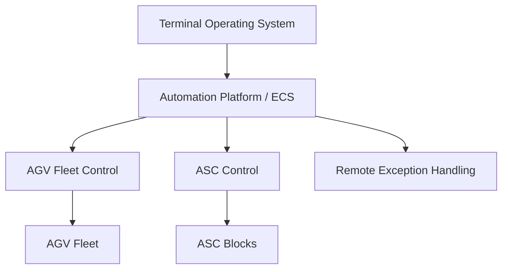
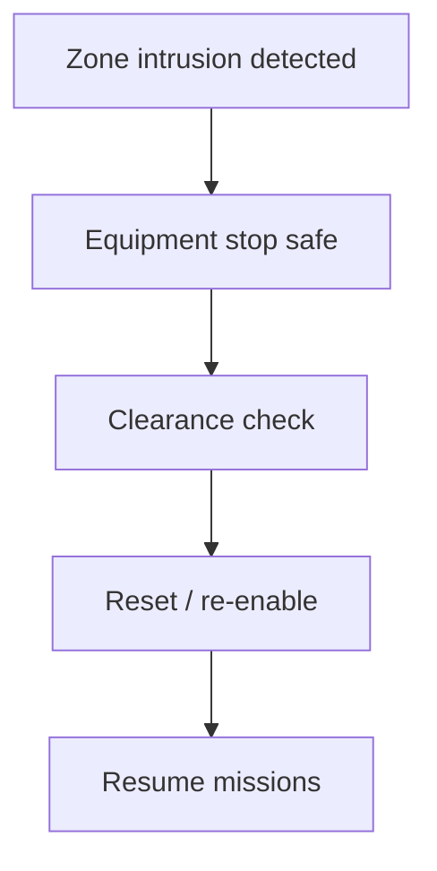

# Summary

This topic covers the main automation architectures used in container terminals, with emphasis on automated guided vehicles (AGVs), automated stacking cranes (ASCs), their orchestration layer, and the safety logic needed to simulate them credibly.

The dominant modern architecture for highly automated container terminals is an **automated yard** based on ASCs combined with an automated horizontal transport system such as AGVs, lift AGVs, automated shuttles, or automated straddles. Semi-automated terminals usually automate only part of the chain, most commonly the yard, while retaining manned transport or manned quay-crane operation. Fully automated terminals automate both yard handling and horizontal transport, while humans remain in supervisory, control-room, maintenance, and exception-handling roles.

For simulation and gameplay, automation should not be represented as a single on/off flag. It should be modelled as an architecture choice with consequences for:
- throughput variability
- labour reliance
- traffic control
- safety zoning
- exception handling
- capital cost
- resilience to disturbances
- data and control-system dependence

# Why this matters for simulation and gameplay

- It creates meaningful terminal archetypes:
  - conventional
  - semi-automated
  - highly automated
  - mixed brownfield retrofit
- It changes road rules, routing, and queue formation.
- It makes software orchestration a first-class operational system instead of an invisible black box.
- It enables strong trade-offs:
  - higher capital cost versus lower labour intensity
  - tighter safety separation versus lower flexibility
  - better consistency versus more brittle exception handling
- It supports rich failure modes:
  - zone intrusion
  - task deadlocks
  - AGV battery/charging bottlenecks
  - ASC handoff conflicts
  - automation degraded mode after sensor or comms loss

# Key definitions and vocabulary

- **Automation architecture**: The combination of equipment, control systems, and operating rules used to automate all or part of terminal operations.
- **Semi-automated terminal**: Terminal where some core handling steps are automated but others remain manned.
- **Fully automated terminal**: Terminal where the primary cargo-handling chain is automated, with humans mainly supervising, maintaining, or handling exceptions.
- **ASC (Automated Stacking Crane)**: Rail-mounted automated crane for stacking and retrieving containers in the yard.
- **AGV (Automated Guided Vehicle)**: Driverless vehicle used to transport containers between quay and yard or between yard interfaces.
- **Lift AGV / ALV**: Vehicle class that may be capable of self-lifting, reducing dependency on separate transfer pads in some layouts.
- **Horizontal transport**: Container movement between quay, yard, rail, or gate interfaces.
- **TOS (Terminal Operating System)**: System managing jobs, inventory, planning, and operational workflow.
- **ECS / automation platform / equipment control system**: Layer that dispatches and coordinates automated machines and interfaces with the TOS.
- **Handoff point / transfer point**: Controlled location where one machine or subsystem passes a container to another.
- **Safety envelope**: Reserved space and rule set around automated equipment movement and operating areas.
- **Separation zone**: Restricted area used to keep people or incompatible vehicles out of automated machine envelopes.
- **Remote operation / exception handling**: Human intervention used when automation cannot or should not proceed autonomously.
- **Degraded mode**: Reduced-capability operating mode after a fault, intrusion, loss of communications, or other disruption.

# Scope boundaries

## Included

- Automation architectures and levels
- AGV and ASC roles in the cargo flow
- Orchestration logic between TOS, automation platform, and equipment
- Safety envelopes and separation zones
- Fidelity levels for simulation
- Representative capability and constraint modelling

## Excluded

- Deep control-theory implementation
- Vendor-specific PLC or wireless protocol details
- Detailed labour relations or change-management programmes
- Full cyber-security design
- Detailed electrical infrastructure design except where it affects operations

# Key attributes and dimensions (human-level data model)

## 1. Automation architectures and why they exist

### A. Semi-automated terminal

A useful public distinction appears in both the OECD/ITF work and the METRANS study: a semi-automated terminal commonly has **automated stacking equipment in the yard** while **horizontal transport remains manned**, or otherwise automates only selected parts of the handling chain.

#### Typical characteristics

- Yard cranes automated or remotely supervised
- Terminal tractors, shuttles, or straddles still manned
- Quay cranes often manned, sometimes with automation-assist features
- More flexible mixed-traffic operation
- Easier brownfield retrofit path than full automation

#### Why it exists

- Lower integration complexity than full automation
- Better fit for existing terminals
- Avoids full separation of people and vehicles across the whole terminal
- Can capture some safety and consistency benefits without total redesign

#### Simulation implications

- Mixed road traffic
- Human-driven variability still matters
- Fewer hard exclusion zones outside automated yard blocks
- Yard throughput depends heavily on transfer-pad design and manned transport discipline

### B. Fully automated terminal

PEMA, OECD/ITF, and related literature describe fully automated terminals as those where **both horizontal transport and yard handling are automated**, with human roles concentrated in monitoring, maintenance, and exception handling.

#### Typical characteristics

- ASCs in the yard
- AGVs, lift AGVs, automated shuttles, or automated straddles for horizontal transport
- Strong segregation between automated areas and human access
- Central automation platform / ECS coordinating moves
- Heavy dependence on reliable comms, sensors, and exception workflows

#### Why it exists

- Higher labour-productivity potential
- Better repeatability and process control
- Stronger safety separation around heavy moving equipment
- Easier optimisation of tightly coupled machine cycles in greenfield layouts

#### Simulation implications

- Directed routes and reservation-controlled junctions
- More deterministic base cycle times
- Bigger penalties for exceptions and blocked zones
- Layout needs dedicated transfer areas and access control

### C. Mixed brownfield retrofit architecture

A common practical architecture is neither cleanly semi-automated nor fully automated. Brownfield terminals may automate the yard first, add remote-control or automation-assist functions, and retain manual tractors or straddles for some years.

#### Why it exists

- Existing civil layout limits AGV deployment
- Operators phase investment
- Labour, layout, and service commitments constrain abrupt change

#### Simulation implications

- Some blocks fully segregated, others mixed
- Safety rules change by zone
- Transport fleet may include both autonomous and human-driven vehicles
- Routing and dispatch must support compatibility rules by lane and zone

## 2. Core equipment architecture

A modern automated container terminal usually has three core machine layers:

1. **Quay-side handling**
   - STS cranes, often manned or semi-automated

2. **Horizontal transport**
   - AGVs, lift AGVs, automated shuttles, automated straddles, or manual shuttles/tractors

3. **Yard storage handling**
   - ASCs or other automated stacking equipment

### Canonical automated flow

```text
STS crane -> AGV handoff -> AGV line-haul -> ASC transfer point -> ASC stack or retrieve
```

### Canonical semi-automated flow

```text
STS crane -> manned shuttle / TT -> ASC transfer point -> ASC stack or retrieve
```

## 3. Representative AGV capabilities and constraints

OEM material and terminal-planning guidance support treating AGVs as:
- unmanned
- software-controlled
- route-constrained
- fleet-orchestrated
- dependent on safe segregation and dispatch control

### AGV capability model for simulation

| Attribute | Typical simulation meaning |
|---|---|
| payload_mode | single container or chassis/container transport depending on concept |
| max_speed_mps | free-flow speed on dedicated lanes |
| loaded_speed_factor | lower speed under load |
| acceleration_class | modest; heavy equipment |
| turning_constraint | wide, lane-dependent |
| battery_or_power_mode | battery, charging, or other energy model |
| docking_precision | ability to align at handoff positions |
| autonomy_zone_class | which lanes/zones the AGV may enter |
| obstacle_response | stop, reroute, call operator |
| communication_dependency | degraded mode on signal loss |

### Strong simulation assumptions

- AGVs do not improvise like human drivers.
- AGVs need explicit route permission and safe handoff states.
- AGV productivity comes from orchestration and traffic design, not heroic improvisation.

## 4. Representative ASC capabilities and constraints

Academic and industry material consistently treats the ASC yard as the prevailing automation model in modern robotised yards.

### ASC capability model for simulation

| Attribute | Typical simulation meaning |
|---|---|
| block_length_bays | stack length served by crane |
| rows_served | number of stack rows |
| tiers_served | stack height capability |
| crane_count_per_block | often one or two cranes per block depending on concept |
| landside_seaside_split | whether separate cranes or work zones exist |
| travel_speed | gantry movement along block |
| trolley_speed | cross-travel or trolley movement |
| hoist_speed | lift/lower capability |
| handoff_points | end or side transfer positions |
| remote_override | whether human intervention can complete exceptions |

### Important operational rule

Many automated-yard concepts divide work so that:
- one interface serves seaside vehicles
- another serves landside vehicles
- one or more ASCs share or divide the block spatially

A simple simulation should still model handoff queues and crane interference even if it does not model full control logic.

## 5. Orchestration layer

The automation platform sits between planning systems and machine execution. Kalmar's published materials describe an open automation platform approach, while OEM and terminal-planning material broadly treat this layer as the coordinator for dispatch, routing, and machine interfaces.

### Practical system split

- **TOS**
  - decides what needs to happen
  - tracks container inventory and work orders

- **Automation platform / ECS**
  - decides which machine does it
  - schedules and sequences tasks
  - manages routes, reservations, interlocks, and handoff permissions

- **Machine controller**
  - executes motion, sensing, braking, and local safety logic

### Simulation implication

Do not model automation as one monolithic brain. Use at least three layers:
1. planning
2. orchestration
3. local equipment execution

That produces believable failure modes.

# Rules, constraints, and algorithms

## 1. Automation level model

A simulation-ready automation scale:

### Level 0: manual
- all moves human-driven
- normal terminal roads
- no machine exclusion zones except ordinary safety areas

### Level 1: automation-assist
- some automated machine functions
- humans remain in direct operational control
- useful for assisted cranes, remote aids, lane guidance, stack-position automation

### Level 2: semi-automated yard
- ASCs automated
- horizontal transport mostly manned
- clearly controlled transfer zones at yard interfaces

### Level 3: highly automated terminal
- ASCs automated
- horizontal transport partially or mostly automated
- human access restricted in automated traffic zones
- exceptions handled by supervisors or remote operators

### Level 4: fully automated terminal
- normal cargo-handling chain automated end-to-end
- humans outside active operating areas except under controlled access
- remote intervention mainly for faults and recovery

### Simple rule

```text
automation_level determines:
  allowed_vehicle_classes_by_zone
  safety_separation_rules
  dispatch_algorithm_complexity
  expected_variability
  exception_frequency_penalty
```

## 2. AGV dispatch and routing rules

AGV systems are not just driverless tractors. They are fleet systems.

### Basic AGV dispatch logic

```text
job assigned when:
  container is ready at source
  destination handoff point has downstream capacity
  AGV is available
  route corridor is available
```

### Routing cost

```text
route_cost =
  travel_time
  + junction_reservation_delay
  + charging_detour_penalty
  + destination_queue_delay
```

### Good simulation behaviours

- no free roaming
- no overtaking in narrow dedicated lanes
- route reservation or right-of-way at junctions
- rerouting only when allowed by control logic
- blocked destination prevents release of upstream vehicle

## 3. ASC scheduling rules

A simulation can represent ASC scheduling at several depths.

### Simple model
- first-ready first-served within crane zone

### Better model
- combine travel distance and job urgency

```text
asc_job_score =
  urgency_weight
  - gantry_travel_penalty
  - trolley_travel_penalty
  - rehandle_penalty
```

### Two-crane block rule
If two ASCs share a block:
- enforce a no-cross or protected overlap rule
- apply waiting time when crane envelopes conflict
- optionally split landside and seaside work by designated zones

## 4. AGV-ASC handoff rules

The handoff is one of the most important control points.

### Handoff preconditions

```text
handoff_allowed if:
  AGV positioned_in_slot
  ASC available
  stack slot ready
  no safety intrusion
  transfer_pad not blocked
```

### Handoff state machine

```text
AGV_ARRIVE -> DOCK -> WAIT_PERMISSION -> TRANSFER -> CLEAR_ZONE -> RELEASE
```

### Failure modes worth simulating

- AGV arrives but ASC still busy
- ASC ready but AGV delayed in corridor
- wrong container at handoff
- transfer position blocked
- zone intrusion freezes the transfer

## 5. Safety envelopes and separation zones

Safety should be explicit, not hand-waved.

### Core safety-zone types

| Zone type | Meaning |
|---|---|
| machine_envelope | physical swept path of crane/vehicle |
| operational_buffer | extra clearance around movement area |
| exclusion_zone | no people or incompatible vehicles during operation |
| controlled_access_zone | entry allowed only with interlock / permit |
| crossing_zone | special area with stop/reservation logic |
| maintenance_zone | machine isolated or speed-limited during maintenance |

### AGV safety rules

- AGV lanes should be tagged by access class.
- Human entry into an AGV-only lane triggers stop or degraded mode.
- Crossings need explicit logic:
  - barrier
  - interlock
  - reservation
  - stop-and-clear procedure

### ASC safety rules

- ASC blocks are normally exclusion zones during automatic operation.
- Human access requires:
  - crane stopped or isolated
  - permit state active
  - block ownership transferred to maintenance / manual mode

### Simple intrusion rule

```text
if person_or_unauthorised_vehicle enters exclusion_zone:
    affected_equipment -> stop_safe
    zone_state = intruded
    recovery requires reset + clearance check
```

## 6. Fidelity levels for safety modelling

### Low fidelity
- zones are simple forbidden polygons
- intrusion causes immediate stop
- no detailed recovery timing

### Standard fidelity
- separate machine envelope and operational buffer
- controlled crossings
- reset and inspection delay after intrusion
- per-zone access permissions

### High fidelity
- moving dynamic envelopes
- speed-dependent stopping distance
- differentiated sensor states
- partial-zone slowdown versus full stop
- maintenance isolation logic and manual recovery workflow

## 7. Automation orchestration failure modes

A believable automated terminal should include software-side failure modes:

- task deadlock
- stale reservation
- orphaned AGV mission
- ASC destination blocked
- container identity mismatch
- lost comms to one machine
- degraded wireless area
- charging queue overload
- remote-operator backlog

### Simple degraded-mode rule

```text
if automation_fault_severity >= threshold:
    affected_zone_capacity *= 0.3
    require remote_intervention = true
```

## 8. Brownfield mixing rules

Research on mixing automated with non-automated yard traffic highlights why mixed terminals need digital infrastructure changes and careful compatibility control.

### Good simulation rules for mixed traffic

- do not allow unrestricted manual vehicles inside AGV core corridors
- define transfer fences between automated and manual zones
- add extra delay at mixed handoff nodes
- impose stronger speed caps in mixed zones
- raise incident risk when segregation quality is poor

## 9. Charging and energy constraints

AGV systems often need explicit energy or charging logic at higher fidelity.

### Minimal energy rule

```text
if battery_state < reserve_threshold:
    assign charging mission before next long haul
```

### Operational effect

- charging points become queues
- dispatch must preserve enough transport capacity
- poor charger placement creates hidden bottlenecks

# Standards and authoritative references to confirm

There is no single universal standard that defines one container-terminal automation architecture. This topic should therefore be grounded in recognised industry guidance, OECD/ITF overview work, OEM materials, and peer-reviewed operational research.

## Primary references

1. **PEMA, Container Terminal Automation (2016)**  
   Use for terminology, scope of automation concepts, and the framing of automation levels and technologies in container terminals.

2. **PEMA, Container Terminal Yard Automation (2012)**  
   Use for ASC-centric yard automation concepts, layout examples, and typical automation system structures.

3. **OECD/ITF, Container Port Automation: Impacts and Implications (2025)**  
   Use for the broad distinctions between semi-automated and fully automated terminals and for system-level impacts on cost, performance, and safety.

4. **Kalmar automation materials**
   - Use for representative automation-platform concepts, modular deployment, open interfaces, and staged automation approaches such as automated straddle or coupled-manual-horizontal architectures.
   - Treat vendor-specific claims as representative examples, not universal truths.

5. **Konecranes automated container handling, AGV and ASC materials**
   - Use for representative descriptions of safe driverless transport, automation architectures, and integration between AGVs and ASCs.

## Useful supporting references

6. **Port Technology terminal automation design and planning papers**
   - Useful for comparing horizontal transport options in ASC terminals and practical design trade-offs.

7. **Safety and dependability literature for autonomous terminal systems**
   - Useful for safety-level framing, degraded modes, and exception handling concepts.

# Example outputs to include

## 1. Automation architecture presets

### Semi-automated ASC + manual shuttle

```yaml
architecture_id: semi_asc_manual_horizontal
automation_level: 2
quay:
  sts_mode: manned
yard:
  equipment: asc
  operation_mode: automated
horizontal_transport:
  vehicle_type: terminal_tractor
  operation_mode: manned
safety:
  automated_zones:
    - asc_blocks
  mixed_zones:
    - apron_corridors
    - transfer_lanes
control:
  tos_to_ecs: true
  ecs_controls_horizontal: false
  remote_exception_handling: true
```

### Fully automated ASC + AGV

```yaml
architecture_id: full_asc_agv
automation_level: 4
quay:
  sts_mode: manned_or_semi
yard:
  equipment: asc
  operation_mode: automated
horizontal_transport:
  vehicle_type: agv
  operation_mode: automated
safety:
  automated_zones:
    - agv_corridors
    - asc_blocks
    - handoff_pads
  controlled_crossings:
    - apron_crossings
control:
  tos_to_ecs: true
  ecs_controls_horizontal: true
  ecs_controls_yard: true
  remote_exception_handling: true
```

### Brownfield hybrid retrofit

```yaml
architecture_id: brownfield_hybrid
automation_level: 3
quay:
  sts_mode: manned
yard:
  equipment: asc_and_manual_rtg_mix
  operation_mode: mixed
horizontal_transport:
  vehicle_type:
    - agv
    - terminal_tractor
  operation_mode: mixed
safety:
  automated_zones:
    - selected_blocks
  mixed_zones:
    - retrofit_transfer_fences
    - shared_apron_segments
control:
  tos_to_ecs: true
  ecs_controls_horizontal: partial
  remote_exception_handling: true
```

## 2. AGV mission graph example

```yaml
mission_id: AGV_JOB_8821
container_id: ABCD1234567
source:
  node: QC_BUFFER_03
  type: quay_handoff
destination:
  node: BLK_A_SEA_IO_02
  type: asc_transfer
preconditions:
  - source_ready
  - destination_capacity_available
  - route_reserved
  - battery_above_reserve
states:
  - assigned
  - to_source
  - waiting_pick
  - carrying
  - waiting_drop
  - completed
failure_modes:
  - zone_intrusion_stop
  - stale_route_reservation
  - destination_blocked
```

## 3. Safety zone model

```json
{
  "zone_id": "ASC_BLOCK_A_EXCLUSION",
  "zone_type": "exclusion_zone",
  "applies_to": ["ASC_A1", "ASC_A2"],
  "access_policy": "authorised_only_when_isolated",
  "intrusion_response": "stop_safe_and_require_reset",
  "fidelity_rules": {
    "low": "static_polygon_stop",
    "standard": "static_polygon_plus_recovery_delay",
    "high": "dynamic_envelope_plus_speed_dependent_response"
  }
}
```

# Data schemas

## JSON Schema fragment for automation architecture

```json
{
  "$schema": "https://json-schema.org/draft/2020-12/schema",
  "$id": "terminal_automation_architecture.schema.json",
  "title": "TerminalAutomationArchitecture",
  "type": "object",
  "required": ["architecture_id", "automation_level", "yard", "horizontal_transport", "safety"],
  "properties": {
    "architecture_id": { "type": "string" },
    "automation_level": { "type": "integer", "minimum": 0, "maximum": 4 },
    "quay": {
      "type": "object",
      "properties": {
        "sts_mode": { "type": "string" }
      }
    },
    "yard": {
      "type": "object",
      "required": ["equipment", "operation_mode"],
      "properties": {
        "equipment": { "type": "string" },
        "operation_mode": { "type": "string", "enum": ["manual", "remote", "automated", "mixed"] }
      }
    },
    "horizontal_transport": {
      "type": "object",
      "required": ["vehicle_type", "operation_mode"],
      "properties": {
        "vehicle_type": {
          "oneOf": [
            { "type": "string" },
            {
              "type": "array",
              "items": { "type": "string" }
            }
          ]
        },
        "operation_mode": { "type": "string", "enum": ["manual", "remote", "automated", "mixed"] }
      }
    },
    "safety": {
      "type": "object",
      "properties": {
        "automated_zones": {
          "type": "array",
          "items": { "type": "string" }
        },
        "mixed_zones": {
          "type": "array",
          "items": { "type": "string" }
        },
        "controlled_crossings": {
          "type": "array",
          "items": { "type": "string" }
        }
      }
    },
    "control": {
      "type": "object",
      "properties": {
        "tos_to_ecs": { "type": "boolean" },
        "ecs_controls_horizontal": { "type": "boolean" },
        "ecs_controls_yard": { "type": "boolean" },
        "remote_exception_handling": { "type": "boolean" }
      }
    }
  }
}
```

# Sample data

## JSON

```json
{
  "architecture_id": "full_asc_agv_v1",
  "automation_level": 4,
  "quay": {
    "sts_mode": "manned_or_semi"
  },
  "yard": {
    "equipment": "asc",
    "operation_mode": "automated"
  },
  "horizontal_transport": {
    "vehicle_type": "agv",
    "operation_mode": "automated"
  },
  "safety": {
    "automated_zones": ["AGV_CORE", "ASC_BLOCK_A", "ASC_BLOCK_B"],
    "mixed_zones": [],
    "controlled_crossings": ["APRON_X1", "MAINT_X2"]
  },
  "control": {
    "tos_to_ecs": true,
    "ecs_controls_horizontal": true,
    "ecs_controls_yard": true,
    "remote_exception_handling": true
  }
}
```

## YAML

```yaml
architecture_id: semi_asc_manual_horizontal
automation_level: 2
quay:
  sts_mode: manned
yard:
  equipment: asc
  operation_mode: automated
horizontal_transport:
  vehicle_type: terminal_tractor
  operation_mode: manual
safety:
  automated_zones:
    - ASC_BLOCK_A
    - ASC_BLOCK_B
  mixed_zones:
    - TRANSFER_FRONTAGE
    - APRON_CORRIDOR
  controlled_crossings:
    - YARD_ACCESS_GATE_1
control:
  tos_to_ecs: true
  ecs_controls_horizontal: false
  ecs_controls_yard: true
  remote_exception_handling: true
```

# Visualisation guidance

## Mermaid diagrams

### Carrier flow through an automated ASC + AGV terminal


### Control-system layering



### Safety response



## UI/dashboard widgets where relevant

- Automation architecture card with level and zone map
- AGV fleet occupancy and queue monitor
- ASC block utilisation and interference chart
- Zone intrusion event log
- Remote-operator workload panel
- Degraded-mode alert summary
- Heatmap of blocked handoff pads and charging stations

# 3D rendering notes (scale, dimensions, textures/markings)

- Automated areas should look visibly different from manual areas.
- Use fences, barriers, marked exclusion zones, warning lights, and gated access points around AGV and ASC zones.
- AGV corridors should be clean, repetitive, and rule-bound rather than messy truck roads.
- Transfer pads and handoff locations should be visually legible because they are important gameplay nodes.
- ASC blocks should feel like precise machine territory:
  - rail tracks
  - service cabinets
  - no-go markings
  - maintenance gates
- Mixed brownfield terminals should show awkward seams:
  - retrofit barriers
  - shared crossings
  - manual override cabins
  - temporary-looking routing compromises

# Validation checklist

- [ ] Automation is represented as architecture and control logic, not just a cosmetic flag
- [ ] Semi-automated and fully automated terminals have different transport assumptions
- [ ] AGVs use controlled routes and cannot improvise like manual trucks
- [ ] ASC blocks have explicit handoff points and queue logic
- [ ] Safety envelopes and separation zones are modelled explicitly
- [ ] Intrusion events produce safe stop and recovery behaviour
- [ ] Mixed traffic rules are stricter in retrofit zones
- [ ] Degraded mode reduces capacity and requires intervention
- [ ] Charging or energy constraints exist at higher fidelity if AGVs are battery-based
- [ ] The orchestration layer is separated from TOS planning and machine execution

# Open questions and research backlog

- Add a separate topic for remote-operated and automated STS crane modes.
- Add a separate topic for charging strategy and energy infrastructure in electric AGV fleets.
- Research better public sources for representative AGV speed, acceleration, and charger service-time ranges.
- Add more detailed brownfield transition states:
  - fenced pilot zone
  - night-only automation window
  - mixed-shift operation
- Add safety KPI modelling:
  - zone intrusions
  - remote takeovers
  - manual recovery time
  - near-stop events
- Add cyber and communications degradation modelling for automation resilience.
- Add equipment-type variants:
  - lift AGV
  - automated shuttle carrier
  - automated straddle carrier
  - coupled-manual-horizontal concepts

# Research notes to verify later

- Public sources are strong on architecture distinctions and representative equipment roles, but weak on universally applicable hard numeric limits for AGV speed envelopes, stopping distances, and zone dimensions. Those values should therefore be scenario parameters rather than fake absolutes.
- Treat OEM descriptions of automation platforms and vehicle capabilities as realistic exemplars for simulation presets, while keeping all performance and safety values configurable.
