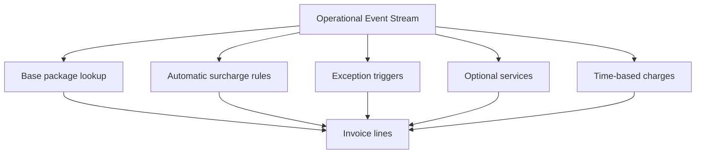
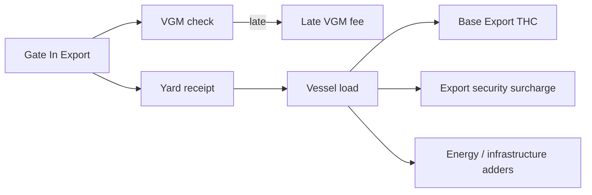

# Summary

This topic converts public container-terminal tariffs into simulation-ready cost logic. The aim is not perfect commercial realism down to every currency and contract clause. The aim is to model how terminals typically charge by **event**, **container characteristics**, **service bundle**, **exception condition**, and **elapsed time**.

A useful simulation split is:

- **Base handling charges** for standard import/export/transshipment container moves
- **Supplementary surcharges** applied automatically to broad classes of moves
- **Exception charges** triggered by operational problems or late requests
- **Optional service charges** for requested extra services
- **Storage and dwell charges** for elapsed time on terminal
- **Accessory handling charges** for special cargo or non-standard flows

Public tariffs show that the commercial unit is often not “a container terminal visit” but a set of priced operational events such as a quay-crane move, yard transfer, VGM handling, gate event, weighbridge request, restow, hazardous handling, reefer service, or late-arrival/late-documentation exception.

# Why this matters for simulation and gameplay

- It turns terminal operations into economic trade-offs rather than pure throughput puzzles.
- It allows the player or AI to feel the cost of bad planning:
  - late VGM
  - restows
  - overweight / misdeclared units
  - export arrivals after cut-off
  - extended dwell
- It supports multiple business models:
  - public/common-user tariff terminal
  - line-contracted terminal
  - landlord-port + terminal-operator surcharge stack
- It creates believable KPIs:
  - revenue per move
  - cost per vessel call
  - exception-cost leakage
  - margin by cargo type
  - congestion cost versus tariff recovery
- It gives a clean bridge between operational events and finance events.

# Key definitions and vocabulary

- **THC (Terminal Handling Charge)**: Commercial charge for standard terminal handling. In practice, this may bundle multiple physical moves and service components rather than map 1:1 to a single machine action.
- **Basic Terminal Handling Charge**: A tariff item covering the standard import/export terminal handling package for a container.
- **Restow**: Moving a container from one vessel slot to another, or via quay/yard, usually as an extra chargeable event.
- **Shunt / shuttle**: Internal transfer between terminal areas or facilities, usually chargeable separately when outside the base handling package.
- **VGM (Verified Gross Mass)**: Declared or terminal-provided container weight used for SOLAS compliance.
- **Security surcharge / ISPS surcharge**: A tariff component applied to recover security-related terminal or port costs.
- **Infrastructure / energy / fuel / cyber surcharge**: Recovery component layered onto normal moves.
- **Cut-off**: Operational deadline after which export receipt, documentation, or data updates trigger penalties or refusal.
- **Free storage / free time**: Storage period included before dwell charges start.
- **POA (Price on Application)**: No public fixed rate, priced case by case.
- **Charge basis**: The commercial unit used in tariffing, for example per container, per move, per day, per VGM supplied, per vessel call, per hour, or per document.

# Scope boundaries

## Included

- How public tariffs are structured for simulation purposes
- Which operational moves are commonly included in a base terminal charge
- Which charges are commonly separate
- Event-to-charge mapping
- Modular rules for tariffs, surcharges, and exceptions
- Example parameter packs for simulation systems

## Excluded

- Exact contract pricing between specific carriers and terminals
- Full legal tariff interpretation
- Customs duty, VAT, and broader trade taxation
- Detailed accounting treatment
- Audit-grade invoice logic

# Key attributes and dimensions (human-level data model)

## 1. What public tariffs suggest about structure

Public tariffs strongly suggest that a simulation should not model one universal charge. Instead, use layers.

### Layer A: Base move package

A base move package usually covers the normal physical handling path for an import, export, or transshipment container.

A public DP World Southampton tariff explicitly states that **Basic Terminal Handling Charges** include:
- quay crane lift to discharge from vessel and transport to stack, or lift from stack and load to vessel
- **2 yard moves** to receive from or deliver to truck and lift between truck and stack
- free storage days if applicable
- standard documentation processing
- primary computerised documentation
- ship-planning functions including bay plans

This is extremely useful for simulation because it shows that a commercial THC can bundle more than one machine action.

### Layer B: Broad automatic surcharges

Public examples show terminals adding flat surcharges on top of ordinary moves, such as:
- security
- infrastructure
- fuel
- energy / decarbonisation
- cyber security
- sanitary / compliance related charges

These can be modelled as event-linked adders on top of otherwise standard move classes.

### Layer C: Exception charges

Common examples in public tariffs include:
- late VGM or missing VGM
- terminal weighing request after ingate
- misdeclaration
- export receipt after cut-off
- unplanned restow
- overweight or special-weigh processing
- late arrival of export while vessel is already under operations

### Layer D: Optional requested services

Common examples include:
- weighbridge use
- re-weigh requests
- photos
- gas checks
- seal replacement
- placard application / removal
- labour by hour
- escorting or supervision
- reefer plug/unplug and power monitoring
- devanning / repacking
- pinning / lashing / hatch cover handling
- special handling for out-of-gauge or hazardous cargo

### Layer E: Storage and time-based charges

Public tariffs often include:
- free storage period
- escalating storage after free time
- trailer parking
- demurrage-like or yard-efficiency shifting fees after long dwell
- reefer power charged per day or part thereof

## 2. Included versus separate moves

For simulation, separate the idea of a **commercial bundle** from the **underlying physical events**.

### Example commercial bundle

```text
Basic Import THC
  includes:
    - 1 quay discharge lift
    - transfer from quay to stack
    - yard handling to/from truck
    - standard documents
    - included free days (if tariff says so)
```

### Example separate items

```text
Not necessarily included:
  - restow
  - hazardous premium
  - reefer power
  - VGM exception handling
  - weighbridge request
  - gate security surcharge
  - shunt between terminals
  - labour for special requests
```

That split lets a simulation price the same operational event stream under different commercial packages.

## 3. Common charge bases seen in public tariffs

| Charge basis | Examples |
|---|---|
| per container | THC, security surcharge, restow, hazardous premium |
| per move | quay crane move, shifting, special handling |
| per import full container move | energy / fuel / import infrastructure adders |
| per export full container | VGM-related administration or security |
| per VGM supplied | VGM data handling |
| per day or part thereof | reefer power, storage, trailer parking |
| per hour | labour, gang hire, supervision |
| per vessel call | waste/security/port-side vessel charges in some tariffs |
| per document / entry / instance | customs exam, misdeclaration, paper ticket, exception fee |

## 4. Real tariff patterns worth modelling

### Pattern A: THC is a bundle, not just one lift

DP World Southampton states that basic THC includes quay-crane movement plus two yard moves and documentation/planning functions. That means a simulation invoice system should not blindly bill each crane, TT, and yard-crane event separately if the tariff package says they are included.

### Pattern B: transshipment can be charged differently

Southampton notes that each transshipment container is charged for one discharge move and one load move. Some terminals publish distinct transshipment handling rates rather than simply import/export rates.

### Pattern C: the same operational family can have early, late, and exceptional price bands

London Gateway publishes VGM-related charges with different levels depending on whether:
- shipper VGM is provided before arrival
- shipper VGM is provided after arrival
- no VGM is received by a deadline
- terminal is asked to weigh and provide VGM
- misdeclaration threshold is exceeded
- re-weigh is requested

PD Teesport similarly prices terminal weighing differently if the request is made prior to ingate versus post-ingate, with the post-ingate charge explicitly including removal from stack, shunting to weigh station, weighing, and return to stack.

### Pattern D: some surcharges are tied to move completion points

MCP's published port-charge examples state that some import charges are applied at **terminal outgate** and some export charges are applied at **point of loading**. That is gold dust for simulation, because it shows exactly where to anchor a billing event.

### Pattern E: public tariffs often stack operational and policy recovery items

Examples include:
- energy adjustment / transfer levies
- fuel recovery
- infrastructure charges
- security charges
- decarbonisation surcharges
- cyber-security fees
- ISPS surcharges

These are useful as configurable tariff modules rather than hard-coded one-offs.

# Rules, constraints, and algorithms

## 1. Core commercial model

Use a layered charge engine.

```text
total_charge =
  base_package_charge
  + automatic_surcharges
  + exception_charges
  + optional_service_charges
  + dwell_charges
  + taxes_if_modelled
```

### Practical rule

- Base package is chosen by move class and cargo attributes.
- Surcharges are attached by rules.
- Exceptions are triggered by late/missing/problem events.
- Optional services are only added when explicitly requested or automatically forced by conditions.
- Dwell charges depend on elapsed time after free period.

## 2. Map tariff logic to operational events

### Event types that usually matter

| Operational event | Typical tariff relevance |
|---|---|
| vessel_discharge | import THC, transshipment discharge, security/energy adders |
| vessel_load | export THC, transshipment load, export security adders |
| gate_in_export | may trigger VGM admin, gate/security, documentation checks |
| gate_out_import | may trigger import security/infrastructure charge |
| terminal_weigh_request | weigh / VGM / exception charge |
| restow | restow charge, possibly unplanned-restow premium |
| reefer_plug_in | reefer service charge |
| reefer_power_day_tick | daily reefer power charge |
| hazardous_label_service | placard / hazard service charge |
| intra_terminal_shunt | shunt charge |
| storage_day_tick | dwell / storage fee |
| cut_off_breach | late receipt or late documentation charge |

## 3. Included-move logic

A tariff package can contain included moves. Model this explicitly.

### Example

```text
package: basic_import_thc
included_events:
  - vessel_discharge
  - quay_to_stack_transfer
  - yard_receive_or_deliver
  - stack_lift_to_or_from_truck
included_allowances:
  free_storage_days: 3
```

### Invoice rule

```text
if event in included_events and package is active:
    charge_event_amount = 0
    mark as commercially_included
else:
    charge_event_amount = tariff_lookup(event)
```

This prevents double-billing when a public tariff has already bundled those events.

## 4. Exception-charge logic

### VGM example

```text
if shipper_vgm_received_before_arrival:
    charge(vgm_admin_standard)
elif shipper_vgm_received_after_arrival:
    charge(vgm_admin_late)
if no_vgm_by_deadline:
    charge(vgm_missing_deadline)
if terminal_weigh_requested:
    charge(terminal_vgm_weigh)
if measured_difference_exceeds_threshold:
    charge(vgm_misdeclaration)
```

### Restow example

```text
if move_type == restow:
    charge(restow_standard)
if move_type == restow and advised_before_arrival == false:
    charge(restow_unplanned_premium)
```

### Export after cut-off example

```text
if gate_in_export_time > vessel_cutoff_time and accepted_by_terminal:
    charge(late_export_receival_fee)
```

## 5. Time-based charging

### Storage and dwell

```text
billable_storage_days =
  max(0, elapsed_days - free_storage_days)

storage_charge =
  rate_for_day_1_to_n
  + escalated_rate_after_threshold
```

### Reefer power

```text
reefer_power_charge =
  plugged_in_days * reefer_power_daily_rate
```

### Long-dwell operational handling

Some tariffs include extra operational handling or shifting charges for containers that remain too long and must be segregated or repositioned for efficiency. In simulation, this can be modelled as a threshold-triggered yard-efficiency charge or extra internal move cost.

## 6. Cargo-class modifiers

Use cargo modifiers on top of base packages.

| Modifier | Typical effect |
|---|---|
| size 40ft | multiplier or separate rate |
| size 45ft | multiplier or separate rate |
| full vs empty | separate rate class |
| reefer | service adders and power charges |
| hazardous | premium / direct handling / escort / admin |
| out_of_gauge | attachment / labour / special-lift / special-VGM adders |
| tank | equipment-specific surcharge in some tariffs |
| transshipment | discharge + load, or dedicated rate set |

### Rule example

```text
base_rate_key =
  move_class
  + size_class
  + load_status
  + trade_flow
```

Then apply modifiers:
```text
final_rate = base_rate * cargo_modifier * contract_modifier
```

## 7. Contract mode versus public-tariff mode

Not every terminal customer pays the public tariff.

### Recommended simulation modes

#### Public tariff mode
- Use published price tables and broad rules.
- Good for sandbox and common-user terminals.

#### Contracted carrier mode
- Use negotiated rate cards.
- Public tariff remains fallback for non-contracted services and exceptions.

#### Simplified gameplay mode
- Hide currency realism.
- Score charges in abstract “cost units” but keep the same trigger logic.

## 8. Modular tariff architecture

Do not hard-code one terminal's tariff book. Use modules.

### Suggested module list

- base_thc_module
- transshipment_module
- security_module
- infrastructure_module
- fuel_energy_module
- vgm_module
- reefer_module
- hazardous_module
- storage_module
- labour_special_services_module
- gate_module
- shunt_internal_transfer_module
- contract_override_module

### Resolution order

```text
1. identify commercial package
2. identify included events
3. apply mandatory surcharges
4. apply exception triggers
5. apply optional requested services
6. apply elapsed-time charges
7. apply customer / contract overrides
```

# Standards and authoritative references to confirm

There is no single international standard that fixes terminal tariff structure globally. Public tariff books and operator charge schedules are the authoritative source for local tariff design, while the simulation should use them structurally rather than pretending one book is universal.

## Public examples used for this topic

1. **DP World Southampton Public Tariff 2024**
   - Valuable because it explicitly states what is included in Basic Terminal Handling Charges.
   - Useful for modelling bundled THC and separate restow logic.

2. **DP World London Gateway Public Tariff 2024**
   - Valuable for VGM charging patterns, re-weigh requests, weighbridge use, ancillary services, and energy/fuel adders.

3. **PD Teesport Limited Unitised Terminals Rates and Charges 2024**
   - Valuable for distinguishing standard weighing before ingate from more expensive post-ingate weighing that includes removal from stack, shunting, weighing, and return to stack.
   - Also useful for shunt and intra-terminal handling examples.

4. **MCP plc Port Charges 2025-2026**
   - Valuable for stating when certain charges are applied, such as import security/infrastructure at outgate and export security/infrastructure at point of loading.
   - Also useful for showing that MCP may collect charges on behalf of terminal operators.

5. **Port of Felixstowe Rates and Charges 2025**
   - Valuable for SOLAS exception examples linked to missed VGM deadlines, material difference, and special weighing processes.

6. **DP World Constanta Public Terminal Tariffs 2025-2026**
   - Valuable for showing explicit surcharge families like VGM processing, late arrival while vessel is under operations, cyber security, sanitary, and ISPS charges layered onto vessel-move handling.

7. **Peel Ports common-user charge schedules**
   - Useful for examples where a published surcharge is explicitly described as inclusive of several components such as terminal security, decarbonisation, Brexit, fuel, and energy items.

# Example outputs to include

## 1. Canonical tariff-rule model

```yaml
tariff_profile_id: public_terminal_standard
currency: GBP
base_packages:
  - package_id: import_full_standard
    applies_when:
      trade_flow: import
      load_status: full
      cargo_type: standard
    charge_basis: per_container
    amount: 100
    included_events:
      - vessel_discharge
      - quay_to_stack_transfer
      - yard_delivery_to_truck
    included_allowances:
      free_storage_days: 3

automatic_surcharges:
  - surcharge_id: security_import
    applies_when:
      trade_flow: import
      load_status: full
    trigger_event: gate_out_import
    amount: 10

  - surcharge_id: energy_import
    applies_when:
      trade_flow: import
      load_status: full
    trigger_event: vessel_discharge
    amount: 15

exception_charges:
  - charge_id: vgm_late
    trigger_condition: vgm_received_after_arrival
    amount: 4

  - charge_id: vgm_missing_deadline
    trigger_condition: no_vgm_by_deadline
    amount: 60

  - charge_id: export_after_cutoff
    trigger_condition: export_received_after_cutoff_and_accepted
    amount: 240
```

## 2. Event-to-charge mapping example

| Event | Example charge family | Included or separate |
|---|---|---|
| vessel_discharge | import THC | usually included in package |
| stack_to_truck_delivery | yard move in THC | sometimes included |
| gate_out_import | import security / infrastructure | often separate |
| gate_in_export | VGM admin / gate processing | sometimes separate |
| terminal_weigh_request | VGM weigh | separate |
| restow | restow | separate |
| reefer_plug_in | reefer handling | separate |
| reefer_power_day_tick | reefer power | separate |
| storage_day_tick | storage / dwell | separate after free time |
| export_after_cutoff | late receipt fee | separate exception |

## 3. Simplified revenue simulation formula

```text
job_revenue =
  package_price(selected_package)
  + sum(triggered_surcharges)
  + sum(triggered_exceptions)
  + sum(optional_services)
  + dwell_fees
```

## 4. Public-tariff-derived scenario presets

### Preset A: bundled-THC terminal
- Base THC includes quay-crane move and normal yard delivery path
- Revenue stable on standard cargo
- Profit sensitive to restows, reefer days, and late VGM

### Preset B: surcharge-heavy terminal
- Lower-looking base THC
- Higher security/energy/infrastructure adders
- More visible event-by-event invoice line items

### Preset C: exception-recovery terminal
- Standard moves competitive
- Late and non-compliant cargo heavily penalised
- Good for gameplay focused on cut-off discipline and documentation quality

# Data schemas

## JSON Schema fragment for tariff rules

```json
{
  "$schema": "https://json-schema.org/draft/2020-12/schema",
  "$id": "terminal_tariff_profile.schema.json",
  "title": "TerminalTariffProfile",
  "type": "object",
  "required": ["tariff_profile_id", "currency"],
  "properties": {
    "tariff_profile_id": { "type": "string" },
    "currency": { "type": "string" },
    "base_packages": {
      "type": "array",
      "items": {
        "type": "object",
        "required": ["package_id", "charge_basis", "amount"],
        "properties": {
          "package_id": { "type": "string" },
          "charge_basis": { "type": "string", "enum": ["per_container", "per_move", "per_day", "per_hour"] },
          "amount": { "type": "number" },
          "applies_when": { "type": "object" },
          "included_events": {
            "type": "array",
            "items": { "type": "string" }
          },
          "included_allowances": { "type": "object" }
        }
      }
    },
    "automatic_surcharges": {
      "type": "array",
      "items": {
        "type": "object",
        "required": ["surcharge_id", "trigger_event", "amount"],
        "properties": {
          "surcharge_id": { "type": "string" },
          "trigger_event": { "type": "string" },
          "amount": { "type": "number" },
          "applies_when": { "type": "object" }
        }
      }
    },
    "exception_charges": {
      "type": "array",
      "items": {
        "type": "object",
        "required": ["charge_id", "trigger_condition", "amount"],
        "properties": {
          "charge_id": { "type": "string" },
          "trigger_condition": { "type": "string" },
          "amount": { "type": "number" }
        }
      }
    },
    "time_based_charges": {
      "type": "array",
      "items": {
        "type": "object",
        "required": ["charge_id", "time_unit", "amount"],
        "properties": {
          "charge_id": { "type": "string" },
          "time_unit": { "type": "string", "enum": ["day", "hour"] },
          "amount": { "type": "number" },
          "free_time": { "type": "integer" }
        }
      }
    }
  }
}
```

# Sample data

## JSON

```json
{
  "tariff_profile_id": "sim_public_terminal_v1",
  "currency": "GBP",
  "base_packages": [
    {
      "package_id": "import_full_standard",
      "charge_basis": "per_container",
      "amount": 125.0,
      "applies_when": {
        "trade_flow": "import",
        "load_status": "full",
        "cargo_type": "standard"
      },
      "included_events": [
        "vessel_discharge",
        "quay_to_stack_transfer",
        "yard_delivery_to_truck"
      ],
      "included_allowances": {
        "free_storage_days": 3
      }
    }
  ],
  "automatic_surcharges": [
    {
      "surcharge_id": "security_import",
      "trigger_event": "gate_out_import",
      "amount": 10.0,
      "applies_when": {
        "trade_flow": "import",
        "load_status": "full"
      }
    }
  ],
  "exception_charges": [
    {
      "charge_id": "vgm_missing_deadline",
      "trigger_condition": "no_vgm_by_deadline",
      "amount": 60.0
    }
  ],
  "time_based_charges": [
    {
      "charge_id": "reefer_power",
      "time_unit": "day",
      "amount": 55.0,
      "free_time": 0
    }
  ]
}
```

## YAML

```yaml
tariff_profile_id: sim_public_terminal_v1
currency: GBP
base_packages:
  - package_id: export_full_standard
    charge_basis: per_container
    amount: 120.0
    applies_when:
      trade_flow: export
      load_status: full
      cargo_type: standard
    included_events:
      - gate_in_export
      - yard_receive_from_truck
      - stack_to_vessel_load
automatic_surcharges:
  - surcharge_id: export_security
    trigger_event: vessel_load
    amount: 10.0
    applies_when:
      trade_flow: export
      load_status: full
exception_charges:
  - charge_id: export_after_cutoff
    trigger_condition: export_received_after_cutoff_and_accepted
    amount: 240.0
  - charge_id: terminal_vgm_weigh
    trigger_condition: terminal_weigh_requested
    amount: 25.0
time_based_charges:
  - charge_id: storage_standard
    time_unit: day
    amount: 18.0
    free_time: 3
```

# Visualisation guidance

## Mermaid diagrams

### Charge layering



### Example event-linked billing flow



## UI/dashboard widgets where relevant

- Revenue by move class
- Exception-fee leakage avoided by better planning
- Storage revenue versus yard congestion penalty
- Average charge stack per container
- Tariff rule inspector for a selected container
- Forecast revenue by vessel call
- Heatmap of where charge-triggering events occur in the terminal

# 3D rendering notes (scale, dimensions, textures/markings)

This topic is economics-first, but it should still affect the world model:

- Containers with late VGM, cut-off breaches, customs holds, or hazardous issues should visibly sit in exception states rather than flowing normally.
- Long-dwell cargo can trigger yard clutter, reshuffles, and visible segregation.
- Reefer charges should correspond to actual plugged-in reefer locations.
- Special-service charges should map to visible actions such as weighing, gas checks, placard changes, or escorting.
- If the player opens a container or visit detail panel, show both:
  - physical event chain
  - commercial charge chain

# Validation checklist

- [ ] Base THC can include multiple physical events without double-billing
- [ ] Surcharges are modular rather than hard-coded into one rate
- [ ] Exception charges are triggered by explicit operational conditions
- [ ] Gate, vessel, and yard events can each trigger charges
- [ ] Time-based charges support free time and escalation
- [ ] Import, export, and transshipment can have different rule sets
- [ ] Full/empty, size, reefer, hazardous, and OOG modifiers are supported
- [ ] Public tariff mode and contract mode are separate
- [ ] Revenue can be traced back to operational events
- [ ] Simulation uses tariff structure realism without pretending rates are universal

# Open questions and research backlog

- Add a separate topic for storage, demurrage, detention, and dwell economics in more depth.
- Add a separate topic for contract pricing versus public tariff fallbacks.
- Research more public examples for direct transshipment pricing and inland rail surcharge structures.
- Add a “customer complaint / invoice dispute” mechanic for wrong charge-party mapping.
- Add explicit charge-party rules:
  - shipping line
  - clearing agent
  - trucker
  - cargo owner
- Add exception workflows for customs exams, holds, and damaged units.
- Add vessel-side tariffs such as berth dues and waste charges if the simulation expands beyond terminal handling economics.

# Research notes to verify later

- The strongest public examples available are very good at showing structure and trigger points, but not all terminals publish the same level of detail. Treat public tariffs as templates for charge logic, then parameterise locally.
- When building parsers or scenario content, preserve the distinction between:
  - commercial package
  - charge trigger event
  - charge party
  - included service
  - separate extra service
