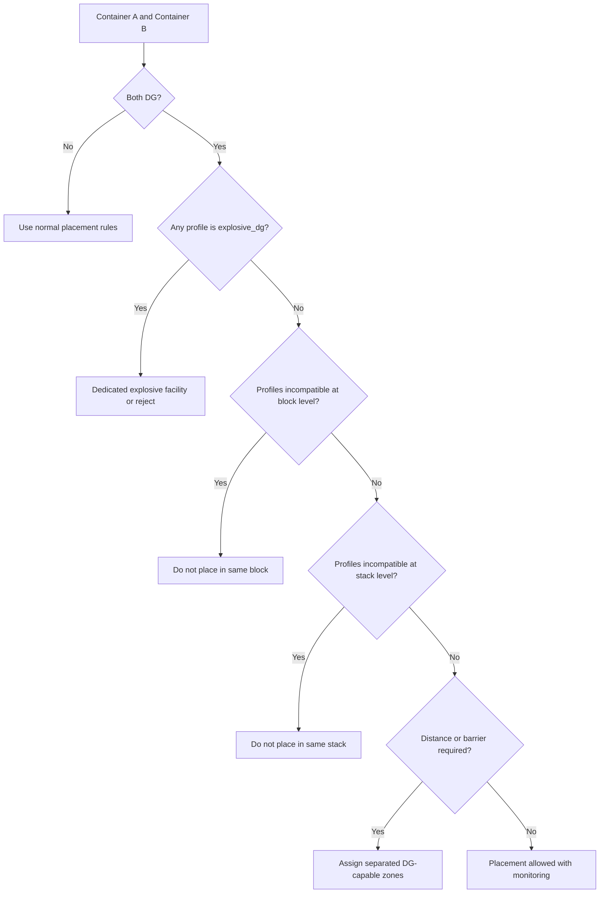
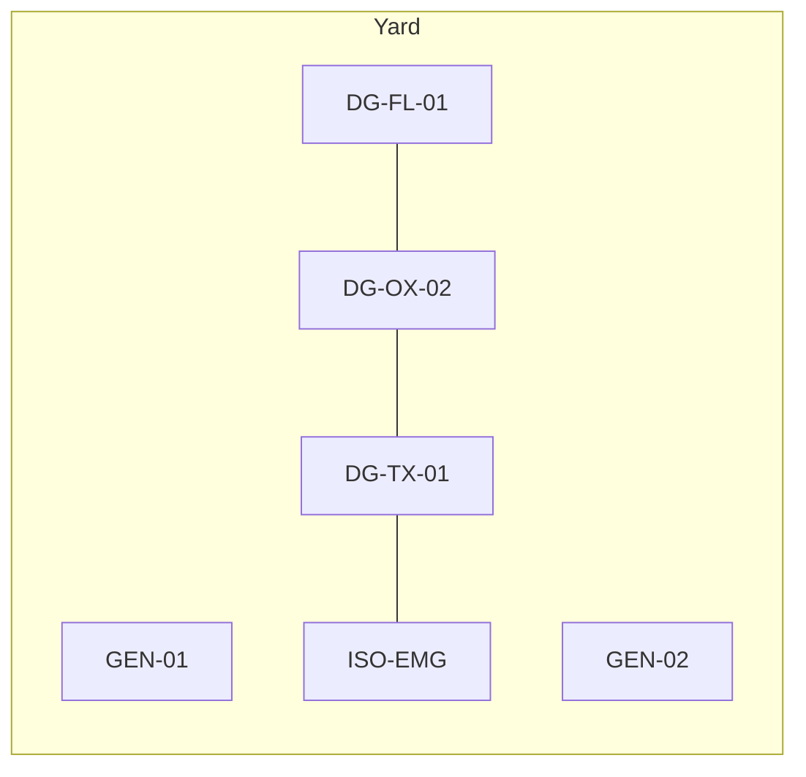
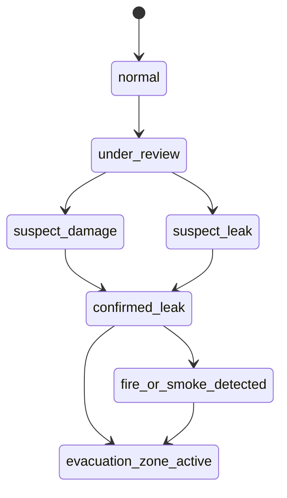

## Summary

This document defines a **simulation-ready model for hazardous containers** aligned at a high level with the **International Maritime Dangerous Goods (IMDG) Code** and related container packing guidance.

It covers:
- the minimum dangerous-goods attributes a terminal simulation should track
- a gameplay-safe subset of IMDG class and division concepts
- high-level segregation logic for yard planning and vessel stowage support
- packing and securing faults that can generate realistic exceptions
- terminal zoning and emergency-response concepts that influence layout and operations

This file is deliberately **high-level**. The IMDG Code contains detailed legal and technical requirements for each substance and special provision. A simulation or game should use this file for operational behaviour and plausibility, but a real terminal or vessel operation must use the actual Code, competent authority requirements, and local site rules.

---

## Why this matters for simulation and gameplay

Hazardous cargo makes a terminal feel like an actual terminal instead of a giant box car park with cranes.

Without a hazardous-cargo model:
- all containers can be stacked anywhere, which is nonsense
- vessel planning loses one of its biggest operational constraints
- yard zoning becomes visually and mechanically bland
- documentation, inspection, and exception workflows are too clean
- emergency response has no teeth
- there is no believable reason for special moves, holds, or missed connections

A good hazmat model adds:
- storage restrictions
- separation distances or zone incompatibilities
- extra planning steps and cut-offs
- hold reasons such as missing DG declaration or incompatible placement
- escalation gameplay such as leak, fire risk, inspection, or emergency isolation
- meaningful “smart planning” systems instead of random stacking

At arcade fidelity, use a few classes and red/amber/green rules. At simulation fidelity, add class/division detail, compatibility groups, segregation categories, and special handling flags.

---

## Key definitions and vocabulary

- **Dangerous goods (DG)**  
  Substances, materials, or articles regulated for transport because they present risks such as fire, explosion, toxicity, corrosivity, radioactivity, or environmental harm.

- **IMDG Code**  
  The International Maritime Dangerous Goods Code, developed under IMO for dangerous goods in packaged form, including provisions for classification, packing, marking, documentation, stowage, and segregation.

- **UN number**  
  A four-digit identifier assigned to a dangerous substance or article, for example `UN 1203`.

- **Proper Shipping Name (PSN)**  
  The formal transport name used for documentation and declarations.

- **Class / Division**  
  IMDG hazard categories. Some classes are split into divisions, such as explosives and toxic/infectious substances.

- **Packing Group (PG)**  
  Relative degree of danger for some classes, commonly I, II, or III.

- **Marine Pollutant**  
  A substance identified as harmful to the marine environment and subject to additional marking and handling requirements.

- **Segregation**  
  The required separation of incompatible dangerous goods so that they are not stowed or handled together in a way that creates additional risk.

- **CTU**  
  Cargo Transport Unit. In this context, often the freight container carrying the dangerous goods cargo.

- **CTU Code**  
  The IMO/ILO/UNECE Code of Practice for Packing of Cargo Transport Units, which gives guidance for safe packing, securing, and handling across the intermodal chain.

- **Hazmat zone / DG zone**  
  A designated terminal area for storing or handling dangerous goods under local and site rules.

- **Emergency isolation area**  
  A temporary or dedicated area used to separate a container presenting immediate safety concerns, such as leakage, fire risk, or suspected undeclared hazards.

---

## Scope boundaries (what is included/excluded)

### Included
- IMDG-aligned class and division concepts at a simulation level
- UN number, class, packing group, marine pollutant, and key declaration fields
- high-level segregation logic and decision flow
- yard zoning and placement constraints
- simple emergency-planning concepts for site layout and incident gameplay
- CTU packing and securing faults that create operational exceptions
- links to vessel stowage and terminal move planning

### Excluded
- verbatim reproduction of IMDG tables, schedules, or substance-specific requirements
- country-specific dangerous goods law beyond broad terminal modelling needs
- detailed firefighting chemistry or medical response procedures
- dangerous goods in bulk tankers or bulk carriers outside container-terminal scope
- every special provision, limited quantity, excepted quantity, and exemption edge case

---

## Key attributes and dimensions (human-level data model)

The minimum useful hazardous-container model should include the following fields.

### 1. Regulatory identification
- `hazmat.is_hazardous`
- `hazmat.un_number`
- `hazmat.proper_shipping_name`
- `hazmat.imdg_class`
- `hazmat.imdg_division`
- `hazmat.packing_group`
- `hazmat.marine_pollutant`
- `hazmat.flashpoint_c`
- `hazmat.tunnel_or_local_restrictions` (optional local extension)

### 2. Segregation and compatibility
- `hazmat.segregation_profile`
- `hazmat.segregation_group`
- `hazmat.compatibility_group` (mainly relevant for Class 1 explosives)
- `hazmat.incompatible_with[]`
- `hazmat.requires_dedicated_zone`
- `hazmat.max_stack_height_override`
- `hazmat.underdeck_allowed`
- `hazmat.ondeck_preferred_or_required`

### 3. Documentation and readiness
- `hazmat.dg_declaration_received`
- `hazmat.dg_review_status`
- `hazmat.emergency_contact_present`
- `hazmat.special_handling_instructions`
- `hazmat.acceptance_status`

### 4. Operational control
- `hazmat.yard_zone_code`
- `hazmat.isolation_required`
- `hazmat.temperature_monitoring_required`
- `hazmat.leak_suspected`
- `hazmat.damage_suspected`
- `hazmat.response_priority`
- `hazmat.last_inspection_result`

### 5. Incident and fault modelling
- `hazmat.faults[]`
- `hazmat.incident_state`
- `hazmat.restricted_operations[]`

### High-value classes/divisions to model first

A simulation does not need every nuance on day one. Start with a minimum set that creates believable operational choices.

| IMDG class/division | Plain-English meaning | Simulation significance |
|---|---|---|
| 1 | Explosives | highest restrictions, dedicated zones, severe separation logic |
| 2.1 | Flammable gases | strong fire/explosion concern, isolation and heat sensitivity |
| 2.2 | Non-flammable, non-toxic gases | pressurised handling concerns, lower fire risk |
| 2.3 | Toxic gases | severe exclusion and emergency-response sensitivity |
| 3 | Flammable liquids | common, important, strong ignition-control logic |
| 4.1 | Flammable solids | fire risk, storage restrictions |
| 4.2 | Substances liable to spontaneous combustion | high escalation gameplay value |
| 4.3 | Dangerous when wet | water-response complications, strict separation from moisture-related hazards |
| 5.1 | Oxidizing substances | strong incompatibility with fuels and many combustibles |
| 5.2 | Organic peroxides | highly sensitive, often severe operational controls |
| 6.1 | Toxic substances | segregation and exposure controls |
| 8 | Corrosive substances | leakage, damage, contamination, response gameplay |
| 9 | Miscellaneous dangerous substances and articles | broad catch-all, includes marine pollutant scenarios |

### Minimal hazard placement categories for gameplay

Use these coarse placement buckets first, then refine later.

| Placement category | Typical members | Yard logic |
|---|---|---|
| `general_dg` | lower-complexity DG classes | allowed in DG-capable blocks with rule checks |
| `fire_risk_dg` | class 3, 4.1, 4.2, 5.2 | stronger ignition and separation controls |
| `oxidizer_dg` | class 5.1 | separate from fuels and many combustibles |
| `toxic_dg` | class 2.3, 6.1 | stronger access and incident controls |
| `explosive_dg` | class 1 | dedicated area or rejected by many terminal profiles |
| `reactive_dg` | class 4.3, some unstable cargoes | weather and spill-response complications |
| `corrosive_dg` | class 8 | spill containment and inspection priority |
| `marine_pollutant_only` | some class 9 or other marked cargo | environmental controls, often lower segregation impact than major hazard classes |

---

## Rules, constraints, and algorithms (include simplified simulation models)

### 1. Hazard classification completeness check

A hazardous container should not be “accepted” into normal planning unless the minimum declaration set is present.

```pseudo
hazmat_complete = (
  hazmat.is_hazardous == true and
  hazmat.un_number != null and
  hazmat.imdg_class != null and
  hazmat.proper_shipping_name != null
)

if hazmat.is_hazardous and not hazmat_complete:
  status.holds += ["dg_documentation_hold"]
  hazmat.acceptance_status = "rejected_pending_review"
```

### 2. High-level segregation logic

The IMDG Code includes detailed segregation requirements. For simulation, use a two-stage approach:
1. assign each hazardous container a **segregation profile**
2. check zone and adjacency rules between profiles

Recommended simulation segregation outcomes:
- `compatible`
- `separate_in_same_zone`
- `separate_by_distance_or_barrier`
- `not_in_same_stack`
- `not_in_same_block`
- `not_accepted_together_on_site_profile`

```pseudo
function segregation_outcome(a, b):
  if a.profile == "explosive_dg" or b.profile == "explosive_dg":
    return "not_accepted_together_on_site_profile" unless dedicated_explosive_facility
  if one_is("oxidizer_dg") and other_is("fire_risk_dg"):
    return "not_in_same_block"
  if one_is("toxic_dg") and other_is("fire_risk_dg"):
    return "separate_by_distance_or_barrier"
  if one_is("reactive_dg") and other_is("water_reactive_conflict"):
    return "not_in_same_stack"
  return "compatible"
```

Important modelling note:
- a real deployment must check the actual IMDG segregation rules and any substance-specific provisions
- the simulation should treat this file as a simplification layer, not as legal compliance logic

### 3. Yard placement rules

```pseudo
function can_place(container, yard_slot):
  if not yard_slot.dg_capable and container.hazmat.is_hazardous:
    return false

  if container.hazmat.requires_dedicated_zone and yard_slot.zone_code != container.hazmat.yard_zone_code:
    return false

  if container.hazmat.isolation_required and not yard_slot.isolation_capable:
    return false

  if yard_slot.adjacent_conflicts_with(container):
    return false

  return true
```

Recommended simple constraints:
- no hazardous cargo in non-DG yard blocks
- no incompatible DG in the same stack
- stricter classes may require dedicated blocks
- leaking or damaged DG should move to isolation or emergency area, not routine storage
- reefer power, tank container fittings, or temperature-monitoring requirements may further reduce eligible slots

### 4. Stack-level rule

A very game-useful simplification is to make stack acceptance binary.

```pseudo
function can_join_stack(container, stack):
  for each existing in stack.containers:
    outcome = segregation_outcome(container, existing)
    if outcome in ["not_in_same_stack", "not_in_same_block", "not_accepted_together_on_site_profile"]:
      return false
  return true
```

This avoids trying to simulate half a law library in one poor stack of steel rectangles.

### 5. CTU packing and securing fault model

The CTU Code gives guidance for safe packing and securing throughout the intermodal chain. For gameplay, use fault states that can be detected by inspection or cause operational restrictions.

Suggested fault states:
- `load_not_secured`
- `weight_distribution_suspect`
- `incompatible_goods_packed_together`
- `damaged_packaging`
- `leakage_detected`
- `placard_missing_or_incorrect`
- `documentation_mismatch`
- `overstow_restriction_breached`
- `temperature_control_fault`

```pseudo
if fault in ["leakage_detected", "damaged_packaging"]:
  hazmat.incident_state = "active_safety_risk"
  hazmat.isolation_required = true
  status.holds += ["safety_hold"]

if fault == "documentation_mismatch":
  status.holds += ["dg_documentation_hold"]
```

### 6. Emergency escalation model

Terminal emergency planning should distinguish at least:
- normal hazardous storage
- abnormal but stable state
- active incident

Suggested incident states:
- `normal`
- `under_review`
- `suspect_damage`
- `suspect_leak`
- `confirmed_leak`
- `fire_or_smoke_detected`
- `evacuation_zone_active`

```pseudo
if smoke_detected or temperature_runaway:
  hazmat.incident_state = "fire_or_smoke_detected"
  terminal.activate_exclusion_zone(container.location)
  terminal.dispatch_emergency_response()
```

### 7. Vessel planning interaction

Hazardous containers affect more than the yard. They can constrain whether a unit is valid for a specific planned slot.

```pseudo
slot_ok = (
  slot.hazmat_allowed and
  slot.deck_zone in container.hazmat.allowed_deck_zones and
  slot.segregation_ok_from_neighbours and
  not slot.near_incompatible_cargo
)
```

For simulation:
- some classes should be modelled as preferring or requiring on-deck placement
- some cargoes should be excluded from certain under-deck or accommodation-adjacent positions
- simplified stowage flags are enough for game logic as long as they are consistent

### 8. Acceptance policy tiers for gameplay

Different terminals should have different DG capability profiles.

| Terminal profile | Description | Gameplay effect |
|---|---|---|
| `basic` | accepts only limited DG subset | more rejections, diversions, and planning pain |
| `standard` | accepts most common DG classes with zoned storage | balanced gameplay |
| `advanced` | specialised DG handling with isolation and monitoring | higher throughput, more complex incidents |
| `restricted` | little or no DG acceptance | forces rerouting and exceptions |

---

## Standards and authoritative references to confirm (edition/year, what to verify)

- **IMO IMDG Code**  
  Confirm the current edition and amendment cycle. As of the IMO publication page, the **2024 Edition incorporating Amendment 42-24** came into force on **1 January 2026** and could be applied voluntarily from **1 January 2025**. Verify class/division coverage, segregation terminology, and the limits of any simplified model used here.

- **IMO dangerous goods overview**  
  Confirm that the IMDG Code covers dangerous goods in packaged form and includes requirements relevant to packing, container traffic, stowage, and segregation of incompatible substances.

- **IMO/ILO/UNECE CTU Code**  
  Confirm that the CTU Code applies throughout the intermodal chain and provides guidance for safe packing and securing of cargo transport units, including dangerous goods.

- **Local port / competent authority dangerous goods rules**  
  Confirm site-specific acceptance profiles, emergency distances, firefighting arrangements, inspection procedures, and any local prohibition or notification requirements. These vary and should not be guessed.

- **Emergency planning guidance for ports and terminals**  
  Confirm how local emergency plans define alarm states, isolation areas, command roles, and evacuation or exclusion zones. These are important for incident gameplay but are typically site-specific.

---

## Example outputs to include (tables, diagrams, sample data)

### Example table: class to high-level storage constraint

| Hazard group | Example class/division | High-level storage idea | Common simulation constraints |
|---|---|---|---|
| Explosive | 1 | dedicated area or reject | no routine mixed storage, strong exclusion radius |
| Flammable gas | 2.1 | high-control DG zone | ignition control, separation from oxidizers |
| Toxic gas | 2.3 | tightly restricted area | very limited acceptance, emergency priority |
| Flammable liquid | 3 | DG zone | no incompatible adjacency, fire-risk zoning |
| Spontaneously combustible | 4.2 | monitored DG zone | high incident escalation potential |
| Dangerous when wet | 4.3 | weather-aware DG zone | keep away from incompatible response context |
| Oxidizer | 5.1 | separate DG zone | away from fuels and many combustibles |
| Organic peroxide | 5.2 | strict-control DG zone | severe acceptance limits, possible temperature rules |
| Toxic substance | 6.1 | controlled DG zone | access and exposure controls |
| Corrosive | 8 | spill-aware DG zone | containment and inspection priority |
| Miscellaneous / marine pollutant | 9 | DG or controlled general zone | environmental controls, variable restrictions |

### Example outputs for downstream systems
- hazmat acceptance report
- DG yard occupancy heatmap
- incompatibility alert list
- incident escalation queue
- vessel hazmat pre-check list
- DG documentation exception dashboard

---

## Data schemas (JSON Schema references or in-file fragments)

### Hazardous container fragment

```json
{
  "$schema": "https://json-schema.org/draft/2020-12/schema",
  "$id": "hazardous-container.schema.json",
  "title": "HazardousContainer",
  "type": "object",
  "required": ["container_id", "hazmat"],
  "properties": {
    "container_id": { "type": "string" },
    "hazmat": {
      "type": "object",
      "required": ["is_hazardous"],
      "properties": {
        "is_hazardous": { "type": "boolean" },
        "un_number": { "type": "string" },
        "proper_shipping_name": { "type": "string" },
        "imdg_class": { "type": "string" },
        "imdg_division": { "type": "string" },
        "packing_group": {
          "type": "string",
          "enum": ["I", "II", "III", "not_applicable", "unknown"]
        },
        "marine_pollutant": { "type": "boolean" },
        "flashpoint_c": { "type": "number" },
        "segregation_profile": {
          "type": "string",
          "enum": [
            "general_dg",
            "fire_risk_dg",
            "oxidizer_dg",
            "toxic_dg",
            "explosive_dg",
            "reactive_dg",
            "corrosive_dg",
            "marine_pollutant_only",
            "unknown"
          ]
        },
        "compatibility_group": { "type": "string" },
        "segregation_group": { "type": "string" },
        "requires_dedicated_zone": { "type": "boolean" },
        "yard_zone_code": { "type": "string" },
        "isolation_required": { "type": "boolean" },
        "dg_declaration_received": { "type": "boolean" },
        "dg_review_status": {
          "type": "string",
          "enum": ["not_required", "pending", "accepted", "rejected", "manual_review"]
        },
        "acceptance_status": {
          "type": "string",
          "enum": ["not_reviewed", "accepted", "accepted_with_controls", "rejected_pending_review", "rejected"]
        },
        "faults": {
          "type": "array",
          "items": { "type": "string" }
        },
        "incident_state": {
          "type": "string",
          "enum": [
            "normal",
            "under_review",
            "suspect_damage",
            "suspect_leak",
            "confirmed_leak",
            "fire_or_smoke_detected",
            "evacuation_zone_active"
          ]
        }
      }
    }
  }
}
```

### Yard zone capability fragment

```json
{
  "$schema": "https://json-schema.org/draft/2020-12/schema",
  "$id": "yard-zone-dg-capability.schema.json",
  "title": "YardZoneDangerousGoodsCapability",
  "type": "object",
  "required": ["zone_code", "dg_capable"],
  "properties": {
    "zone_code": { "type": "string" },
    "dg_capable": { "type": "boolean" },
    "accepted_profiles": {
      "type": "array",
      "items": { "type": "string" }
    },
    "isolation_capable": { "type": "boolean" },
    "max_stack_height": { "type": "integer" },
    "requires_monitoring": { "type": "boolean" },
    "adjacent_zone_codes": {
      "type": "array",
      "items": { "type": "string" }
    }
  }
}
```

---

## Sample data (JSON and YAML)

### JSON

```json
{
  "container_id": "MSKU1234567",
  "hazmat": {
    "is_hazardous": true,
    "un_number": "1203",
    "proper_shipping_name": "GASOLINE",
    "imdg_class": "3",
    "imdg_division": "",
    "packing_group": "II",
    "marine_pollutant": false,
    "flashpoint_c": -40,
    "segregation_profile": "fire_risk_dg",
    "compatibility_group": "",
    "segregation_group": "",
    "requires_dedicated_zone": false,
    "yard_zone_code": "DG-FL-01",
    "isolation_required": false,
    "dg_declaration_received": true,
    "dg_review_status": "accepted",
    "acceptance_status": "accepted_with_controls",
    "faults": [],
    "incident_state": "normal"
  }
}
```

### YAML

```yaml
container_id: TEMU7788990
hazmat:
  is_hazardous: true
  un_number: "2014"
  proper_shipping_name: HYDROGEN PEROXIDE, AQUEOUS SOLUTION
  imdg_class: "5"
  imdg_division: "5.1"
  packing_group: II
  marine_pollutant: false
  flashpoint_c:
  segregation_profile: oxidizer_dg
  compatibility_group: ""
  segregation_group: ""
  requires_dedicated_zone: true
  yard_zone_code: DG-OX-02
  isolation_required: false
  dg_declaration_received: true
  dg_review_status: manual_review
  acceptance_status: accepted_with_controls
  faults:
    - placard_missing_or_incorrect
  incident_state: under_review
```

---

## Visualisation guidance

### Mermaid diagrams

#### 1. Segregation decision tree



#### 2. Simplified hazmat yard grid



#### 3. Incident escalation flow



### UI/dashboard widgets where relevant

Useful UI widgets:
- **DG acceptance queue** sorted by sailing cutoff and review status
- **Hazmat yard map** with zone colouring by profile and occupancy
- **Incompatibility alert panel** listing conflicting neighbours or stacks
- **Incident board** showing leak, smoke, temperature, and isolation states
- **Documentation panel** for UN number, class, packing group, and declaration completeness
- **Vessel pre-check widget** showing hazardous slot conflicts before load confirmation

---

## 3D rendering notes (scale, dimensions, textures/markings)

The physical container mesh can stay mostly unchanged, but hazardous attributes should affect **markings, overlays, props, and scene behaviour**.

Recommended rendering hooks:
- DG placards on container sides and doors
- marine pollutant marks where applicable
- warning beacons, cones, or temporary barriers for isolated containers
- spill props, response kits, and emergency vehicles for incident scenes
- zone signage and painted ground markings in DG-capable yard blocks
- heat, smoke, or leakage VFX only for incident states, not as permanent decoration everywhere like some overexcited disaster film

Suggested fidelity levels:
- **low**: icon overlays and coloured zone highlights
- **medium**: placards, barrier props, and alert animations
- **high**: dynamic exclusion zones, inspection props, smoke/leak VFX, emergency vehicle response

---

## Validation checklist

- [ ] The model separates dangerous-goods status from generic container status
- [ ] UN number, class/division, and proper shipping name can be stored
- [ ] Packing group is optional where not applicable
- [ ] A simplified segregation model exists without pretending to reproduce the full IMDG Code
- [ ] Yard zones can declare DG capability and accepted hazard profiles
- [ ] Incompatible containers cannot be placed in the same stack or block under the simplified rules
- [ ] DG declarations and review status can block operational readiness
- [ ] CTU packing/securing faults can trigger holds or isolation
- [ ] Incident escalation can move a container from normal storage to emergency handling
- [ ] The model can support both yard placement and vessel-slot pre-check logic
- [ ] Local or terminal-specific overrides can be added without rewriting the whole schema

---

## Open questions and research backlog

- Confirm the smallest useful segregation-rule matrix that feels authentic without becoming unreadable
- Add limited-quantity and excepted-quantity simplifications if gameplay needs them
- Decide whether Class 7 radioactive cargo should be explicitly modelled in the first public version or handled as a restricted placeholder
- Define a standard set of local terminal overrides:
  - accepted classes
  - dedicated blocks
  - distance rules
  - emergency isolation policy
- Add temperature-control modelling for self-reactive substances and organic peroxides
- Extend fault logic for undeclared or misdeclared dangerous goods
- Add inspection gameplay triggers:
  - damaged placard
  - odour report
  - heat alarm
  - leaking package
  - suspicious paperwork
- Add links to vessel stowage-specific dangerous goods constraints in the vessel knowledge-base files
