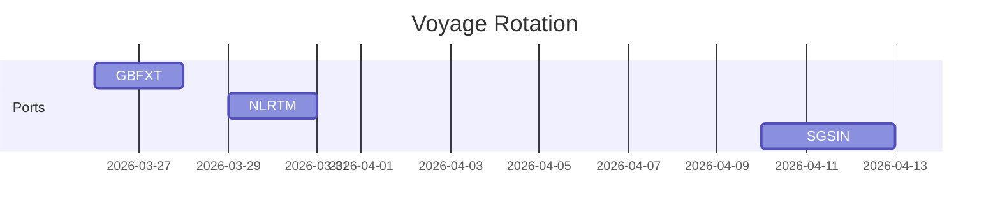

## Summary

This document defines the **logical voyage and manifest model** for container vessels.

It covers:
- voyage identity and structure
- port rotation and scheduling
- container manifests (load/discharge lists)
- planning versions and updates

This is the **planning layer above stowage**, connecting:
- containers
- ports
- time
- vessel operations

---

## Why this matters for simulation and gameplay

Without voyage logic:
- ships just appear randomly
- containers have no deadlines
- no planning pressure exists

With it:
- cut-offs matter
- delays cascade
- ports interact realistically
- decisions have consequences

This is where the game becomes about **time and sequencing**, not just placement.

---

## Key definitions and vocabulary

- Voyage: a vessel journey across multiple ports
- Port rotation: ordered list of ports visited
- ETA: Estimated Time of Arrival
- ETD: Estimated Time of Departure
- Load list: containers to be loaded
- Discharge list: containers to be unloaded
- Manifest: full list of containers onboard
- Cut-off: latest time for container acceptance
- Call: vessel visit at a specific port

---

## Scope boundaries

Included:
- voyage structure
- scheduling
- manifests and lists

Excluded:
- detailed financials
- full EDI message specs

---

## Key attributes and dimensions

### Voyage structure

- vessel_id
- voyage_id
- service_code
- rotation[]

### Port call structure

- port_code
- terminal_id
- eta
- etd
- cutoffs:
  - gate
  - documentation
  - vgm
- berth_window

---

### Container manifest structure

- container_id
- pod
- pol
- current_slot
- planned_slot
- status

---

## Rules, constraints, and algorithms

### 1. Port rotation sequencing

```pseudo
for port in rotation:
  ensure eta < next_port.eta
```

---

### 2. Cut-off validation

```pseudo
if current_time > cutoff:
  container.status = "rolled"
```

---

### 3. Load eligibility

```pseudo
if container.ready_to_load and no_holds:
  include in load_list
else:
  exclude
```

---

### 4. Discharge determination

```pseudo
if container.pod == current_port:
  add to discharge_list
```

---

### 5. Manifest update

```pseudo
manifest = previous_manifest
remove(discharge_list)
add(load_list)
```

---

### 6. Delay propagation

```pseudo
delay = actual_departure - planned_departure

for next_port in rotation:
  next_port.eta += delay
```

---

## Standards and references

- entity["organization","Shipplanning Message Design Group","maritime edi group"]  
  - BAPLIE: stowage snapshot  
  - MOVINS: load/discharge instructions  
  - COPRAR: load/discharge order  
  - COARRI: actual operations  

---

## Example outputs

### Port rotation

| Port | ETA | ETD |
|------|-----|-----|
| GBFXT | 01 Jan | 02 Jan |
| NLRTM | 04 Jan | 05 Jan |
| SGSIN | 20 Jan | 21 Jan |

---

### Sample load list

| Container | POD |
|----------|-----|
| MSKU1234567 | SG |
| CMAU9988776 | NL |

---

## Data schemas

### Voyage schema

```json
{
  "voyage_id": "VOY-001",
  "vessel_id": "VESSEL-001",
  "service_code": "AE1",
  "rotation": []
}
```

---

### Port call schema

```json
{
  "port_code": "GBFXT",
  "eta": "2026-03-26T08:00:00Z",
  "etd": "2026-03-27T18:00:00Z"
}
```

---

### Manifest schema

```json
{
  "containers": []
}
```

---

## Sample data

### JSON

```json
{
  "voyage_id": "VOY-MSK-118W",
  "vessel_id": "VESSEL-MSK-ALPHA",
  "service_code": "AEU1",
  "rotation": [
    {
      "port_code": "GBFXT",
      "eta": "2026-03-26T08:00:00Z",
      "etd": "2026-03-27T18:00:00Z"
    },
    {
      "port_code": "NLRTM",
      "eta": "2026-03-29T10:00:00Z",
      "etd": "2026-03-30T20:00:00Z"
    }
  ]
}
```

---

### YAML

```yaml
voyage_id: VOY-TEST-01
vessel_id: VESSEL-01
service_code: TEST
rotation:
  - port_code: GBFXT
    eta: 2026-03-26T08:00:00Z
    etd: 2026-03-27T18:00:00Z
```

---

## Visualisation guidance

### Mermaid: voyage timeline



---

### Mermaid: manifest lifecycle


---

## 3D rendering notes

- Visualise voyage as timeline UI, not 3D object
- Highlight current port and next port
- Show container flow visually:
  - unload arrows
  - load arrows

---

## Validation checklist

- [ ] Rotation ordered correctly
- [ ] ETA/ETD consistent
- [ ] Cut-offs enforced
- [ ] Load/discharge lists correct
- [ ] Manifest updates correctly

---

## Open questions

- Multiple service loops per vessel
- Handling skipped ports
- Real-time re-routing logic
- Versioned planning vs actuals
