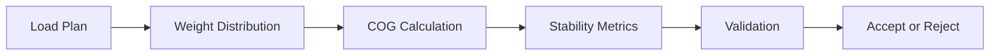

## Summary

This document defines **simplified vessel stability concepts and loading rules** suitable for simulation and gameplay.

It covers:
- centre of gravity and metacentric height (GM)
- list (side tilt) and trim (fore/aft tilt)
- weight distribution rules
- simplified stability validation models
- impact of misdeclared weights (VGM issues)

This is NOT naval architecture level detail.  
This is “don’t let the ship look like it’s about to fall over and ruin your game credibility”.

---

## Why this matters for simulation and gameplay

Without stability:
- players can stack 5000 containers on one side
- ships behave like floating shelves
- no penalty for bad planning

With stability:
- poor loading causes visible tilt
- crane sequencing matters
- weight distribution becomes strategic
- misdeclared weights create chaos (realistic chaos)

This is where your simulation starts punishing stupidity.

---

## Key definitions and vocabulary

- Centre of Gravity (G): point where total weight acts
- Centre of Buoyancy (B): centre of displaced water
- Metacentre (M): stability reference point
- GM (Metacentric Height): distance between G and M
- Positive GM: stable
- Negative GM: unstable (bad, very bad)

- List: sideways tilt
- Trim: forward/backward tilt
- Heel: temporary tilt (e.g. wind or crane)

- VGM (Verified Gross Mass): declared container weight under SOLAS

---

## Scope boundaries

Included:
- simplified stability physics
- container weight distribution effects
- gameplay-safe validation rules

Excluded:
- full hydrostatics
- wave dynamics
- real-time physics simulation

---

## Key attributes and dimensions

### Vessel stability attributes

- total_weight
- longitudinal_cog
- transverse_cog
- vertical_cog
- gm_value
- trim_angle
- list_angle

### Container contribution

Each container affects:
- weight
- x (fore/aft)
- y (left/right)
- z (height)

---

## Rules, constraints, and algorithms

### 1. Centre of Gravity calculation

```pseudo
total_weight = sum(container.weight)

cog_x = sum(container.weight * x) / total_weight
cog_y = sum(container.weight * y) / total_weight
cog_z = sum(container.weight * z) / total_weight
```

---

### 2. GM approximation (simplified)

```pseudo
gm = base_gm - (cog_z / stability_factor)
```

Rule:
```pseudo
if gm < minimum_threshold:
  reject_load_plan()
```

---

### 3. List calculation

```pseudo
list_angle = cog_y * list_factor
```

Rule:
```pseudo
if abs(list_angle) > max_list:
  reject
```

---

### 4. Trim calculation

```pseudo
trim = cog_x * trim_factor
```

Rule:
```pseudo
if abs(trim) > max_trim:
  reject
```

---

### 5. Weight distribution rule

```pseudo
left_weight = sum(left side)
right_weight = sum(right side)

if abs(left_weight - right_weight) > tolerance:
  instability_risk = true
```

---

### 6. Stack height rule

```pseudo
if top_heavy:
  gm decreases
```

Rule:
```pseudo
if too_many_high_tier_heavy_containers:
  reject
```

---

### 7. VGM risk model

```pseudo
if declared_weight != actual_weight:
  hidden_instability_risk = true
```

Simulation effect:
- delayed instability
- unexpected list during voyage

---

### 8. Simplified stability scoring

```pseudo
score = 100

if gm low: score -= 40
if list high: score -= 30
if trim high: score -= 20
if weight imbalance: score -= 30
```

Bands:
- 80–100: safe
- 50–80: acceptable
- <50: unsafe

---

## Standards and references

- entity["organization","International Maritime Organization","un maritime agency"]  
  - Intact Stability Code (2008 IS Code)
  - SOLAS (VGM requirements)

---

## Example outputs

### Stability result

| Metric | Value |
|-------|------|
| GM | 0.8 |
| List | 3° |
| Trim | 1° |
| Score | 75 |

---

### Bad scenario

- heavy containers stacked high on one side  
→ excessive list  
→ reject plan

---

## Data schemas

```json
{
  "stability": {
    "gm": 0.8,
    "list": 3,
    "trim": 1,
    "score": 75,
    "status": "acceptable"
  }
}
```

---

## Sample data

### JSON

```json
{
  "vessel_id": "VESSEL-001",
  "stability": {
    "gm": 0.6,
    "list": 5,
    "trim": 2,
    "score": 55,
    "status": "warning"
  }
}
```

---

### YAML

```yaml
vessel_id: VESSEL-TEST
stability:
  gm: 0.4
  list: 7
  trim: 3
  score: 40
  status: unsafe
```

---

## Visualisation guidance

### Mermaid: stability pipeline



---

## 3D rendering notes

- visual tilt based on list/trim
- subtle lean for realism
- exaggerated tilt for gameplay feedback

---

## Validation checklist

- [ ] GM calculated
- [ ] list within limits
- [ ] trim within limits
- [ ] weight balanced
- [ ] heavy containers not top-loaded

---

## Open questions

- how detailed GM model should be
- dynamic vs static stability
- weather effects integration
- cargo shift modelling
