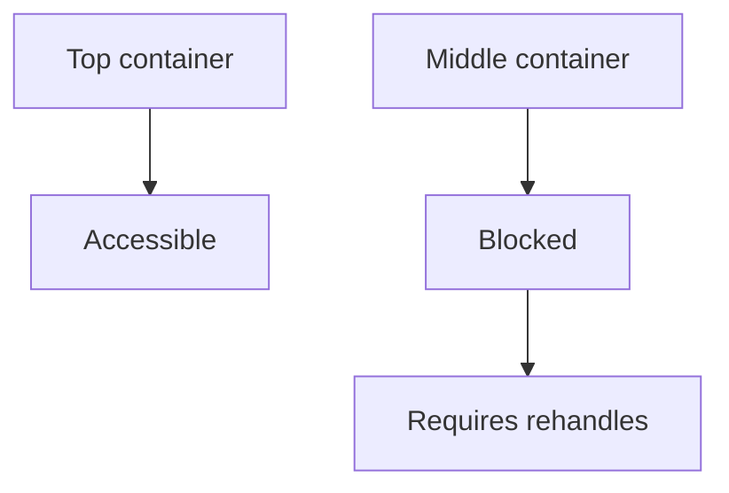
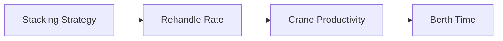

## Summary

This document defines **yard stacking strategies and rehandle logic** as a core throughput constraint in container terminal simulation.

It covers:
- stacking strategies (how containers are placed in yard blocks)
- grouping and sorting rules
- rehandle (unproductive move) generation
- trade-offs between density, accessibility, and operational efficiency

Rehandles are one of the biggest hidden killers of productivity:
**they consume equipment time without advancing cargo flow.**

---

## Why this matters for simulation and gameplay

If you ignore rehandles:
- yard looks unrealistically efficient
- cranes never wait for containers
- throughput is inflated
- planning decisions don’t matter

If you model them properly:
- bad planning hurts (as it should)
- congestion emerges naturally
- trade-offs become meaningful
- players can optimise strategies (or completely mess them up)

Rehandles are where your sim stops being “spreadsheet pretty” and starts being painfully realistic.

---

## Key definitions and vocabulary

- **Stacking strategy**  
  Rule set determining where containers are placed within yard blocks.

- **Rehandle (unproductive move)**  
  Movement of a container that is not part of its final outbound flow (e.g. moving boxes out of the way).

- **Stack accessibility**  
  Whether a container can be retrieved without moving others.

- **Buried container**  
  A container that has other containers stacked above it.

- **Pre-marshalling**  
  Rearranging stacks in advance of vessel operations to reduce rehandles.

- **Segregation grouping**  
  Placing containers together based on shared attributes (POD, vessel, type).

---

## Scope boundaries (what is included/excluded)

### Included
- stacking strategies and their operational behaviour
- rehandle generation logic
- grouping rules and trade-offs
- simplified simulation algorithms

### Excluded
- full optimisation solvers
- machine learning stacking strategies
- detailed yard crane routing (covered elsewhere)

---

## Key attributes and dimensions (human-level data model)

### Container attributes relevant to stacking

- `container_id`
- `destination_port`
- `vessel_id`
- `departure_time`
- `container_type`
- `is_hazardous`
- `is_reefer`
- `weight_class`

### Yard placement attributes

- `block_id`
- `bay`
- `row`
- `tier`
- `stack_height`
- `max_tier`
- `grouping_key`

---

## Rules, constraints, and algorithms (include simplified simulation models)

## 1. Basic stacking strategies

### 1.1 Random stacking (baseline)

Containers are placed in the next available slot.

Pros:
- simple
- high space utilisation

Cons:
- extremely high rehandles
- poor retrieval performance

---

### 1.2 First-in-first-out (FIFO stacking)

Containers are stacked in arrival order.

Pros:
- predictable
- simple logic

Cons:
- ignores vessel departure sequence
- still generates rehandles

---

### 1.3 Destination grouping (POD-based)

Containers grouped by port of discharge.

Pros:
- reduces rehandles for vessel loading
- improves load readiness

Cons:
- may reduce space efficiency
- uneven block utilisation

---

### 1.4 Vessel-based stacking

Containers grouped by outbound vessel.

Pros:
- minimal rehandles during load
- highly efficient quay operations

Cons:
- requires accurate planning
- poor flexibility for late changes

---

### 1.5 Tier-aware stacking (priority stacking)

Containers with earlier departure placed on top.

Rule:
```
if container.departure_time earlier:
  assign higher tier (top of stack)
```

Pros:
- reduces rehandles significantly
- aligns with operational priorities

Cons:
- requires forecasting
- more complex logic

---

### 1.6 Segregation-based stacking

Separate by:
- hazardous class
- reefer requirement
- container size/type

Pros:
- compliance and safety
- operational clarity

Cons:
- reduces flexibility
- increases fragmentation

---

## 2. Rehandle logic

### 2.1 Basic rehandle calculation

```
rehandles_required = number_of_containers_above_target
```

Example:
- container at tier 1 with 2 containers above → 2 rehandles

---

### 2.2 Retrieval cost model

```
retrieval_cost = 1 + rehandles_required
```

Where:
- 1 = actual move
- rehandles = unproductive moves

---

### 2.3 Yard-level rehandle KPI

```
rehandle_rate = total_rehandles / total_retrieval_moves
```

---

### 2.4 Dynamic rehandle effect

```
if yard_occupancy > threshold:
  rehandle_rate increases non-linearly
```

Suggested:
```
if occupancy > 80%:
  multiplier = 1.2
if occupancy > 90%:
  multiplier = 1.5
```

---

## 3. Strategy selection logic (simplified)

```
if container.type == reefer:
  assign reefer_block

elif container.hazmat:
  assign DG_block

elif container.is_export:
  group by vessel

elif container.is_import:
  group by arrival_time

else:
  assign nearest available slot
```

---

## 4. Pre-marshalling logic

Before vessel arrival:

```
for each export_container:
  if buried:
    move to accessible position
```

Trade-off:
- increases yard workload early
- reduces quay delays later

---

## 5. Trade-off model

| Strategy | Space Efficiency | Rehandles | Complexity | Flexibility |
|----------|----------------|-----------|------------|------------|
| Random | High | Very High | Low | High |
| FIFO | Medium | High | Low | Medium |
| POD grouping | Medium | Medium | Medium | Medium |
| Vessel grouping | Medium | Low | High | Low |
| Tier-aware | Medium | Low | High | Medium |
| Segregation-heavy | Low | Medium | Medium | Low |

---

## Standards and authoritative references to confirm (edition/year, what to verify)

- Academic research on container stacking and yard optimisation
- Terminal operational guidelines for export pre-stacking
- Industry best practices for yard planning
- Studies linking yard congestion to crane productivity

---

## Example outputs to include (tables, diagrams, sample data)

### Strategy comparison table

| Strategy | Rehandle Rate | Notes |
|----------|--------------|------|
| Random | 0.8 | Worst-case scenario |
| FIFO | 0.6 | Slight improvement |
| POD grouping | 0.4 | Balanced |
| Vessel grouping | 0.2 | Best for loading |
| Tier-aware | 0.15 | Optimal with planning |

---

### Sample day-of-operations move list

| Time | Move Type | Container | From | To | Rehandles |
|------|----------|----------|------|----|----------|
| 08:00 | Gate In | C1 | Truck | Yard A1 | 0 |
| 09:15 | Pre-marshall | C2 | A1-1-1 | A1-2-3 | 1 |
| 10:30 | Load | C3 | A1-3-2 | Vessel | 2 |
| 11:00 | Rehandle | C4 | A1-3-3 | Temp slot | 1 |
| 11:10 | Load | C3 | Temp | Vessel | 0 |

---

## Data schemas (JSON Schema references or in-file fragments)

```json
{
  "container_id": "MSCU1234567",
  "block_id": "EXP-C3",
  "bay": 5,
  "row": 2,
  "tier": 1,
  "rehandles_required": 2
}
```

---

## Sample data (JSON and YAML)

### JSON

```json
{
  "strategy": "vessel_grouping",
  "rehandle_rate": 0.22,
  "yard_occupancy": 0.81
}
```

### YAML

```yaml
container_id: CMAU9988776
stack_position:
  block: EXP-C3
  bay: 10
  row: 3
  tier: 2
rehandles_required: 1
```

---

## Visualisation guidance

### Mermaid diagram: stack accessibility



### Mermaid diagram: strategy impact



---

## 3D rendering notes (scale, dimensions, textures/markings)

- visualise stacks with clear vertical tiers
- highlight buried containers
- animate rehandles during retrieval
- colour-code stacks by grouping strategy
- show congestion visually via stack density

---

## Validation checklist

- [ ] Rehandle logic implemented correctly
- [ ] Stacking strategies selectable
- [ ] Occupancy impacts rehandle rate
- [ ] Grouping rules enforced
- [ ] Pre-marshalling behaviour modelled
- [ ] KPI linkage (rehandle rate -> productivity)

---

## Open questions and research backlog

- Add predictive stacking based on ETA uncertainty
- Model AI-assisted stacking strategies
- Include machine constraints (ASC vs RTG differences)
- Add cost model for rehandles vs pre-marshalling
- Integrate real-time adaptive stacking algorithms
